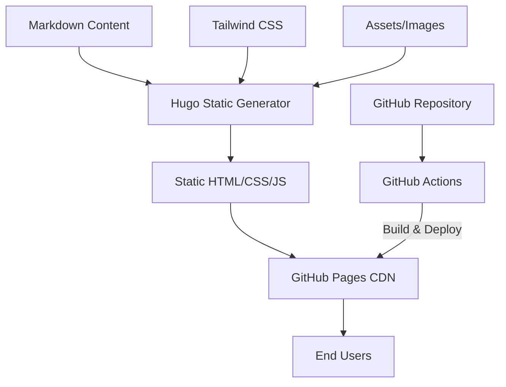

# Product Homepage Design - Product Requirements Document

## Executive Summary

### Problem Statement
MirDB is a powerful persistent key-value store with memcached compatibility, but it currently lacks a dedicated product homepage to showcase its features, capabilities, and value proposition. Potential users and developers have no central resource to learn about MirDB, understand its benefits compared to alternatives, or get started with the product.

### Proposed Solution
Create a compelling, informative product homepage for MirDB that effectively communicates its unique value proposition as a persistent key-value store with memcached protocol compatibility. The homepage will serve as the primary entry point for developers evaluating MirDB, providing clear information about features, architecture, and getting started resources.

### Expected Impact
- **Increased Adoption**: Clear product positioning will attract developers seeking persistent memcached alternatives
- **Reduced Onboarding Friction**: Comprehensive documentation and quick-start guides will accelerate user adoption
- **Enhanced Credibility**: Professional product presentation establishes MirDB as a mature, production-ready solution
- **Community Growth**: Easy access to documentation and resources will foster community engagement

### Success Metrics
- Homepage bounce rate < 40%
- Average time on page > 2 minutes
- Quick-start guide completion rate > 25%
- GitHub star growth rate increase of 20%
- Documentation page views per session > 3

---

## Requirements & Scope

### Functional Requirements

| ID | Requirement | Priority |
|----|-------------|----------|
| REQ-1 | Display hero section with product name, tagline, and primary value proposition | Must |
| REQ-2 | Present key features section highlighting memcached compatibility, persistence, and LSM architecture | Must |
| REQ-3 | Include quick-start installation and usage instructions | Must |
| REQ-4 | Provide architecture overview with visual diagram | Should |
| REQ-5 | Display supported commands and protocol information | Should |
| REQ-6 | Include configuration options reference | Should |
| REQ-7 | Show performance characteristics and benchmarks (when available) | Could |
| REQ-8 | Provide links to GitHub repository and documentation | Must |
| REQ-9 | Include comparison section vs standard memcached | Should |
| REQ-10 | Display project status and roadmap highlights | Could |

### Non-Functional Requirements

| ID | Requirement | Priority |
|----|-------------|----------|
| NFR-1 | Page load time under 3 seconds on 3G connection | Must |
| NFR-2 | Mobile-responsive design supporting screens 320px and above | Must |
| NFR-3 | WCAG 2.1 AA accessibility compliance | Should |
| NFR-4 | SEO-optimized with proper meta tags and structured data | Should |
| NFR-5 | Cross-browser compatibility (Chrome, Firefox, Safari, Edge) | Must |
| NFR-6 | Static site generation for fast hosting and low maintenance | Should |

### Out of Scope
- User authentication or account management
- Interactive database demo or playground
- Community forum integration
- Blog or news section
- Internationalization (i18n) - English only for initial release
- Analytics dashboard for administrators

### Success Criteria
- All "Must" priority requirements implemented and functional
- Homepage passes Lighthouse performance score > 80
- Homepage passes accessibility audit with no critical issues
- Positive feedback from 5+ community members during review

---

## User Experience & Interface

### Target Audience
1. **Backend Developers**: Engineers evaluating caching solutions for their applications
2. **DevOps Engineers**: Operators looking for memcached-compatible persistent storage
3. **Technical Architects**: Decision-makers comparing storage technologies
4. **Open Source Contributors**: Developers interested in contributing to Rust projects

### User Journey

```
Landing → Learn Value Prop → Explore Features → Try Quick-Start → Access Documentation → Contribute/Adopt
```

1. **Discovery**: User arrives from search, GitHub, or referral
2. **Value Recognition**: Hero section immediately communicates what MirDB is and why it matters
3. **Feature Exploration**: User scrolls through key features and architecture
4. **Hands-On Evaluation**: Quick-start section enables immediate experimentation
5. **Deep Dive**: Links to full documentation for comprehensive information
6. **Decision**: User decides to adopt, contribute, or bookmark for later

### Page Structure

#### Hero Section
- Product name and logo
- Tagline: "Persistent Key-Value Store with Memcached Protocol"
- Brief description (2-3 sentences)
- Primary CTA: "Get Started"
- Secondary CTA: "View on GitHub"

#### Key Features Section
- **Memcached Compatible**: Drop-in replacement for existing memcached deployments
- **Persistent Storage**: Data survives restarts using SSTable architecture
- **High Performance**: LSM tree design optimized for write-heavy workloads
- **Simple Configuration**: TOML-based configuration with sensible defaults

#### Architecture Overview
- Visual diagram showing data flow (WAL → Memtable → SSTable levels)
- Brief explanation of LSM tree benefits
- Link to detailed architecture documentation

#### Quick-Start Section
- Installation instructions (cargo build)
- Basic configuration example
- Sample commands (SET, GET, DELETE)
- Connection example using standard memcached client

#### Protocol Reference
- Supported commands table
- MirDB-specific commands (INFO, MAJOR_COMPACTION)
- Response codes

#### Configuration Reference
- Key configuration parameters table
- Default values
- Link to full configuration documentation

#### Footer
- GitHub repository link
- Documentation link
- License information (MIT/Apache)
- Project status indicator

### Accessibility Considerations
- Semantic HTML structure with proper heading hierarchy
- Sufficient color contrast ratios (4.5:1 minimum)
- Keyboard navigation support
- Screen reader compatible with ARIA labels where needed
- Code blocks with syntax highlighting and copyable content

---

## Technical Considerations

### High-Level Technical Approach
The homepage will be implemented as a static site for optimal performance, easy deployment, and minimal maintenance overhead. Content will be derived from existing documentation and knowledge base.

### Integration Points
- **GitHub Repository**: Links and potentially embedded stats (stars, forks)
- **Documentation Site**: Cross-linking with detailed documentation
- **Package Registry**: Links to crates.io when published

### Key Technical Constraints
- Must be deployable to GitHub Pages or similar static hosting
- Should require no backend services or databases
- Must be maintainable by developers without frontend specialization

### Performance Considerations
- Static site generation for instant page loads
- Optimized images and assets
- Minimal JavaScript for progressive enhancement
- CDN-friendly asset structure

---

## Design Specification

### Recommended Approach
Build a single-page static website using a modern static site generator, with a clean developer-focused design that emphasizes code examples and technical content. The site should be deployable to GitHub Pages for zero-cost hosting integrated with the repository.

### Key Technical Decisions

#### 1. Static Site Generator
- **Options Considered**: Hugo, Jekyll, Astro, plain HTML/CSS
- **Tradeoffs**: Hugo offers speed and Go ecosystem familiarity; Jekyll has GitHub Pages native support; Astro provides modern component architecture; plain HTML is simplest but least maintainable
- **Recommendation**: Hugo - fast builds, excellent for documentation-style sites, single binary with no runtime dependencies, aligns with the Rust community's preference for simple, performant tools

#### 2. Styling Approach
- **Options Considered**: Tailwind CSS, Custom CSS, CSS framework (Bootstrap)
- **Tradeoffs**: Tailwind offers utility-first rapid development but adds build complexity; Custom CSS is lightweight but slower to develop; Bootstrap is heavy and generic-looking
- **Recommendation**: Tailwind CSS - enables rapid, consistent styling with minimal CSS file size through purging, widely adopted in developer tool sites

#### 3. Hosting Platform
- **Options Considered**: GitHub Pages, Netlify, Vercel, Self-hosted
- **Tradeoffs**: GitHub Pages is free and integrated but limited features; Netlify/Vercel offer more features but add external dependency; Self-hosted requires infrastructure
- **Recommendation**: GitHub Pages - zero cost, integrated with repository, sufficient for static content, reduces operational complexity

#### 4. Code Syntax Highlighting
- **Options Considered**: Prism.js, Highlight.js, Hugo built-in Chroma
- **Tradeoffs**: Prism.js is lightweight and customizable; Highlight.js has broad language support; Chroma is built into Hugo with no JavaScript required
- **Recommendation**: Hugo Chroma - zero JavaScript overhead, excellent Rust/TOML support, consistent with static-first approach

### High-Level Architecture



### Key Considerations
- **Performance**: Static generation ensures sub-second page loads; all assets optimized at build time; no runtime dependencies
- **Security**: No backend means minimal attack surface; static content served via HTTPS from GitHub CDN
- **Scalability**: CDN distribution handles any traffic level; no server capacity concerns

### Risk Management
- **Content Maintenance Risk**: Documentation may become outdated as MirDB evolves. Mitigation: Structure content to pull from central sources where possible; establish review cadence
- **Design Consistency Risk**: Homepage may diverge from future documentation site styling. Mitigation: Use shared design tokens and component patterns from the start

### Success Criteria
- Page achieves Lighthouse performance score > 90
- Build time under 30 seconds
- Zero JavaScript errors in browser console
- All code examples are accurate and runnable

---

## User Stories

### Personas
- **Backend Developer (Alex)**: Evaluating caching solutions for a new microservice
- **DevOps Engineer (Jordan)**: Looking to replace volatile memcached with persistent storage
- **OSS Contributor (Sam)**: Interested in contributing to Rust database projects

### Core Stories

#### Story 1: Understanding Product Value
**As a** backend developer evaluating caching solutions,
**I want to** quickly understand what MirDB is and how it differs from memcached,
**so that** I can determine if it's worth evaluating further.

**Acceptance Criteria:**
- Given I land on the homepage
- When the page loads
- Then I see a clear tagline and description within the first viewport
- And I understand it's a persistent key-value store compatible with memcached

**Priority**: Must
**Traceability**: REQ-1, REQ-9

---

#### Story 2: Exploring Key Features
**As a** technical architect comparing storage technologies,
**I want to** see the key features and architecture of MirDB,
**so that** I can evaluate its fit for my system requirements.

**Acceptance Criteria:**
- Given I am on the homepage
- When I scroll past the hero section
- Then I see clearly presented feature cards with icons
- And I can view an architecture diagram showing the LSM tree data flow

**Priority**: Must
**Traceability**: REQ-2, REQ-4

---

#### Story 3: Getting Started Quickly
**As a** developer who wants to try MirDB,
**I want to** find quick-start instructions with copy-paste commands,
**so that** I can have a running instance within minutes.

**Acceptance Criteria:**
- Given I am on the homepage
- When I navigate to the quick-start section
- Then I see installation commands I can copy with one click
- And I see basic usage examples with SET/GET commands
- And the examples use realistic data

**Priority**: Must
**Traceability**: REQ-3, REQ-5

---

#### Story 4: Accessing Documentation
**As a** developer implementing MirDB in my application,
**I want to** easily find links to detailed documentation,
**so that** I can learn about configuration options and advanced features.

**Acceptance Criteria:**
- Given I am on any section of the homepage
- When I look for documentation links
- Then I find clear navigation to GitHub and docs
- And links open in new tabs to preserve my place

**Priority**: Must
**Traceability**: REQ-6, REQ-8

---

#### Story 5: Understanding Protocol Support
**As a** developer with existing memcached clients,
**I want to** see which commands MirDB supports,
**so that** I know if my current code will work without modifications.

**Acceptance Criteria:**
- Given I am on the homepage
- When I view the protocol section
- Then I see a clear table of supported commands
- And I see any MirDB-specific commands highlighted separately

**Priority**: Should
**Traceability**: REQ-5

---

#### Story 6: Mobile Access
**As a** developer reviewing MirDB on my phone during commute,
**I want to** read the homepage content comfortably on mobile,
**so that** I can evaluate the product on any device.

**Acceptance Criteria:**
- Given I access the homepage on a mobile device (320px width)
- When the page loads
- Then all content is readable without horizontal scrolling
- And navigation is accessible via mobile-friendly controls

**Priority**: Must
**Traceability**: NFR-2

---

## Dependencies & Assumptions

### Dependencies
- GitHub repository must be public for GitHub Pages deployment
- Hugo and Tailwind tooling available in build environment
- GitHub Actions available for CI/CD pipeline

### Assumptions
- MirDB project will continue active development
- English-only content is acceptable for initial release
- No immediate need for dynamic content or user-generated contributions
- Project maintainers will review and approve content before launch

### Cross-Team Coordination
- Content review by MirDB maintainers for technical accuracy
- Design review for consistency with any existing project branding

---

## Appendices

### Reference Materials
- MirDB GitHub Repository
- Memcached Protocol Specification
- LSM Tree Architecture Documentation

### Content Sources
- Project knowledge base (`.something/knowledge/`)
- Existing README and configuration examples
- Code documentation and comments
