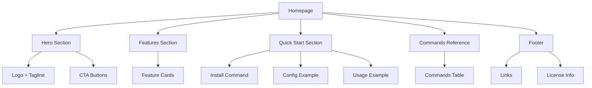

# Product Homepage Design - Product Requirements Document

## Executive Summary

### Problem Statement
MirDB is a powerful persistent key-value store that combines memcached protocol compatibility with durable storage, but it currently lacks a dedicated homepage to communicate its value proposition, features, and usage to potential users and developers. Without a proper homepage, adoption is hindered as users have no centralized resource to understand what MirDB offers or how to get started.

### Proposed Solution
Create a comprehensive product homepage for MirDB that effectively communicates the product's unique value proposition (persistent storage with memcached compatibility), showcases key features, provides quick-start guidance, and establishes credibility as a modern, production-ready database solution.

### Expected Impact
- **Increased Adoption**: Clear messaging will help developers quickly understand MirDB's benefits
- **Reduced Onboarding Friction**: Quick-start guides and documentation links will accelerate time-to-value
- **Community Growth**: A professional homepage establishes credibility and encourages open-source contributions
- **Market Positioning**: Differentiates MirDB from both traditional memcached and other key-value stores

### Success Metrics
- Homepage completion with all required sections
- Mobile-responsive design implementation
- Page load time under 3 seconds
- Clear call-to-action visibility above the fold
- Documentation and quick-start content accessibility

---

## Requirements & Scope

### Functional Requirements

| ID | Requirement | Priority |
|----|-------------|----------|
| REQ-1 | Display hero section with product name, tagline, and primary value proposition | Must |
| REQ-2 | Present key features section highlighting persistence, memcached compatibility, and LSM tree architecture | Must |
| REQ-3 | Include quick-start code examples showing basic GET/SET operations | Must |
| REQ-4 | Provide navigation to documentation, GitHub repository, and community resources | Must |
| REQ-5 | Display comparison table showing MirDB vs. memcached vs. other key-value stores | Should |
| REQ-6 | Include installation instructions for common platforms | Must |
| REQ-7 | Show configuration examples with TOML file format | Should |
| REQ-8 | Display supported commands reference (SET, GET, DELETE, INFO, etc.) | Should |
| REQ-9 | Include architecture diagram showing LSM tree data flow | Could |
| REQ-10 | Provide footer with license information, links, and copyright | Must |

### Non-Functional Requirements

| ID | Requirement | Priority |
|----|-------------|----------|
| NFR-1 | Page must be responsive and display correctly on mobile, tablet, and desktop | Must |
| NFR-2 | Page must load within 3 seconds on standard broadband connection | Must |
| NFR-3 | Page must be accessible (WCAG 2.1 Level AA compliance) | Should |
| NFR-4 | Page must render correctly in modern browsers (Chrome, Firefox, Safari, Edge) | Must |
| NFR-5 | Code examples must have syntax highlighting for readability | Should |
| NFR-6 | Page should use semantic HTML for SEO optimization | Should |

### Out of Scope
- User authentication or account management
- Interactive database playground or live demo environment
- Multi-language localization (English only for initial release)
- Blog or news section
- Community forum integration
- Analytics dashboard
- Backend API development

### Success Criteria
- All "Must" priority requirements implemented and functional
- Homepage passes responsive design testing on 3+ device sizes
- All navigation links functional and pointing to correct destinations
- Code examples render with proper syntax highlighting
- Page achieves acceptable Lighthouse performance score (>80)

---

## User Experience & Interface

### Target Users

1. **Backend Developers**: Looking for a persistent cache solution with familiar memcached API
2. **DevOps Engineers**: Evaluating data stores for infrastructure deployment
3. **Technical Decision Makers**: Comparing database options for their stack
4. **Open Source Contributors**: Exploring the project to potentially contribute

### User Journey

```
Landing → Understand Value Prop → Explore Features → View Quick Start → Take Action (Install/Docs/GitHub)
```

1. **First Impression (0-5 seconds)**: User lands on homepage, immediately sees hero section with clear tagline explaining what MirDB is
2. **Value Discovery (5-30 seconds)**: User scrolls to features section, understands key differentiators
3. **Technical Validation (30-120 seconds)**: User reviews code examples, command reference, and architecture overview
4. **Decision Point**: User chooses to either:
   - Install MirDB locally
   - Read full documentation
   - Explore GitHub repository
   - Compare with alternatives

### Interface Requirements

#### Hero Section
- Product logo/name prominently displayed
- Tagline: "Persistent Key-Value Store with Memcached Protocol"
- Sub-description emphasizing the key differentiator (persistence + compatibility)
- Primary CTA button: "Get Started"
- Secondary CTA: "View on GitHub"

#### Features Section
- 3-4 feature cards with icons:
  - **Memcached Compatible**: Drop-in replacement for existing memcached clients
  - **Persistent Storage**: Data survives restarts using SSTable files
  - **High Performance**: Built with Rust and Tokio for async operations
  - **LSM Tree Engine**: Efficient write-optimized storage architecture

#### Quick Start Section
- Installation command (cargo install or binary download)
- Configuration snippet (TOML format)
- Basic usage example with GET/SET commands
- Copy-to-clipboard functionality for code blocks

#### Commands Reference Section
- Tabular display of supported commands
- Brief description for each command
- Example syntax

#### Footer
- License information (link to LICENSE file)
- GitHub repository link
- Documentation link
- Copyright notice

### Accessibility Considerations
- Sufficient color contrast ratios (4.5:1 minimum)
- Keyboard navigation support
- Alt text for all images/icons
- Semantic heading hierarchy (h1 → h2 → h3)
- Skip navigation link for screen readers

---

## Technical Considerations

### Technology Approach
The homepage should be implemented as a static site to ensure fast load times, easy hosting, and minimal maintenance overhead. Given MirDB is a Rust project, the homepage should integrate well with the existing repository structure.

### Hosting Options
- GitHub Pages (free, integrates with repo)
- Netlify (free tier available, good for static sites)
- Cloudflare Pages (free, excellent performance)

### Integration Points
- **GitHub Repository**: Links to source code, issues, and releases
- **Documentation**: Integration with existing or future documentation site
- **Package Registry**: Link to crates.io for Rust package

### Performance Requirements
- Minimize external dependencies to reduce load time
- Optimize images (WebP format preferred)
- Inline critical CSS for above-the-fold content
- Lazy load below-the-fold content

---

## Design Specification

### Recommended Approach
Build a single-page static website using modern HTML, CSS, and minimal JavaScript. The design should be clean, developer-focused, and technically credible while maintaining fast load times and accessibility.

### Key Technical Decisions

#### 1. Framework/Build Tool
- **Options Considered**: Raw HTML/CSS, Jekyll, Hugo, Astro, Next.js
- **Tradeoffs**:
  - Raw HTML: Maximum simplicity, no build step, but harder to maintain
  - Jekyll: GitHub Pages native support, Ruby dependency
  - Hugo: Very fast builds, Go-based, good for docs
  - Astro: Modern, component-based, excellent performance
- **Recommendation**: Hugo or raw HTML/CSS. Hugo if future documentation expansion is planned; raw HTML for maximum simplicity and zero dependencies.

#### 2. Styling Approach
- **Options Considered**: Custom CSS, Tailwind CSS, Bootstrap, CSS framework
- **Tradeoffs**:
  - Custom CSS: Full control, smaller bundle, more development effort
  - Tailwind: Rapid development, utility-first, larger initial learning curve
  - Bootstrap: Well-known, potentially heavy for simple page
- **Recommendation**: Custom CSS or Tailwind CSS. Custom CSS keeps the page lightweight; Tailwind accelerates development if design iterations are expected.

#### 3. Code Highlighting
- **Options Considered**: Prism.js, highlight.js, server-side highlighting
- **Tradeoffs**:
  - Prism.js: Lightweight, modular, good theme support
  - highlight.js: Wide language support, slightly heavier
  - Server-side: Zero client JS, but requires build step
- **Recommendation**: Prism.js for client-side highlighting due to its lightweight nature and excellent Rust/shell support.

#### 4. Diagram Rendering
- **Options Considered**: Static image, Mermaid.js, D2, pre-rendered SVG
- **Tradeoffs**:
  - Static image: Simple, fast, harder to update
  - Mermaid.js: Dynamic, maintainable, adds JS dependency
  - Pre-rendered SVG: Best of both worlds, requires build step
- **Recommendation**: Pre-rendered SVG for the architecture diagram to maintain page performance while allowing future updates.

### High-Level Architecture



### Key Considerations

- **Performance**: Static HTML/CSS with minimal JavaScript ensures sub-3-second load times. Critical CSS should be inlined, and Prism.js loaded asynchronously.

- **Security**: Static site minimizes attack surface. Ensure no inline scripts from untrusted sources; use CSP headers if hosting supports it.

- **Scalability**: Static hosting scales infinitely with CDN. Hugo/Astro enables easy content updates if the site grows.

### Risk Management

- **Content Accuracy Risk**: Technical details may become outdated as MirDB evolves. Mitigation: Reference authoritative sources (README, docs) and establish update process.

- **Browser Compatibility Risk**: Modern CSS features may not render correctly in older browsers. Mitigation: Test on target browsers, use progressive enhancement.

### Success Criteria

- Page loads in under 3 seconds on 4G connection
- All code examples are accurate and functional
- Responsive design works on mobile (320px) to desktop (1920px)
- Navigation links resolve correctly

---

## Dependencies & Assumptions

### Dependencies
- **GitHub Repository**: Homepage must link to active GitHub repository
- **Documentation**: Quick-start content depends on existing or planned documentation
- **Design Assets**: Logo and any brand assets need to be available or created

### Assumptions
- MirDB project will continue active development
- English is sufficient for initial release
- Static hosting is acceptable (no server-side requirements)
- Existing MirDB README/docs provide accurate technical content to reference
- No brand guidelines exist; homepage can establish initial visual identity

### Cross-Team Coordination
- **Maintainers**: Review and approve homepage content for technical accuracy
- **Contributors**: May assist with design assets or content updates

---

## Appendices

### A. Product Content Reference

#### Tagline Options
1. "Persistent Key-Value Store with Memcached Protocol"
2. "The Memcached You Can Trust to Remember"
3. "Drop-in Persistence for Your Cache Layer"

#### Key Messaging Points
- **What**: Persistent key-value store written in Rust
- **How**: Implements memcached text protocol with LSM tree storage
- **Why**: Get memcached compatibility with data durability

#### Technical Specifications for Homepage
- Default port: 12333
- Protocol: Memcached text protocol
- Storage: LSM tree with SSTables
- Implementation: Rust with Tokio async runtime

### B. Command Reference Content

| Command | Description | Syntax |
|---------|-------------|--------|
| SET | Store a key-value pair | `set <key> <flags> <ttl> <bytes>` |
| GET | Retrieve one or more keys | `get <key1> [<key2> ...]` |
| DELETE | Remove a key | `delete <key>` |
| ADD | Store if key doesn't exist | `add <key> <flags> <ttl> <bytes>` |
| REPLACE | Store if key exists | `replace <key> <flags> <ttl> <bytes>` |
| INFO | Display database status | `info` |

### C. Quick Start Content

```bash
# Installation
cargo install mirdb

# Start server
mirdb -c /path/to/config.toml

# Connect with any memcached client
telnet localhost 12333
```

```toml
# Example config (mirdb.toml)
addr = "0.0.0.0:12333"
work_dir = "/var/lib/mirdb"
mem_table_max_size = "4M"
sst_max_size = "100M"
```

### D. Wireframe Description

```
┌─────────────────────────────────────────────────┐
│  [Logo] MirDB          [Docs] [GitHub]          │  ← Header/Nav
├─────────────────────────────────────────────────┤
│                                                 │
│         MirDB                                   │
│  Persistent Key-Value Store                     │  ← Hero Section
│  with Memcached Protocol                        │
│                                                 │
│  [Get Started]  [View on GitHub]                │
│                                                 │
├─────────────────────────────────────────────────┤
│                                                 │
│  ┌─────────┐  ┌─────────┐  ┌─────────┐         │
│  │Memcached│  │Persistent│  │  High   │         │  ← Features
│  │Protocol │  │ Storage  │  │ Perf    │         │
│  └─────────┘  └─────────┘  └─────────┘         │
│                                                 │
├─────────────────────────────────────────────────┤
│                                                 │
│  Quick Start                                    │
│  ┌─────────────────────────────────────────┐   │  ← Quick Start
│  │ $ cargo install mirdb                    │   │
│  │ $ mirdb -c config.toml                   │   │
│  └─────────────────────────────────────────┘   │
│                                                 │
├─────────────────────────────────────────────────┤
│                                                 │
│  Commands                                       │
│  ┌─────────────────────────────────────────┐   │  ← Commands
│  │ SET  │ GET  │ DELETE │ ADD │ REPLACE    │   │
│  └─────────────────────────────────────────┘   │
│                                                 │
├─────────────────────────────────────────────────┤
│  [License] [GitHub] [Docs]     © 2024 MirDB    │  ← Footer
└─────────────────────────────────────────────────┘
```
