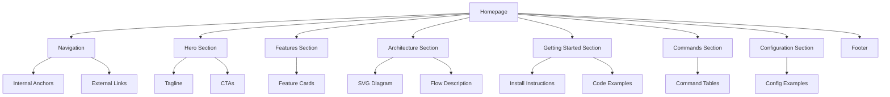

# Product Homepage Design - Product Requirements Document

## Executive Summary

### Problem Statement
MirDB is a powerful persistent key-value store that combines memcached compatibility with durable storage. However, the product currently lacks a homepage to communicate its value proposition, features, and getting-started information to potential users. Without a homepage, developers cannot easily discover, understand, or adopt MirDB for their use cases.

### Proposed Solution
Create a comprehensive product homepage that effectively communicates MirDB's unique value proposition, core features, technical architecture, and provides clear paths for users to get started. The homepage will serve as the primary entry point for developers exploring MirDB as a storage solution.

### Expected Impact
- **User Acquisition**: Enable developers to discover and understand MirDB's capabilities
- **Reduced Onboarding Friction**: Provide clear getting-started guidance and documentation links
- **Product Credibility**: Establish MirDB as a professional, well-documented open-source project
- **Community Growth**: Facilitate adoption and community engagement through clear communication

### Success Metrics
- Homepage successfully deployed and accessible
- All key product information accurately represented
- Clear call-to-action paths for getting started
- Responsive design functioning across device sizes

---

## Requirements & Scope

### Functional Requirements

| ID | Requirement | Priority |
|----|-------------|----------|
| REQ-1 | Display product name (MirDB) and tagline prominently in hero section | Must |
| REQ-2 | Communicate core value proposition: persistent key-value store with memcached compatibility | Must |
| REQ-3 | Display key product features with clear descriptions | Must |
| REQ-4 | Include getting-started section with installation/usage instructions | Must |
| REQ-5 | Show supported commands and protocol information | Should |
| REQ-6 | Display architecture overview or diagram | Should |
| REQ-7 | Include configuration examples and defaults | Should |
| REQ-8 | Provide links to documentation/repository | Must |
| REQ-9 | Display current implementation status and roadmap items | Could |
| REQ-10 | Include code examples demonstrating basic usage | Should |

### Non-Functional Requirements

| ID | Requirement | Priority |
|----|-------------|----------|
| NFR-1 | Page must be responsive and display correctly on desktop, tablet, and mobile devices | Must |
| NFR-2 | Page must load within 3 seconds on standard connections | Should |
| NFR-3 | Content must be accessible (WCAG 2.1 AA compliance) | Should |
| NFR-4 | Design must be clean, professional, and developer-focused | Must |
| NFR-5 | Page must render correctly in modern browsers (Chrome, Firefox, Safari, Edge) | Must |

### Out of Scope
- User authentication or account management
- Interactive database playground or sandbox
- Blog or news section
- Multi-language localization (initial release in English only)
- Analytics dashboard or usage tracking
- Community forum or discussion features

### Success Criteria
- Homepage displays all "Must" priority requirements
- Page passes responsive design testing on major viewport sizes
- Page loads without errors in target browsers
- All links and navigation elements function correctly
- Content accurately represents MirDB's current capabilities and status

---

## User Stories

### Target Personas
1. **Backend Developer**: Evaluating storage solutions for applications requiring both caching and persistence
2. **DevOps Engineer**: Looking for memcached-compatible alternatives with durability guarantees
3. **Open Source Contributor**: Exploring Rust-based database projects to contribute to

### Core Stories

#### US-1: Understand Product Purpose
**As a** backend developer
**I want to** quickly understand what MirDB does
**So that** I can determine if it meets my storage needs

**Priority**: Must

**Acceptance Criteria**:
- Given I land on the homepage
- When I view the hero section
- Then I see the product name "MirDB" and a clear tagline explaining it's a persistent key-value store with memcached compatibility

**Traceability**: REQ-1, REQ-2

---

#### US-2: Discover Key Features
**As a** developer evaluating storage solutions
**I want to** see MirDB's key features at a glance
**So that** I can compare it with alternatives

**Priority**: Must

**Acceptance Criteria**:
- Given I am on the homepage
- When I scroll to the features section
- Then I see clearly organized features including: memcached protocol support, persistence via SSTables, and LSM tree architecture
- And each feature has a brief, understandable description

**Traceability**: REQ-3

---

#### US-3: Get Started Quickly
**As a** developer who wants to try MirDB
**I want to** find installation and basic usage instructions
**So that** I can start using MirDB in my project

**Priority**: Must

**Acceptance Criteria**:
- Given I am on the homepage
- When I navigate to the getting-started section
- Then I see clear instructions for installing/running MirDB
- And I see a basic code example for connecting and performing operations
- And I see a link to detailed documentation

**Traceability**: REQ-4, REQ-8, REQ-10

---

#### US-4: Understand Supported Operations
**As a** developer familiar with memcached
**I want to** see which commands MirDB supports
**So that** I can assess compatibility with my existing code

**Priority**: Should

**Acceptance Criteria**:
- Given I am on the homepage
- When I view the commands/protocol section
- Then I see a list of supported commands (SET, GET, DELETE, etc.)
- And I understand the response codes and behavior

**Traceability**: REQ-5

---

#### US-5: View Technical Architecture
**As a** developer who cares about internals
**I want to** understand MirDB's architecture
**So that** I can make informed decisions about performance and reliability

**Priority**: Should

**Acceptance Criteria**:
- Given I am on the homepage
- When I view the architecture section
- Then I see a visual representation of the LSM tree data flow
- And I understand the write and read paths

**Traceability**: REQ-6

---

#### US-6: Access Repository and Documentation
**As a** potential user or contributor
**I want to** access the source code and documentation
**So that** I can explore the project further or contribute

**Priority**: Must

**Acceptance Criteria**:
- Given I am on the homepage
- When I look for external links
- Then I find a prominent link to the GitHub repository
- And I find links to detailed documentation

**Traceability**: REQ-8

---

#### US-7: View on Mobile Device
**As a** developer browsing on mobile
**I want to** view the homepage on my phone
**So that** I can learn about MirDB while away from my desk

**Priority**: Must

**Acceptance Criteria**:
- Given I access the homepage on a mobile device
- When the page loads
- Then all content is readable without horizontal scrolling
- And navigation is accessible and functional
- And images and diagrams scale appropriately

**Traceability**: NFR-1

---

## User Experience & Interface

### Page Structure and Sections

1. **Navigation Bar**
   - Logo/Product name
   - Links: Features, Getting Started, Documentation, GitHub

2. **Hero Section**
   - Product name: MirDB
   - Tagline emphasizing persistent key-value storage with memcached compatibility
   - Primary CTA: "Get Started" button
   - Secondary CTA: "View on GitHub" button

3. **Key Features Section**
   - Feature cards highlighting:
     - Memcached Protocol Compatibility
     - Persistent Storage (SSTables)
     - LSM Tree Architecture
     - Async Networking (Tokio-based)
   - Each card with icon, title, and brief description

4. **Architecture Overview Section**
   - Visual diagram showing data flow (Write path and Read path)
   - Brief explanation of LSM tree components

5. **Getting Started Section**
   - Quick installation instructions
   - Basic configuration example (TOML snippet)
   - Simple usage example with memcached client

6. **Commands Reference Section**
   - Table or list of supported commands
   - Categorized: Storage, Retrieval, Deletion, Admin

7. **Configuration Section**
   - Default configuration values
   - Key tunable parameters with descriptions

8. **Footer**
   - Links to documentation, GitHub, license
   - Project status indicator

### User Interaction Patterns
- Smooth scroll navigation between sections
- Copy-to-clipboard functionality for code snippets
- Responsive collapsible navigation on mobile
- Hover states on interactive elements

### Accessibility Considerations
- Semantic HTML structure with proper heading hierarchy
- Alt text for all images and diagrams
- Sufficient color contrast ratios
- Keyboard navigation support
- Focus indicators on interactive elements

---

## Technical Considerations

### High-Level Technical Approach
The homepage will be implemented as a static website, optimized for performance and ease of deployment. The site should prioritize fast load times, cross-browser compatibility, and maintainability.

### Content Requirements
The homepage content must accurately reflect MirDB's current capabilities:
- Protocol: Memcached text protocol compatibility
- Storage: SSTables with LSM tree architecture
- Default port: 12333
- Implemented features: Async networking, memtable with skip list, minor/major compaction
- Planned: Raft consensus (clearly marked as future)

### Integration Points
- Links to GitHub repository for source code access
- Links to external documentation (if exists)
- Potential integration with package manager installation commands

### Performance Considerations
- Optimize images and assets for web delivery
- Minimize external dependencies
- Consider lazy loading for below-fold content
- Use efficient CSS and minimize JavaScript where possible

### Key Constraints
- Content must be maintainable and easy to update as product evolves
- Design should accommodate future additions (new features, documentation pages)
- Must work without server-side processing (static hosting compatible)

---

## Design Specification

### Recommended Approach
Build a single-page static website with section-based navigation, using modern CSS for responsive layout and minimal JavaScript for interactivity. The design should follow a developer-tool aesthetic: clean, technical, and focused on content clarity.

### Key Technical Decisions

#### 1. Technology Stack
- **Options Considered**: React SPA, Next.js static export, Plain HTML/CSS/JS, Static site generator (Hugo/Jekyll)
- **Tradeoffs**:
  - React/Next.js: Rich interactivity but higher complexity and build requirements
  - Plain HTML/CSS: Simple deployment but harder to maintain at scale
  - Static site generators: Good balance of maintainability and simplicity
- **Recommendation**: Static HTML/CSS with minimal JavaScript for maximum simplicity, fast load times, and zero build dependencies for initial version

#### 2. Styling Approach
- **Options Considered**: Custom CSS, Tailwind CSS, CSS framework (Bootstrap), CSS-in-JS
- **Tradeoffs**:
  - Custom CSS: Full control but more development effort
  - Tailwind: Utility-first, fast development, larger learning curve
  - Bootstrap: Quick setup but generic appearance
- **Recommendation**: Custom CSS with CSS variables for theming, ensuring a unique developer-focused aesthetic without framework overhead

#### 3. Architecture Diagram Format
- **Options Considered**: Static image (PNG/SVG), Mermaid.js rendered diagram, ASCII art
- **Tradeoffs**:
  - Static image: Easy to create but harder to update
  - Mermaid.js: Code-based, version controllable, but adds JS dependency
  - ASCII: Developer-friendly but limited visual appeal
- **Recommendation**: SVG diagram for the architecture visualization - scalable, maintainable, and performant

#### 4. Code Snippet Presentation
- **Options Considered**: Pre-styled code blocks, Syntax highlighting library (Prism/Highlight.js), Plain text
- **Tradeoffs**:
  - Libraries add dependencies but improve readability
  - Plain text is simpler but less visually appealing
- **Recommendation**: Lightweight syntax highlighting with Prism.js (minimal footprint, widely used) for code examples and configuration snippets

### High-Level Architecture



### Key Considerations
- **Performance**: Static assets, optimized images, minimal JS ensure sub-3-second load times
- **Security**: No server-side processing, no user input handling, minimal attack surface
- **Scalability**: Static hosting enables CDN distribution for global performance

### Risk Management
- **Content Accuracy Risk**: Homepage content may become outdated as MirDB evolves. Mitigation: Structure content in easily updatable sections with clear ownership.
- **Browser Compatibility Risk**: CSS features may not work in older browsers. Mitigation: Use progressive enhancement and test across target browsers.

### Success Criteria
- All "Must" priority requirements implemented and functional
- Page achieves Lighthouse performance score > 90
- Responsive breakpoints tested at 320px, 768px, 1024px, and 1440px widths
- Zero critical accessibility violations

---

## Dependencies & Assumptions

### Dependencies
- Access to MirDB branding assets (logo, colors) if they exist
- Confirmation of hosting platform/deployment target
- Access to GitHub repository URL for linking

### Assumptions
- Product documentation exists or will be created separately
- No immediate need for internationalization
- Static hosting is available (GitHub Pages, Netlify, or similar)
- Design should accommodate future documentation pages or blog

---

## Appendices

### A. Content Reference: Key Messages

**Primary Value Proposition**:
"MirDB: A persistent key-value store with memcached compatibility. Get the speed of in-memory caching with the durability of disk-based storage."

**Feature Highlights**:
1. **Drop-in Memcached Compatibility**: Use existing memcached clients without code changes
2. **Persistent Storage**: Data survives restarts with SSTable-based durability
3. **Write-Optimized Architecture**: LSM tree design for high write throughput
4. **Built with Rust**: Memory-safe, high-performance implementation

### B. Content Reference: Technical Specifications

**Supported Commands**:
- Storage: SET, ADD, REPLACE, APPEND, PREPEND
- Retrieval: GET, GETS
- Deletion: DELETE
- Admin: INFO, MAJOR_COMPACTION

**Default Configuration**:
- Port: 12333
- Memtable size: 4MB
- SSTable size: 100MB
- LSM levels: 7

### C. Visual Reference: Data Flow

```
Write Path:
Request → WAL → Memtable → Immutable Memtables → L0 SSTs → L1+ SSTs

Read Path:
Request → Memtable → Immutable Memtables → L0 (linear) → L1+ (binary search)
```
