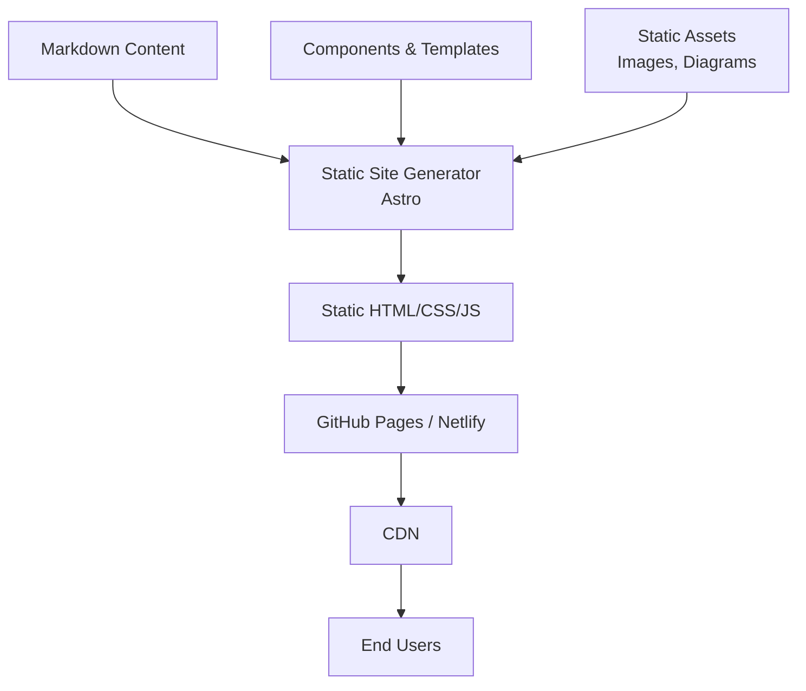

# Product Showcase Website - Product Requirements Document

## Executive Summary

### Problem Statement
MirDB is a powerful persistent key-value store written in Rust that implements the Memcached protocol, offering unique value by combining memcached compatibility with data persistence. However, the project currently lacks a public-facing website to showcase its capabilities, explain its value proposition, and attract potential users and contributors. Without a dedicated web presence, potential users cannot easily discover, understand, or evaluate MirDB for their use cases.

### Proposed Solution
Create a modern, responsive product showcase website for MirDB that effectively communicates the product's value proposition, features, architecture, and usage instructions. The website will serve as the primary marketing and documentation entry point for developers seeking a persistent, memcached-compatible key-value store.

### Expected Impact
- **User Acquisition**: Enable developers to discover and evaluate MirDB through organic search and direct traffic
- **Developer Experience**: Provide clear documentation and getting-started guides that reduce time-to-first-use
- **Community Growth**: Establish a foundation for community building through clear contribution guidelines and project visibility
- **Project Credibility**: Professional web presence increases trust and adoption likelihood

### Success Metrics
- Website successfully deployed and accessible
- All core product information clearly presented
- Documentation enables users to install and run MirDB within 10 minutes
- Website loads in under 3 seconds on standard connections
- Mobile-responsive design functions correctly across devices

---

## Requirements & Scope

### Functional Requirements

| ID | Requirement | Priority |
|----|-------------|----------|
| REQ-1 | Display product overview explaining MirDB's purpose as a persistent memcached-compatible key-value store | Must |
| REQ-2 | Present key features including memcached protocol support, persistence via SSTables, and LSM tree architecture | Must |
| REQ-3 | Provide getting-started guide with installation and basic usage instructions | Must |
| REQ-4 | Display supported memcached commands (SET, GET, DELETE, ADD, REPLACE, APPEND, PREPEND) | Must |
| REQ-5 | Show configuration options and parameters with clear explanations | Should |
| REQ-6 | Include high-level architecture diagram showing data flow (WAL -> Memtable -> SSTable) | Should |
| REQ-7 | Provide code examples demonstrating common operations | Should |
| REQ-8 | Link to GitHub repository for source code access | Must |
| REQ-9 | Display project status including implemented and planned features | Should |
| REQ-10 | Include responsive navigation that works on desktop and mobile | Must |
| REQ-11 | Provide contact or community engagement information | Could |

### Non-Functional Requirements

| ID | Requirement | Priority |
|----|-------------|----------|
| NFR-1 | Website must be responsive and functional on mobile, tablet, and desktop viewports | Must |
| NFR-2 | Page load time must be under 3 seconds on standard broadband connections | Must |
| NFR-3 | Website must be accessible and follow basic WCAG 2.1 AA guidelines | Should |
| NFR-4 | Website must be static/serverless for easy deployment and low maintenance | Must |
| NFR-5 | Content must be easily updatable without requiring code changes where possible | Should |
| NFR-6 | Website must render correctly on modern browsers (Chrome, Firefox, Safari, Edge) | Must |

### Out of Scope
- User authentication or login functionality
- Interactive database playground or live demo
- Blog or news section
- Multi-language internationalization
- Analytics dashboard (basic analytics integration is acceptable)
- E-commerce or payment functionality
- User forums or comment systems

### Success Criteria
- All Must-priority requirements implemented and verified
- Website successfully deployed to a hosting platform
- Content accurately reflects current MirDB capabilities
- No critical accessibility violations
- Responsive design verified on at least 3 viewport sizes

---

## User Experience & Interface

### User Journey

**Primary User Flow: Developer Evaluation**
1. Developer lands on homepage via search or direct link
2. Reads hero section to understand what MirDB does
3. Scrolls to features section to evaluate capabilities
4. Reviews getting-started guide to assess ease of adoption
5. Visits GitHub repository to review code quality
6. Makes decision to try or bookmark for later

**Secondary User Flow: Quick Reference**
1. Existing user visits site for command reference
2. Navigates directly to documentation section
3. Finds needed information (commands, configuration)
4. Returns to their development work

### Interface Requirements

**Homepage Structure**
- Hero section with tagline, brief description, and primary CTA (GitHub link / Get Started)
- Features grid highlighting key capabilities (3-4 cards)
- Architecture overview with visual diagram
- Getting started section with quick-start code snippet
- Footer with links and attribution

**Navigation**
- Simple top navigation: Home, Features, Documentation, GitHub
- Sticky/fixed navigation on scroll for easy access
- Mobile hamburger menu for smaller viewports

**Visual Design Principles**
- Clean, developer-focused aesthetic
- Syntax-highlighted code blocks
- Clear typography hierarchy
- Consistent spacing and alignment
- Dark/light mode consideration (Could have)

### Accessibility Considerations
- Semantic HTML structure
- Sufficient color contrast ratios
- Keyboard navigation support
- Alt text for images and diagrams
- Focus indicators for interactive elements

---

## Technical Considerations

### High-Level Technical Approach
The website should be built as a static site for maximum performance, minimal maintenance, and easy deployment. Static site generation enables hosting on free platforms (GitHub Pages, Netlify, Vercel) with excellent performance characteristics.

### Integration Points
- **GitHub Repository**: Direct links to MirDB source code
- **Package Registry**: Future links to crates.io when published
- **Analytics**: Optional integration with privacy-respecting analytics (Plausible, Fathom, or similar)

### Key Technical Constraints
- Must generate static HTML/CSS/JS output
- No server-side runtime dependencies
- Content should be maintainable through markdown or similar format
- Build process should be simple and well-documented

### Performance Considerations
- Minimal JavaScript payload
- Optimized images (WebP with fallbacks)
- Lazy loading for below-fold content
- Efficient CSS (avoid large frameworks if possible)

---

## Design Specification

### Recommended Approach
Build a lightweight static website using a modern static site generator, emphasizing simplicity, performance, and developer-friendly content management through markdown files.

### Key Technical Decisions

#### 1. Static Site Generator
- **Options Considered**: Hugo, Astro, Next.js (static export), 11ty, plain HTML/CSS
- **Tradeoffs**: Hugo offers speed but Go templating; Astro provides component model with minimal JS; Next.js adds complexity; 11ty is flexible but less opinionated; plain HTML requires more manual work
- **Recommendation**: Astro - provides excellent developer experience, ships minimal JavaScript by default, supports markdown content, and has a component-based architecture suitable for a documentation-style site

#### 2. Styling Approach
- **Options Considered**: Tailwind CSS, vanilla CSS, CSS framework (Bootstrap), CSS-in-JS
- **Tradeoffs**: Tailwind offers utility-first rapid development but adds build step; vanilla CSS is simplest but slower to develop; Bootstrap is heavy for this use case; CSS-in-JS adds runtime overhead
- **Recommendation**: Tailwind CSS - fast development, excellent documentation, minimal final bundle with purging, well-suited for static sites

#### 3. Hosting Platform
- **Options Considered**: GitHub Pages, Netlify, Vercel, Cloudflare Pages
- **Tradeoffs**: GitHub Pages is free but limited features; Netlify/Vercel offer more features with generous free tiers; Cloudflare Pages has excellent performance
- **Recommendation**: GitHub Pages or Netlify - both are free, reliable, and commonly used for open-source project sites. GitHub Pages offers tighter integration with the repository.

#### 4. Content Management
- **Options Considered**: Markdown files in repo, headless CMS, hardcoded HTML
- **Tradeoffs**: Markdown is developer-friendly but requires rebuilds; headless CMS adds complexity; hardcoded HTML is inflexible
- **Recommendation**: Markdown files in repository - aligns with developer workflow, enables version control, no external dependencies

### High-Level Architecture



### Key Considerations
- **Performance**: Static generation ensures fast load times; Astro's partial hydration minimizes JavaScript; CDN distribution provides global low-latency access
- **Security**: Static sites have minimal attack surface; no server-side code execution; no database vulnerabilities
- **Scalability**: CDN-backed static hosting scales automatically to any traffic level at no additional cost

### Risk Management
- **Content Drift Risk**: Documentation may become outdated as MirDB evolves. Mitigation: establish content review process aligned with major releases
- **Build Complexity Risk**: Adding too many plugins or features could complicate builds. Mitigation: start minimal, add features only when clearly needed

### Success Criteria
- Website builds successfully in CI/CD pipeline
- All pages pass Lighthouse performance score of 90+
- Content accurately represents current MirDB functionality
- Site is accessible and responsive across target devices

---

## Dependencies & Assumptions

### Dependencies
- MirDB GitHub repository for linking and potentially for deployment (GitHub Pages)
- Selected static site generator (Astro) and its ecosystem
- Hosting platform availability (GitHub Pages/Netlify)

### Assumptions
- MirDB project maintainers will review and approve website content
- Basic product information and documentation content is available or can be derived from existing knowledge
- No custom domain is required initially (can use github.io or netlify.app subdomain)
- English language only is acceptable for initial release

### Cross-Team Coordination
- Repository maintainers for GitHub Pages setup (if used)
- Content review by MirDB project contributors

---

## Appendices

### Content Outline

**Hero Section**
- Headline: "MirDB - Persistent Key-Value Store with Memcached Protocol"
- Subheadline: "The simplicity of memcached with the durability of disk storage"
- CTA: "Get Started" / "View on GitHub"

**Features Section**
1. Memcached Protocol Compatible
2. Persistent Storage with SSTables
3. LSM Tree Architecture
4. High Performance with Rust

**Quick Start Code Example**
```bash
# Start MirDB
mirdb -c config.toml

# Connect with any memcached client
telnet localhost 12333
set mykey 0 0 5
hello
STORED
get mykey
VALUE mykey 0 5
hello
END
```

**Supported Commands Reference**
- Storage: SET, ADD, REPLACE, APPEND, PREPEND
- Retrieval: GET, GETS
- Deletion: DELETE
- Admin: INFO, MAJOR_COMPACTION

**Architecture Diagram Content**
Visual representation of: Write Request -> WAL -> Memtable -> Immutable Memtables -> Level 0 SSTables -> Level N SSTables

### Reference Links
- MirDB GitHub Repository
- Memcached Protocol Documentation
- LSM Tree Background Information
