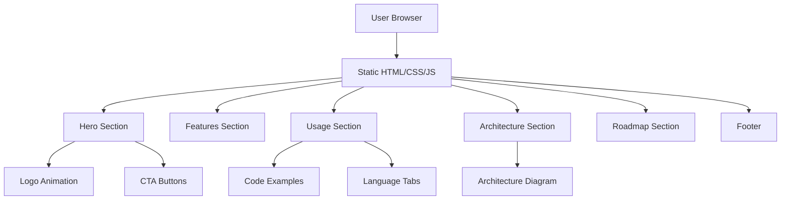

# MirDB Product Landing Page - Product Requirements Document

## Executive Summary

### Problem Statement
MirDB is a high-performance persistent key-value store written in Rust, but it lacks a professional product landing page to showcase its capabilities, attract contributors, and help potential users understand its value proposition compared to existing solutions like memcached and Redis.

### Proposed Solution
Create a modern, responsive product landing page that effectively communicates MirDB's unique value proposition as a persistent, memcached-compatible key-value store with LSM-tree architecture.

### Expected Impact
- Increase project visibility and adoption within the Rust and database communities
- Reduce barrier to entry for new users through clear documentation and examples
- Attract potential contributors by showcasing the project's architecture and roadmap
- Establish credibility as a production-ready storage solution

### Success Metrics
- Page load time under 2 seconds
- Mobile-responsive design (works on all screen sizes)
- Clear call-to-action for getting started
- Comprehensive feature documentation accessible from the landing page

## Requirements & Scope

### Functional Requirements

**REQ-1: Hero Section**
- Display project name (MirDB) with animated logo
- Clear tagline: "A Persistent Key-Value Store with Memcached Protocol"
- Primary call-to-action button linking to GitHub repository
- Secondary call-to-action for quick start documentation

**REQ-2: Features Showcase**
- Memcached Protocol Compatibility section with protocol highlights
- Persistence Architecture section explaining SSTable-based storage
- LSM Tree Implementation section with visual diagram
- Performance Characteristics section with key metrics

**REQ-3: Usage Documentation**
- Code examples showing basic operations (get, set, delete)
- Connection examples for popular programming languages
- Configuration examples with default values

**REQ-4: Technical Architecture**
- High-level system architecture diagram
- Component breakdown (memtable, SSTables, compaction)
- Data flow visualization

**REQ-5: Project Status & Roadmap**
- Completed features checklist
- In-progress and planned features
- Version history and changelog link

**REQ-6: Navigation & Footer**
- Sticky navigation with smooth scrolling to sections
- Footer with GitHub link, license information, and contributor credits

### Non-Functional Requirements

**NFR-1: Performance**
- First Contentful Paint under 1.5 seconds
- Time to Interactive under 3 seconds
- Optimized assets (compressed images, minified CSS/JS)

**NFR-2: Accessibility**
- WCAG 2.1 AA compliance
- Keyboard navigation support
- Screen reader compatibility
- Sufficient color contrast ratios

**NFR-3: Responsiveness**
- Mobile-first design approach
- Breakpoints: mobile (<768px), tablet (768px-1024px), desktop (>1024px)
- Touch-friendly interface elements

**NFR-4: Browser Compatibility**
- Support for latest 2 versions of Chrome, Firefox, Safari, Edge
- Graceful degradation for older browsers

**NFR-5: SEO**
- Semantic HTML structure
- Meta tags for social sharing (Open Graph, Twitter Cards)
- Structured data markup
- Descriptive page titles and meta descriptions

### Out of Scope
- Interactive demo environment (future enhancement)
- User authentication or account management
- Real-time database metrics dashboard
- Multi-language support (i18n) - English only for initial release
- Blog or news section

### Success Criteria
- [ ] All functional requirements implemented and tested
- [ ] Lighthouse performance score 90+ on mobile and desktop
- [ ] Lighthouse accessibility score 95+
- [ ] Cross-browser testing completed
- [ ] Code review and approval from project maintainers

## User Stories

### Persona: Backend Developer (Primary)
**Alex** is a backend developer evaluating storage solutions for a high-throughput application. They need a persistent cache that works with existing memcached clients.

**Story 1: Understanding Value Proposition**
- **As a** backend developer evaluating storage solutions
- **I want** to quickly understand what makes MirDB different from memcached and Redis
- **So that** I can determine if it fits my use case
- **Acceptance Criteria:**
  - Given I visit the landing page
  - When I view the hero section and features
  - Then I can clearly see the key differentiators (persistence + memcached compatibility)
- **Priority:** Must
- **Traceability:** REQ-1, REQ-2

**Story 2: Evaluating Technical Fit**
- **As a** backend developer
- **I want** to see code examples and architecture details
- **So that** I can assess integration complexity and performance characteristics
- **Acceptance Criteria:**
  - Given I navigate to the Usage section
  - When I view the code examples
  - Then I see working examples in at least 2 languages (e.g., Python, Node.js)
  - And I can copy-paste the examples directly
- **Priority:** Must
- **Traceability:** REQ-3, REQ-4

**Story 3: Getting Started Quickly**
- **As a** backend developer
- **I want** clear installation and setup instructions
- **So that** I can try MirDB within 5 minutes
- **Acceptance Criteria:**
  - Given I click the "Get Started" button
  - When I follow the quick start guide
  - Then I have a running MirDB instance with a working example
- **Priority:** Must
- **Traceability:** REQ-1, REQ-3

### Persona: Open Source Contributor (Secondary)
**Sam** is a Rust developer interested in contributing to database projects. They want to understand the codebase architecture and contribution guidelines.

**Story 4: Understanding Architecture**
- **As a** potential contributor
- **I want** to see the system architecture and tech stack
- **So that** I can identify areas where I can contribute
- **Acceptance Criteria:**
  - Given I view the Architecture section
  - When I examine the component diagram
  - Then I understand the main components (memtable, SSTable, compaction)
  - And I see links to relevant source code areas
- **Priority:** Should
- **Traceability:** REQ-4

**Story 5: Finding Contribution Opportunities**
- **As a** potential contributor
- **I want** to see the project roadmap and open issues
- **So that** I can find tasks matching my skills
- **Acceptance Criteria:**
  - Given I view the Roadmap section
  - When I look at planned features
  - Then I see clear links to GitHub issues labeled "good first issue" or "help wanted"
- **Priority:** Should
- **Traceability:** REQ-5

## User Experience & Interface

### User Journey

**Entry Point:** User discovers MirDB through search, social media, or referral
**Primary Flow:**
1. Hero section captures attention with clear value proposition
2. Features section educates on key differentiators
3. Usage examples demonstrate practical application
4. Architecture section builds technical confidence
5. CTA drives to GitHub or documentation

**Secondary Flow (Contributors):**
1. Entry through technical blog post or GitHub
2. Navigate to Architecture section
3. Review Roadmap for contribution opportunities
4. Access contribution guidelines

### Interface Requirements

**Visual Design:**
- Clean, modern aesthetic reflecting Rust's systems programming focus
- Color scheme: Dark theme with accent colors (Rust orange #DEA584, teal highlights)
- Typography: Monospace for code, sans-serif for body (Inter or system fonts)
- Ample whitespace for readability

**Animations:**
- Subtle logo animation in hero (matching existing GIF asset)
- Fade-in animations on scroll for content sections
- Smooth hover states on interactive elements
- No animations that could cause motion sickness

**Content Sections Layout:**
```
[Navigation - Sticky]
[Hero - Full viewport height]
[Features - 3-column grid on desktop]
[Usage - Code examples with tabs]
[Architecture - Diagram + explanation]
[Roadmap - Timeline view]
[Footer - Links and credits]
```

### Accessibility Considerations
- Skip-to-content link for keyboard users
- ARIA labels on interactive elements
- Focus indicators visible on all interactive elements
- Alt text on all images and diagrams
- Reduced motion media query support

## Technical Considerations

### High-Level Technical Approach
- Static site generation for optimal performance
- Single-page application with smooth scroll navigation
- No external dependencies for core functionality

### Integration Points
- GitHub API integration for star count and latest release (optional, client-side)
- Embedded code snippets from repository (can be static)

### Key Technical Constraints
- Must work without JavaScript (progressive enhancement)
- No server-side rendering requirements (can be deployed to GitHub Pages/Netlify)
- All assets must be self-hosted or from reliable CDNs

### Performance Considerations
- Lazy load images below the fold
- Preload critical fonts and hero image
- Minimize JavaScript bundle size
- Use CSS animations over JavaScript where possible

## Design Specification

### Recommended Approach
Build a static, single-page landing site using modern HTML5, CSS3, and minimal JavaScript. The design should emphasize MirDB's technical sophistication while remaining accessible to developers of all levels.

### Key Technical Decisions

#### 1. Site Generation Approach
- **Options Considered:** Pure HTML/CSS, Static Site Generator (Hugo/Jekyll), Build Tool (Vite/Webpack)
- **Tradeoffs:**
  - Pure HTML/CSS: Maximum control, no build step, harder to maintain
  - SSG: Good balance of maintainability and performance, learning curve
  - Build Tool: Overkill for single landing page, adds complexity
- **Recommendation:** Pure HTML/CSS with minimal vanilla JavaScript for interactivity. Given the scope (single page), simplicity outweighs maintenance concerns.

#### 2. Styling Strategy
- **Options Considered:** CSS Framework (Tailwind/Bootstrap), CSS-in-JS, Vanilla CSS with custom properties
- **Tradeoffs:**
  - CSS Framework: Faster development, larger bundle, generic look
  - CSS-in-JS: Requires build step, unnecessary for static site
  - Vanilla CSS: Maximum performance, full control, more code
- **Recommendation:** Vanilla CSS with CSS custom properties for theming. Keeps bundle minimal and allows precise control over design.

#### 3. Animation Approach
- **Options Considered:** GSAP, Framer Motion, CSS Animations, Intersection Observer API
- **Tradeoffs:**
  - GSAP: Powerful, adds significant bundle size
  - Framer Motion: React-only, not applicable
  - CSS Animations: Lightweight, limited complexity
  - Intersection Observer: Native API, good for scroll triggers
- **Recommendation:** CSS animations for simple effects, Intersection Observer API for scroll-triggered animations. No external animation libraries.

### High-Level Architecture



### Key Considerations

**Performance:** The site must load quickly even on slower connections. All assets should be optimized, and critical CSS should be inlined. Target: <100KB total initial payload.

**Security:** As a static site, security concerns are minimal. Ensure no sensitive information in client-side code. All external links should use `rel="noopener noreferrer"`.

**Scalability:** Static site can be served from any CDN without scaling concerns. No database or server-side components to manage.

### Risk Management

**Technical Risk: Browser Compatibility**
- CSS custom properties and modern layout features may not work in older browsers
- **Mitigation:** Include CSS fallbacks for critical layout features. Test on target browsers during development.

**Technical Risk: Animation Performance**
- Complex animations could cause jank on lower-end devices
- **Mitigation:** Use `transform` and `opacity` for animations (GPU-accelerated). Implement `prefers-reduced-motion` support.

### Success Criteria
- Site loads and is interactive within 3 seconds on 3G connection
- All functionality works without JavaScript (progressive enhancement)
- Lighthouse scores: Performance 90+, Accessibility 95+, Best Practices 100, SEO 100
- Visual design receives positive feedback from project maintainers

## Dependencies & Assumptions

### Dependencies
- GitHub repository must be public and accessible
- Logo and usage GIF assets available in repository
- CircleCI badge and build status accessible

### Assumptions
- Target audience is technical (software developers)
- Primary use case is evaluation and getting started
- Site will be hosted on GitHub Pages or similar static hosting
- No authentication or dynamic content required for initial release

### Cross-Team Coordination
- Coordinate with project maintainers for:
  - Logo and branding assets
  - Technical accuracy review
  - Roadmap alignment
  - Final approval before deployment

## Appendices

### Reference Materials
- GitHub Repository: https://github.com/yetone/mirdb
- Memcached Protocol Documentation: https://github.com/memcached/memcached/blob/master/doc/protocol.txt
- Existing README.md with project overview

### Asset Requirements
- Animated logo (GIF): assets/logo.gif
- Usage demonstration (GIF): assets/usage.gif
- Architecture diagrams (to be created)
- Favicon and social sharing images (to be created)

### Content Sources
- Feature descriptions based on existing README.md
- Code examples to be derived from project documentation
- Technical specifications from codebase analysis
