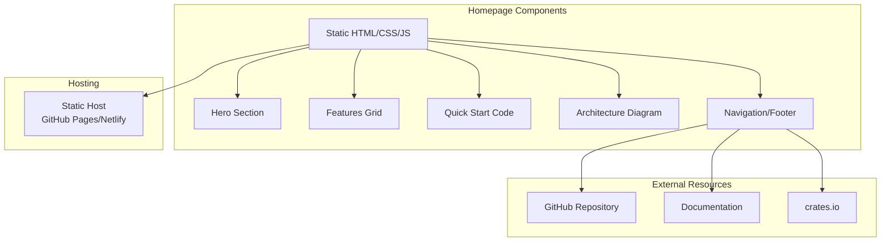

# MirDB Product Homepage Design - Product Requirements Document

## Executive Summary

### Problem Statement
MirDB is a feature-rich persistent key-value store with Memcached compatibility, but it currently lacks a dedicated homepage to communicate its value proposition, features, and getting-started guidance to potential users. Without a proper product homepage, developers cannot easily discover, evaluate, or adopt MirDB for their projects.

### Proposed Solution
Create a modern, responsive product homepage that effectively communicates MirDB's unique value proposition as a persistent Memcached-compatible database, showcases its key features and architecture, and provides clear pathways for users to get started quickly.

### Expected Impact
- **Increased Adoption**: Clear value proposition and easy onboarding will lower barriers to entry for new users
- **Brand Recognition**: Professional homepage establishes MirDB as a credible open-source database solution
- **Developer Trust**: Technical documentation and architecture overview builds confidence in the product
- **Community Growth**: Easy access to resources encourages contributions and community engagement

### Success Metrics
- Homepage load time under 3 seconds on 3G connections
- Mobile responsiveness score above 90 on Lighthouse
- User engagement: average time on page exceeds 2 minutes
- Conversion rate: 15%+ of visitors navigate to documentation or GitHub
- Accessibility compliance: WCAG 2.1 AA standard

---

## Requirements & Scope

### Functional Requirements

| ID | Requirement | Priority |
|------|-------------|----------|
| REQ-1 | Display clear product value proposition (persistent key-value store with Memcached compatibility) above the fold | Must |
| REQ-2 | Showcase key features: Memcached protocol support, persistence via SSTables, LSM Tree architecture | Must |
| REQ-3 | Provide quick-start code snippet demonstrating basic usage with existing Memcached clients | Must |
| REQ-4 | Include navigation to documentation, GitHub repository, and getting started guide | Must |
| REQ-5 | Display current project status and implemented features | Should |
| REQ-6 | Show default configuration options (port, directories, sizes) | Should |
| REQ-7 | Include architecture diagram illustrating LSM Tree components | Should |
| REQ-8 | Provide comparison section highlighting differences from standard Memcached | Could |
| REQ-9 | Display language/client library compatibility information | Could |
| REQ-10 | Include community links (discussions, contributing guidelines) | Could |

### Non-Functional Requirements

| ID | Requirement | Priority |
|------|-------------|----------|
| NFR-1 | Page must be fully responsive across desktop, tablet, and mobile devices | Must |
| NFR-2 | Initial page load under 3 seconds on standard broadband connection | Must |
| NFR-3 | Support dark mode based on system preferences | Should |
| NFR-4 | Meet WCAG 2.1 AA accessibility standards | Should |
| NFR-5 | Support all modern browsers (Chrome, Firefox, Safari, Edge - last 2 versions) | Must |
| NFR-6 | Static site generation for fast hosting on GitHub Pages or similar | Should |
| NFR-7 | SEO optimization with proper meta tags, structured data, and semantic HTML | Should |

### Out of Scope
- User authentication or account management
- Interactive database console or playground
- Blog or news section
- Multi-language/internationalization support
- Analytics dashboard or usage tracking implementation
- E-commerce or payment functionality

### Success Criteria
- All "Must" priority requirements implemented and functional
- Homepage passes Lighthouse performance audit with score above 90
- Homepage renders correctly on latest versions of Chrome, Firefox, Safari, and Edge
- All navigation links function correctly
- Page is usable with keyboard-only navigation
- Content accurately represents current MirDB capabilities

---

## User Stories

### Personas

1. **Developer Dan** - A backend engineer evaluating database solutions for a new project requiring caching with persistence
2. **DevOps Diana** - An infrastructure engineer looking for Memcached-compatible solutions with better durability
3. **Contributor Chris** - An open-source enthusiast interested in contributing to Rust-based database projects

### Core User Stories

#### Story 1: Understand Product Value
**As a** Developer Dan
**I want to** quickly understand what MirDB offers and how it differs from standard Memcached
**So that** I can evaluate if it fits my project requirements

**Acceptance Criteria:**
```gherkin
Given I am a developer visiting the MirDB homepage
When the page loads
Then I should see a clear headline explaining MirDB is a persistent key-value store
And I should see that it supports the Memcached protocol
And I should understand the key differentiator (persistence) within 10 seconds

Given I am viewing the features section
When I scroll to the features
Then I should see at least 3 key features with brief descriptions
And each feature should have a visual icon or illustration
```
**Traceability:** REQ-1, REQ-2
**Priority:** Must

#### Story 2: Get Started Quickly
**As a** Developer Dan
**I want to** see how to connect to MirDB using my existing Memcached client
**So that** I can quickly test the product without learning new APIs

**Acceptance Criteria:**
```gherkin
Given I am on the homepage
When I navigate to the quick-start section
Then I should see a code snippet showing connection with a Memcached client
And the code should be copy-able with a single click
And the default connection address (0.0.0.0:12333) should be visible

Given I want to run MirDB locally
When I view the installation instructions
Then I should see clear steps to build and run the server
And I should see the default configuration values
```
**Traceability:** REQ-3, REQ-6
**Priority:** Must

#### Story 3: Access Documentation
**As a** DevOps Diana
**I want to** navigate to detailed documentation and the source code
**So that** I can understand the architecture and deployment requirements

**Acceptance Criteria:**
```gherkin
Given I am on the homepage
When I look at the navigation
Then I should see clear links to Documentation and GitHub
And clicking these links should open the respective resources

Given I want to understand the architecture
When I view the architecture section
Then I should see a diagram showing the LSM Tree components
And I should understand the data flow from write to disk
```
**Traceability:** REQ-4, REQ-7
**Priority:** Must

#### Story 4: Evaluate Project Maturity
**As a** DevOps Diana
**I want to** understand the current status and roadmap of the project
**So that** I can assess if it's suitable for production use

**Acceptance Criteria:**
```gherkin
Given I am evaluating MirDB for production use
When I view the project status section
Then I should see which features are implemented (async networking, compaction, etc.)
And I should see what is planned (Raft consensus)
And I should be able to find the project's GitHub for more details
```
**Traceability:** REQ-5
**Priority:** Should

#### Story 5: Contribute to the Project
**As a** Contributor Chris
**I want to** find information about contributing to MirDB
**So that** I can participate in the open-source community

**Acceptance Criteria:**
```gherkin
Given I am interested in contributing
When I look for contribution information
Then I should find a link to the GitHub repository
And I should find community or contribution guidelines
```
**Traceability:** REQ-10
**Priority:** Could

---

## User Experience & Interface

### User Journey

```
Landing → Hero Section → Features Overview → Quick Start → Architecture → CTA/Navigation
```

1. **Arrival**: User lands on homepage from search, referral, or direct link
2. **Value Recognition**: Hero section immediately communicates product purpose
3. **Feature Discovery**: Scrolling reveals key capabilities and differentiators
4. **Hands-on Orientation**: Code snippets show immediate usability
5. **Technical Understanding**: Architecture section builds confidence
6. **Action**: Clear CTAs guide to documentation, GitHub, or getting started

### Interface Requirements

#### Hero Section
- Product name and logo prominently displayed
- Tagline: "Persistent Key-Value Store with Memcached Protocol"
- Primary CTA button: "Get Started"
- Secondary CTA: "View on GitHub"
- Optional: animated visualization of data persistence concept

#### Features Section
- Grid layout with 3-4 feature cards
- Each card: icon, title, brief description
- Key features to highlight:
  - Memcached Protocol Compatibility
  - Persistent Storage (SSTables)
  - LSM Tree Architecture
  - Async Rust Performance

#### Quick Start Section
- Code snippet with syntax highlighting
- Copy-to-clipboard functionality
- Example showing connection with standard Memcached client
- Default configuration display

#### Architecture Section
- Visual diagram of LSM Tree structure
- Components: Memtable → Immutable Memtable → SSTables → Compaction
- Brief explanation of data flow

#### Navigation
- Fixed/sticky header with:
  - Logo
  - Documentation link
  - GitHub link
  - Getting Started link
- Footer with:
  - License information
  - Additional resources

### Accessibility Considerations
- Sufficient color contrast ratios (4.5:1 minimum)
- Alt text for all images and diagrams
- Keyboard navigable interface
- Screen reader compatible structure
- Focus indicators for interactive elements
- Skip navigation link for keyboard users

---

## Technical Considerations

### High-Level Technical Approach
Static site generation is recommended for optimal performance, simple hosting, and SEO benefits. The homepage should be lightweight, focusing on content delivery rather than complex interactivity.

### Integration Points
- **GitHub Repository**: Links to source code, issues, and releases
- **Documentation Site**: Links to detailed technical documentation (if separate)
- **Package Registries**: Links to crates.io for Rust users

### Key Technical Constraints
- Must be hostable on static hosting platforms (GitHub Pages, Netlify, Vercel)
- No server-side dependencies required for homepage functionality
- Must work without JavaScript for core content (progressive enhancement)

### Performance Considerations
- Target bundle size under 100KB (excluding images)
- Images optimized and served in modern formats (WebP with fallbacks)
- Critical CSS inlined for faster first paint
- Lazy loading for below-fold content

---

## Design Specification

### Recommended Approach
Build a static, single-page website using a modern static site generator or vanilla HTML/CSS/JS. Focus on fast load times, clean typography, and clear information hierarchy. Leverage existing open-source database homepage patterns (Redis, ScyllaDB) as inspiration.

### Key Technical Decisions

#### 1. Static Site Technology
- **Options Considered**: Plain HTML/CSS, Astro, Next.js (static export), Hugo
- **Tradeoffs**: Plain HTML is simplest but harder to maintain; Astro offers modern DX with minimal JS; Next.js adds complexity; Hugo is fast but requires Go knowledge
- **Recommendation**: Astro or plain HTML/CSS for simplicity and performance with minimal learning curve

#### 2. Styling Approach
- **Options Considered**: Vanilla CSS, Tailwind CSS, CSS-in-JS
- **Tradeoffs**: Vanilla CSS is portable but verbose; Tailwind is utility-first with larger initial size; CSS-in-JS requires JS runtime
- **Recommendation**: Tailwind CSS or vanilla CSS with custom properties for maintainability and design consistency

#### 3. Hosting Platform
- **Options Considered**: GitHub Pages, Netlify, Vercel, Cloudflare Pages
- **Tradeoffs**: GitHub Pages integrates with repo but has limited features; Netlify/Vercel offer more features and better performance
- **Recommendation**: GitHub Pages for simplicity or Netlify for enhanced features like form handling and deploy previews

#### 4. Code Syntax Highlighting
- **Options Considered**: Prism.js, Highlight.js, Shiki (build-time)
- **Tradeoffs**: Runtime highlighters add JS weight; build-time highlighting is faster but requires build step
- **Recommendation**: Build-time highlighting with Shiki if using a build tool, or Prism.js for simplicity

### High-Level Architecture



### Key Considerations
- **Performance**: Static generation ensures sub-second load times; lazy loading and image optimization maintain performance at scale
- **Security**: Static site eliminates server-side vulnerabilities; external links should use `rel="noopener noreferrer"`
- **Scalability**: Static hosting scales infinitely with CDN distribution; no server capacity concerns

### Risk Management
- **Content Accuracy Risk**: Homepage content may become outdated as MirDB evolves; mitigate by keeping content minimal and linking to authoritative documentation
- **Browser Compatibility Risk**: Modern CSS features may not work in older browsers; mitigate by using progressive enhancement and testing across target browsers

### Success Criteria
- Homepage deploys successfully to chosen hosting platform
- Lighthouse performance score exceeds 90
- All functional requirements verified through manual testing
- Homepage accurately reflects current MirDB capabilities

---

## Dependencies & Assumptions

### Dependencies
- **GitHub Repository**: Source of truth for project information, links, and potential hosting
- **Design Assets**: Logo, icons, and diagrams need to be created or sourced
- **Content**: Final copy for all sections needs review and approval

### Assumptions
- MirDB project will remain open-source and publicly accessible
- Default configuration values (port 12333, etc.) will remain stable
- Standard Memcached client libraries can connect without modification
- Target audience is primarily developers and DevOps engineers

---

## Appendices

### A. Content Reference

#### Hero Tagline Options
1. "Persistent Key-Value Store with Memcached Protocol"
2. "Memcached with Durability, Powered by Rust"
3. "The Persistent Cache: Memcached Protocol, Disk Durability"

#### Feature Descriptions
1. **Memcached Compatible**: "Connect using any standard Memcached client. Zero migration effort for existing applications."
2. **Persistent Storage**: "Data survives restarts. SSTables provide durable, efficient disk storage."
3. **LSM Tree Architecture**: "Optimized for write-heavy workloads with intelligent compaction strategies."
4. **Rust Performance**: "Built with Tokio for async I/O. Safe, fast, and resource-efficient."

### B. Visual References

Recommended homepage inspiration:
- [Redis.io](https://redis.io) - Clear value proposition, product tiers
- [ScyllaDB](https://scylladb.com) - Technical depth, architecture focus
- [RocksDB](https://rocksdb.org) - Developer-focused, documentation-centric

### C. Default Configuration Reference
```toml
# MirDB Default Configuration
listen_address = "0.0.0.0:12333"
max_lsm_levels = 7
work_directory = "/tmp/mirdb"
sstable_max_size = "100MB"
memtable_max_size = "4MB"
block_size = "4KB"
```
