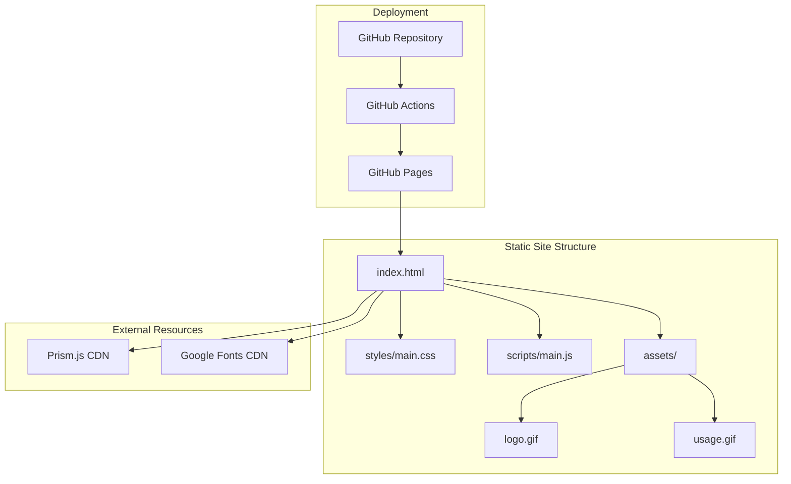

# Product Homepage Design - Product Requirements Document

## Executive Summary

### Problem Statement
MirDB is a persistent key-value store with Memcached protocol support, but it currently lacks a dedicated homepage that communicates its value proposition, features, and usage instructions to potential users and contributors. Without a proper homepage, the project relies solely on the GitHub README, which limits discoverability, brand presence, and user engagement.

### Proposed Solution
Create a modern, responsive product homepage that showcases MirDB's capabilities, provides clear documentation entry points, demonstrates ease of use, and encourages adoption. The homepage will serve as the primary landing page for the project, communicating key features and benefits while maintaining consistency with the product's technical nature.

### Expected Impact
- **Increased Adoption**: Clear value proposition and documentation will lower barriers to entry
- **Improved Developer Experience**: Easy access to getting started guides and usage examples
- **Enhanced Credibility**: Professional presentation establishes trust in the project
- **Community Growth**: Visible contribution guidelines and GitHub integration encourage participation

### Success Metrics
- Visitor-to-documentation click-through rate > 40%
- Average time on page > 2 minutes (indicating content engagement)
- GitHub star conversion rate increase from homepage visitors
- Reduction in "getting started" related GitHub issues

---

## Requirements & Scope

### Functional Requirements

| ID | Requirement | Priority |
|----|-------------|----------|
| REQ-1 | Display hero section with product name, tagline, and primary call-to-action | Must |
| REQ-2 | Showcase key features (Memcached protocol, skip-list memtable, compaction) | Must |
| REQ-3 | Provide quick-start/installation instructions | Must |
| REQ-4 | Display usage example with code snippet | Must |
| REQ-5 | Link to GitHub repository prominently | Must |
| REQ-6 | Display project status badges (CI status) | Should |
| REQ-7 | Include animated logo/visual demonstration (existing GIF assets) | Should |
| REQ-8 | Provide navigation to documentation sections | Should |
| REQ-9 | Display feature comparison or technical specifications | Could |
| REQ-10 | Include testimonials or use case examples | Could |

### Non-Functional Requirements

| ID | Requirement | Priority |
|----|-------------|----------|
| NFR-1 | Page must be fully responsive (mobile, tablet, desktop) | Must |
| NFR-2 | Page load time < 3 seconds on 3G connection | Must |
| NFR-3 | Accessibility compliance (WCAG 2.1 AA) | Must |
| NFR-4 | Cross-browser compatibility (Chrome, Firefox, Safari, Edge) | Must |
| NFR-5 | Support dark/light mode theming | Should |
| NFR-6 | SEO optimization with appropriate meta tags | Should |
| NFR-7 | Static site generation for hosting simplicity | Should |

### Out of Scope
- User authentication or account management
- Backend API or database integrations
- Interactive playground/sandbox environment
- Blog or content management system
- Internationalization (initial release in English only)
- Custom analytics dashboard (use standard tools like Google Analytics or Plausible)

### Success Criteria
- All "Must" requirements implemented and functional
- Page passes Lighthouse performance score > 90
- Page passes accessibility audit with no critical issues
- Stakeholder approval of visual design and content

---

## User Experience & Interface

### Target Users
1. **Software Engineers**: Evaluating MirDB for their projects
2. **DevOps/Infrastructure Engineers**: Looking for key-value store solutions
3. **Open Source Contributors**: Interested in contributing to the project
4. **Technical Decision Makers**: Assessing technology choices

### User Journey

```
Visitor arrives at homepage
    |
    v
[Hero Section] - Understands what MirDB is
    |
    v
[Features Section] - Learns key capabilities
    |
    v
[Usage Example] - Sees how easy it is to use
    |
    v
[Quick Start] - Gets installation instructions
    |
    v
[CTA: GitHub/Docs] - Takes action (stars repo, reads docs, tries product)
```

### Interface Requirements

#### Hero Section
- Product logo (animated GIF from assets)
- Clear tagline: "A Persistent Key-Value Store with Memcached Protocol"
- Primary CTA: "Get Started" or "View on GitHub"
- Secondary CTA: "Read Documentation"

#### Features Section
- Grid or card-based layout
- Key features with icons:
  - Memcached Protocol Compatibility
  - Skip-list Memtable Implementation
  - Minor & Major Compaction
  - Tokio Async Runtime
  - Persistent Storage (LSM-tree based)

#### Code Example Section
- Syntax-highlighted code block
- Copy-to-clipboard functionality
- Show simple GET/SET operations via Memcached protocol

#### Quick Start Section
- Step-by-step installation instructions
- Cargo/build commands
- Configuration basics

#### Footer
- GitHub link
- License information
- CI/build status badge

### Accessibility Considerations
- Semantic HTML structure
- Keyboard navigation support
- Screen reader compatible
- Sufficient color contrast ratios
- Alt text for images and GIFs

---

## Technical Considerations

### High-Level Technical Approach
The homepage will be implemented as a static site to ensure fast load times, easy deployment, and minimal maintenance overhead. The site will be hosted on GitHub Pages or a similar static hosting service, leveraging the existing repository structure.

### Integration Points
- **GitHub Repository**: Links and status badges
- **Existing Assets**: Logo GIF and usage demonstration GIF from `/assets/` directory
- **CI Pipeline**: Display CircleCI badge status

### Key Technical Constraints
- Must work without a backend server (static files only)
- Should integrate with existing project structure
- Deployment should be automated via CI/CD

### Performance Considerations
- Optimize images and GIFs for web delivery
- Minimize JavaScript bundle size
- Use modern CSS for animations where possible
- Implement lazy loading for below-fold content

---

## Design Specification

### Recommended Approach
Build a single-page static website using a modern static site generator or vanilla HTML/CSS/JS, optimized for performance and maintainability within the existing Rust project structure.

### Key Technical Decisions

#### 1. Static Site Framework
- **Options Considered**: Vanilla HTML/CSS/JS, Hugo, Jekyll, Astro, 11ty
- **Tradeoffs**: Vanilla is simplest but lacks templating; Hugo/Jekyll require Ruby/Go; Astro/11ty add Node dependency but offer component architecture
- **Recommendation**: Vanilla HTML/CSS/JS for initial implementation - minimizes dependencies and integrates cleanly with Rust project; can migrate to SSG later if content grows

#### 2. Styling Approach
- **Options Considered**: Plain CSS, Tailwind CSS, CSS-in-JS, SCSS
- **Tradeoffs**: Plain CSS is dependency-free but verbose; Tailwind requires build step but enables rapid development; SCSS adds preprocessing overhead
- **Recommendation**: Plain CSS with CSS custom properties for theming - keeps build simple and works well for single-page sites

#### 3. Hosting Platform
- **Options Considered**: GitHub Pages, Netlify, Vercel, Cloudflare Pages
- **Tradeoffs**: GitHub Pages is free and integrated but limited; Netlify/Vercel offer more features but add external dependency
- **Recommendation**: GitHub Pages - free, integrated with repository, sufficient for static site needs

#### 4. Code Syntax Highlighting
- **Options Considered**: Prism.js, Highlight.js, server-rendered, CSS-only
- **Tradeoffs**: JS libraries add bundle size; CSS-only limited styling options
- **Recommendation**: Prism.js (lightweight) - small footprint, excellent language support, works client-side

### High-Level Architecture



### Key Considerations
- **Performance**: Static files served via CDN ensure fast global delivery; minimal JS keeps bundle small
- **Security**: No backend means minimal attack surface; CSP headers can be configured in GitHub Pages
- **Scalability**: Static hosting scales automatically; no server resources to manage

### Risk Management
- **Browser Compatibility Risk**: Some modern CSS features may not work in older browsers; mitigation: use progressive enhancement and test across browsers
- **Asset Loading Risk**: Large GIFs may slow initial load; mitigation: optimize GIFs, consider lazy loading, provide static fallbacks

### Success Criteria
- Page renders correctly on all major browsers
- Lighthouse performance score > 90
- All interactive elements (CTAs, code copy) function correctly
- CI/CD pipeline successfully deploys changes automatically

---

## Dependencies & Assumptions

### Dependencies
- GitHub Pages or equivalent static hosting service
- CircleCI integration for build status badge
- CDN availability for external libraries (Prism.js, fonts)

### Assumptions
- Project maintainers will provide final copy/content for sections
- Existing logo and usage GIFs are approved for homepage use
- GitHub repository will remain public
- No custom domain is required initially (use github.io subdomain)

### Cross-Team Coordination
- Collaboration with project maintainers for content approval
- Design review before implementation (if visual mockups required)

---

## Appendices

### Reference Materials
- Existing README.md content for feature descriptions
- Logo asset: `/assets/logo.gif`
- Usage demonstration: `/assets/usage.gif`
- CI badge configuration from existing README

### Content Outline

**Hero Section Copy:**
> MirDB: A Persistent Key-Value Store
> Fast, reliable, and painless as using Memcached

**Feature Highlights:**
1. **Memcached Protocol** - Drop-in compatibility with existing Memcached clients
2. **Skip-list Memtable** - Efficient in-memory data structure for fast writes
3. **Automatic Compaction** - Minor and major compaction for optimized storage
4. **Async Runtime** - Built on Tokio for high-performance async I/O
5. **Persistent Storage** - LSM-tree based architecture for durability

**Roadmap Indication:**
- Completed: Tokio + Memcached, Memtable, Compaction
- In Progress: Raft consensus for distributed operation
