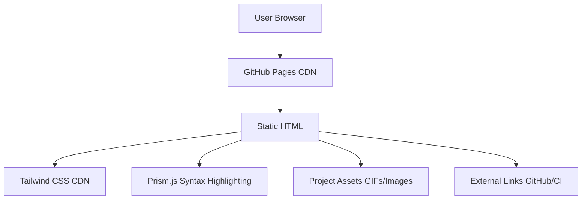

# Product Landing Page - Product Requirements Document

## Executive Summary

### Problem Statement
MirDB is a high-performance persistent key-value store with Memcached protocol compatibility, but it lacks a professional product landing page to effectively communicate its value proposition to potential users and contributors. Without a compelling homepage, the project struggles to attract adoption, communicate its technical advantages, and establish credibility in the competitive database landscape.

### Proposed Solution
Create a modern, responsive product landing page that clearly communicates MirDB's key features, technical capabilities, and ease of use. The landing page will serve as the primary entry point for developers evaluating MirDB, providing clear value propositions, usage examples, and pathways to documentation and community resources.

### Expected Impact
- **Increased Adoption**: Clear communication of MirDB's benefits will drive more developers to try the product
- **Improved Developer Experience**: Easy access to documentation, examples, and getting started guides
- **Enhanced Credibility**: Professional presentation establishes trust with enterprise users and open-source contributors
- **Community Growth**: Better visibility leads to increased contributions and community engagement

### Success Metrics
- Page load time under 2 seconds
- Mobile-responsive design (works on all screen sizes)
- Clear call-to-action paths to GitHub repository and documentation
- SEO-optimized content for key-value store and Memcached-related searches

---

## Requirements & Scope

### Functional Requirements

| ID | Requirement | Priority |
|----|-------------|----------|
| REQ-1 | Display hero section with product name, tagline, and primary CTA | Must |
| REQ-2 | Showcase key features (Memcached protocol compatibility, persistent storage, LSM-tree architecture) | Must |
| REQ-3 | Include animated usage demonstration (terminal-style or GIF) | Must |
| REQ-4 | Provide clear installation/getting started instructions | Must |
| REQ-5 | Display project status badges (CI status, version info) | Should |
| REQ-6 | Include links to GitHub repository and documentation | Must |
| REQ-7 | Show project roadmap/TODO list with completion status | Should |
| REQ-8 | Display architecture highlights (tokio, skiplist, compaction) | Should |

### Non-Functional Requirements

| ID | Requirement | Priority |
|----|-------------|----------|
| NFR-1 | Page must load in under 2 seconds | Must |
| NFR-2 | Fully responsive design (mobile, tablet, desktop) | Must |
| NFR-3 | SEO-optimized with proper meta tags and structured data | Should |
| NFR-4 | Accessible (WCAG 2.1 AA compliance) | Should |
| NFR-5 | Support for dark/light mode preference | Could |
| NFR-6 | Static site (no server-side rendering required) | Must |

### Out of Scope
- Interactive demo environment (live database playground)
- User authentication or account management
- E-commerce or pricing pages
- Blog or news section
- Multi-language support (initial release)

### Success Criteria
- [ ] Landing page is deployed and accessible via web browser
- [ ] All content accurately reflects MirDB's current capabilities
- [ ] Page passes Google PageSpeed Insights with score > 90
- [ ] Design is visually consistent with modern open-source project standards
- [ ] All links to GitHub and documentation are functional

---

## User Experience & Interface

### Target Audience
- **Primary**: Backend developers evaluating key-value stores for their applications
- **Secondary**: DevOps engineers looking for Memcached-compatible persistent storage
- **Tertiary**: Open-source contributors interested in Rust-based database projects

### User Journey
1. **Discovery**: User arrives via search engine, social media, or direct link
2. **Understanding**: User quickly grasps what MirDB is and its key benefits
3. **Validation**: User sees proof of functionality (demo, badges, features)
4. **Action**: User clicks through to GitHub, documentation, or installation guide

### Interface Requirements

#### Hero Section
- Large product logo/animation
- Clear tagline: "A Persistent Key-Value Store with Memcached Protocol"
- Primary CTA: "View on GitHub" or "Get Started"
- Secondary CTA: "See Demo"

#### Features Section
- Grid layout showcasing 4-6 key features
- Each feature with icon, title, and brief description
- Features to highlight:
  - Memcached Protocol Compatibility
  - Persistent Storage (LSM-Tree)
  - High Performance (Tokio async)
  - Skip List Memtable
  - Compaction Support (Minor & Major)

#### Demo Section
- Terminal-style code block showing usage example
- Or embedded GIF demonstrating actual usage
- Copy-to-clipboard functionality for commands

#### Getting Started Section
- Installation instructions (cargo install, docker, etc.)
- Quick start code example
- Link to full documentation

#### Footer
- GitHub repository link
- License information
- Contributing guidelines link
- Copyright notice

### Design Principles
- **Clean & Modern**: Minimalist design with ample whitespace
- **Code-First**: Highlight technical capabilities prominently
- **Trust Signals**: Display badges, stars, and activity metrics
- **Performance-First**: Fast loading, no heavy dependencies

---

## Technical Considerations

### Technology Stack Options

#### Option 1: Static HTML/CSS/JS (Recommended)
- **Pros**: Maximum performance, no build step, easy to host
- **Cons**: Manual maintenance for repeated elements
- **Best for**: Simple landing pages, GitHub Pages hosting

#### Option 2: Static Site Generator (Jekyll/Hugo)
- **Pros**: Templating, easy content management, GitHub Pages native support
- **Cons**: Build step required, learning curve
- **Best for**: Content-heavy sites, blog integration planned

#### Option 3: React/Vue SPA
- **Pros**: Interactive elements, component reusability
- **Cons**: Heavier bundle, SEO considerations
- **Best for**: Highly interactive demos, complex state management

### Hosting Recommendations
- **GitHub Pages**: Free, native integration with repository
- **Vercel/Netlify**: Free tier, automatic deployments, CDN
- **Self-hosted**: Full control, requires server maintenance

### Integration Points
- GitHub API (optional): Fetch star count, latest release
- CI Status Badge: CircleCI integration
- Analytics (optional): Google Analytics or privacy-focused alternative

---

## Design Specification

### Recommended Approach
Create a lightweight, static HTML landing page with modern CSS (using a framework like Tailwind CSS or custom CSS). The page will be hosted on GitHub Pages for seamless integration with the existing repository. Focus on fast load times and clear communication of technical value propositions.

### Key Technical Decisions

#### 1. Styling Approach
- **Options Considered**: Tailwind CSS, Bootstrap, Custom CSS, CSS-in-JS
- **Tradeoffs**:
  - Tailwind: Utility-first, fast development, larger initial CSS
  - Bootstrap: Component-rich, consistent look, heavier bundle
  - Custom CSS: Full control, minimal size, more development time
- **Recommendation**: Tailwind CSS via CDN for rapid development and modern aesthetics with minimal configuration

#### 2. Animation Strategy
- **Options Considered**: GIF assets, CSS animations, JavaScript libraries (Three.js, Lottie)
- **Tradeoffs**:
  - GIF: Simple, works everywhere, larger file sizes
  - CSS animations: Lightweight, performant, limited complexity
  - JS libraries: Rich interactions, heavier payload
- **Recommendation**: Use existing project GIFs (logo.gif, usage.gif) with CSS fade-in animations for performance

#### 3. Code Highlighting
- **Options Considered**: Prism.js, Highlight.js, Static styled blocks
- **Tradeoffs**:
  - Prism.js: Syntax highlighting, extensible, requires JS
  - Highlight.js: Auto-detection, larger bundle
  - Static blocks: Zero JS, less visual appeal
- **Recommendation**: Prism.js lightweight build for shell/command highlighting only

### High-Level Architecture



### Key Considerations

#### Performance
- Use CDN-hosted dependencies for caching benefits
- Optimize GIF assets or provide video alternatives
- Lazy load below-fold content
- Target < 100KB total page weight (excluding images)

#### Security
- No user input handling (static site)
- HTTPS enforced by GitHub Pages
- Subresource Integrity (SRI) for CDN resources

#### Scalability
- Static site scales infinitely via GitHub Pages CDN
- No database or server-side components to manage

### Risk Management

#### Technical Risk: Asset Loading
- **Risk**: GitHub raw content URLs may be slow or rate-limited
- **Mitigation**: Host assets in repository's `assets/` directory, use relative paths

#### Technical Risk: CDN Dependency
- **Risk**: Tailwind/Prism CDN outages affect page rendering
- **Mitigation**: Include fallback styles inline, or vendor critical CSS

### Success Criteria
- Page loads in under 2 seconds on 3G connection
- Passes Lighthouse audit with 90+ scores across all categories
- Displays correctly on devices from 320px to 4K widths
- All external links functional and open in new tabs

---

## User Stories

### Story 1: Developer Evaluating Key-Value Stores
**As a** backend developer evaluating key-value stores for my application,
**I want** to quickly understand MirDB's features and benefits,
**So that** I can determine if it meets my requirements for a persistent Memcached-compatible store.

**Acceptance Criteria:**
- Given I visit the landing page
- When I scroll through the hero and features sections
- Then I can see clear descriptions of Memcached compatibility, persistence, and performance characteristics
- And I can find links to technical documentation

**Traceability:** REQ-1, REQ-2, REQ-6
**Priority:** Must

### Story 2: DevOps Engineer Seeking Usage Examples
**As a** DevOps engineer looking for a persistent cache solution,
**I want** to see actual usage examples and installation instructions,
**So that** I can quickly evaluate how to deploy MirDB in my infrastructure.

**Acceptance Criteria:**
- Given I visit the landing page
- When I navigate to the Demo or Getting Started section
- Then I see terminal-style examples of commands
- And I can copy installation commands to my clipboard
- And I see links to Docker/deployment documentation

**Traceability:** REQ-3, REQ-4, REQ-6
**Priority:** Must

### Story 3: Open Source Contributor
**As a** potential open-source contributor,
**I want** to see the project's current status and roadmap,
**So that** I can identify areas where I can contribute.

**Acceptance Criteria:**
- Given I visit the landing page
- When I look for project status information
- Then I see CI badges and build status
- And I can view the TODO/roadmap section
- And I can click through to the GitHub repository

**Traceability:** REQ-5, REQ-7, REQ-8
**Priority:** Should

### Story 4: Mobile User Browsing Project
**As a** developer browsing on my phone,
**I want** the landing page to be readable and functional on mobile devices,
**So that** I can learn about MirDB without needing a desktop computer.

**Acceptance Criteria:**
- Given I visit the landing page on a mobile device
- When the page loads
- Then all content is readable without horizontal scrolling
- And CTAs are easily tappable
- And images scale appropriately to screen width

**Traceability:** NFR-2
**Priority:** Must

---

## Dependencies & Assumptions

### Dependencies
- GitHub Pages hosting (free, requires repository admin access)
- Access to existing project assets (logo.gif, usage.gif)
- CircleCI badge integration (already configured)

### Assumptions
- Project assets (GIFs) are optimized for web use
- GitHub repository remains public and accessible
- No major rebranding or name changes in near term
- Target audience is technical (developers, DevOps)

---

## Appendices

### Reference Materials
- **Project Repository**: https://github.com/yetone/mirdb
- **Existing Assets**:
  - Logo: `/assets/logo.gif`
  - Usage Demo: `/assets/usage.gif`
- **CI Status**: CircleCI integration already active

### Content Outline

#### Hero Section Content
```
MirDB
A Persistent Key-Value Store with Memcached Protocol

Drop-in replacement for Memcached with durable storage.
Powered by Rust. Built for performance.

[View on GitHub] [Get Started]
```

#### Features Section Content
1. **Memcached Compatible** - Use existing Memcached clients and protocols
2. **Persistent Storage** - Data survives restarts with LSM-tree architecture
3. **High Performance** - Async I/O with Tokio for maximum throughput
4. **Efficient Memory** - Skip list memtable for fast in-memory operations
5. **Automatic Compaction** - Background minor and major compaction

#### Code Example
```bash
# Install via cargo
cargo install mirdb

# Start the server
mirdb-server --port 11211

# Use with any Memcached client
printf "set mykey 0 0 5\r\nhello\r\n" | nc localhost 11211
```

### SEO Keywords
- Key-value store
- Persistent cache
- Memcached alternative
- Rust database
- LSM-tree storage
- Async key-value store
