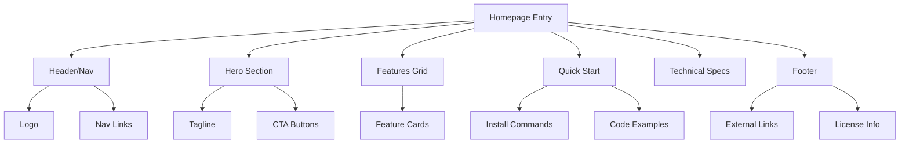

# Product Homepage Design - Product Requirements Document

## Executive Summary

### Problem Statement
MirDB is a persistent key-value store with powerful features (memcached protocol compatibility, LSM tree storage, data persistence) but lacks a public-facing homepage to communicate its value proposition, attract users, and provide essential information for getting started.

### Proposed Solution
Create a homepage for MirDB that effectively communicates the product's unique value proposition, key features, and provides clear pathways for users to get started. The homepage will serve as the primary marketing and documentation entry point for the project.

### Expected Impact
- **Increased Adoption**: Clear communication of features and benefits will attract more developers seeking a persistent memcached alternative
- **Reduced Onboarding Friction**: Quick-start information and documentation links will help users get started faster
- **Professional Presence**: A well-designed homepage establishes credibility and trust in the project

### Success Metrics
- Homepage successfully deployed and accessible
- All key product features clearly communicated
- Clear call-to-action for getting started
- Documentation and quick-start sections present
- Mobile-responsive design implemented

---

## Requirements & Scope

### Functional Requirements

| ID | Requirement | Priority |
|----|-------------|----------|
| REQ-1 | Display product name (MirDB) and tagline prominently in hero section | Must |
| REQ-2 | Present clear value proposition explaining what MirDB is and why it matters | Must |
| REQ-3 | Showcase key features with descriptions (memcached compatibility, persistence, LSM tree architecture) | Must |
| REQ-4 | Provide quick-start code examples showing basic usage | Must |
| REQ-5 | Include installation/setup instructions or link to documentation | Must |
| REQ-6 | Display current project status and implemented features | Should |
| REQ-7 | Include navigation to documentation, GitHub repository, and other resources | Must |
| REQ-8 | Show configuration defaults and system requirements | Should |
| REQ-9 | Include comparison with standard memcached highlighting key differentiators | Should |
| REQ-10 | Provide contact/community information for support and contributions | Could |

### Non-Functional Requirements

| ID | Requirement | Priority |
|----|-------------|----------|
| NFR-1 | Page must be responsive and render correctly on mobile, tablet, and desktop devices | Must |
| NFR-2 | Page must load within 3 seconds on standard broadband connection | Must |
| NFR-3 | Page must be accessible following WCAG 2.1 AA guidelines | Should |
| NFR-4 | Page must render correctly in modern browsers (Chrome, Firefox, Safari, Edge) | Must |
| NFR-5 | Content must be SEO-friendly with proper meta tags and semantic HTML | Should |
| NFR-6 | Design must be consistent with technical/developer tool aesthetics | Should |

### Out of Scope
- User authentication or login functionality
- Interactive database demos or live playgrounds
- Blog or news section
- Multi-language/internationalization support
- Backend API integration
- Analytics dashboard (basic analytics tracking is acceptable)

### Success Criteria
- Homepage renders correctly across all target browsers and devices
- All key features from REQ-1 through REQ-7 are implemented
- Page passes Lighthouse performance score of 80+
- Page passes accessibility audit with no critical issues
- Stakeholder approval on design and content

---

## User Experience & Interface

### User Journey

```
Visitor Arrives
       │
       ▼
┌──────────────────┐
│   Hero Section   │──── Understands what MirDB is
└────────┬─────────┘
         │
         ▼
┌──────────────────┐
│  Features Grid   │──── Learns key capabilities
└────────┬─────────┘
         │
         ▼
┌──────────────────┐
│   Quick Start    │──── Sees how to get started
└────────┬─────────┘
         │
         ▼
┌──────────────────┐
│  CTA / Get Code  │──── Takes action (GitHub, Docs)
└──────────────────┘
```

### Interface Requirements

#### Header/Navigation
- Logo and product name
- Navigation links: Features, Documentation, GitHub, Quick Start

#### Hero Section
- Product name and tagline
- Brief description (1-2 sentences)
- Primary CTA button (e.g., "Get Started" or "View on GitHub")
- Optional: Terminal/code preview animation

#### Features Section
- 3-4 feature cards highlighting:
  - Memcached Protocol Compatibility
  - Data Persistence (SSTables)
  - LSM Tree Architecture
  - Async I/O with Tokio

#### Quick Start Section
- Installation command
- Basic configuration example
- Simple usage code snippet showing SET/GET operations

#### Technical Specifications Section
- Default configuration values
- System requirements
- Supported commands overview

#### Footer
- Links to documentation, GitHub, license
- Project status/version information

### Accessibility Considerations
- All images must have alt text
- Color contrast must meet WCAG AA standards
- Interactive elements must be keyboard accessible
- Skip navigation link for screen readers
- Semantic HTML structure (header, main, nav, footer)

---

## Technical Considerations

### Technology Options
The homepage can be built using various approaches:
- **Static HTML/CSS/JS**: Simple, no build process, easy deployment
- **Static Site Generator (Hugo, Jekyll, 11ty)**: Better for documentation integration
- **React/Vue SPA**: More dynamic but heavier, may be overkill for a homepage

### Integration Points
- GitHub repository for source code links
- Documentation site (if separate)
- Package registry (crates.io) for installation instructions

### Performance Considerations
- Minimize external dependencies to reduce load time
- Optimize images (WebP format, appropriate sizing)
- Consider lazy loading for below-fold content
- Minimal JavaScript for interactivity

### Hosting Considerations
- GitHub Pages (free, integrates with repo)
- Netlify/Vercel (easy deployment, good performance)
- Custom hosting as needed

---

## Design Specification

### Recommended Approach
A static HTML/CSS homepage with minimal JavaScript, optimized for fast loading and easy maintenance. This approach balances simplicity with the need for a professional, modern design suitable for a developer-focused product.

### Key Technical Decisions

#### 1. Framework/Build System
- **Options Considered**: Plain HTML/CSS, Static Site Generator (Hugo/Jekyll), React SPA
- **Tradeoffs**: Plain HTML is simplest but harder to maintain at scale; SSG adds build complexity but enables templating; React is overkill for static content
- **Recommendation**: Static HTML/CSS with optional build step for minification, prioritizing simplicity and fast deployment

#### 2. Styling Approach
- **Options Considered**: Plain CSS, CSS Framework (Tailwind), CSS-in-JS
- **Tradeoffs**: Plain CSS offers full control but more code; Tailwind provides utility classes but adds learning curve; CSS-in-JS requires JavaScript
- **Recommendation**: Plain CSS with CSS custom properties for theming, keeping dependencies minimal

#### 3. Hosting Platform
- **Options Considered**: GitHub Pages, Netlify, Vercel, Custom server
- **Tradeoffs**: GitHub Pages integrates with repo but limited features; Netlify/Vercel offer more features and easy deploys
- **Recommendation**: GitHub Pages for zero-cost integration with existing repository

#### 4. Code Highlighting
- **Options Considered**: Prism.js, Highlight.js, Pre-rendered syntax highlighting
- **Tradeoffs**: JS libraries add weight; pre-rendered reduces interactivity but improves performance
- **Recommendation**: Prism.js (lightweight) with minimal languages loaded, or pre-rendered highlighting for optimal performance

### High-Level Architecture



### Key Considerations
- **Performance**: Static assets with minimal JS ensure fast load times; CDN hosting improves global access speeds
- **Security**: No backend means minimal attack surface; external links should use rel="noopener"
- **Scalability**: Static hosting scales infinitely with CDN; content updates require rebuild/redeploy

### Risk Management
- **Content Drift Risk**: Documentation may become outdated as product evolves; mitigate by linking to central docs rather than duplicating content
- **Browser Compatibility Risk**: CSS features may not work in older browsers; mitigate by using progressive enhancement and testing across browsers

### Success Criteria
- Page loads under 3 seconds globally
- Lighthouse performance score of 80+
- All content accurately reflects current product capabilities
- Clear user path from landing to getting started

---

## User Stories

### Personas
- **Developer Evaluator**: A developer researching key-value stores who wants to quickly understand if MirDB fits their needs
- **Existing Memcached User**: A developer familiar with memcached looking for a persistent alternative
- **Open Source Contributor**: A developer interested in contributing to the project

### Core User Stories

#### US-1: Understand Product Value
**As a** Developer Evaluator
**I want** to quickly understand what MirDB is and its key benefits
**So that** I can determine if it's worth investigating further

**Acceptance Criteria:**
- Given I land on the homepage
- When I view the hero section
- Then I see a clear tagline explaining MirDB is a persistent key-value store with memcached compatibility

**Priority**: Must
**Traceability**: REQ-1, REQ-2

---

#### US-2: Learn Key Features
**As a** Developer Evaluator
**I want** to see the main features of MirDB
**So that** I can understand its capabilities compared to alternatives

**Acceptance Criteria:**
- Given I am on the homepage
- When I scroll to the features section
- Then I see clearly described features including memcached protocol support, data persistence, and LSM tree architecture

**Priority**: Must
**Traceability**: REQ-3

---

#### US-3: Quick Start Experience
**As an** Existing Memcached User
**I want** to see how to get started with MirDB
**So that** I can try it out quickly

**Acceptance Criteria:**
- Given I am on the homepage
- When I navigate to the quick start section
- Then I see installation commands and basic usage examples for SET/GET operations

**Priority**: Must
**Traceability**: REQ-4, REQ-5

---

#### US-4: Access Documentation
**As a** Developer Evaluator
**I want** to access detailed documentation
**So that** I can learn more about configuration and advanced features

**Acceptance Criteria:**
- Given I am on the homepage
- When I look for documentation links
- Then I find clear navigation to documentation and GitHub repository

**Priority**: Must
**Traceability**: REQ-7

---

#### US-5: Understand Compatibility
**As an** Existing Memcached User
**I want** to understand how MirDB compares to standard memcached
**So that** I can evaluate migration effort

**Acceptance Criteria:**
- Given I am on the homepage
- When I look for comparison information
- Then I see how MirDB differs from memcached (persistence, supported commands)

**Priority**: Should
**Traceability**: REQ-9

---

#### US-6: Mobile Access
**As a** Developer Evaluator
**I want** to view the homepage on my mobile device
**So that** I can research MirDB while away from my desktop

**Acceptance Criteria:**
- Given I access the homepage from a mobile device
- When the page loads
- Then all content is readable and navigation is functional without horizontal scrolling

**Priority**: Must
**Traceability**: NFR-1

---

#### US-7: Contribute to Project
**As an** Open Source Contributor
**I want** to find information about contributing
**So that** I can help improve MirDB

**Acceptance Criteria:**
- Given I am on the homepage
- When I look for contribution information
- Then I find a link to the GitHub repository and project status

**Priority**: Could
**Traceability**: REQ-6, REQ-10

---

## Dependencies & Assumptions

### Dependencies
- Access to MirDB GitHub repository for linking
- Final product copy and messaging approved by stakeholders
- Logo/brand assets if available
- Hosting platform access (GitHub Pages or alternative)

### Assumptions
- No existing brand guidelines; design can be created fresh
- English-only content is acceptable for initial launch
- No CMS required; content updates will be done via code changes
- GitHub Pages or similar free hosting is acceptable
- Basic analytics (page views) is sufficient; no advanced tracking needed

---

## Appendices

### Content Reference: MirDB Features to Highlight

1. **Memcached Protocol Compatibility**
   - Standard text protocol support
   - Works with existing memcached clients
   - Supported commands: SET, GET, DELETE, ADD, REPLACE, APPEND, PREPEND

2. **Data Persistence**
   - SSTables for on-disk storage
   - Write-Ahead Log for durability
   - Survives restarts unlike traditional memcached

3. **LSM Tree Architecture**
   - Efficient write performance
   - Background compaction
   - Multi-level storage optimization

4. **Modern Rust Implementation**
   - Tokio-based async networking
   - Memory safety guarantees
   - High performance

### Default Configuration Reference
- Listen address: `0.0.0.0:12333`
- Max LSM levels: 7
- Work directory: `/tmp/mirdb`
- SSTable max size: 100MB
- Memtable max size: 4MB
- Block size: 4KB

### Quick Start Code Example

```bash
# Installation (placeholder - update with actual method)
cargo install mirdb-server

# Run the server
mirdb-server --config /path/to/config.toml
```

```python
# Connect with any memcached client
import memcache
client = memcache.Client(['localhost:12333'])

# Store data
client.set('key', 'value')

# Retrieve data
value = client.get('key')
```
