# Product Homepage Design - Product Requirements Document

## Executive Summary

### Problem Statement
MirDB is a high-performance persistent key-value store written in Rust that implements the Memcached protocol. As an emerging open-source database project, MirDB currently lacks a public-facing homepage that effectively communicates its value proposition, features, and technical capabilities to potential users and contributors. Without a dedicated homepage, the project struggles to establish credibility, attract users, and grow its community.

### Proposed Solution
Create a modern, responsive product homepage that showcases MirDB's unique capabilities as a persistent, Memcached-compatible key-value store. The homepage will serve as the primary entry point for developers evaluating database solutions, providing clear information about features, architecture, and getting started resources.

### Expected Impact
- **Increased Adoption**: Clear communication of MirDB's value proposition will attract developers seeking a persistent alternative to memcached
- **Community Growth**: A professional homepage establishes credibility and encourages contributions
- **Reduced Support Burden**: Comprehensive documentation and examples on the homepage will reduce repetitive questions
- **Competitive Positioning**: Position MirDB as a viable alternative to Redis and other key-value stores

### Success Metrics
- Homepage successfully communicates MirDB's core value proposition within 10 seconds of landing
- Clear differentiation from memcached and Redis is evident
- Users can find getting started instructions within 2 clicks
- Homepage renders correctly on desktop, tablet, and mobile devices

## Requirements & Scope

### Functional Requirements

**REQ-1: Hero Section**
The homepage must display a prominent hero section with:
- Project name (MirDB) and tagline explaining the core value proposition
- Brief one-sentence description: "A persistent key-value store with Memcached protocol compatibility"
- Call-to-action buttons for "Get Started" and "View on GitHub"
- Visual element (logo, ASCII art representation, or animated graphic)

**REQ-2: Features Showcase**
The homepage must present key features in an organized manner:
- **Memcached Protocol Support**: Compatible with existing memcached clients
- **Persistence**: Data survives restarts unlike traditional memcached
- **LSM Tree Architecture**: Efficient storage with memtables and SSTable compaction
- **High Performance**: Skip list data structure for fast in-memory operations
- **Rust Implementation**: Memory safety and performance benefits

**REQ-3: Architecture Overview**
The homepage must provide a high-level explanation of MirDB's architecture:
- Visual diagram or illustration of the LSM tree structure
- Explanation of write path: WAL → Memtable → Immutable Memtable → SSTables
- Explanation of read path: Memtable → Immutable Memtables → SSTable levels
- Description of compaction process (minor and major)

**REQ-4: Quick Start Guide**
The homepage must include a getting started section with:
- Installation instructions (cargo build, Docker if applicable)
- Basic configuration example
- Sample code showing client connection and basic operations (get, set, delete)
- Link to full documentation

**REQ-5: Configuration Reference**
The homepage must document key configuration options:
- Listen address and port (default: 0.0.0.0:12333)
- Work directory configuration
- Memtable and SSTable size limits
- Compaction triggers and levels

**REQ-6: Comparison Section**
The homepage must include a comparison table showing:
- MirDB vs Memcached (persistence, protocol compatibility)
- MirDB vs Redis (architecture, use cases)
- Clear positioning of when to choose MirDB

**REQ-7: Footer with Resources**
The homepage must include a footer with:
- Links to GitHub repository
- Documentation links
- Community channels (if any)
- License information (MIT/Apache-2.0 or similar)

### Non-Functional Requirements

**NFR-1: Performance**
- Homepage must load in under 3 seconds on a standard broadband connection
- Static assets should be optimized and minified

**NFR-2: Responsiveness**
- Homepage must render correctly on screen sizes from 320px (mobile) to 1920px (desktop)
- Navigation must adapt to mobile (hamburger menu) vs desktop (horizontal nav)

**NFR-3: Accessibility**
- Must meet WCAG 2.1 Level AA standards
- All images must have alt text
- Color contrast ratios must meet accessibility guidelines
- Keyboard navigation must be supported

**NFR-4: SEO**
- Proper meta tags for title, description, and keywords
- Semantic HTML structure
- Open Graph tags for social sharing

**NFR-5: Browser Compatibility**
- Must support latest 2 versions of Chrome, Firefox, Safari, and Edge
- Graceful degradation for older browsers

### Out of Scope
- Interactive demo or playground (future enhancement)
- User authentication or accounts
- Blog or news section (can be added later)
- Multi-language support (English only for initial release)
- Real-time metrics dashboard

### Success Criteria
- [ ] All functional requirements (REQ-1 through REQ-7) are implemented
- [ ] Homepage passes accessibility audit (WCAG 2.1 Level AA)
- [ ] Homepage scores 90+ on Google Lighthouse for performance, accessibility, and SEO
- [ ] Homepage renders correctly on tested browsers and devices
- [ ] Content accurately reflects MirDB's current capabilities

## User Stories

### Story 1: Developer Evaluating Database Options
**As a** backend developer evaluating key-value stores for my application,
**I want** to quickly understand what MirDB offers and how it differs from memcached,
**so that** I can determine if it's suitable for my use case.

**Acceptance Criteria:**
- Given I land on the MirDB homepage,
- When I read the hero section,
- Then I understand that MirDB is a persistent key-value store compatible with memcached protocol.

- Given I am comparing databases,
- When I view the comparison section,
- Then I can see clear differences between MirDB, memcached, and Redis.

**Priority:** Must
**Traceability:** REQ-1, REQ-6

### Story 2: Developer Getting Started
**As a** developer who has decided to try MirDB,
**I want** clear installation and setup instructions,
**so that** I can get MirDB running locally within 5 minutes.

**Acceptance Criteria:**
- Given I am on the homepage,
- When I click "Get Started",
- Then I see installation instructions and a basic configuration example.

- Given I am following the quick start guide,
- When I copy the example code,
- Then I can successfully connect to MirDB and perform get/set operations.

**Priority:** Must
**Traceability:** REQ-4

### Story 3: Systems Architect Understanding Internals
**As a** systems architect evaluating MirDB for production use,
**I want** to understand the underlying storage architecture,
**so that** I can assess its performance characteristics and operational requirements.

**Acceptance Criteria:**
- Given I am researching MirDB's architecture,
- When I view the architecture section,
- Then I see a clear diagram explaining the LSM tree structure.

- Given I need to understand data flow,
- When I read the write and read path explanations,
- Then I understand how data moves through the system.

**Priority:** Should
**Traceability:** REQ-3

### Story 4: Open Source Contributor
**As a** Rust developer interested in contributing to open source,
**I want** to find the GitHub repository and understand the project structure,
**so that** I can explore the codebase and find contribution opportunities.

**Acceptance Criteria:**
- Given I am on the homepage,
- When I click "View on GitHub",
- Then I am taken to the MirDB repository.

- Given I want to understand the project better,
- When I explore the footer links,
- Then I find documentation and community resources.

**Priority:** Should
**Traceability:** REQ-7

## User Experience & Interface

### Layout Structure

```
+----------------------------------------------------------+
|  Logo    Home    Features    Docs    GitHub              |
+----------------------------------------------------------+
|                                                          |
|                    HERO SECTION                          |
|              MirDB - Persistent KV Store                 |
|     Memcached protocol compatibility with persistence    |
|                                                          |
|         [Get Started]        [View on GitHub]            |
|                                                          |
+----------------------------------------------------------+
|                                                          |
|                   FEATURES SECTION                       |
|  +---------------+  +---------------+  +-------------+  |
|  |   Memcached   |  | Persistence   |  |    LSM      |  |
|  |  Protocol     |  |               |  |   Tree      |  |
|  +---------------+  +---------------+  +-------------+  |
|  +---------------+  +---------------+  +-------------+  |
|  |  High Perf    |  |  Rust Safety  |  |  Skip List  |  |
|  +---------------+  +---------------+  +-------------+  |
|                                                          |
+----------------------------------------------------------+
|                                                          |
|                 ARCHITECTURE SECTION                     |
|              [LSM Tree Diagram]                          |
|                                                          |
|  Write Path: WAL → Memtable → Immutable → SSTables       |
|  Read Path:  Memtable → Immutables → SSTable Levels      |
|                                                          |
+----------------------------------------------------------+
|                                                          |
|                 QUICK START SECTION                      |
|  +----------------------------------------------------+  |
|  | $ cargo build --release                            |  |
|  | $ ./mirdb-server -c default.conf                   |  |
|  |                                                    |  |
|  | $ telnet localhost 12333                           |  |
|  | set mykey 0 0 5                                    |  |
|  | hello                                              |  |
|  | STORED                                             |  |
|  | get mykey                                          |  |
|  | VALUE mykey 0 5                                    |  |
|  | hello                                              |  |
|  | END                                                |  |
|  +----------------------------------------------------+  |
|                                                          |
+----------------------------------------------------------+
|                                                          |
|                COMPARISON SECTION                        |
|  +----------------------------------------------------+  |
|  | Feature        | MirDB | Memcached | Redis         |  |
|  | Persistence    |  Yes  |    No     | Yes           |  |
|  | Protocol       | Memc  |   Memc    | Redis         |  |
|  | Memory First   |  Yes  |   Yes     | Yes           |  |
|  | Disk Storage   | LSM   |   N/A     | RDB/AOF       |  |
|  +----------------------------------------------------+  |
|                                                          |
+----------------------------------------------------------+
|                                                          |
|  CONFIGURATION SECTION                                   |
|  Key configuration options with descriptions             |
|                                                          |
+----------------------------------------------------------+
|                                                          |
|  +----------------------------------------------------+  |
|  |  FOOTER                                            |  |
|  |  GitHub | Docs | License | Author                   |  |
|  +----------------------------------------------------+  |
|                                                          |
+----------------------------------------------------------+
```

### Design Guidelines

**Color Palette:**
- Primary: Rust-inspired orange (#DEA584) representing the implementation language
- Secondary: Dark slate (#2D2D2D) for code blocks and dark mode support
- Accent: Teal (#008080) for links and interactive elements
- Background: White (#FFFFFF) with light gray (#F5F5F5) sections for contrast
- Text: Dark gray (#333333) for readability

**Typography:**
- Headings: Sans-serif font (Inter or system-ui)
- Body: Sans-serif font with good readability
- Code: Monospace font (Fira Code, JetBrains Mono, or system monospace)

**Visual Style:**
- Clean, modern aesthetic reflecting Rust's focus on reliability and performance
- Code blocks with syntax highlighting
- Subtle animations on scroll for engagement
- Card-based layout for features

### Responsive Behavior

**Desktop (1024px+):**
- Full horizontal navigation
- Multi-column feature grid (3 columns)
- Side-by-side architecture diagram and text

**Tablet (768px - 1023px):**
- Condensed navigation
- Two-column feature grid
- Stacked architecture section

**Mobile (< 768px):**
- Hamburger menu navigation
- Single-column layout
- Collapsible code blocks
- Touch-friendly button sizes (min 44px)

## Technical Considerations

### Technology Stack Options

**Option 1: Static HTML/CSS/JS (Recommended)**
- Simple, fast, no build process required
- Can be hosted on GitHub Pages
- Easy to maintain and update

**Option 2: Static Site Generator (Jekyll/Hugo)**
- Better for content management if blog added later
- Template system for consistent layout
- Requires build step but GitHub Pages supports Jekyll natively

**Option 3: React/Vue SPA**
- Overkill for a simple homepage
- SEO challenges without SSR
- Not recommended for this use case

### Architecture Diagram (Mermaid)

```mermaid
graph TB
    subgraph "Write Path"
        Client[Client] -->|set key value| Server[MirDB Server]
        Server --> WAL[Write-Ahead Log]
        WAL --> Memtable[Memtable<br/>Skip List]
        Memtable -->|Full| Imm[Immutable Memtable]
        Imm -->|Minor Compaction| L0[SSTable Level 0]
        L0 -->|Major Compaction| L1[SSTable Level 1]
        L1 -->|Major Compaction| L2[SSTable Level 2+]
    end

    subgraph "Read Path"
        Client2[Client] -->|get key| Server2[MirDB Server]
        Server2 --> CheckMem[Check Memtable]
        CheckMem -->|Not Found| CheckImm[Check Immutable Memtables]
        CheckImm -->|Not Found| CheckSST[Check SSTables<br/>L0 → L1 → L2+]
        CheckSST -->|Found| Return[Return Value]
        CheckMem -->|Found| Return
        CheckImm -->|Found| Return
    end
```



### Integration Points
- GitHub repository link (https://github.com/yetone/mirdb)
- Documentation site (can be GitHub wiki or separate docs site)
- Cargo crate link (crates.io when published)

### Performance Considerations
- Use lazy loading for images
- Minify CSS and JavaScript
- Enable gzip compression on web server
- Use CDN for static assets (optional)

### Security Considerations
- No user input forms (reduces attack surface)
- HTTPS only
- Content Security Policy headers
- No sensitive data in client-side code

## Design Specification

### Recommended Approach
Create a clean, single-page static website using modern HTML5, CSS3, and minimal JavaScript. The design should reflect Rust's values of reliability, performance, and safety while being approachable to developers familiar with memcached.

### Key Technical Decisions

#### 1. Layout Framework
- **Options Considered**: Custom CSS, Bootstrap, Tailwind CSS
- **Tradeoffs**:
  - Custom CSS: Maximum control, no dependencies, more development time
  - Bootstrap: Rapid development, larger bundle size, generic look
  - Tailwind CSS: Utility-first, smaller bundle, learning curve
- **Recommendation**: Custom CSS with CSS Grid and Flexbox for maximum performance and unique branding

#### 2. Code Highlighting
- **Options Considered**: Prism.js, highlight.js, static styling
- **Tradeoffs**:
  - Prism.js: Feature-rich, larger bundle
  - highlight.js: Auto-detection, moderate size
  - Static styling: Zero JS, limited flexibility
- **Recommendation**: Prism.js with minimal language support (bash, rust, ini) for syntax highlighting

#### 3. Architecture Diagram
- **Options Considered**: SVG illustration, Mermaid.js, static image
- **Tradeoffs**:
  - SVG: Scalable, accessible, time-consuming to create
  - Mermaid.js: Code-based diagrams, easy to update, JS dependency
  - Static image: Simple, not accessible, harder to update
- **Recommendation**: Mermaid.js for the architecture diagram to allow easy updates as the system evolves

#### 4. Hosting
- **Options Considered**: GitHub Pages, Netlify, Vercel, Self-hosted
- **Tradeoffs**:
  - GitHub Pages: Free, integrated with repo, limited to static
  - Netlify/Vercel: Free tier, CI/CD, more features than needed
  - Self-hosted: Full control, maintenance overhead
- **Recommendation**: GitHub Pages for simplicity and integration with existing repository

### High-Level Architecture

```
+------------------+      +------------------+      +------------------+
|   Developer      |      |   GitHub Pages   |      |   User Browser   |
|   (Content)      |      |   (Hosting)      |      |   (Rendering)    |
+------------------+      +------------------+      +------------------+
         |                         |                         |
         | 1. Write/Update         |                         |
         |    Content              |                         |
         v                         |                         |
+------------------+               |                         |
|   HTML/CSS/JS    |               |                         |
|   Files          |               |                         |
+------------------+               |                         |
         |                         |                         |
         | 2. Push to Repo         |                         |
         v                         v                         |
+------------------+      +------------------+               |
|   GitHub Repo    |----->|   Auto Deploy    |               |
|   (Source)       |      |   to Pages       |               |
+------------------+      +------------------+               |
                                    |                        |
                                    | 3. Serve Static        |
                                    |    Assets              |
                                    v                        v
                           +------------------+      +------------------+
                           |   CDN/Edge       |----->|   Rendered       |
                           |   (Optional)     |      |   Homepage       |
                           +------------------+      +------------------+
```

### Key Considerations

**Performance:**
- Single-page design minimizes HTTP requests
- CSS and JS should be inlined or minified
- Target total page weight under 500KB including assets

**Security:**
- Static site eliminates most security concerns
- HTTPS enforced by GitHub Pages
- No cookies or tracking scripts required

**Scalability:**
- GitHub Pages handles traffic scaling automatically
- CDN distribution included
- No database or server-side components to scale

### Risk Management

**Technical Risk 1: Browser Compatibility**
- CSS Grid and Flexbox may not work in older browsers
- Mitigation: Include autoprefixer for vendor prefixes; test in target browsers; provide graceful degradation

**Technical Risk 2: Mobile Responsiveness**
- Complex layouts may not adapt well to small screens
- Mitigation: Mobile-first design approach; test on actual devices; use relative units (rem, %)

### Success Criteria
- Homepage renders correctly on Chrome, Firefox, Safari, and Edge (latest 2 versions)
- Google Lighthouse scores: Performance 90+, Accessibility 90+, SEO 90+
- Page load time under 3 seconds on 3G connection
- All links functional and pointing to correct destinations
- Content accurately reflects current MirDB capabilities

## Appendices

### A. MirDB Technical Specifications

**Core Components:**
- **mirdb-server**: Main server binary with Tokio async runtime
- **skip-list**: In-memory data structure for memtable implementation
- **sstable**: Sorted String Table implementation for disk storage

**Supported Operations:**
- `get` / `gets`: Retrieve values by key
- `set`: Store key-value pair
- `add`: Store only if key doesn't exist
- `replace`: Store only if key exists
- `append` / `prepend`: Concatenate to existing values
- `delete`: Remove key-value pair

**Configuration Options:**
```toml
addr = "0.0.0.0:12333"
max_level = 7
work_dir = "/tmp/mirdb"
sst_max_size = "100M"
mem_table_max_size = "4M"
mem_table_max_height = 32
imm_mem_table_max_count = 16
block_size = "4K"
block_restart_interval = 16
l0_compaction_trigger = 4
thread_sleep_ms = 500
```

### B. Reference Materials

**Project Repository:** https://github.com/yetone/mirdb (assumed)

**Memcached Protocol Specification:** https://github.com/memcached/memcached/blob/master/doc/protocol.txt

**LSM Tree Resources:**
- "The Log-Structured Merge-Tree" by Patrick O'Neil
- LevelDB/RocksDB documentation for compaction strategies

### C. Competitor References

**Redis Homepage:** https://redis.io
- Clean, modern design
- Clear feature presentation
- Good code examples

**RocksDB Homepage:** https://rocksdb.org
- Technical focus appropriate for developers
- Architecture diagrams
- Performance benchmarks

**Memcached Wiki:** https://github.com/memcached/memcached/wiki
- Simple, documentation-focused
- Protocol examples
