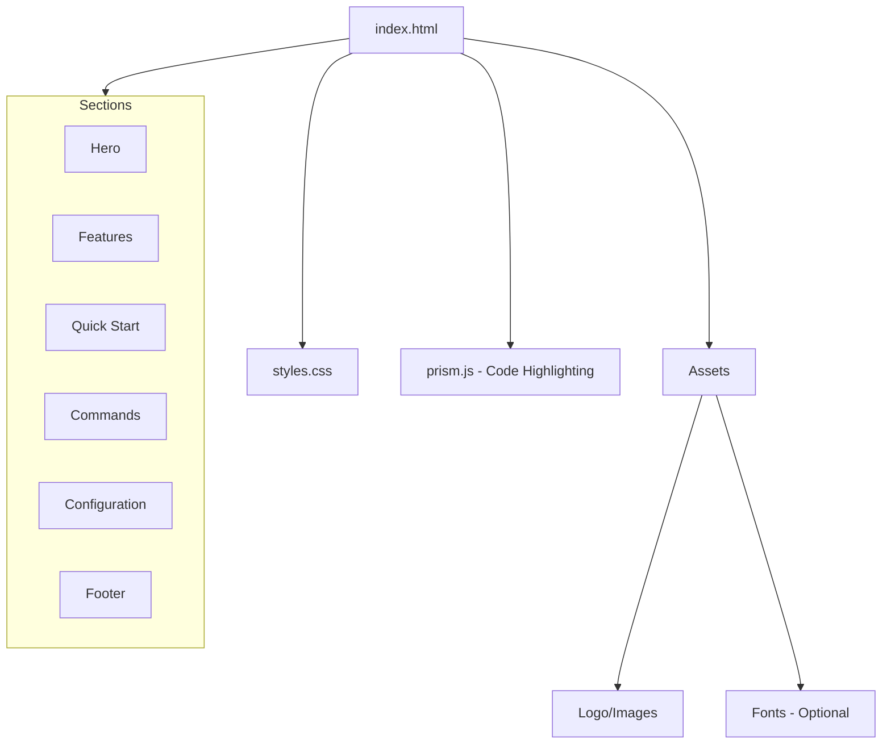

# Homepage Design Initiative - Product Requirements Document

## Executive Summary

### Problem Statement
MirDB is a powerful persistent key-value store with memcached protocol compatibility, but currently lacks a web-based homepage to communicate its value proposition, features, and usage to potential users and developers. Without a homepage, the project has limited discoverability and no central resource for documentation, getting started guides, or community engagement.

### Proposed Solution
Create a professional, informative homepage for MirDB that showcases its key features, provides quick-start documentation, and establishes the project's online presence. The homepage will serve as the primary entry point for developers looking to understand and adopt MirDB.

### Expected Impact
- **Increased Visibility**: Establish MirDB's web presence for discoverability through search engines
- **Developer Adoption**: Lower the barrier to entry by providing clear documentation and quick-start guides
- **Community Growth**: Create a foundation for community engagement and contributions
- **Professional Credibility**: Position MirDB as a production-ready database solution

### Success Metrics
- Homepage successfully deployed and accessible
- Clear communication of MirDB's value proposition (memcached compatibility + persistence)
- Presence of essential documentation sections (features, quick-start, configuration)
- Mobile-responsive design with fast load times (<3 seconds)

---

## Requirements & Scope

### Functional Requirements

| ID | Requirement | Priority |
|----|-------------|----------|
| REQ-1 | Display hero section with MirDB tagline and value proposition | Must |
| REQ-2 | Present core features section highlighting memcached compatibility, persistence, and LSM tree architecture | Must |
| REQ-3 | Include quick-start guide with installation and basic usage instructions | Must |
| REQ-4 | Show supported commands reference (SET, GET, DELETE, INFO) | Must |
| REQ-5 | Display configuration options and example configuration | Should |
| REQ-6 | Provide navigation menu for easy access to all sections | Must |
| REQ-7 | Include footer with project links (GitHub repository, documentation) | Should |
| REQ-8 | Display project status indicating implemented vs. planned features | Should |
| REQ-9 | Show architecture diagram illustrating LSM tree data flow | Could |
| REQ-10 | Include code examples demonstrating client connection | Should |

### Non-Functional Requirements

| ID | Requirement | Priority |
|----|-------------|----------|
| NFR-1 | Page must be responsive and work on mobile devices (320px+) | Must |
| NFR-2 | Page load time under 3 seconds on standard connections | Must |
| NFR-3 | Meet WCAG 2.1 AA accessibility standards | Should |
| NFR-4 | Support modern browsers (Chrome, Firefox, Safari, Edge - last 2 versions) | Must |
| NFR-5 | Static site with no server-side dependencies for easy hosting | Should |
| NFR-6 | Clean, professional design appropriate for developer tooling | Must |
| NFR-7 | SEO-friendly with appropriate meta tags and semantic HTML | Should |

### Out of Scope
- User authentication or login functionality
- Interactive database console or playground
- Multi-language internationalization
- Blog or news section
- Community forum integration
- Automated documentation generation from source code

### Success Criteria
- All "Must" priority requirements implemented
- Homepage passes accessibility audit with no critical issues
- Responsive design verified on mobile, tablet, and desktop viewports
- All information is accurate and consistent with MirDB's actual capabilities

---

## User Experience & Interface

### User Journey

1. **Discovery**: Developer finds MirDB through search or GitHub
2. **Landing**: Arrives at homepage, immediately sees value proposition
3. **Understanding**: Scrolls through features to understand capabilities
4. **Evaluation**: Reviews quick-start guide to assess ease of adoption
5. **Decision**: Accesses detailed documentation or GitHub to proceed

### Interface Requirements

#### Hero Section
- Project logo/name prominently displayed
- Clear tagline: "Persistent key-value store with memcached protocol"
- Primary call-to-action (Get Started / View on GitHub)
- Secondary navigation to documentation

#### Features Section
- Three-column layout for key features:
  - **Memcached Compatible**: Use existing clients seamlessly
  - **Persistent Storage**: Data survives restarts via SSTables
  - **High Performance**: LSM tree architecture with async I/O

#### Quick-Start Section
- Installation command (cargo build/install)
- Configuration example
- Basic usage with telnet/memcached client
- Expected output examples

#### Command Reference Section
- Table or card layout showing supported commands
- Command syntax with examples
- Response codes and their meanings

#### Configuration Section
- Key configuration parameters with descriptions
- Example TOML configuration file
- Default values reference

#### Footer
- GitHub repository link
- License information
- Version/status indicator

### Accessibility Considerations
- Proper heading hierarchy (h1 → h2 → h3)
- Alt text for any images or diagrams
- Sufficient color contrast ratios
- Keyboard navigable interface
- Focus indicators for interactive elements

---

## Technical Considerations

### High-Level Technical Approach
Create a static HTML/CSS website with minimal JavaScript dependencies. The site should be self-contained and easily deployable to any static hosting platform (GitHub Pages, Netlify, Vercel, or simple file server).

### Integration Points
- GitHub repository for source code links
- No backend integration required
- Potential future integration with documentation generators (mdBook, rustdoc)

### Key Technical Constraints
- Must work without server-side processing
- Should minimize external dependencies for reliability
- Code examples must accurately reflect actual MirDB syntax and capabilities

### Performance Considerations
- Optimize images and assets for web
- Consider lazy loading for below-fold content
- Minimize CSS/JS bundle size
- Use system fonts or limited web fonts to reduce load time

---

## Design Specification

### Recommended Approach
Build a single-page static website using semantic HTML5 and modern CSS (Flexbox/Grid) with minimal JavaScript. This approach prioritizes simplicity, fast loading, easy maintenance, and broad hosting compatibility.

### Key Technical Decisions

#### 1. Framework vs. Static HTML
- **Options Considered**: React/Vue SPA, Static site generator (Hugo/Jekyll), Plain HTML/CSS
- **Tradeoffs**: SPAs add complexity and bundle size; SSGs require build toolchain; Plain HTML is simple but harder to maintain at scale
- **Recommendation**: Plain HTML/CSS for initial version - the scope is a single page and doesn't warrant framework overhead

#### 2. CSS Approach
- **Options Considered**: CSS framework (Tailwind/Bootstrap), Custom CSS, CSS-in-JS
- **Tradeoffs**: Frameworks add dependencies but speed development; Custom CSS is lightweight but requires more effort; CSS-in-JS inappropriate for static site
- **Recommendation**: Custom CSS with CSS variables for theming - maintains simplicity while allowing future customization

#### 3. Hosting Strategy
- **Options Considered**: GitHub Pages, Netlify/Vercel, Self-hosted
- **Tradeoffs**: GitHub Pages integrates with repo but limited features; Netlify/Vercel offer more features; Self-hosted requires infrastructure
- **Recommendation**: Design for GitHub Pages compatibility - zero cost, tight repo integration, sufficient for static content

#### 4. Code Highlighting
- **Options Considered**: highlight.js, Prism.js, Pre-formatted static HTML
- **Tradeoffs**: Libraries add weight but provide dynamic highlighting; Static HTML is lightweight but inflexible
- **Recommendation**: Prism.js with minimal language support (TOML, Bash, Rust) - good balance of features and size

### High-Level Architecture

### Key Considerations
- **Performance**: Target <100KB total page weight; use CSS sprites or SVG for icons; defer non-critical JS loading
- **Security**: No user input handling; all content static; use HTTPS when deployed; no external API calls
- **Scalability**: Single-page design accommodates growth; can migrate to SSG if content expands significantly

### Risk Management
- **Content Accuracy Risk**: Homepage content may drift from actual MirDB capabilities - mitigate by sourcing content directly from knowledge base and establishing review process
- **Browser Compatibility Risk**: Custom CSS may behave differently across browsers - mitigate by testing on major browsers and using CSS reset/normalize

### Success Criteria
- Page loads completely in under 3 seconds on 3G connection
- All content sections render correctly on mobile and desktop
- Code examples are syntactically correct and copy-paste ready
- Zero console errors in browser developer tools

---

## User Stories

### Personas
- **New Developer**: First-time visitor evaluating MirDB for a project
- **Returning Developer**: User seeking quick reference for commands/configuration
- **Contributor**: Developer looking to understand the project before contributing

### Core Stories

#### US-1: Understand Product Value
**As a** new developer
**I want** to quickly understand what MirDB offers
**So that** I can evaluate if it fits my project needs

**Priority**: Must

**Related Requirements**: REQ-1, REQ-2

**Acceptance Criteria**:
- Given I land on the homepage
- When the page loads
- Then I see a clear tagline explaining MirDB's purpose within 5 seconds
- And I see the three key differentiators (memcached compatible, persistent, high performance)

---

#### US-2: Get Started Quickly
**As a** new developer
**I want** clear installation and usage instructions
**So that** I can try MirDB with minimal friction

**Priority**: Must

**Related Requirements**: REQ-3, REQ-10

**Acceptance Criteria**:
- Given I am on the homepage
- When I navigate to the quick-start section
- Then I see step-by-step installation commands
- And I see a working example of connecting and storing data
- And the commands are copy-paste ready

---

#### US-3: Reference Commands
**As a** returning developer
**I want** to quickly find command syntax
**So that** I can use the correct format without searching documentation

**Priority**: Must

**Related Requirements**: REQ-4

**Acceptance Criteria**:
- Given I am on the homepage
- When I navigate to the commands section
- Then I see a list of all supported commands (SET, GET, DELETE, etc.)
- And each command shows its syntax and parameters
- And I see example usage for each command

---

#### US-4: Configure MirDB
**As a** developer setting up MirDB
**I want** to understand configuration options
**So that** I can tune MirDB for my environment

**Priority**: Should

**Related Requirements**: REQ-5

**Acceptance Criteria**:
- Given I am on the homepage
- When I navigate to the configuration section
- Then I see a complete example configuration file
- And I see a table explaining each parameter
- And I see the default values for each parameter

---

#### US-5: Navigate Efficiently
**As a** any user
**I want** easy navigation between sections
**So that** I can quickly find the information I need

**Priority**: Must

**Related Requirements**: REQ-6

**Acceptance Criteria**:
- Given I am on the homepage
- When I view the navigation menu
- Then I see links to all major sections
- And clicking a link scrolls smoothly to that section
- And the navigation is accessible via keyboard

---

#### US-6: Access Project Resources
**As a** developer or potential contributor
**I want** links to the GitHub repository and documentation
**So that** I can explore the source code or contribute

**Priority**: Should

**Related Requirements**: REQ-7, REQ-8

**Acceptance Criteria**:
- Given I am on the homepage
- When I scroll to the footer
- Then I see a link to the GitHub repository
- And I see project status information (what's implemented vs. planned)
- And all external links open in a new tab

---

## Dependencies & Assumptions

### Dependencies
- Access to MirDB GitHub repository for accurate linking
- Logo or branding assets (if existing; otherwise to be created)
- Final confirmation of supported commands and configuration options

### Assumptions
- MirDB remains compatible with the memcached text protocol as documented
- The project will be hosted on a platform supporting static files
- No immediate need for multi-page documentation site (single page sufficient for MVP)
- English language only for initial release

---

## Appendices

### A. MirDB Key Features Summary

| Feature | Description |
|---------|-------------|
| Memcached Protocol | Compatible with standard memcached text protocol |
| Persistence | Data stored in SSTables, survives restarts |
| LSM Tree | Log-Structured Merge-tree for efficient writes |
| Async I/O | Built on Tokio for high-performance networking |
| WAL | Write-Ahead Log for crash recovery |

### B. Supported Commands Reference

| Command | Description |
|---------|-------------|
| SET | Store a key-value pair |
| GET | Retrieve one or more keys |
| DELETE | Remove a key |
| ADD | Store only if key doesn't exist |
| REPLACE | Store only if key exists |
| APPEND | Append data to existing value |
| PREPEND | Prepend data to existing value |
| INFO | Display database status |
| MAJOR_COMPACTION | Trigger manual compaction |

### C. Default Configuration Reference

| Parameter | Default Value |
|-----------|---------------|
| addr | 0.0.0.0:12333 |
| max_level | 7 |
| work_dir | /tmp/mirdb |
| sst_max_size | 100MB |
| mem_table_max_size | 4MB |
| block_size | 4KB |
| l0_compaction_trigger | 4 |
| thread_sleep_ms | 500ms |
