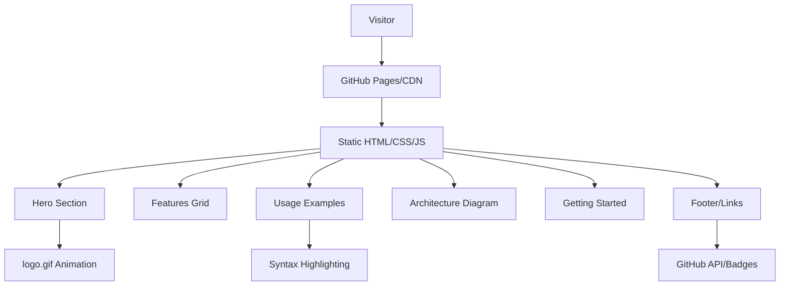

# MirDB Product Homepage - Product Requirements Document

## Executive Summary

### Problem Statement
MirDB is a high-performance persistent key-value store with memcached protocol compatibility, but it lacks a professional product homepage to effectively communicate its value proposition, features, and technical capabilities to potential users and contributors. Without a compelling web presence, the project struggles to attract adoption, community contributions, and visibility in the competitive database landscape.

### Proposed Solution
Create a modern, responsive product homepage that effectively showcases MirDB's unique value proposition as a persistent key-value store with memcached compatibility. The homepage will serve as the primary touchpoint for developers evaluating database solutions, providing clear feature explanations, usage examples, and pathways to documentation and community resources.

### Expected Impact
- **Increased Project Visibility**: Professional web presence enhances credibility and discoverability
- **Improved Developer Adoption**: Clear value proposition and usage examples reduce evaluation friction
- **Enhanced Community Engagement**: Accessible documentation and contribution guidelines attract contributors
- **Better User Onboarding**: Interactive examples and clear feature descriptions accelerate time-to-value

### Success Metrics
- Homepage load time under 2 seconds
- Mobile-responsive design (works on all screen sizes)
- Clear call-to-action paths to GitHub repository and documentation
- SEO-optimized structure for database-related keywords

## Requirements & Scope

### Functional Requirements

| ID | Requirement | Priority |
|----|-------------|----------|
| REQ-1 | Display hero section with product name, tagline, and primary value proposition | Must |
| REQ-2 | Showcase key features: persistent storage, memcached protocol compatibility, LSM-tree architecture, compaction support | Must |
| REQ-3 | Include animated or interactive usage examples demonstrating memcached protocol commands | Must |
| REQ-4 | Display project status badges (CI status, version, license) | Must |
| REQ-5 | Provide clear navigation to GitHub repository, documentation, and community resources | Must |
| REQ-6 | Include technical architecture overview with visual diagrams | Should |
| REQ-7 | Display performance benchmarks and comparison data | Should |
| REQ-8 | Include "Getting Started" quick guide with installation instructions | Must |
| REQ-9 | Showcase project roadmap and completed features | Should |
| REQ-10 | Provide contribution guidelines and community links | Should |

### Non-Functional Requirements

| ID | Requirement | Priority |
|----|-------------|----------|
| NFR-1 | Homepage must load in under 2 seconds on standard connections | Must |
| NFR-2 | Design must be responsive and functional on mobile, tablet, and desktop | Must |
| NFR-3 | Code syntax highlighting for all code examples | Must |
| NFR-4 | SEO-optimized meta tags and structured data | Must |
| NFR-5 | Accessibility compliance (WCAG 2.1 AA) | Should |
| NFR-6 | Dark/light mode toggle | Could |
| NFR-7 | Static site generation for easy deployment (GitHub Pages compatible) | Must |

### Out of Scope
- Interactive database playground/REPL
- Real-time performance monitoring dashboard
- User authentication or account management
- E-commerce or pricing pages
- Multi-language internationalization (i18n)

### Success Criteria
- [ ] Homepage renders correctly on Chrome, Firefox, Safari, and Edge
- [ ] Google Lighthouse performance score ≥ 90
- [ ] All interactive elements functional on mobile devices
- [ ] SEO audit shows proper meta tags and structured data
- [ ] Accessibility audit passes WCAG 2.1 AA standards

## User Stories

### Primary Persona: Backend Developer Evaluating Database Solutions

**Story 1: Understanding the Product**
> As a backend developer, I want to quickly understand what MirDB is and how it differs from other key-value stores, so that I can determine if it fits my use case.

- **Acceptance Criteria**:
  - Given I visit the homepage, when I view the hero section, then I see a clear tagline explaining MirDB's purpose within 5 seconds
  - Given I scroll down, when I view the features section, then I see comparisons highlighting memcached compatibility and persistence
- **Priority**: Must
- **Traceability**: REQ-1, REQ-2

**Story 2: Evaluating Technical Fit**
> As a backend developer, I want to see usage examples and architecture details, so that I can assess if MirDB meets my technical requirements.

- **Acceptance Criteria**:
  - Given I'm viewing the features section, when I click on "Usage Examples", then I see animated or syntax-highlighted code examples
  - Given I'm interested in architecture, when I view the technical section, then I see a diagram explaining the LSM-tree implementation
- **Priority**: Must
- **Traceability**: REQ-3, REQ-6

**Story 3: Getting Started Quickly**
> As a backend developer, I want clear installation and setup instructions, so that I can try MirDB within minutes.

- **Acceptance Criteria**:
  - Given I'm on the homepage, when I click "Get Started", then I'm taken to a section with copy-paste installation commands
  - Given I'm viewing installation instructions, when I follow them, then I can have MirDB running locally in under 5 minutes
- **Priority**: Must
- **Traceability**: REQ-8

### Secondary Persona: Open Source Contributor

**Story 4: Understanding Contribution Opportunities**
> As a potential contributor, I want to see the project roadmap and contribution guidelines, so that I can find areas where I can help.

- **Acceptance Criteria**:
  - Given I'm viewing the homepage, when I scroll to the community section, then I see a link to contribution guidelines
  - Given I'm interested in contributing, when I view the roadmap, then I see which features are planned vs completed
- **Priority**: Should
- **Traceability**: REQ-9, REQ-10

## User Experience & Interface

### User Journey

1. **Discovery**: User arrives via search engine, social media, or referral
2. **Evaluation**: User scans hero section and features to understand value proposition
3. **Exploration**: User views usage examples and technical details
4. **Trial**: User clicks "Get Started" and follows installation guide
5. **Engagement**: User navigates to GitHub to star, fork, or contribute

### Interface Requirements

**Hero Section**:
- Full-width banner with animated logo (reuse existing logo.gif)
- Clear headline: "MirDB: Persistent Key-Value Store with Memcached Compatibility"
- Subheadline explaining key differentiators
- Primary CTA: "Get Started" | Secondary CTA: "View on GitHub"

**Features Section**:
- Grid layout showcasing 4-6 key features
- Each feature card includes icon, title, and brief description
- Features: Persistent Storage, Memcached Protocol, LSM-Tree Architecture, Compaction, Tokio Async, Rust Performance

**Usage Section**:
- Terminal-style code block showing memcached commands
- Animated typing effect or static syntax-highlighted example
- Commands: `set`, `get`, `delete` with MirDB

**Architecture Section**:
- Visual diagram showing data flow: Client → Memcached Protocol → Memtable → SSTable → Storage
- Brief explanation of LSM-tree and compaction

**Getting Started Section**:
- Installation commands (cargo install, docker, or build from source)
- Quick start example with minimal configuration
- Link to full documentation

**Footer**:
- GitHub repository link
- License information (display current license)
- Author attribution
- CI status badge

### Accessibility Considerations
- Semantic HTML structure with proper heading hierarchy
- Alt text for all images and diagrams
- Keyboard navigation support
- Sufficient color contrast (4.5:1 minimum)
- Focus indicators for interactive elements

## Technical Considerations

### High-Level Technical Approach
- Static site generator (e.g., Vite, Next.js static export, or plain HTML/CSS/JS)
- Single-page application with smooth scroll navigation
- No backend dependencies for easy GitHub Pages deployment

### Integration Points
- GitHub API for star count and latest release (optional)
- CircleCI badge integration
- Crates.io version badge

### Key Technical Constraints
- Must be deployable to GitHub Pages (static files only)
- No server-side rendering required
- Minimal JavaScript for fast initial load

### Performance Considerations
- Lazy load images and animations
- Minimize CSS and JavaScript bundle sizes
- Use system fonts to avoid external font loading
- Optimize logo.gif for web use

## Design Specification

### Recommended Approach
Create a clean, modern single-page website with a developer-focused aesthetic. Use the existing brand assets (logo.gif) while maintaining a professional, technical feel appropriate for a database product. Prioritize readability and clear information hierarchy.

### Key Technical Decisions

#### 1. Static Site Technology
- **Options Considered**: Plain HTML/CSS, Jekyll, Vite, Next.js Static Export, Astro
- **Tradeoffs**:
  - Plain HTML: Maximum simplicity, minimal dependencies
  - Jekyll: GitHub Pages native support, but Ruby dependency
  - Vite: Fast build, modern DX, but Node.js required
  - Next.js: Powerful but potentially overkill for single page
  - Astro: Excellent performance, component-based, static-first
- **Recommendation**: Use Vite or plain HTML/CSS for simplicity and fast builds

#### 2. Styling Approach
- **Options Considered**: Plain CSS, Tailwind CSS, Bootstrap, custom CSS framework
- **Tradeoffs**:
  - Plain CSS: No dependencies, maximum control
  - Tailwind: Utility-first, rapid development, larger bundle without purging
  - Bootstrap: Familiar but potentially bloated
- **Recommendation**: Use Tailwind CSS with PurgeCSS for optimal bundle size

#### 3. Animation Strategy
- **Options Considered**: CSS animations only, GSAP, Lottie, plain GIF
- **Tradeoffs**:
  - CSS: Lightweight, performant, limited complexity
  - GSAP: Powerful but adds JavaScript overhead
  - Lottie: JSON-based, scalable but requires library
- **Recommendation**: Use CSS animations for UI elements, reuse existing logo.gif for brand animation

### High-Level Architecture

### Key Considerations

**Performance**: Target < 100KB total initial payload (excluding images). Use lazy loading for below-fold content. Implement code splitting if using a framework.

**Security**: No user input handling required. All external links use rel="noopener noreferrer". Content Security Policy headers recommended for GitHub Pages.

**Scalability**: Static site handles unlimited traffic via CDN. No database or server-side scaling concerns.

### Risk Management

**Technical Risk 1**: Animation performance on mobile devices
- **Mitigation**: Use CSS transforms and opacity only. Provide reduced-motion media query support. Test on low-end devices.

**Technical Risk 2**: GitHub Pages deployment limitations
- **Mitigation**: Ensure all assets use relative paths. Verify build output is fully static. Test deployment on staging branch first.

### Success Criteria
- Homepage loads in under 2 seconds on 3G connection
- Passes Google Lighthouse audit with 90+ scores in all categories
- Renders correctly on browsers representing 95%+ of market share
- All links to external resources (GitHub, docs) functional

## Dependencies & Assumptions

### External Dependencies
- GitHub Pages for hosting
- CircleCI for status badges
- Crates.io for version badges
- Shields.io or similar for badge generation

### Assumptions
- Existing logo.gif can be optimized for web use or used as-is
- Project README will be kept in sync with homepage content
- GitHub repository remains publicly accessible
- Domain/DNS configuration handled separately (if custom domain desired)

### Cross-Team Coordination
- **Documentation Team**: Ensure homepage links to accurate, up-to-date docs
- **Maintainers**: Provide accurate roadmap and feature status
- **Design**: Approve visual design and brand consistency
