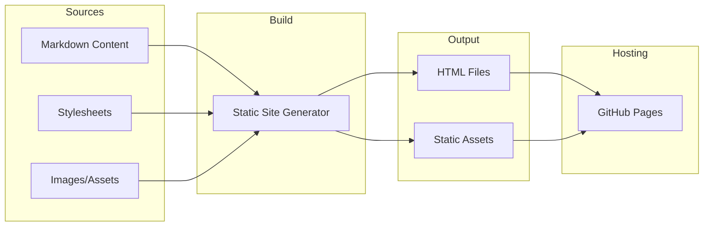

# Product Homepage Design - Product Requirements Document

## Executive Summary

### Problem Statement
MirDB is a powerful persistent key-value store with Memcached protocol compatibility, but it currently lacks a dedicated homepage that communicates its value proposition, features, and benefits to potential users. Without a homepage, users have difficulty discovering the product, understanding its capabilities, and getting started with adoption.

### Proposed Solution
Create a modern, informative product homepage for MirDB that effectively communicates the product's unique value proposition, showcases its key features, provides quick-start documentation, and guides visitors toward adoption. The homepage will serve as the primary marketing and information gateway for the MirDB project.

### Expected Impact
- **Increased Product Visibility**: Establish MirDB's online presence and brand identity
- **Improved User Acquisition**: Lower barrier to entry for new users through clear messaging and documentation
- **Enhanced Credibility**: Professional presentation builds trust with potential enterprise adopters
- **Community Growth**: Facilitate open-source community engagement and contributions

### Success Metrics
- Homepage load time under 3 seconds on standard connections
- Clear information architecture with less than 3 clicks to key information
- Mobile-responsive design with proper rendering on all major device sizes
- Accessibility compliance with WCAG 2.1 AA standards

---

## Requirements & Scope

### Functional Requirements

| ID | Requirement | Priority |
|----|-------------|----------|
| REQ-1 | Display product name, tagline, and value proposition prominently above the fold | Must |
| REQ-2 | Present key features section highlighting Memcached compatibility, persistence, and LSM Tree architecture | Must |
| REQ-3 | Include quick-start code snippets showing basic usage examples | Must |
| REQ-4 | Provide navigation to documentation, GitHub repository, and community resources | Must |
| REQ-5 | Display current project status and implemented features | Should |
| REQ-6 | Include comparison section showing advantages over alternatives (memcached, Redis) | Should |
| REQ-7 | Show default configuration values for quick reference | Should |
| REQ-8 | Include footer with license information, links, and contact details | Must |
| REQ-9 | Provide call-to-action buttons for "Get Started" and "View on GitHub" | Must |
| REQ-10 | Display architecture diagram or visual representation of LSM Tree structure | Could |

### Non-Functional Requirements

| ID | Requirement | Priority |
|----|-------------|----------|
| NFR-1 | Page must load within 3 seconds on 3G connections | Must |
| NFR-2 | Design must be responsive across mobile, tablet, and desktop viewports | Must |
| NFR-3 | Meet WCAG 2.1 AA accessibility standards | Must |
| NFR-4 | Support modern browsers (Chrome, Firefox, Safari, Edge - last 2 versions) | Must |
| NFR-5 | SEO-optimized with proper meta tags, semantic HTML, and Open Graph tags | Should |
| NFR-6 | No external JavaScript dependencies required for core content display | Should |
| NFR-7 | Static site generation for fast hosting on GitHub Pages or similar platforms | Should |

### Out of Scope
- User authentication or account management
- Interactive database playground or live demo environment
- Blog or news section
- Multi-language internationalization
- E-commerce or payment processing
- User analytics dashboard (basic analytics like page views are acceptable)
- API documentation (link to external docs instead)

### Success Criteria
- Homepage successfully deployed and accessible via public URL
- All REQ-1 through REQ-9 "Must" requirements implemented and verified
- All NFR "Must" requirements validated through testing
- Stakeholder sign-off on visual design and content accuracy

---

## User Stories

### Personas
- **Developer**: A software engineer evaluating key-value stores for their application
- **Technical Decision Maker**: An engineering lead or architect assessing MirDB for team adoption
- **Open Source Contributor**: A developer interested in contributing to the MirDB project

### Core User Stories

#### Story 1: Understand Product Value
**As a** Developer
**I want to** quickly understand what MirDB is and its key benefits
**So that** I can determine if it's relevant to my needs

**Acceptance Criteria:**
- Given I land on the homepage
- When I view the hero section
- Then I see the product name, a clear tagline, and a 1-2 sentence value proposition within 5 seconds

**Priority:** Must
**Related Requirements:** REQ-1

---

#### Story 2: Explore Key Features
**As a** Technical Decision Maker
**I want to** see MirDB's technical capabilities and differentiators
**So that** I can compare it against alternatives

**Acceptance Criteria:**
- Given I am on the homepage
- When I scroll to the features section
- Then I see clearly presented features including Memcached compatibility, persistence, and LSM Tree architecture with brief explanations

**Priority:** Must
**Related Requirements:** REQ-2, REQ-5

---

#### Story 3: Quick Start with Code
**As a** Developer
**I want to** see working code examples immediately
**So that** I can understand how to integrate MirDB into my project

**Acceptance Criteria:**
- Given I am on the homepage
- When I navigate to the quick-start section
- Then I see copy-able code snippets showing installation and basic get/set operations

**Priority:** Must
**Related Requirements:** REQ-3

---

#### Story 4: Access Resources
**As a** Developer
**I want to** easily find documentation and the source code repository
**So that** I can learn more and start using MirDB

**Acceptance Criteria:**
- Given I am on the homepage
- When I look for navigation options
- Then I find clearly labeled links to documentation, GitHub repository, and community resources within 2 clicks

**Priority:** Must
**Related Requirements:** REQ-4, REQ-9

---

#### Story 5: Evaluate Against Alternatives
**As a** Technical Decision Maker
**I want to** understand how MirDB compares to memcached and Redis
**So that** I can make an informed technology choice

**Acceptance Criteria:**
- Given I am on the homepage
- When I look for comparison information
- Then I find a section highlighting MirDB's advantages (persistence vs memcached, Memcached protocol compatibility)

**Priority:** Should
**Related Requirements:** REQ-6

---

#### Story 6: View Mobile Site
**As a** Developer
**I want to** view the homepage on my mobile device
**So that** I can research MirDB while on the go

**Acceptance Criteria:**
- Given I access the homepage on a mobile device
- When the page loads
- Then all content is properly formatted, readable, and navigable without horizontal scrolling

**Priority:** Must
**Related Requirements:** NFR-2

---

#### Story 7: Contribute to Project
**As an** Open Source Contributor
**I want to** find information about contributing to MirDB
**So that** I can get involved with the project

**Acceptance Criteria:**
- Given I am on the homepage
- When I look for contribution information
- Then I find a link to the GitHub repository and/or contribution guidelines

**Priority:** Should
**Related Requirements:** REQ-4, REQ-8

---

## User Experience & Interface

### User Journey

1. **Discovery**: User arrives at homepage from search, link, or direct navigation
2. **Understanding**: User reads hero section and grasps what MirDB does (< 10 seconds)
3. **Exploration**: User scrolls through features to understand capabilities
4. **Evaluation**: User reviews code examples and/or comparison section
5. **Action**: User clicks "Get Started" or "View on GitHub" to proceed

### Interface Requirements

#### Hero Section
- Product logo/name prominently displayed
- Tagline: "Persistent Key-Value Store with Memcached Protocol"
- Brief value proposition paragraph
- Primary CTA: "Get Started" button
- Secondary CTA: "View on GitHub" button

#### Features Section
- Grid or card layout presenting 3-4 key features:
  - Memcached Protocol Compatibility
  - Disk Persistence with SSTables
  - LSM Tree Architecture
  - High Performance Async I/O (Tokio)
- Each feature includes icon, title, and 2-3 sentence description

#### Quick Start Section
- Installation command (cargo install or build from source)
- Basic server startup command
- Example client connection and get/set operations
- Syntax-highlighted code blocks with copy functionality

#### Footer Section
- License information (link to LICENSE file)
- Links: Documentation, GitHub, Community
- Version or status indicator

### Accessibility Considerations
- Proper heading hierarchy (h1 > h2 > h3)
- Alt text for all images and icons
- Sufficient color contrast ratios (4.5:1 minimum for text)
- Keyboard navigable interactive elements
- Focus indicators for accessibility
- Semantic HTML structure

### User Interaction Patterns
- Smooth scroll navigation for single-page sections
- Hover states for interactive elements
- Copy-to-clipboard functionality for code snippets
- Mobile hamburger menu for navigation on small screens

---

## Technical Considerations

### High-Level Technical Approach
The homepage will be built as a static website that can be hosted on GitHub Pages, Netlify, or similar static hosting platforms. This approach ensures fast load times, minimal maintenance overhead, and easy deployment through the existing GitHub repository workflow.

### Integration Points
- **GitHub Repository**: Link to MirDB source code and releases
- **Documentation Site**: Link to external documentation (if exists)
- **Package Registry**: Link to crates.io for Rust package installation

### Key Technical Constraints
- Must be deployable as static files (HTML, CSS, JS)
- No server-side runtime required
- Compatible with GitHub Pages hosting constraints
- Minimal build tooling to keep maintenance simple

### Performance Considerations
- Optimize images and use modern formats (WebP with fallbacks)
- Minimize CSS and inline critical styles
- Lazy-load below-fold content if needed
- Use system fonts or limited web font loading

---

## Design Specification

### Recommended Approach
Build a single-page static website using minimal tooling (plain HTML/CSS or a lightweight static site generator) that showcases MirDB's value proposition, features, and quick-start guide. Prioritize fast load times and low maintenance over framework sophistication.

### Key Technical Decisions

#### 1. Static Site Technology
- **Options Considered**: Plain HTML/CSS, Hugo, Jekyll, Astro, Next.js static export
- **Tradeoffs**: Plain HTML offers simplicity but limited templating; Hugo/Jekyll add build complexity but provide templating and markdown support; modern frameworks add unnecessary JavaScript overhead
- **Recommendation**: Hugo or plain HTML/CSS - both integrate well with GitHub Pages, require minimal dependencies, and serve static files efficiently

#### 2. Styling Approach
- **Options Considered**: Custom CSS, Tailwind CSS, CSS framework (Bootstrap), CSS-in-JS
- **Tradeoffs**: Custom CSS offers full control but more maintenance; Tailwind provides utility-first approach with larger build; Bootstrap adds unused styles; CSS-in-JS requires JS runtime
- **Recommendation**: Custom CSS or Tailwind (purged) - keeps bundle size small and avoids framework lock-in

#### 3. Code Syntax Highlighting
- **Options Considered**: Prism.js, Highlight.js, Server-side highlighting, CSS-only
- **Tradeoffs**: JS libraries add dependencies but provide dynamic highlighting; server-side requires build step; CSS-only limits language support
- **Recommendation**: Prism.js or server-side highlighting via static site generator - provides good syntax highlighting without significant overhead

### High-Level Architecture


### Key Considerations
- **Performance**: Static files served from CDN ensure sub-second load times; image optimization and minimal JS keep payload small
- **Security**: No server-side code eliminates most attack vectors; rely on hosting platform security
- **Scalability**: Static hosting scales infinitely; no database or compute resources needed

### Risk Management
- **Content Staleness Risk**: Homepage content may become outdated as MirDB evolves. Mitigation: Include dynamic badges (build status, version) and establish content review process.
- **Browser Compatibility Risk**: CSS or JS features may not work in older browsers. Mitigation: Use progressive enhancement and test across target browsers.

### Success Criteria
- Homepage loads in under 3 seconds on 3G connection
- Lighthouse performance score of 90+
- All "Must" functional requirements implemented
- Successful deployment to chosen hosting platform

---

## Dependencies & Assumptions

### External Dependencies
- **GitHub Pages** (or equivalent static hosting): Required for deployment
- **GitHub Repository**: Source for repository links and potentially CI/CD
- **Domain/DNS** (optional): If custom domain is desired

### Assumptions
- MirDB project maintainers will provide approval on content and messaging
- Project logo or brand assets exist or will be created
- Documentation exists or link will point to GitHub README
- No custom backend services are required for homepage functionality

### Cross-Team Coordination
- Content review by MirDB maintainers/contributors
- Design feedback if design resources are available
- Documentation team (if exists) for accurate technical content

---

## Appendices

### Content Reference: MirDB Key Messages

**Primary Value Proposition:**
MirDB is a persistent key-value store that combines the simplicity of the Memcached protocol with the durability of disk-based storage, powered by a high-performance LSM Tree architecture.

**Key Feature Messages:**
1. **Drop-in Memcached Compatibility**: Use your existing Memcached clients - no code changes required
2. **True Persistence**: Your data survives restarts with SSTable-based disk storage
3. **Modern Architecture**: Built on LSM Trees with efficient compaction for optimal read/write performance
4. **Rust Performance**: Async I/O powered by Tokio for high-throughput operations

**Technical Highlights for Homepage:**
- Default port: 12333
- Written in Rust
- Open source
- LSM Tree with 7 levels
- Skip list memtable implementation

### Reference: Default Configuration Values
```
Listen address: 0.0.0.0:12333
Max LSM levels: 7
Work directory: /tmp/mirdb
SSTable max size: 100MB
Memtable max size: 4MB
Block size: 4KB
```
