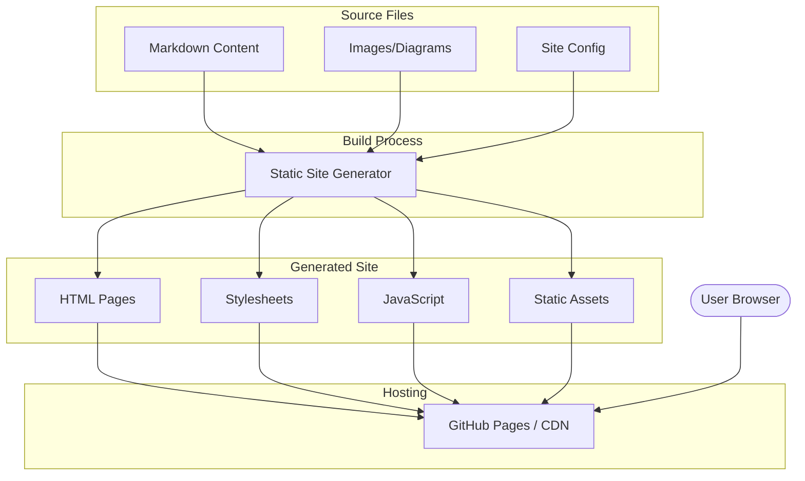

# Website Introduction Hub - Product Requirements Document

## Executive Summary

### Problem Statement
MirDB is a sophisticated persistent key-value store with LSM tree architecture and Memcached protocol compatibility. However, there is currently no public-facing website to introduce the project, explain its features, or help potential users understand its value proposition and how to get started.

### Proposed Solution
Create an introductory website that showcases MirDB's capabilities, architecture, and usage instructions. The website will serve as the primary information hub for developers interested in using MirDB, providing clear documentation of features, getting started guides, and technical architecture explanations.

### Expected Impact
- **User Acquisition**: Provide a professional entry point for developers discovering MirDB
- **Reduced Onboarding Friction**: Clear documentation and quick start guides will help users adopt MirDB faster
- **Project Credibility**: A well-designed website establishes trust and demonstrates project maturity
- **Community Growth**: Enable potential contributors to understand the project architecture and contribution opportunities

### Success Metrics
- Website successfully deployed and accessible
- All core MirDB features documented and explained
- Quick start guide enables users to run MirDB within 5 minutes
- Architecture diagrams clearly illustrate the LSM tree storage engine

---

## Requirements & Scope

### Functional Requirements

| ID | Requirement | Priority |
|----|-------------|----------|
| REQ-1 | Display project overview with clear value proposition explaining MirDB's purpose as a persistent Memcached-compatible key-value store | Must |
| REQ-2 | Present feature highlights including LSM tree architecture, Memcached protocol support, and persistence capabilities | Must |
| REQ-3 | Provide architecture visualization showing data flow from WAL through memtables to SSTable levels | Must |
| REQ-4 | Include getting started guide with installation instructions and basic usage examples | Must |
| REQ-5 | Document supported Memcached commands (SET, GET, DELETE, etc.) with examples | Must |
| REQ-6 | Display configuration options and tuning parameters in an organized format | Should |
| REQ-7 | Provide navigation to source code repository | Must |
| REQ-8 | Support responsive design for mobile and desktop viewing | Should |
| REQ-9 | Include project status section showing implemented vs. planned features | Should |
| REQ-10 | Display default configuration values with explanations | Could |

### Non-Functional Requirements

| ID | Requirement | Priority |
|----|-------------|----------|
| NFR-1 | Website must load initial content within 3 seconds on standard connections | Must |
| NFR-2 | Static site with no backend dependencies for simplified hosting | Should |
| NFR-3 | SEO-optimized with appropriate meta tags and semantic HTML | Should |
| NFR-4 | Accessible following WCAG 2.1 Level AA guidelines | Should |
| NFR-5 | Support for code syntax highlighting in documentation sections | Must |

### Out of Scope
- User authentication or account management
- Interactive API playground or live demo environment
- Community forum or discussion features
- Automated documentation generation from source code
- Multi-language (i18n) support for initial release
- Blog or news section

### Success Criteria
- All Must-priority requirements implemented and verified
- Website deployed to a publicly accessible URL
- Content accurately reflects current MirDB capabilities as documented in knowledge base
- Architecture diagrams match the actual LSM tree implementation
- Getting started guide tested and verified to work with current MirDB release

---

## User Stories

### Personas

1. **Developer Explorer**: A software engineer evaluating key-value stores for their project, seeking to understand MirDB's capabilities and trade-offs
2. **Potential User**: A developer who has decided to try MirDB and needs clear setup instructions
3. **Contributor**: An open-source enthusiast interested in understanding MirDB's architecture to potentially contribute

### Core User Stories

#### US-1: Understand Project Purpose
**As a** Developer Explorer
**I want to** quickly understand what MirDB is and its key differentiators
**So that** I can determine if it's suitable for my use case

**Priority**: Must

**Related Requirements**: REQ-1, REQ-2

**Acceptance Criteria**:
- Given I land on the homepage
- When I view the hero section
- Then I see a clear one-line description of MirDB as a "persistent key-value store with Memcached protocol support"
- And I see the top 3 differentiating features (persistence, LSM tree, Memcached compatibility)

#### US-2: Explore Technical Architecture
**As a** Developer Explorer
**I want to** understand MirDB's storage architecture
**So that** I can evaluate its performance characteristics and suitability

**Priority**: Must

**Related Requirements**: REQ-3, REQ-9

**Acceptance Criteria**:
- Given I navigate to the architecture section
- When I view the architecture content
- Then I see a visual diagram showing the data flow (WAL → Memtable → Immutable Memtables → SSTable Levels)
- And I understand the LSM tree compaction process
- And I can see which features are currently implemented vs. planned

#### US-3: Get Started Quickly
**As a** Potential User
**I want to** install and run MirDB with minimal friction
**So that** I can start evaluating it with real usage

**Priority**: Must

**Related Requirements**: REQ-4, REQ-5

**Acceptance Criteria**:
- Given I navigate to the getting started section
- When I follow the installation instructions
- Then I can build and run MirDB within 5 minutes
- And I can execute basic SET/GET commands using a memcached client
- And I see example commands with expected outputs

#### US-4: Learn Supported Commands
**As a** Potential User
**I want to** see all supported Memcached commands with examples
**So that** I can understand MirDB's API capabilities

**Priority**: Must

**Related Requirements**: REQ-5

**Acceptance Criteria**:
- Given I navigate to the commands/API section
- When I view the command documentation
- Then I see all supported commands (SET, GET, GETS, DELETE, ADD, REPLACE, APPEND, PREPEND)
- And each command shows syntax, parameters, and example usage
- And I see MirDB-specific commands (INFO, MAJOR_COMPACTION)

#### US-5: Configure MirDB
**As a** Potential User
**I want to** understand available configuration options
**So that** I can tune MirDB for my specific requirements

**Priority**: Should

**Related Requirements**: REQ-6, REQ-10

**Acceptance Criteria**:
- Given I navigate to the configuration section
- When I view the configuration documentation
- Then I see all configurable parameters organized by category (Network, Storage, Memory Tables, SSTables, Compaction)
- And each parameter shows description, default value, and acceptable formats

#### US-6: Access Source Code
**As a** Contributor
**I want to** easily navigate to the source code repository
**So that** I can explore the codebase and potentially contribute

**Priority**: Must

**Related Requirements**: REQ-7

**Acceptance Criteria**:
- Given I am on any page of the website
- When I look for repository links
- Then I see a prominent link to the source code repository
- And the link opens in a new tab

---

## User Experience & Interface

### Site Structure

```
Homepage
├── Hero Section (Value proposition)
├── Feature Highlights (3-4 key features)
├── Architecture Overview (Visual diagram)
├── Quick Start (Installation + basic commands)
├── Documentation
│   ├── Commands Reference
│   └── Configuration Guide
├── Project Status (Implemented vs. Planned)
└── Footer (Repository link, license)
```

### User Journey

1. **Discovery**: User lands on homepage, immediately understands MirDB's purpose
2. **Exploration**: User scrolls to see feature highlights and architecture
3. **Evaluation**: User reviews technical details to assess fit
4. **Action**: User follows quick start guide to try MirDB
5. **Deep Dive**: User explores detailed documentation as needed

### Interface Requirements

- **Navigation**: Sticky header with clear section links
- **Typography**: Monospace font for code blocks, readable sans-serif for body text
- **Color Scheme**: Professional, technical aesthetic suitable for developer audience
- **Code Blocks**: Syntax-highlighted with copy-to-clipboard functionality
- **Diagrams**: Clean, readable architecture diagrams (preferably SVG for scalability)

### Accessibility Considerations

- Semantic HTML structure with proper heading hierarchy
- Sufficient color contrast ratios (4.5:1 minimum)
- Keyboard navigation support
- Alt text for all images and diagrams
- Skip navigation links for screen readers

---

## Technical Considerations

### High-Level Technical Approach
A static website approach is recommended, generated at build time with all content embedded. This aligns with the project's infrastructure simplicity goals and enables hosting on any static file server or CDN.

### Integration Points
- **Source Repository**: Links to GitHub/GitLab repository for code access
- **Package Registry**: Links to crates.io if/when MirDB is published

### Key Technical Constraints
- Must be maintainable with minimal ongoing infrastructure overhead
- Should not require a backend server or database
- Content should be easy to update as MirDB evolves

### Performance Considerations
- Static generation enables aggressive caching
- Minimal JavaScript for fast initial load
- Optimized images and assets for quick rendering

---

## Design Specification

### Recommended Approach
Static site generator with Markdown-based content management, enabling easy updates as the project evolves while maintaining fast performance and simple deployment.

### Key Technical Decisions

#### 1. Site Generation Approach
- **Options Considered**: Pure HTML/CSS, Static Site Generator (SSG), Single Page Application (SPA)
- **Tradeoffs**: Pure HTML is simplest but hard to maintain; SPA provides interactivity but is overkill for documentation; SSG offers maintainability with static output
- **Recommendation**: Static Site Generator - balances maintainability with performance and hosting simplicity

#### 2. Static Site Generator Selection
- **Options Considered**: Hugo, Jekyll, Astro, VitePress, Docusaurus
- **Tradeoffs**: Hugo is fastest but requires Go knowledge; Jekyll has Ruby dependency; Astro/VitePress offer modern DX with JS ecosystem; Docusaurus is documentation-focused but heavier
- **Recommendation**: VitePress or Astro - modern tooling, excellent developer experience, Markdown-first approach suits technical documentation

#### 3. Hosting Strategy
- **Options Considered**: GitHub Pages, Netlify, Vercel, Self-hosted
- **Tradeoffs**: GitHub Pages is free and integrates with repo; Netlify/Vercel offer better CI/CD; Self-hosted requires infrastructure management
- **Recommendation**: GitHub Pages - free, integrates directly with source repository, sufficient for static content

#### 4. Diagram Implementation
- **Options Considered**: Static images, Mermaid.js, D2, Custom SVG
- **Tradeoffs**: Static images require external tools to update; Mermaid integrates with Markdown; D2 has better aesthetics but separate toolchain; Custom SVG offers full control but high effort
- **Recommendation**: Mermaid.js - can be embedded in Markdown, version-controlled with content, widely supported

### High-Level Architecture



### Key Considerations
- **Performance**: Static generation with CDN hosting ensures sub-second load times; lazy loading for images below fold
- **Security**: No backend eliminates most attack vectors; only concern is XSS prevention in any dynamic content
- **Scalability**: CDN-hosted static files scale infinitely with zero additional infrastructure

### Risk Management
- **Content Staleness Risk**: Documentation may drift from actual implementation. Mitigation: Include content review in release checklist, consider automated checks comparing docs to code.
- **Toolchain Dependency Risk**: SSG tool may become unmaintained. Mitigation: Choose widely-adopted tool with active community; content in Markdown remains portable.

### Success Criteria
- Website builds successfully from source with single command
- Generated site passes Lighthouse performance audit (score > 90)
- All content accurately reflects MirDB capabilities from knowledge base
- Site deploys automatically on content changes via CI/CD

---

## Dependencies & Assumptions

### Dependencies
- Source code repository accessible for linking
- MirDB installation instructions remain valid for documented version
- Chosen static site generator toolchain availability

### Assumptions
- Target audience has technical background (developers)
- English is sufficient for initial release
- Project maintainers will update content as MirDB evolves
- Standard development tools (Node.js or equivalent) available for builds

---

## Appendices

### Content Sources

The website content should be derived from the following knowledge base entries:

1. **Project Overview** (UUID: b3a7fcb8-a652-48c7-a55a-6638cd2d1b5c) - Core project description and features
2. **Project Structure** (UUID: e0d2f997-9a80-4cdb-952f-ceaa3bd67b6e) - Codebase organization
3. **LSM Tree Storage** (UUID: fd598601-3282-45dd-b150-e3a532139d3c) - Architecture and data flow
4. **Memcached Protocol** (UUID: 5ea4aab2-d7eb-4f2c-b501-66d1cc8fa545) - Supported commands
5. **Configuration** (UUID: f02b71fa-2a0f-44f4-9cc7-30f5164f240e) - Tuning parameters

### Key Content Elements

#### Feature Highlights to Include
1. **Memcached Protocol Compatibility** - Use existing memcached clients
2. **Persistent Storage** - Data survives restarts, unlike pure memcached
3. **LSM Tree Architecture** - Efficient write-optimized storage
4. **Configurable** - Tunable parameters for different workloads

#### Architecture Diagram Content
```
Write Request → WAL → Memtable → Immutable Memtables → Level 0 SSTs → Level 1+ SSTs
                 ↓                        ↓                    ↓              ↓
            (durability)           (minor compaction)    (may overlap)  (sorted, non-overlapping)
```

#### Default Configuration Reference
| Parameter | Default Value |
|-----------|---------------|
| Listen Address | 0.0.0.0:12333 |
| Max LSM Levels | 7 |
| Work Directory | /tmp/mirdb |
| SSTable Max Size | 100MB |
| Memtable Max Size | 4MB |
| Block Size | 4KB |
