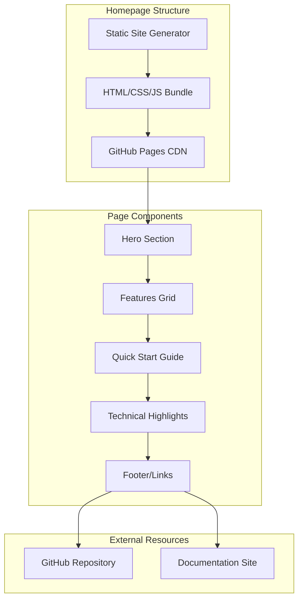

# Homepage Design Initiative - Product Requirements Document

## Executive Summary

### Problem Statement
MirDB is a powerful persistent key-value store with unique capabilities (Memcached protocol compatibility combined with disk persistence), but currently lacks a product homepage to communicate its value proposition to potential users, developers, and organizations evaluating storage solutions.

### Proposed Solution
Create a compelling, informative homepage for MirDB that effectively communicates the product's unique value proposition, key features, and technical capabilities. The homepage will serve as the primary entry point for users discovering MirDB and will guide them toward adoption.

### Expected Impact
- **Increased Discoverability**: Provide a professional web presence for the project
- **Improved User Onboarding**: Help users quickly understand what MirDB offers and how to get started
- **Developer Attraction**: Draw contributors to the open-source project
- **Trust Building**: Establish credibility through clear documentation and professional presentation

### Success Metrics
- Homepage successfully deployed and accessible
- Users can understand MirDB's core value proposition within 30 seconds
- Clear path to getting started documentation
- Mobile-responsive design functioning across devices

---

## Requirements & Scope

### Functional Requirements

| ID | Requirement | Priority |
|----|-------------|----------|
| REQ-1 | Display product name, tagline, and value proposition prominently | Must |
| REQ-2 | Present key features (Memcached compatibility, persistence, LSM tree architecture) | Must |
| REQ-3 | Provide quick-start or getting started section | Must |
| REQ-4 | Include installation/usage instructions or links | Must |
| REQ-5 | Display code examples demonstrating basic usage | Should |
| REQ-6 | Show comparison with alternatives (memcached, other KV stores) | Should |
| REQ-7 | Link to GitHub repository for source code access | Must |
| REQ-8 | Include documentation navigation or links | Must |
| REQ-9 | Display project status and roadmap highlights | Could |
| REQ-10 | Provide contact or community links | Could |

### Non-Functional Requirements

| ID | Requirement | Priority |
|----|-------------|----------|
| NFR-1 | Page must be responsive and mobile-friendly | Must |
| NFR-2 | Page must load within 3 seconds on standard connections | Must |
| NFR-3 | Page must be accessible (WCAG 2.1 AA compliance) | Should |
| NFR-4 | Page must render correctly in major browsers (Chrome, Firefox, Safari, Edge) | Must |
| NFR-5 | Page must be SEO-optimized with proper meta tags | Should |
| NFR-6 | Design must be consistent with developer-focused tooling aesthetic | Should |

### Out of Scope
- User authentication or account management
- Interactive database demos or sandboxes
- Comprehensive API documentation (link to external docs instead)
- Blog or news section
- Multi-language support (initial release in English only)
- Analytics dashboard or metrics collection

### Success Criteria
- All "Must" priority requirements are implemented
- Homepage passes responsive design testing on mobile, tablet, and desktop
- Page loads successfully in all major browsers
- Links to documentation and GitHub are functional

---

## User Experience & Interface

### Target Users
1. **Software Developers**: Looking for a persistent caching solution
2. **DevOps Engineers**: Evaluating storage infrastructure options
3. **System Architects**: Comparing memcached alternatives with persistence
4. **Open Source Contributors**: Seeking Rust projects to contribute to

### User Journey

```
Landing → Understand Value Prop → Explore Features → View Quick Start → Access Docs/GitHub
   │              │                      │                  │                    │
   └──────────────┴──────────────────────┴──────────────────┴────────────────────┘
                              (< 2 minutes to first understanding)
```

### Page Sections (Recommended Flow)

1. **Hero Section**
   - Product name and logo
   - Tagline: "Persistent Key-Value Store with Memcached Protocol"
   - Brief value proposition (1-2 sentences)
   - Primary CTA: "Get Started" / "View on GitHub"

2. **Features Section**
   - Memcached Protocol Compatibility
   - Data Persistence with SSTables
   - LSM Tree Architecture
   - Async I/O with Tokio

3. **Quick Start Section**
   - Installation command
   - Basic configuration example
   - Simple usage example (SET/GET)

4. **Technical Highlights**
   - Supported commands overview
   - Performance characteristics
   - Configuration options summary

5. **Footer**
   - GitHub link
   - Documentation link
   - License information

### Interface Requirements
- Clean, minimal design suitable for developer tools
- Syntax-highlighted code blocks for examples
- Clear visual hierarchy guiding users through content
- Prominent call-to-action buttons
- Dark mode consideration (optional but recommended for developer audience)

### Accessibility Considerations
- Sufficient color contrast ratios
- Keyboard navigation support
- Screen reader compatible markup
- Alt text for any images or diagrams

---

## User Stories

### Personas
- **Developer Dan**: A backend developer evaluating caching solutions
- **DevOps Diana**: An operations engineer looking for persistent storage options
- **Contributor Chris**: An open-source enthusiast interested in Rust projects

### Core Stories

#### US-1: Understand Product Value
**As a** Developer Dan, **I want** to quickly understand what MirDB does, **so that** I can determine if it fits my use case.

**Acceptance Criteria:**
- Given I land on the homepage
- When the page loads
- Then I see a clear tagline explaining MirDB's purpose within 2 seconds
- And I understand it's a persistent key-value store with memcached compatibility

**Related Requirements:** REQ-1, REQ-2

**Priority:** Must

---

#### US-2: Explore Key Features
**As a** DevOps Diana, **I want** to see the key features and technical capabilities, **so that** I can evaluate MirDB against other solutions.

**Acceptance Criteria:**
- Given I am on the homepage
- When I scroll to the features section
- Then I see clearly listed features including persistence, memcached protocol, and LSM tree architecture
- And each feature has a brief explanation of its benefit

**Related Requirements:** REQ-2, REQ-6

**Priority:** Must

---

#### US-3: Get Started Quickly
**As a** Developer Dan, **I want** to see how to install and use MirDB, **so that** I can try it out quickly.

**Acceptance Criteria:**
- Given I want to try MirDB
- When I navigate to the quick start section
- Then I see installation instructions
- And I see a basic usage example with SET and GET commands
- And the code examples are syntax-highlighted and copyable

**Related Requirements:** REQ-3, REQ-4, REQ-5

**Priority:** Must

---

#### US-4: Access Source Code
**As a** Contributor Chris, **I want** to easily find the GitHub repository, **so that** I can explore the codebase and potentially contribute.

**Acceptance Criteria:**
- Given I am on the homepage
- When I look for the source code
- Then I find a prominent link to the GitHub repository
- And clicking it takes me directly to the MirDB repository

**Related Requirements:** REQ-7

**Priority:** Must

---

#### US-5: View on Mobile Device
**As a** Developer Dan, **I want** to view the homepage on my phone, **so that** I can read about MirDB while commuting.

**Acceptance Criteria:**
- Given I access the homepage on a mobile device
- When the page loads
- Then all content is readable without horizontal scrolling
- And navigation is touch-friendly
- And code examples are scrollable within their containers

**Related Requirements:** NFR-1, NFR-4

**Priority:** Must

---

#### US-6: Find Documentation
**As a** DevOps Diana, **I want** to find detailed documentation, **so that** I can learn about configuration options and advanced usage.

**Acceptance Criteria:**
- Given I need more detailed information
- When I look for documentation links
- Then I find clear navigation to documentation resources
- And the links are functional and lead to relevant content

**Related Requirements:** REQ-8

**Priority:** Must

---

#### US-7: Understand Project Status
**As a** Contributor Chris, **I want** to understand the project's current status and roadmap, **so that** I can identify areas where I might contribute.

**Acceptance Criteria:**
- Given I am interested in contributing
- When I look for project status information
- Then I see what features are implemented
- And I see what features are planned (e.g., Raft consensus)

**Related Requirements:** REQ-9

**Priority:** Could

---

## Design Specification

### Recommended Approach
Create a single-page static homepage using modern frontend technologies that emphasizes performance, developer-friendly aesthetics, and clear communication of MirDB's unique value proposition as a persistent memcached-compatible store.

### Key Technical Decisions

#### 1. Framework/Technology Stack
- **Options Considered**: Static HTML/CSS, React/Next.js, Vue/Nuxt, Astro, Hugo/Jekyll
- **Tradeoffs**: Static HTML is simplest but harder to maintain; React/Next.js offers components but adds complexity; Static site generators balance maintainability with simplicity
- **Recommendation**: Static site generator (Hugo or Astro) for optimal performance, easy maintenance, and developer familiarity in the Rust ecosystem

#### 2. Styling Approach
- **Options Considered**: Custom CSS, Tailwind CSS, CSS Framework (Bootstrap), CSS-in-JS
- **Tradeoffs**: Custom CSS offers full control but slower development; Tailwind provides utility-first rapid development; Frameworks may feel generic
- **Recommendation**: Tailwind CSS for rapid development, small bundle size, and flexibility to create a unique developer-focused design

#### 3. Hosting Strategy
- **Options Considered**: GitHub Pages, Netlify, Vercel, Self-hosted
- **Tradeoffs**: GitHub Pages is free and integrated with repo; Netlify/Vercel offer better CI/CD and preview deployments; Self-hosted requires infrastructure
- **Recommendation**: GitHub Pages for simplicity and zero cost, with optional migration to Netlify for enhanced features

#### 4. Code Example Presentation
- **Options Considered**: Plain code blocks, Prism.js, Highlight.js, Shiki
- **Tradeoffs**: Plain blocks lack highlighting; Prism/Highlight.js are mature but add JavaScript; Shiki offers build-time highlighting
- **Recommendation**: Shiki or Prism.js for syntax highlighting with copy-to-clipboard functionality

### High-Level Architecture



### Key Considerations

- **Performance**: Static generation ensures fast load times; minimal JavaScript reduces bundle size; CDN distribution via GitHub Pages provides global availability
- **Security**: Static site has minimal attack surface; no server-side processing; external links use rel="noopener noreferrer"
- **Scalability**: Static hosting scales infinitely; no server resources required; can handle traffic spikes without issues

### Risk Management

- **Content Maintenance Risk**: Homepage may become outdated as project evolves. Mitigation: Structure content to reference external docs for details that change frequently.
- **Design Consistency Risk**: Homepage may not match future documentation site style. Mitigation: Establish basic design tokens (colors, typography) that can be shared.

### Success Criteria
- Homepage builds and deploys successfully via CI/CD
- Page achieves 90+ Lighthouse performance score
- All user stories with "Must" priority are satisfied
- Homepage renders correctly across target browsers and devices

---

## Dependencies & Assumptions

### Dependencies
- GitHub repository access for hosting (GitHub Pages)
- Access to MirDB logo/branding assets (if they exist)
- Final approval on messaging and value proposition copy

### Assumptions
- MirDB will continue to support the memcached protocol as a core feature
- The project will remain open source under current licensing
- Documentation will be hosted separately (linked from homepage)
- No backend services are required for the homepage

### Cross-Team Coordination
- Content review with project maintainers for accuracy
- Design alignment if broader documentation site is planned

---

## Appendices

### Key Messaging Points (from Product Knowledge)

**Primary Value Proposition:**
"MirDB combines the simplicity of the memcached protocol with the durability of disk persistence, giving you a familiar interface with data that survives restarts."

**Key Differentiators:**
1. Drop-in memcached replacement for existing applications
2. Data persistence using proven SSTable format
3. Efficient LSM tree architecture for write-heavy workloads
4. Written in Rust for safety and performance

**Technical Highlights for Homepage:**
- Supports SET, GET, DELETE, ADD, REPLACE, APPEND, PREPEND commands
- Custom INFO command for database status
- Configurable via TOML files
- Async I/O powered by Tokio
