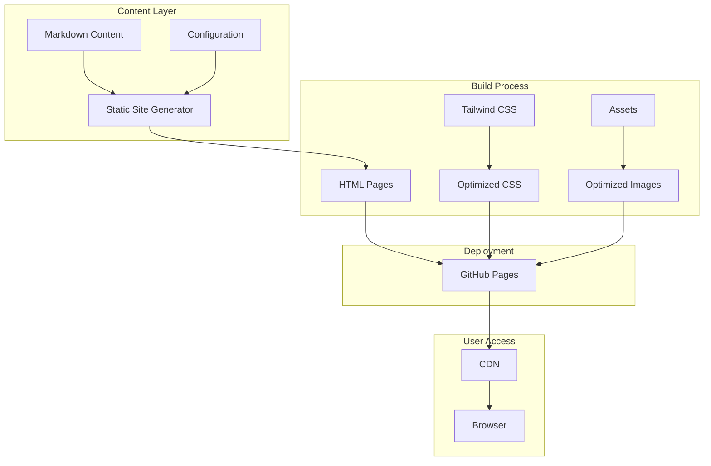

# Homepage Design Initiative - Product Requirements Document

## Executive Summary

### Problem Statement
MirDB is a capable persistent key-value store with memcached protocol compatibility, LSM tree architecture, and high-performance async networking. However, the project currently lacks a public-facing homepage that can effectively communicate its value proposition, features, and differentiation to potential users. Without a homepage, potential adopters cannot easily discover, evaluate, or understand how to get started with MirDB.

### Proposed Solution
Create a professional, informative homepage for MirDB that showcases the product's capabilities, provides clear documentation entry points, and enables developers to quickly understand why MirDB is the right choice for their persistent caching needs.

### Expected Impact
- **Increased Adoption**: A clear, compelling homepage will attract developers seeking a persistent alternative to memcached
- **Reduced Onboarding Friction**: Users can quickly understand MirDB's value and how to get started
- **Improved Credibility**: A professional web presence establishes MirDB as a serious, production-ready solution
- **Community Growth**: Easier discovery leads to more contributors and community engagement

### Success Metrics
- Homepage successfully deployed and accessible
- Clear presentation of key product features and benefits
- Documentation and getting started paths easily accessible
- Page loads within acceptable performance thresholds (<3 seconds)
- Mobile-responsive design implementation

---

## Requirements & Scope

### Functional Requirements

| ID | Requirement | Priority |
|----|-------------|----------|
| REQ-1 | Display product name, tagline, and brief description prominently above the fold | Must |
| REQ-2 | Present key features section highlighting: Memcached protocol compatibility, data persistence, LSM tree architecture, and async networking | Must |
| REQ-3 | Include a "Getting Started" section with quick start commands and configuration basics | Must |
| REQ-4 | Provide navigation to documentation, GitHub repository, and installation instructions | Must |
| REQ-5 | Display code examples showing basic usage (SET, GET operations) | Should |
| REQ-6 | Include a comparison section differentiating MirDB from standard memcached | Should |
| REQ-7 | Show project status and roadmap information (current features vs. planned features like Raft consensus) | Should |
| REQ-8 | Provide configuration reference or link to detailed configuration documentation | Could |
| REQ-9 | Include community/contribution section with links to issues and contribution guidelines | Could |

### Non-Functional Requirements

| ID | Requirement | Priority |
|----|-------------|----------|
| NFR-1 | Page must be responsive and render correctly on mobile, tablet, and desktop devices | Must |
| NFR-2 | Page must load within 3 seconds on standard broadband connections | Must |
| NFR-3 | Page must be accessible (WCAG 2.1 Level AA compliance) | Should |
| NFR-4 | Page must be SEO-optimized with appropriate meta tags and semantic HTML | Should |
| NFR-5 | Design must be consistent with modern developer tool aesthetics | Should |
| NFR-6 | Page must function without JavaScript for core content (progressive enhancement) | Could |

### Out of Scope

- User authentication or account management
- Interactive database demo or playground
- Blog or news section
- Multi-language/internationalization support
- Analytics dashboard or telemetry
- Full documentation site (this is homepage only)

### Success Criteria

1. Homepage renders correctly across major browsers (Chrome, Firefox, Safari, Edge)
2. All navigation links function correctly
3. Page passes Google Lighthouse accessibility audit with score ≥ 80
4. Page passes Google Lighthouse performance audit with score ≥ 80
5. All content accurately reflects MirDB's current capabilities and status

---

## User Experience & Interface

### Target Users

1. **Primary**: Software engineers evaluating caching solutions for their applications
2. **Secondary**: DevOps engineers looking for persistent memcached alternatives
3. **Tertiary**: Open source contributors interested in database internals

### User Journey

```
Discovery → Landing → Evaluation → Getting Started → Adoption
   │           │           │              │             │
   │           │           │              │             └─→ Documentation/GitHub
   │           │           │              └─→ Quick Start Section
   │           │           └─→ Features & Comparison Sections
   │           └─→ Hero Section with Value Proposition
   └─→ Search Engine/GitHub/Word of Mouth
```

### Interface Requirements

#### Hero Section
- Product logo/name with memorable tagline (e.g., "Persistent Key-Value Storage with Memcached Compatibility")
- Brief 1-2 sentence product description
- Primary CTA: "Get Started" button
- Secondary CTA: "View on GitHub" button

#### Features Section
- Card-based layout highlighting 4-6 key features:
  - Memcached Protocol Support
  - Persistent Storage
  - LSM Tree Architecture
  - High-Performance Async I/O
  - Configurable Parameters
  - Easy Integration

#### Quick Start Section
- Terminal-style code block showing:
  - Installation command
  - Basic configuration example
  - Simple SET/GET example

#### Comparison Section (Optional)
- Side-by-side comparison table: MirDB vs. Memcached
- Focus on persistence, durability, and configuration advantages

#### Footer
- Links to: Documentation, GitHub, License, Contributing Guidelines
- Project status indicator

### Accessibility Considerations

- Proper heading hierarchy (h1 → h2 → h3)
- Alt text for all images and icons
- Sufficient color contrast ratios (4.5:1 minimum)
- Keyboard navigation support
- Screen reader compatibility

---

## Design Specification

### Recommended Approach

Create a static, single-page homepage using modern web technologies that emphasize performance, maintainability, and developer-friendly aesthetics. The page should load quickly, work without JavaScript for core content, and be easy to update as the project evolves.

### Key Technical Decisions

#### 1. Static Site vs. Dynamic Application

- **Options Considered**: Static HTML/CSS, Static Site Generator (Hugo, Astro, 11ty), React SPA, Server-rendered application
- **Tradeoffs**: Static approaches offer better performance and simpler hosting but less interactivity; SPAs provide richer experiences but add complexity and bundle size
- **Recommendation**: Static site generator (Astro or Hugo) for optimal balance of developer experience, performance, and maintainability

#### 2. Styling Approach

- **Options Considered**: Plain CSS, CSS Framework (Tailwind), Component Library (Chakra, MUI), Custom Design System
- **Tradeoffs**: Plain CSS is lightweight but time-consuming; frameworks accelerate development but add dependencies; component libraries ensure consistency but may feel generic
- **Recommendation**: Tailwind CSS for rapid, utility-first styling with minimal runtime overhead and easy customization

#### 3. Hosting Strategy

- **Options Considered**: GitHub Pages, Netlify, Vercel, Self-hosted
- **Tradeoffs**: GitHub Pages integrates with repository but has limitations; Netlify/Vercel offer better CI/CD but add external dependency; self-hosted provides control but requires maintenance
- **Recommendation**: GitHub Pages for simplicity and zero-cost hosting integrated with existing repository

#### 4. Code Syntax Highlighting

- **Options Considered**: Prism.js, highlight.js, Shiki, Server-side highlighting
- **Tradeoffs**: Client-side libraries add JavaScript; server-side highlighting increases build complexity but eliminates runtime cost
- **Recommendation**: Build-time syntax highlighting (via static site generator) for zero-runtime JavaScript overhead

### High-Level Architecture



### Key Considerations

- **Performance**: Static generation ensures fast initial page loads; CSS purging removes unused styles; image optimization reduces bandwidth
- **Security**: Static site eliminates server-side vulnerabilities; no database or dynamic endpoints to protect; CSP headers can be configured at hosting level
- **Scalability**: Static hosting scales infinitely via CDN; no server resources to manage; GitHub Pages handles traffic spikes automatically

### Risk Management

- **Content Accuracy Risk**: Homepage content may become outdated as MirDB evolves; mitigate by keeping content in easily-editable markdown files with clear update process
- **Design Drift Risk**: Without design system, future updates may introduce inconsistencies; mitigate by documenting component patterns and maintaining Tailwind configuration
- **Browser Compatibility Risk**: Modern CSS features may not work in older browsers; mitigate by testing across browser matrix and using progressive enhancement

### Success Criteria

- Page achieves Lighthouse performance score ≥ 90
- Build process completes in under 30 seconds
- Content updates can be made via simple markdown file edits
- Page renders correctly without JavaScript enabled

---

## User Stories

### Personas

1. **Alex (Evaluating Developer)**: Software engineer searching for a persistent caching solution
2. **Jordan (DevOps Engineer)**: Infrastructure engineer looking to replace volatile memcached deployments
3. **Casey (Contributor)**: Open source enthusiast interested in database internals

### Core Stories

#### US-1: Understand Product Value Proposition
**As** Alex (evaluating developer),
**I want** to quickly understand what MirDB is and why it's different,
**so that** I can determine if it's worth further investigation.

**Acceptance Criteria:**
- Given I land on the homepage
- When I view the hero section
- Then I see a clear tagline explaining MirDB's purpose within 5 seconds
- And I understand it's a persistent memcached-compatible store

**Priority**: Must
**Traces to**: REQ-1, REQ-2

---

#### US-2: Evaluate Key Features
**As** Alex (evaluating developer),
**I want** to see MirDB's key features and technical capabilities,
**so that** I can assess if it meets my project requirements.

**Acceptance Criteria:**
- Given I am on the homepage
- When I scroll to the features section
- Then I see clearly presented features including persistence, memcached compatibility, and LSM architecture
- And each feature has a brief explanation of its benefit

**Priority**: Must
**Traces to**: REQ-2, REQ-6

---

#### US-3: Get Started Quickly
**As** Alex (evaluating developer),
**I want** to see quick start instructions,
**so that** I can try MirDB with minimal friction.

**Acceptance Criteria:**
- Given I am on the homepage
- When I navigate to the getting started section
- Then I see installation commands and basic usage examples
- And I can copy code snippets with a single click

**Priority**: Must
**Traces to**: REQ-3, REQ-5

---

#### US-4: Access Documentation and Repository
**As** Jordan (DevOps engineer),
**I want** to navigate to detailed documentation and the GitHub repository,
**so that** I can learn about configuration options and deployment.

**Acceptance Criteria:**
- Given I am on the homepage
- When I look for documentation links
- Then I find clear navigation to docs, GitHub, and configuration reference
- And all links open correctly in new tabs

**Priority**: Must
**Traces to**: REQ-4, REQ-8

---

#### US-5: Understand Project Status
**As** Casey (potential contributor),
**I want** to understand the current project status and roadmap,
**so that** I can identify areas where I might contribute.

**Acceptance Criteria:**
- Given I am on the homepage
- When I look for project status information
- Then I see what features are implemented vs. planned (e.g., Raft consensus)
- And I find links to contribution guidelines

**Priority**: Should
**Traces to**: REQ-7, REQ-9

---

#### US-6: View on Mobile Device
**As** Alex (evaluating developer),
**I want** to view the homepage on my mobile device,
**so that** I can evaluate MirDB while away from my workstation.

**Acceptance Criteria:**
- Given I access the homepage on a mobile device
- When the page loads
- Then all content is readable without horizontal scrolling
- And navigation elements are touch-friendly

**Priority**: Must
**Traces to**: NFR-1

---

## Dependencies & Assumptions

### Dependencies

| Dependency | Type | Impact |
|------------|------|--------|
| GitHub repository access | Internal | Required for GitHub Pages deployment |
| Domain/subdomain (if custom) | External | Needed if not using github.io default |
| Product screenshots/diagrams | Internal | Required for visual content |
| Final copy approval | Internal | Marketing/product review of messaging |

### Assumptions

1. The project will continue to use GitHub as primary repository
2. No custom domain purchase is required (github.io acceptable)
3. Existing MirDB documentation can be linked to (not rebuilt)
4. Project maintainers can review and approve content
5. No legal review required for open source project homepage

### Cross-Team Coordination

- **Development Team**: Provide technical accuracy review
- **Project Maintainers**: Approve final content and messaging
- **Community**: Gather feedback post-launch

---

## Appendices

### A. Content Outline

```
1. Hero Section
   - Logo + "MirDB"
   - Tagline: "Persistent Key-Value Storage with Memcached Compatibility"
   - Description: "A high-performance, persistent key-value store written in Rust.
     Drop-in compatible with memcached clients, powered by LSM tree storage."
   - CTAs: [Get Started] [View on GitHub]

2. Features Section
   - Memcached Protocol: Use existing memcached clients without changes
   - Persistent Storage: Data survives restarts via SSTable storage
   - LSM Architecture: Efficient writes with background compaction
   - Async I/O: Built on Tokio for high-performance networking
   - Configurable: Tune memory, storage, and compaction parameters
   - Rust Performance: Memory-safe with zero-cost abstractions

3. Quick Start Section
   - Installation command
   - Configuration example (etc/mirdb.toml)
   - Basic usage example (telnet/nc commands)

4. Comparison Section (MirDB vs Memcached)
   | Feature | MirDB | Memcached |
   |---------|-------|-----------|
   | Persistence | ✓ | ✗ |
   | Protocol | Memcached | Memcached |
   | Architecture | LSM Tree | Hash Table |
   | Durability | WAL + SSTable | None |

5. Status & Roadmap
   - Implemented: Protocol, Persistence, Compaction
   - Planned: Raft Consensus, Distributed Operation

6. Footer
   - Documentation | GitHub | License (MIT/Apache) | Contributing
```

### B. Technical Reference

- **Default Port**: 12333
- **Protocol**: Memcached text protocol
- **Storage**: LSM Tree with 7 levels
- **Supported Commands**: SET, GET, DELETE, ADD, REPLACE, APPEND, PREPEND, INFO
