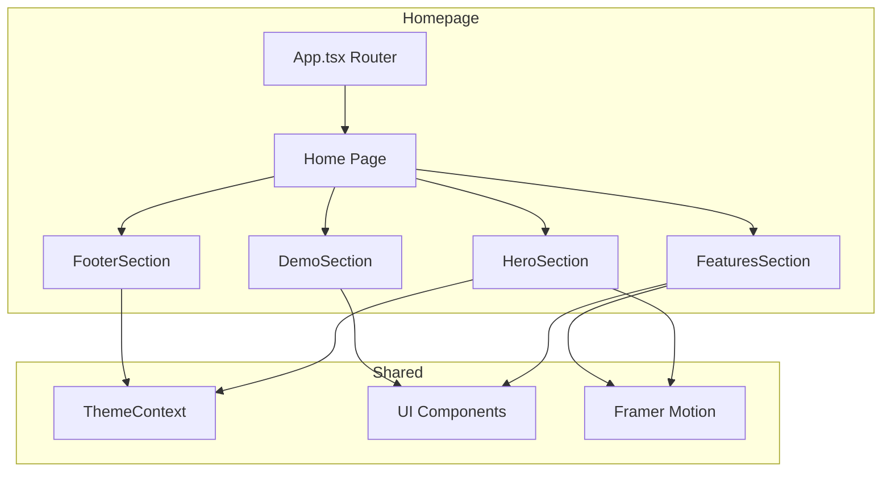

# Product Homepage Design - Product Requirements Document

## Executive Summary

### Problem Statement
The URL Shortening Service currently lacks a dedicated, compelling homepage that effectively communicates the product's value proposition to new visitors. Users landing on the root URL (`/`) need a clear introduction to the service's capabilities, benefits, and a straightforward path to get started.

### Proposed Solution
Design and implement a modern, conversion-focused homepage that showcases the URL shortening service's key features, communicates its value proposition, and provides clear calls-to-action for user registration and URL creation. The homepage will leverage the existing React/TypeScript frontend architecture with Tailwind CSS and DaisyUI components.

### Expected Impact
- **User Acquisition**: Clear value proposition increases conversion from visitors to registered users
- **User Experience**: Immediate understanding of product capabilities reduces bounce rate
- **Brand Identity**: Professional homepage establishes credibility and trust
- **Engagement**: Interactive elements and feature highlights encourage exploration

### Success Metrics
- Visitor-to-registration conversion rate improvement
- Reduced bounce rate on landing page
- Increased time spent on homepage
- Higher click-through rate to registration/login

---

## Requirements & Scope

### Functional Requirements

| ID | Requirement | Priority |
|----|-------------|----------|
| REQ-1 | Display hero section with product tagline and primary CTA | Must |
| REQ-2 | Showcase key features (URL shortening, analytics, sharing) with visual elements | Must |
| REQ-3 | Provide prominent "Get Started" and "Login" call-to-action buttons | Must |
| REQ-4 | Include "Try it now" URL shortening demo (optional registration) | Should |
| REQ-5 | Display usage statistics or social proof elements | Should |
| REQ-6 | Show feature comparison or pricing tiers (if applicable) | Could |
| REQ-7 | Include footer with navigation links, legal, and contact information | Must |
| REQ-8 | Support responsive design for mobile, tablet, and desktop viewports | Must |
| REQ-9 | Integrate with existing theme system (dark mode support) | Must |
| REQ-10 | Provide smooth scroll navigation between homepage sections | Should |

### Non-Functional Requirements

| ID | Requirement | Priority |
|----|-------------|----------|
| NFR-1 | Page load time under 2 seconds on standard connections | Must |
| NFR-2 | Achieve 90+ Lighthouse accessibility score | Should |
| NFR-3 | Support all modern browsers (Chrome, Firefox, Safari, Edge) | Must |
| NFR-4 | Maintain consistent design language with existing UI components | Must |
| NFR-5 | Ensure SEO-friendly markup with proper meta tags | Should |
| NFR-6 | Support animations using Framer Motion without performance degradation | Should |

### Out of Scope
- Backend API changes for the homepage
- User account management features on homepage
- Full analytics dashboard preview
- Multi-language/internationalization support
- Blog or content management system integration

### Success Criteria
- Homepage renders correctly on all target devices and browsers
- All CTAs navigate to appropriate routes (registration, login, dashboard)
- Theme toggle functions correctly on homepage
- Page passes accessibility audit with no critical issues
- Lighthouse performance score meets or exceeds 85

---

## User Stories

### Personas
- **New Visitor**: First-time user discovering the service, needs to understand value proposition
- **Returning User**: Existing user looking to quickly access login or dashboard
- **Evaluating User**: Potential user comparing services, needs feature information

### Core User Stories

**US-1: Understand Product Value** (REQ-1, REQ-2)
> As a new visitor, I want to immediately understand what this service does and why I should use it, so that I can decide if it meets my needs.

*Acceptance Criteria:*
- Given I land on the homepage
- When the page loads
- Then I see a clear headline explaining the service
- And I see visual representations of key features
- And I understand the primary benefit within 5 seconds

**US-2: Quick Registration Path** (REQ-3)
> As a new visitor who wants to try the service, I want a clear and prominent sign-up option, so that I can start using the product quickly.

*Acceptance Criteria:*
- Given I am on the homepage
- When I decide to sign up
- Then I can find a "Get Started" or "Sign Up" button within the viewport
- And clicking it navigates me to the registration page

**US-3: Existing User Login** (REQ-3)
> As a returning user, I want to easily find the login option, so that I can access my dashboard without searching.

*Acceptance Criteria:*
- Given I am on the homepage as a returning user
- When I look for login
- Then I find a "Login" button in a consistent location (header/navigation)
- And clicking it navigates me to the login page

**US-4: Try Before Registering** (REQ-4)
> As an evaluating user, I want to test the URL shortening without creating an account, so that I can experience the product before committing.

*Acceptance Criteria:*
- Given I am on the homepage
- When I enter a URL in the demo input
- Then I see a shortened URL generated (or prompted to register)
- And I understand the value of full account features

**US-5: Mobile Experience** (REQ-8, NFR-3)
> As a mobile user, I want the homepage to be fully functional and visually appealing on my device, so that I have a good experience regardless of device.

*Acceptance Criteria:*
- Given I access the homepage on a mobile device
- When the page renders
- Then all content is readable without horizontal scrolling
- And CTAs are easily tappable
- And navigation is accessible via mobile menu

**US-6: Consistent Theme Experience** (REQ-9)
> As a user who prefers dark mode, I want the homepage to respect my theme preference, so that I have a comfortable viewing experience.

*Acceptance Criteria:*
- Given I have dark mode enabled (system or manual)
- When I visit the homepage
- Then the homepage renders in dark mode
- And all elements maintain proper contrast and readability

**US-7: Feature Discovery** (REQ-2, REQ-5)
> As an evaluating user, I want to see all the features this service offers, so that I can compare it with alternatives.

*Acceptance Criteria:*
- Given I am on the homepage
- When I scroll down
- Then I see a features section with analytics, sharing, and management capabilities
- And each feature has a brief description and visual element

---

## User Experience & Interface

### User Journey
1. **Landing**: User arrives at homepage, immediately sees hero section with value proposition
2. **Discovery**: User scrolls to explore features, benefits, and social proof
3. **Decision**: User decides to try the service or learn more
4. **Action**: User clicks CTA to register, login, or try demo
5. **Conversion**: User proceeds to registration or authentication flow

### Interface Requirements

#### Hero Section
- Large, compelling headline (e.g., "Shorten URLs. Track Results.")
- Subheadline explaining the benefit
- Primary CTA button ("Get Started Free")
- Secondary CTA button ("Login")
- Optional: Visual illustration or animation

#### Features Section
- Grid or card layout showcasing 3-4 key features:
  - URL Shortening (create memorable links)
  - Analytics Dashboard (track clicks, referrers, geography)
  - Share Statistics (public share tokens)
  - Theme Support (dark mode, customization)
- Each feature includes icon, title, and brief description

#### Demo/Try Section (Optional)
- URL input field
- "Shorten" button
- Result display or registration prompt

#### Social Proof Section
- Usage statistics (if available)
- Testimonials or trust indicators
- Feature highlights

#### Footer
- Navigation links (Home, Login, Register)
- Legal links (Privacy, Terms)
- Copyright notice

### Accessibility Considerations
- Proper heading hierarchy (h1, h2, h3)
- Alt text for all images and icons
- Keyboard navigation support
- Sufficient color contrast ratios
- Focus indicators for interactive elements
- Screen reader compatible structure

### User Interaction Patterns
- Smooth scroll behavior between sections
- Hover states on interactive elements
- Loading states for any async operations
- Responsive navigation (hamburger menu on mobile)
- Theme toggle integration

---

## Technical Considerations

### High-Level Technical Approach
The homepage will be implemented as an enhancement to the existing React SPA, following established patterns in the codebase. It will utilize the existing component library (Tailwind CSS + DaisyUI), state management (Theme Context), and routing structure.

### Integration Points
- **Routing**: Extends current React Router configuration at `/` route
- **Theme System**: Integrates with existing ThemeContext for dark mode support
- **Component Library**: Leverages existing GlassMorphismCard, FuturisticButton, and other components
- **Animation**: Uses Framer Motion for entrance animations and interactions
- **API Client**: May use existing axios client for demo functionality (if implemented)

### Key Technical Constraints
- Must maintain compatibility with existing frontend architecture
- Should not require backend API changes
- Must support existing theme configurations (light, dark, cyberpunk, synthwave, etc.)
- Should minimize bundle size impact

### Performance Considerations
- Lazy loading for below-fold images
- Optimized asset delivery
- Minimal JavaScript for initial render
- CSS-based animations where possible

---

## Design Specification

### Recommended Approach
Implement a modular, section-based homepage using existing React components and Tailwind CSS utilities. Each section (Hero, Features, Demo, Footer) will be a separate component for maintainability. The design will follow the existing glassmorphism aesthetic with smooth Framer Motion animations.

### Key Technical Decisions

#### 1. Component Architecture
- **Options Considered**: Single monolithic component vs. modular section components
- **Tradeoffs**: Monolithic is simpler but harder to maintain; modular requires more files but improves reusability
- **Recommendation**: Modular section-based components (HeroSection, FeaturesSection, DemoSection, FooterSection) for better maintainability and potential reuse

#### 2. Styling Approach
- **Options Considered**: Custom CSS vs. Tailwind utilities vs. DaisyUI components
- **Tradeoffs**: Custom CSS offers full control but increases maintenance; Tailwind is utility-first but verbose; DaisyUI provides ready components but less customization
- **Recommendation**: Combine Tailwind utilities with existing DaisyUI components to maintain design consistency with the rest of the application

#### 3. Animation Strategy
- **Options Considered**: CSS animations vs. Framer Motion vs. no animations
- **Tradeoffs**: CSS is lightweight but limited; Framer Motion is powerful but adds bundle size; no animations reduces engagement
- **Recommendation**: Use Framer Motion (already in project) for entrance animations and scroll-triggered effects, keeping animations subtle and performant

#### 4. Demo Functionality
- **Options Considered**: Full API integration vs. mock demo vs. no demo
- **Tradeoffs**: Full integration requires auth handling; mock demo may disappoint users; no demo reduces engagement
- **Recommendation**: Implement demo that prompts registration on submit, showing the input flow without backend changes

### High-Level Architecture

### Key Considerations
- **Performance**: Lazy load images, use CSS transforms for animations, minimize re-renders with React.memo
- **Security**: No sensitive data displayed, demo form should sanitize input
- **Scalability**: Section-based architecture allows easy addition of new sections or features

### Risk Management
- **Browser Compatibility Risk**: Glassmorphism effects may not render consistently across browsers. Mitigation: Provide fallback styles for unsupported features.
- **Animation Performance Risk**: Complex Framer Motion animations may affect mobile performance. Mitigation: Use `will-change` hints and reduce animation complexity on mobile.

### Success Criteria
- Homepage components render without console errors
- All sections display correctly on desktop, tablet, and mobile
- Theme switching works seamlessly
- CTAs navigate to correct routes
- Page achieves 85+ Lighthouse score

---

## Dependencies & Assumptions

### Dependencies
- Existing React/TypeScript frontend framework
- Tailwind CSS and DaisyUI component library
- Framer Motion animation library
- React Router for navigation
- ThemeContext for theme management

### Assumptions
- The existing frontend build pipeline supports additional page components
- DaisyUI theme tokens are sufficient for homepage styling needs
- No backend API changes are required for initial homepage implementation
- Asset files (images, icons) will be provided or sourced from existing design system

### Cross-Team Coordination
- Design assets may need to be created or sourced
- Content copy for headlines and descriptions should be reviewed

---

## Appendices

### Reference: Current Tech Stack
- **Frontend**: React 18, TypeScript, Vite, Tailwind CSS, DaisyUI, React Query, Zustand, Framer Motion
- **Routing**: React Router v6
- **Styling**: Tailwind CSS utilities + DaisyUI components
- **State**: Context API (Auth, Theme) + Zustand (UI state)

### Reference: Existing Component Patterns
- `GlassMorphismCard`: Card component with glassmorphism effect
- `FuturisticButton`: Styled button component
- `BackgroundEffect`: Visual background effects
- `ThemeToggle`: Theme switching component
- `Navbar`: Navigation component

### Related Routes
- `/register` - User registration page
- `/login` - User login page
- `/dashboard` - Main user dashboard (protected)
