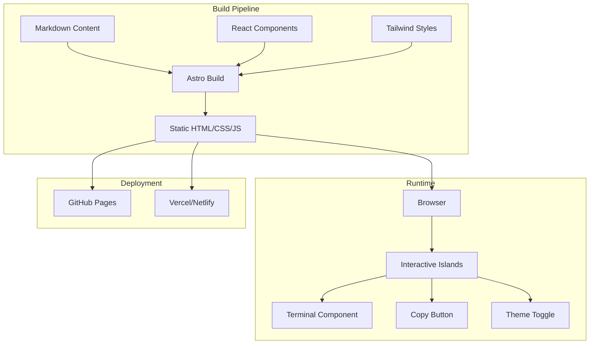

# MirDB Product Homepage - Product Requirements Document

## Executive Summary

### Problem Statement
MirDB is a high-performance persistent key-value store with Memcached protocol compatibility, but it lacks a professional product homepage to communicate its value proposition, features, and technical capabilities to potential users and contributors. Without a dedicated homepage, the project struggles to attract adoption, communicate its differentiators from other KV stores, and provide clear getting-started guidance.

### Proposed Solution
Create a modern, responsive product homepage that effectively communicates MirDB's key value propositions: persistent storage with Memcached protocol compatibility, LSM-tree based architecture for high write throughput, and seamless drop-in replacement capability for existing Memcached deployments.

### Expected Impact
- Increased project visibility and adoption within the Rust and database communities
- Clear communication of MirDB's technical advantages over traditional Memcached
- Reduced friction for developers evaluating the solution
- Stronger positioning as a production-ready persistent KV store

### Success Metrics
- Homepage clearly communicates key features within 10 seconds of landing
- Getting started instructions enable a working setup in under 5 minutes
- Technical architecture is understandable to developers familiar with key-value stores
- Responsive design works seamlessly across desktop, tablet, and mobile devices

---

## Requirements & Scope

### Functional Requirements

| ID | Requirement | Priority |
|----|-------------|----------|
| REQ-1 | Display hero section with project logo, tagline, and primary CTA | Must |
| REQ-2 | Showcase key features: Memcached compatibility, persistent storage, LSM-tree architecture | Must |
| REQ-3 | Provide interactive code examples demonstrating Memcached protocol usage | Must |
| REQ-4 | Include architecture diagram explaining LSM-tree, memtable, SSTable, and compaction | Must |
| REQ-5 | Display configuration options with sensible defaults documentation | Must |
| REQ-6 | Link to GitHub repository, documentation, and community resources | Must |
| REQ-7 | Show performance benchmarks/comparisons where available | Should |
| REQ-8 | Include installation instructions for various platforms | Must |
| REQ-9 | Display supported Memcached commands (get, gets, set, add, replace, append, prepend, delete) | Must |
| REQ-10 | Feature roadmap section showing completed and planned features (e.g., Raft) | Should |

### Non-Functional Requirements

| ID | Requirement | Priority |
|----|-------------|----------|
| NFR-1 | Page load time under 2 seconds on standard broadband | Must |
| NFR-2 | Responsive design supporting viewport widths from 320px to 2560px | Must |
| NFR-3 | WCAG 2.1 AA accessibility compliance | Must |
| NFR-4 | SEO-optimized with proper meta tags, structured data, and semantic HTML | Must |
| NFR-5 | Dark mode support matching modern developer preferences | Should |
| NFR-6 | Static site generation for easy deployment (GitHub Pages, Vercel, Netlify) | Must |
| NFR-7 | Copy-to-clipboard functionality for code examples | Should |

### Out of Scope
- Interactive demo server or playground environment
- User authentication or account management
- Real-time analytics dashboard
- Multi-language documentation (initial release is English only)
- E-commerce or pricing pages (project is open source)

### Success Criteria
- [ ] All Must-have requirements (REQ-1 through REQ-6, REQ-8, REQ-9) are implemented
- [ ] Lighthouse performance score >= 90
- [ ] Lighthouse accessibility score >= 95
- [ ] Valid HTML5 and CSS3 with no critical errors
- [ ] Cross-browser compatibility (Chrome, Firefox, Safari, Edge latest 2 versions)

---

## User Experience & Interface

### User Journey

1. **Discovery**: User lands on homepage from search, GitHub, or referral
2. **Understanding**: Within 10 seconds, user understands what MirDB is (persistent KV store with Memcached compatibility)
3. **Evaluation**: User reviews features, architecture, and code examples to assess fit
4. **Trial**: User follows installation instructions to get started
5. **Engagement**: User stars the repo, joins community, or contributes

### Interface Requirements

#### Hero Section
- Animated ASCII/logo art (replicating the terminal banner)
- Primary tagline: "A Persistent Key-Value Store with Memcached Protocol"
- Secondary description emphasizing drop-in replacement capability
- Two CTAs: "Get Started" (primary) and "View on GitHub" (secondary)

#### Features Grid
- 6 feature cards with icons:
  1. **Memcached Compatible** - Drop-in replacement, supports standard protocol
  2. **Persistent Storage** - Data survives restarts via LSM-tree architecture
  3. **High Performance** - Skip-list memtable, compressed SSTables
  4. **Configurable** - TOML-based configuration with sensible defaults
  5. **Compaction** - Automatic minor and major compaction for storage efficiency
  6. **Async I/O** - Built on Tokio for high concurrency

#### Interactive Terminal
- Tabbed interface showing different command examples:
  - Basic operations (get/set)
  - Batch operations
  - Configuration example
- Copy-to-clipboard buttons on each code block
- Syntax highlighting for shell/commands

#### Architecture Visualization
- Mermaid diagram or SVG illustration showing:
  - Write path: WAL → Memtable → Immutable Memtable → SSTable
  - Read path: Memtable → SSTable levels (L0-L7)
  - Compaction process visualization

#### Configuration Reference
- Collapsible sections for each config option
- Default values displayed alongside descriptions
- Visual size parser explanation (K, M, G, T units)

---

## Technical Considerations

### High-Level Technical Approach
Static site generated with a modern framework (Astro, Next.js, or Vite-based solution) deployed to GitHub Pages or Vercel. No backend required; all content is static with client-side interactivity.

### Integration Points
- **GitHub API**: Optional dynamic star count fetching
- **npm**: Package management for build tools
- **CI/CD**: GitHub Actions for automated deployment on push to main

### Key Technical Constraints
1. Must be deployable as static files (no server-side rendering requirement)
2. All animations must respect `prefers-reduced-motion`
3. Code syntax highlighting must support Rust, TOML, and shell/bash

### Performance Considerations
- Lazy load below-fold images and diagrams
- Use system fonts with web font fallbacks
- Minimize JavaScript bundle size; prefer CSS animations
- Optimize SVG assets for architecture diagrams

---

## Design Specification

### Recommended Approach
Create a single-page application with anchor navigation, using a dark-first design aesthetic that appeals to systems programmers and database engineers. Emphasize code and terminal aesthetics while maintaining readability.

### Key Technical Decisions

#### 1. Framework Selection
- **Options Considered**: Astro, Next.js (static export), Vite + React, Hugo
- **Tradeoffs**: Astro offers best performance for content-heavy sites; Next.js has larger ecosystem; Hugo is fastest but less flexible for interactive components
- **Recommendation**: Astro with React islands for interactive components (terminal, copy buttons) - optimal balance of performance and interactivity

#### 2. Styling Approach
- **Options Considered**: Tailwind CSS, CSS Modules, Styled Components, vanilla CSS
- **Tradeoffs**: Tailwind provides rapid development and consistency; vanilla CSS has zero runtime overhead
- **Recommendation**: Tailwind CSS with custom color palette matching terminal/dark theme aesthetics

#### 3. Animation Strategy
- **Options Considered**: Framer Motion, GSAP, CSS animations only
- **Tradeoffs**: Framer Motion is React-friendly but adds bundle size; CSS animations are lightweight but less flexible
- **Recommendation**: CSS animations for simple effects, lightweight JS for terminal typing effect only

### High-Level Architecture



### Key Considerations

**Performance**: Static generation ensures sub-2-second load times; lazy loading for architecture diagrams; code splitting for interactive components.

**Security**: No user input handling required; CSP headers configured for static hosting; no external dependencies that could introduce vulnerabilities.

**Scalability**: Static site handles any traffic volume; CDN-friendly; no database or server scaling concerns.

### Risk Management

**Technical Risk - Animation Performance**: Complex terminal animations could cause jank on low-end devices. *Mitigation*: Use CSS transforms only, respect `prefers-reduced-motion`, provide static fallback.

**Technical Risk - Framework Obsolescence**: Frontend frameworks evolve rapidly. *Mitigation*: Astro is HTML-first by design; content is in Markdown which is portable to any future solution.

### Success Criteria
- Lighthouse Performance score >= 90
- First Contentful Paint under 1.5 seconds
- Time to Interactive under 3 seconds
- Zero layout shift during page load

---

## User Stories

### Story 1: Developer Evaluating Database Options
**As a** backend developer evaluating key-value stores for my application, **I want** to quickly understand if MirDB supports my existing Memcached client code, **so that** I can assess migration effort.

**Acceptance Criteria**:
- Given I land on the MirDB homepage
- When I view the "Memcached Compatible" feature section
- Then I see a list of supported commands matching the Memcached protocol
- And I see a code example showing standard get/set operations

**Priority**: Must
**Traceability**: REQ-3, REQ-9

### Story 2: DevOps Engineer Assessing Operational Requirements
**As a** DevOps engineer responsible for database infrastructure, **I want** to understand MirDB's configuration options and resource requirements, **so that** I can plan deployment and capacity.

**Acceptance Criteria**:
- Given I navigate to the Configuration section
- When I review the configuration reference
- Then I see all available options with their default values
- And I see explanations of memory and disk usage implications

**Priority**: Must
**Traceability**: REQ-5, NFR-1

### Story 3: Open Source Contributor Exploring the Project
**As a** Rust developer interested in contributing to database projects, **I want** to understand MirDB's architecture and roadmap, **so that** I can find meaningful contribution opportunities.

**Acceptance Criteria**:
- Given I view the Architecture section
- When I examine the LSM-tree diagram
- Then I understand the write path from WAL to SSTable
- And I see the roadmap showing Raft as a planned feature

**Priority**: Should
**Traceability**: REQ-4, REQ-10

### Story 4: Mobile User Browsing on Phone
**As a** developer browsing on my phone during commute, **I want** to read about MirDB without horizontal scrolling or zooming, **so that** I can evaluate the project on any device.

**Acceptance Criteria**:
- Given I access the homepage on a 375px wide viewport
- When I scroll through all sections
- Then all content remains readable without horizontal scrolling
- And the navigation adapts to a mobile-friendly hamburger menu

**Priority**: Must
**Traceability**: NFR-2

---

## Dependencies & Assumptions

### External Dependencies
- GitHub repository access for star count and link generation
- Hosting platform (GitHub Pages, Vercel, or Netlify) account setup
- Domain name (optional - can use github.io subdomain initially)

### Assumptions
- Project logo assets (animated GIF) are available for use
- README content can be repurposed for homepage content
- Maintainer approval for design direction and messaging
- No legal restrictions on using "Memcached" in descriptive text

### Cross-Team Coordination
- **Maintainers**: Review and approve messaging and roadmap accuracy
- **Design**: If professional design resources available, provide mockups
- **Documentation**: Ensure alignment between homepage and README/docs

---

## Appendices

### A. Content Outline

```
1. Hero
   - Logo/ASCII art
   - Tagline: "Persistent Key-Value Store with Memcached Protocol"
   - Description paragraph
   - CTA buttons

2. Features (6 cards)
   - Memcached Compatible
   - Persistent Storage
   - High Performance
   - Configurable
   - Compaction
   - Async I/O

3. Interactive Terminal
   - Tabs: Basic Usage, Configuration, Advanced
   - Copy buttons

4. Architecture
   - LSM-tree diagram
   - Component descriptions

5. Configuration Reference
   - TOML example
   - Option descriptions table

6. Installation
   - Prerequisites (Rust toolchain)
   - Build from source
   - Run with config

7. Supported Commands
   - Command table with descriptions

8. Roadmap
   - Completed features (checkmarks)
   - Planned features (Raft)

9. Footer
   - GitHub link
   - License info (implied open source)
   - Acknowledgments
```

### B. Color Palette Recommendation

- **Background**: `#0d1117` (GitHub dark)
- **Surface**: `#161b22` (elevated cards)
- **Border**: `#30363d`
- **Text Primary**: `#c9d1d9`
- **Text Secondary**: `#8b949e`
- **Accent**: `#58a6ff` (blue)
- **Success**: `#3fb950` (green)
- **Warning**: `#d29922` (yellow)

### C. Typography

- **Headings**: JetBrains Mono or system monospace stack
- **Body**: system-ui, -apple-system, sans-serif
- **Code**: SF Mono, Consolas, monospace
