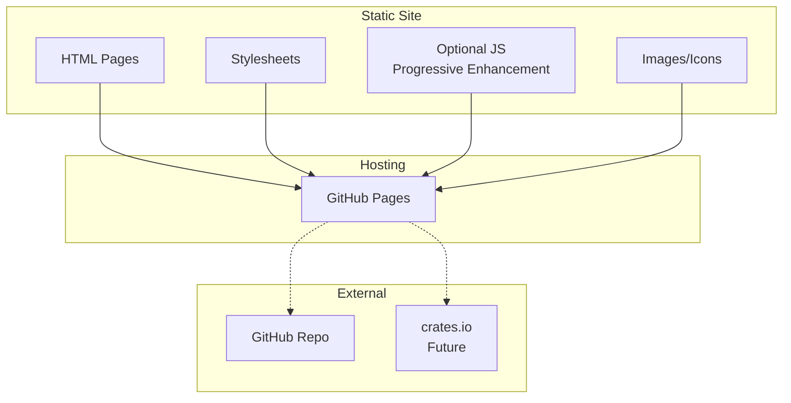

# Product Homepage Design - Product Requirements Document

## Executive Summary

### Problem Statement
MirDB is a capable persistent key-value store with memcached compatibility, but it currently lacks a public-facing homepage to communicate its value proposition, features, and usage information to potential users and the developer community.

### Proposed Solution
Create a professional, informative product homepage for MirDB that clearly communicates the product's unique value proposition (persistent storage with memcached compatibility), showcases key features, provides getting-started documentation, and builds credibility within the developer community.

### Expected Impact
- **User Acquisition**: Enable developers to discover and evaluate MirDB as a solution for their key-value storage needs
- **Brand Recognition**: Establish MirDB's identity as a modern, Rust-based alternative in the database ecosystem
- **Adoption Enablement**: Reduce friction for new users by providing clear documentation and quick-start guides
- **Community Building**: Foster an open-source community around the project

### Success Metrics
- Homepage successfully deployed and accessible
- All key product features clearly communicated
- Quick-start guide enables users to run MirDB within 5 minutes of visiting the page
- Page load time under 3 seconds on standard connections

---

## Requirements & Scope

### Functional Requirements

| ID | Requirement | Priority |
|----|-------------|----------|
| REQ-1 | Display product name, tagline, and logo prominently in hero section | Must |
| REQ-2 | Present key value propositions (persistence, memcached compatibility, LSM tree architecture) | Must |
| REQ-3 | Include a features section highlighting core capabilities | Must |
| REQ-4 | Provide a quick-start guide with installation and basic usage commands | Must |
| REQ-5 | Display supported memcached commands with examples | Should |
| REQ-6 | Include configuration documentation with common parameters | Should |
| REQ-7 | Show project status and roadmap (implemented vs planned features) | Should |
| REQ-8 | Provide navigation to GitHub repository | Must |
| REQ-9 | Include a footer with project links and licensing information | Must |
| REQ-10 | Support responsive design for mobile and desktop viewing | Must |
| REQ-11 | Display code snippets with syntax highlighting | Should |
| REQ-12 | Include a comparison section differentiating MirDB from standard memcached | Could |

### Non-Functional Requirements

| ID | Requirement | Priority |
|----|-------------|----------|
| NFR-1 | Page must load within 3 seconds on 3G connections | Must |
| NFR-2 | Must be accessible (WCAG 2.1 AA compliance) | Should |
| NFR-3 | Must support modern browsers (Chrome, Firefox, Safari, Edge - last 2 versions) | Must |
| NFR-4 | Must be SEO-optimized with proper meta tags and semantic HTML | Should |
| NFR-5 | Must be maintainable with clear content structure for future updates | Must |
| NFR-6 | Should support dark/light mode based on system preference | Could |

### Out of Scope
- User authentication or login functionality
- Interactive database demo or playground
- Blog or news section
- Community forum or discussion board
- Multi-language/internationalization support
- Analytics dashboard
- Download tracking

### Success Criteria
- All "Must" priority requirements implemented and verified
- Homepage passes Lighthouse performance audit with score >= 80
- Homepage passes accessibility audit with no critical issues
- Content accurately reflects current MirDB capabilities
- Quick-start guide tested and verified functional

---

## User Experience & Interface

### User Journey

1. **Discovery**: User arrives at homepage (via search, GitHub, or referral)
2. **Understanding**: User quickly grasps what MirDB is and why it's valuable (hero section)
3. **Evaluation**: User reviews features and compares to alternatives
4. **Decision**: User decides to try MirDB
5. **Action**: User follows quick-start guide to install and run MirDB
6. **Deep Dive**: User explores documentation for advanced configuration

### Page Structure

```
┌─────────────────────────────────────────────────────┐
│  Header: Logo | Navigation (Features | Docs | GitHub) │
├─────────────────────────────────────────────────────┤
│  Hero Section:                                        │
│  - Product name and tagline                          │
│  - Primary value proposition                         │
│  - CTA: Get Started / View on GitHub                 │
├─────────────────────────────────────────────────────┤
│  Value Propositions (3 columns):                     │
│  - Persistent Storage                                │
│  - Memcached Compatible                              │
│  - Written in Rust                                   │
├─────────────────────────────────────────────────────┤
│  Features Section:                                   │
│  - LSM Tree Architecture                             │
│  - Async I/O with Tokio                              │
│  - Configurable Parameters                           │
│  - Background Compaction                             │
├─────────────────────────────────────────────────────┤
│  Quick Start Section:                                │
│  - Installation commands                             │
│  - Basic usage examples                              │
│  - Configuration snippet                             │
├─────────────────────────────────────────────────────┤
│  Commands Reference (collapsible):                   │
│  - GET, SET, DELETE examples                         │
│  - MirDB-specific commands                           │
├─────────────────────────────────────────────────────┤
│  Footer:                                             │
│  - GitHub link                                       │
│  - License (MIT/Apache)                              │
│  - Version info                                      │
└─────────────────────────────────────────────────────┘
```

### Interface Requirements

- **Typography**: Clean, readable fonts (system fonts or web-safe alternatives for performance)
- **Color Scheme**: Professional palette that conveys reliability and technical competence
- **Code Blocks**: Monospace font with syntax highlighting for all code examples
- **Icons**: Minimal icon usage for visual scanning of features
- **Whitespace**: Generous spacing for readability and modern aesthetic

### Accessibility Considerations
- Sufficient color contrast ratios (4.5:1 for normal text)
- Keyboard navigation support for all interactive elements
- Alt text for all images
- Semantic HTML structure with proper heading hierarchy
- Skip-to-content link for screen readers

---

## Technical Considerations

### High-Level Technical Approach
The homepage should be implemented as a static site for optimal performance, minimal hosting requirements, and ease of maintenance. Static sites align well with open-source project homepages and can be easily hosted on GitHub Pages, Netlify, or similar platforms.

### Integration Points
- **GitHub Repository**: Link to source code and issue tracker
- **Package Registry**: Link to crates.io when published (future consideration)

### Key Technical Constraints
- Must work without JavaScript for core content (progressive enhancement)
- Should minimize external dependencies to reduce load time
- Must be compatible with static hosting platforms

### Performance Considerations
- Optimize images and use modern formats (WebP with fallbacks)
- Minimize CSS and avoid large frameworks if possible
- Lazy load below-fold content if needed
- Use system fonts or limit web font usage

---

## Design Specification

### Recommended Approach
Build a static, single-page website using a minimal static site generator or hand-crafted HTML/CSS. Focus on content clarity, fast load times, and easy maintenance. The site should prioritize developer experience with excellent code examples and clear documentation.

### Key Technical Decisions

#### 1. Static Site Technology
- **Options Considered**: Hand-crafted HTML/CSS, Jekyll, Hugo, Astro, 11ty
- **Tradeoffs**: Hand-crafted offers maximum control but harder maintenance; generators add build complexity but improve content management; modern generators (Astro) offer best performance but add tooling overhead
- **Recommendation**: Hugo or hand-crafted HTML/CSS - Hugo provides excellent performance and simple Markdown-based content updates, while hand-crafted works for a single-page site with infrequent changes

#### 2. Hosting Platform
- **Options Considered**: GitHub Pages, Netlify, Vercel, Cloudflare Pages
- **Tradeoffs**: GitHub Pages is simplest for open-source but limited features; Netlify/Vercel offer more features but add vendor dependency; Cloudflare offers best global performance
- **Recommendation**: GitHub Pages - integrates naturally with the existing GitHub repository, free, and sufficient for a static homepage

#### 3. Styling Approach
- **Options Considered**: Custom CSS, Tailwind CSS, CSS framework (Bootstrap, Bulma)
- **Tradeoffs**: Custom CSS offers smallest bundle but more effort; Tailwind provides utility-first approach with larger initial size; frameworks are fastest to build but often bloated
- **Recommendation**: Custom CSS or minimal Tailwind - prioritize small bundle size and maintainability over rapid development

### High-Level Architecture



### Key Considerations
- **Performance**: Static hosting with CDN ensures fast global delivery; minimal JavaScript keeps page interactive immediately
- **Security**: Static sites have minimal attack surface; no backend means no server vulnerabilities
- **Scalability**: Static hosting scales infinitely with no additional cost or configuration

### Risk Management
- **Content Accuracy Risk**: Product features may change; mitigate by structuring content to be easily updatable and linking to source documentation
- **Browser Compatibility Risk**: Older browsers may render inconsistently; mitigate by using progressive enhancement and testing across target browsers

### Success Criteria
- Page loads in under 2 seconds on fast connections
- All code examples are accurate and functional
- Site renders correctly on all target browsers and devices
- Content can be updated without developer assistance (if using SSG)

---

## User Stories

### Personas
- **Evaluating Developer**: A software engineer researching key-value stores for a new project
- **Migrating User**: A developer with existing memcached infrastructure looking for persistence
- **Open Source Contributor**: A Rust developer interested in contributing to the project

### Core Stories

#### US-1: Understand Product Value
**As an** evaluating developer
**I want to** quickly understand what MirDB is and why it's different
**So that** I can determine if it's worth investigating further

**Acceptance Criteria:**
- Given I land on the homepage, When the page loads, Then I see a clear tagline explaining MirDB within 2 seconds
- Given I am on the homepage, When I scroll down, Then I see the key differentiators (persistence, memcached compatibility, Rust)
- Given I want to learn more, When I look for navigation, Then I find clear links to features and documentation

**Priority**: Must
**Related Requirements**: REQ-1, REQ-2

#### US-2: Evaluate Features
**As an** evaluating developer
**I want to** see what features MirDB offers
**So that** I can compare it against my requirements

**Acceptance Criteria:**
- Given I navigate to the features section, When I view it, Then I see a comprehensive list of capabilities
- Given I want technical details, When I review features, Then I see information about the LSM tree architecture and compaction
- Given I need to know limitations, When I read the page, Then I find information about what is and isn't supported

**Priority**: Must
**Related Requirements**: REQ-3, REQ-7

#### US-3: Get Started Quickly
**As a** migrating user
**I want to** try MirDB quickly
**So that** I can validate it works with my existing memcached clients

**Acceptance Criteria:**
- Given I decide to try MirDB, When I look for setup instructions, Then I find a quick-start guide prominently displayed
- Given I follow the quick-start guide, When I execute the commands, Then MirDB runs successfully within 5 minutes
- Given I have MirDB running, When I try memcached commands, Then I can verify basic operations work

**Priority**: Must
**Related Requirements**: REQ-4, REQ-5, REQ-11

#### US-4: Explore Configuration Options
**As a** developer integrating MirDB
**I want to** understand configuration options
**So that** I can tune MirDB for my use case

**Acceptance Criteria:**
- Given I need to configure MirDB, When I look for documentation, Then I find configuration parameters explained
- Given I see a configuration option, When I read its description, Then I understand its purpose and default value
- Given I want to change settings, When I review the config format, Then I can create a valid configuration file

**Priority**: Should
**Related Requirements**: REQ-6

#### US-5: Access Source Code
**As an** open source contributor
**I want to** easily access the GitHub repository
**So that** I can review the code and potentially contribute

**Acceptance Criteria:**
- Given I want to see the source code, When I look for GitHub links, Then I find them in both header and footer
- Given I click a GitHub link, When the page loads, Then I am taken to the correct repository
- Given I want to contribute, When I visit GitHub, Then I find contribution guidelines

**Priority**: Must
**Related Requirements**: REQ-8, REQ-9

---

## Dependencies & Assumptions

### Dependencies
- **GitHub Repository**: Must exist and be accessible for linking
- **Domain/Hosting**: GitHub Pages or alternative hosting must be configured
- **Design Assets**: Logo and any custom graphics must be created or sourced

### Assumptions
- The project will remain open-source and freely accessible
- The memcached protocol implementation is stable and production-ready for basic operations
- Target users are developers comfortable with command-line tools
- English is sufficient for the initial version (no i18n required)

---

## Appendices

### Content Reference: Key Features to Highlight

**Core Value Propositions:**
1. **Persistent Storage** - Unlike memcached, MirDB persists data to disk
2. **Memcached Compatible** - Drop-in replacement using standard memcached protocol
3. **Written in Rust** - Memory safety, performance, and modern async I/O

**Technical Features:**
- LSM Tree architecture with configurable levels
- Async networking with Tokio
- Skip list-based memtable
- Automatic minor and major compaction
- Write-ahead logging for durability
- TOML-based configuration

**Supported Commands:**
- Storage: SET, ADD, REPLACE, APPEND, PREPEND
- Retrieval: GET, GETS
- Deletion: DELETE
- MirDB-specific: INFO, MAJOR_COMPACTION

### Quick-Start Content Outline

```bash
# Installation (when published to crates.io)
cargo install mirdb

# Or build from source
git clone https://github.com/[org]/mirdb
cd mirdb
cargo build --release

# Run with default configuration
./target/release/mirdb

# Connect with any memcached client
telnet localhost 12333
set hello 0 0 5
world
STORED
get hello
VALUE hello 0 5
world
END
```

### Default Configuration Reference

```toml
addr = "0.0.0.0:12333"
max_level = 7
work_dir = "/tmp/mirdb"
sst_max_size = "100M"
mem_table_max_size = "4M"
block_size = "4K"
```
