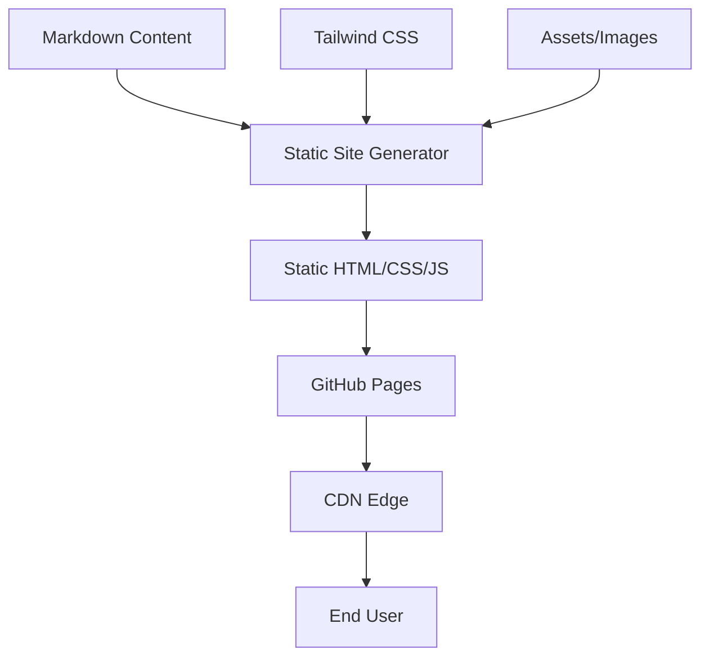

# Product Homepage Design - Product Requirements Document

## Executive Summary

### Problem Statement
MirDB is a feature-rich persistent key-value store with memcached compatibility, but it currently lacks a public-facing homepage to communicate its value proposition, features, and usage information to potential users and the developer community.

### Proposed Solution
Create a homepage for MirDB that effectively communicates the product's core value proposition (persistent key-value storage with memcached compatibility), highlights key features, provides getting started information, and establishes credibility within the developer community.

### Expected Impact
- **Increased Adoption**: Clear documentation and professional presentation will lower the barrier to entry for new users
- **Community Growth**: A well-designed homepage serves as the foundation for community building and contributions
- **Product Visibility**: Improved discoverability and professional presence in the database/storage ecosystem

### Success Metrics
- Homepage successfully deployed and accessible
- Key product information clearly communicated (features, installation, usage)
- Mobile-responsive design functioning across devices
- Page load time under 3 seconds

---

## Requirements & Scope

### Functional Requirements

| ID | Requirement | Priority |
|----|-------------|----------|
| REQ-1 | Display product name, tagline, and core value proposition prominently | Must Have |
| REQ-2 | Present key features section highlighting: Memcached compatibility, Data persistence, LSM Tree architecture | Must Have |
| REQ-3 | Provide quick start/installation instructions | Must Have |
| REQ-4 | Include code examples demonstrating basic usage (SET, GET, DELETE commands) | Must Have |
| REQ-5 | Display configuration options and defaults | Should Have |
| REQ-6 | Include navigation to documentation, GitHub repository, and community resources | Must Have |
| REQ-7 | Show project status indicating implemented and planned features | Should Have |
| REQ-8 | Provide comparison highlighting MirDB vs standard memcached (persistence advantage) | Could Have |
| REQ-9 | Include visual architecture diagram showing LSM tree data flow | Should Have |

### Non-Functional Requirements

| ID | Requirement | Priority |
|----|-------------|----------|
| NFR-1 | Page must be responsive and functional on mobile devices (320px+) | Must Have |
| NFR-2 | Page load time must be under 3 seconds on standard connections | Must Have |
| NFR-3 | Homepage must be accessible (WCAG 2.1 Level AA compliance) | Should Have |
| NFR-4 | Content must be easily maintainable without requiring code changes | Should Have |
| NFR-5 | Design must align with developer tool aesthetics (clean, technical, professional) | Must Have |

### Out of Scope
- User authentication or login functionality
- Interactive database playground or live demo environment
- Blog or news section
- Multi-language/internationalization support
- Analytics dashboard or usage tracking interface
- Community forum or discussion features

### Success Criteria
- All Must Have requirements implemented and verified
- Homepage renders correctly on Chrome, Firefox, Safari, and Edge
- Mobile responsiveness verified on iOS and Android devices
- All external links functional and pointing to correct destinations
- Code examples are syntactically correct and copy-pasteable

---

## User Experience & Interface

### Target Users
1. **Backend Developers**: Looking for a persistent caching solution with familiar memcached API
2. **DevOps Engineers**: Evaluating storage solutions for infrastructure
3. **Open Source Contributors**: Exploring Rust projects to contribute to

### User Journey

```
Landing → Understand Value Prop → Explore Features → Quick Start → Deeper Documentation
    │              │                    │                │              │
    └──────────────┴────────────────────┴────────────────┴──────────────┘
                        Single-page scrolling experience
```

### Interface Requirements

**Hero Section**
- Product name: "MirDB"
- Tagline emphasizing: "Persistent Key-Value Store with Memcached Protocol"
- Primary CTA: "Get Started" / "View on GitHub"
- Optional: Terminal animation showing basic commands

**Features Section**
- Visual cards for each major feature:
  - Memcached Protocol Support (familiar API)
  - Data Persistence (survives restarts)
  - LSM Tree Architecture (efficient storage)
  - Rust Performance (fast and safe)

**Quick Start Section**
- Installation command
- Basic configuration example
- Simple usage example with SET/GET

**Architecture Section**
- Visual diagram of data flow (Write → WAL → Memtable → SSTable levels)
- Brief explanation of LSM tree benefits

**Footer**
- Links to: GitHub, Documentation, License
- Project status/version information

### Accessibility Considerations
- Semantic HTML structure with proper heading hierarchy
- Sufficient color contrast ratios (4.5:1 minimum)
- Keyboard navigation support
- Alt text for all images and diagrams
- Screen reader compatible code blocks

---

## Technical Considerations

### High-Level Approach
Static site implementation that can be hosted on GitHub Pages, Netlify, or similar platforms, minimizing operational overhead while providing fast load times and easy maintenance.

### Integration Points
- GitHub repository for source code links
- Package registry (crates.io) for installation instructions
- External documentation (if separate docs site exists)

### Key Technical Constraints
- Must work without backend server (static hosting)
- Should not require build tools for content updates (Markdown/config-based content preferred)
- Must support syntax highlighting for Rust and shell code examples

### Performance Considerations
- Minimize external dependencies and third-party scripts
- Optimize images and use modern formats (WebP with fallbacks)
- Implement lazy loading for below-fold content
- Consider critical CSS inlining for above-fold content

---

## Design Specification

### Recommended Approach
Single-page static website with clear sections for value proposition, features, quick start guide, and architecture overview. Prioritize simplicity and fast loading over complex interactivity.

### Key Technical Decisions

#### 1. Static Site Generator vs Plain HTML
- **Options Considered**: Plain HTML/CSS, Hugo, Astro, Next.js Static Export
- **Tradeoffs**: Plain HTML is simplest but harder to maintain; SSGs add build complexity but improve maintainability; React-based options may be overkill for a simple homepage
- **Recommendation**: Hugo or Astro for balance of simplicity and Markdown-based content management

#### 2. Styling Approach
- **Options Considered**: Custom CSS, Tailwind CSS, CSS Framework (Bootstrap/Bulma)
- **Tradeoffs**: Custom CSS offers full control but more effort; Tailwind provides utility-first rapid development; Frameworks may include unused styles
- **Recommendation**: Tailwind CSS for efficient development and small bundle size with purging

#### 3. Hosting Platform
- **Options Considered**: GitHub Pages, Netlify, Vercel, Cloudflare Pages
- **Tradeoffs**: GitHub Pages is free and integrated but limited features; Netlify/Vercel offer more features but add external dependency
- **Recommendation**: GitHub Pages for simplicity and alignment with project's GitHub presence

#### 4. Code Syntax Highlighting
- **Options Considered**: Prism.js, highlight.js, Shiki, built-in SSG highlighting
- **Tradeoffs**: Runtime highlighting increases page load; build-time highlighting is faster but requires build step
- **Recommendation**: Build-time syntax highlighting via SSG for optimal performance

### High-Level Architecture



### Key Considerations
- **Performance**: Build-time rendering ensures sub-second page loads; no runtime JavaScript required for core content
- **Security**: Static site eliminates server-side vulnerabilities; content served over HTTPS via CDN
- **Scalability**: CDN distribution handles traffic spikes without infrastructure concerns

### Risk Management
- **Content Maintenance Risk**: If content becomes stale, it damages credibility. Mitigation: Use Markdown files that non-developers can update, establish content review cadence.
- **Browser Compatibility Risk**: Modern CSS features may not work in older browsers. Mitigation: Test across browser matrix, use progressive enhancement.

### Success Criteria
- Page loads in under 2 seconds on 3G connection
- Lighthouse performance score above 90
- All content accurately reflects current MirDB capabilities
- Design is visually consistent with developer tool aesthetics

---

## Dependencies & Assumptions

### Dependencies
- GitHub repository access for hosting configuration
- Domain/subdomain availability (if custom domain desired)
- Access to product assets (logo, diagrams if pre-existing)

### Assumptions
- MirDB project maintainers will review and approve content
- No existing brand guidelines or design system to conform to
- English-only content is acceptable for initial release
- Current feature set as documented in knowledge base is accurate

### Cross-Team Coordination
- Project maintainers for content approval and accuracy verification
- Repository admin access for GitHub Pages setup (if applicable)

---

## Appendices

### Content Reference: Key Product Information

**Core Value Proposition**
MirDB is a persistent key-value store that speaks the memcached protocol, giving you the simplicity of memcached with the durability of disk-backed storage.

**Key Differentiators**
1. Drop-in memcached compatibility - use existing clients
2. Data survives restarts - no cold cache problem
3. Efficient LSM tree storage - optimized for write-heavy workloads
4. Written in Rust - memory safe and performant

**Default Configuration Highlights**
- Port: 12333
- Storage: /tmp/mirdb (configurable)
- Memtable: 4MB before flush
- SSTable: Up to 100MB per file
- Levels: 7 LSM tree levels

**Supported Commands**
- Storage: SET, ADD, REPLACE, APPEND, PREPEND
- Retrieval: GET, GETS
- Management: DELETE, INFO, MAJOR_COMPACTION
