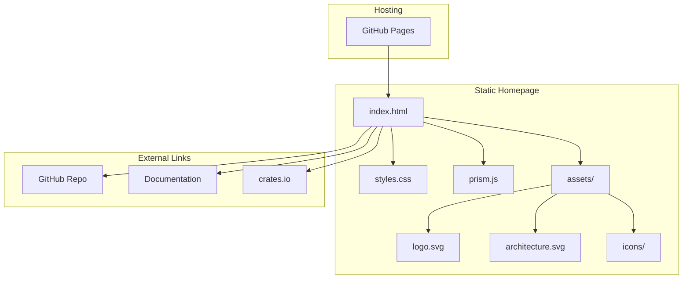

# Product Homepage Design - Product Requirements Document

## Executive Summary

### Problem Statement
MirDB is a powerful persistent key-value store with memcached protocol support, but it currently lacks a web presence to communicate its value proposition, features, and usage information to potential users. Without a homepage, developers cannot easily discover, evaluate, or learn how to adopt MirDB for their projects.

### Proposed Solution
Create a modern, informative product homepage that showcases MirDB's unique capabilities as a persistent memcached-compatible database. The homepage will serve as the primary entry point for developers to learn about MirDB, understand its architecture, and get started with implementation.

### Expected Impact
- **Increased Adoption**: Clear communication of MirDB's value proposition will attract developers looking for persistent key-value storage solutions
- **Reduced Onboarding Friction**: Comprehensive documentation and quick-start guides will accelerate developer adoption
- **Enhanced Credibility**: A professional web presence establishes MirDB as a mature, production-ready solution
- **Community Growth**: Clear contribution guidelines and project visibility will encourage open-source contributions

### Success Metrics
- Homepage successfully deployed and accessible
- Clear communication of all key product features
- Functional navigation to documentation and getting started resources
- Mobile-responsive design working across devices

---

## Requirements & Scope

### Functional Requirements

| ID | Requirement | Priority |
|----|-------------|----------|
| REQ-1 | Display product name, tagline, and value proposition prominently in hero section | Must Have |
| REQ-2 | Present key features (Memcached compatibility, persistence, LSM tree architecture) in an organized feature section | Must Have |
| REQ-3 | Include code examples showing basic usage (connection, SET, GET operations) | Must Have |
| REQ-4 | Provide clear call-to-action buttons for getting started and documentation | Must Have |
| REQ-5 | Display architecture overview with visual diagram explaining LSM tree data flow | Should Have |
| REQ-6 | Show configuration options and parameters in a readable format | Should Have |
| REQ-7 | Include supported memcached commands reference | Should Have |
| REQ-8 | Provide installation/quick-start instructions | Must Have |
| REQ-9 | Link to GitHub repository for source code access | Must Have |
| REQ-10 | Display project status indicating implemented vs. planned features | Should Have |

### Non-Functional Requirements

| ID | Requirement | Priority |
|----|-------------|----------|
| NFR-1 | Page must load within 3 seconds on standard broadband connection | Must Have |
| NFR-2 | Design must be responsive and functional on mobile devices (320px+) | Must Have |
| NFR-3 | Page must be accessible following WCAG 2.1 AA guidelines | Should Have |
| NFR-4 | Homepage must work without JavaScript for core content visibility | Should Have |
| NFR-5 | Code syntax highlighting must be readable in both light and dark contexts | Should Have |
| NFR-6 | Static site with no server-side dependencies for easy hosting | Must Have |

### Out of Scope
- User authentication or account management
- Interactive database playground or sandbox environment
- Blog or news section
- Multi-language internationalization
- Analytics dashboard or usage tracking implementation
- Community forum integration
- Automated documentation generation from source code

### Success Criteria
- All Must Have requirements implemented and verified
- Homepage renders correctly on Chrome, Firefox, Safari, and Edge
- Mobile layout verified on iOS and Android devices
- All navigation links functional and pointing to correct destinations
- Code examples syntactically correct and copy-paste ready

---

## User Experience & Interface

### Target User Personas
1. **Backend Developer**: Evaluating database solutions for caching with persistence needs
2. **DevOps Engineer**: Looking for memcached-compatible storage with durability
3. **Technical Architect**: Researching LSM tree implementations and storage engines
4. **Open Source Contributor**: Exploring Rust projects to contribute to

### User Journey

```
Landing → Hero Section → Feature Overview → Code Examples → Getting Started → GitHub/Docs
```

1. **Discovery**: User arrives at homepage from search or referral
2. **Understanding**: Hero section communicates what MirDB is and why it matters
3. **Evaluation**: Feature section and architecture diagram help user assess fit
4. **Validation**: Code examples demonstrate simplicity and memcached compatibility
5. **Action**: Clear CTAs guide user to installation or deeper documentation

### Interface Requirements

#### Hero Section
- Product logo/name prominently displayed
- Concise tagline: "Persistent Key-Value Store with Memcached Protocol"
- Brief description (2-3 sentences) explaining the value proposition
- Primary CTA: "Get Started"
- Secondary CTA: "View on GitHub"

#### Features Section
- Three primary feature cards:
  1. **Memcached Compatible**: Drop-in replacement using standard protocol
  2. **Persistent Storage**: Data survives restarts with SSTable storage
  3. **High Performance**: LSM tree architecture with async I/O
- Each card includes icon, title, and brief description

#### Code Example Section
- Tabbed or sequential code blocks showing:
  - Connection example (using standard memcached client)
  - SET operation
  - GET operation
- Syntax highlighting for shell/code
- Copy-to-clipboard functionality

#### Architecture Section
- Visual diagram showing LSM tree data flow
- Brief explanation of write path and read path
- Highlight durability guarantees (WAL, compaction)

#### Getting Started Section
- Installation command (cargo install or build from source)
- Basic configuration snippet
- Link to full documentation

#### Footer
- GitHub repository link
- License information (if applicable)
- Version/release information

### Accessibility Considerations
- Semantic HTML structure with proper heading hierarchy
- Alt text for all images and diagrams
- Sufficient color contrast (4.5:1 minimum for text)
- Keyboard navigable interface
- Screen reader compatible navigation

---

## Technical Considerations

### Technology Approach
The homepage should be implemented as a static site to ensure:
- Simple deployment on GitHub Pages, Netlify, or similar platforms
- No server-side infrastructure required
- Fast load times with minimal dependencies
- Easy maintenance and updates

### Integration Points
- **GitHub Repository**: Links to source code, issues, and releases
- **Documentation**: Links to README or separate docs site if available
- **Package Registry**: Link to crates.io for Rust package installation

### Key Technical Constraints
- Must be hostable on static file servers (no SSR requirements)
- Should minimize external dependencies to reduce maintenance burden
- Code examples must be accurate and match current MirDB implementation
- Diagrams should be SVG or similar for crisp rendering at all sizes

### Performance Considerations
- Optimize images and assets for web delivery
- Minimize CSS/JS bundle sizes
- Consider lazy loading for below-fold content
- Use modern image formats (WebP) with fallbacks

---

## Design Specification

### Recommended Approach
Build a single-page static website using modern HTML/CSS with minimal JavaScript, focusing on clean typography, clear information hierarchy, and developer-friendly aesthetics that align with technical/database product conventions.

### Key Technical Decisions

#### 1. Framework/Build Approach
- **Options Considered**: Plain HTML/CSS, Static Site Generator (Hugo/Jekyll), React-based (Next.js/Gatsby)
- **Tradeoffs**: Plain HTML offers simplicity but harder to maintain; SSG provides templating with build step; React adds complexity but enables interactivity
- **Recommendation**: Plain HTML/CSS with optional build tooling for asset optimization - minimizes dependencies while maintaining simplicity for a single-page site

#### 2. Styling Approach
- **Options Considered**: Vanilla CSS, Tailwind CSS, CSS Framework (Bootstrap), CSS-in-JS
- **Tradeoffs**: Vanilla CSS has no dependencies but more verbose; Tailwind is utility-first but requires build; Bootstrap provides components but may feel generic
- **Recommendation**: Vanilla CSS with CSS custom properties (variables) - keeps dependencies minimal while enabling theming and maintainability

#### 3. Code Syntax Highlighting
- **Options Considered**: Prism.js, Highlight.js, Pre-rendered highlighting, No highlighting
- **Tradeoffs**: JS libraries add weight but provide flexibility; pre-rendered is lighter but harder to update
- **Recommendation**: Prism.js with minimal language support (bash, rust) - lightweight, widely used, and provides good developer experience

#### 4. Diagram Rendering
- **Options Considered**: Static SVG images, Mermaid.js, ASCII art, Image files (PNG)
- **Tradeoffs**: SVG is crisp and editable; Mermaid requires JS but is maintainable; ASCII is universal but limited
- **Recommendation**: Static SVG for architecture diagram - allows precise control, scales perfectly, and requires no runtime dependencies

### High-Level Architecture



### Key Considerations
- **Performance**: Static files with minimal JS ensure fast initial load; consider inlining critical CSS for above-fold content to eliminate render-blocking requests
- **Security**: Static site with no user input or server-side processing minimizes attack surface; ensure external links use rel="noopener noreferrer"
- **Scalability**: Static hosting scales infinitely with CDN distribution; no server resources to manage or scale

### Risk Management
- **Content Accuracy Risk**: Code examples may become outdated as MirDB evolves; mitigate by sourcing examples from actual project documentation and establishing review process for updates
- **Browser Compatibility Risk**: Modern CSS features may not work in older browsers; mitigate by using progressive enhancement and testing across target browsers
- **Maintenance Burden Risk**: Standalone HTML may become difficult to update; mitigate by using clear code organization and comments, consider migration to SSG if content grows

### Success Criteria
- Homepage loads in under 3 seconds on 3G connection
- Lighthouse performance score of 90+
- All code examples execute correctly when copied
- Design renders consistently across Chrome, Firefox, Safari, Edge

---

## Dependencies & Assumptions

### Dependencies
- **GitHub Repository**: MirDB source code repository must be publicly accessible for linking
- **Hosting Platform**: Requires static hosting solution (GitHub Pages recommended)
- **Design Assets**: Logo and icons need to be created or sourced

### Assumptions
- MirDB project maintainers will review and approve homepage content for accuracy
- GitHub Pages or equivalent free static hosting is acceptable
- No authentication or dynamic content is required for initial release
- English-only content is sufficient for initial launch
- Current MirDB documentation (README, etc.) provides accurate technical details

### Cross-Team Coordination
- **MirDB Maintainers**: Content review and approval for technical accuracy
- **Design Resources**: Logo and visual asset creation (if not existing)

---

## Appendices

### A. Content Reference - MirDB Key Features

**For Hero Section:**
> MirDB is a persistent key-value store written in Rust that implements the Memcached protocol. Unlike traditional memcached, MirDB persists your data to disk using an LSM tree architecture, giving you the familiar memcached interface with the durability you need.

**For Features:**
1. Memcached Protocol Support - Connect using any standard memcached client
2. Persistent Storage - Data survives restarts with SSTable-based storage
3. LSM Tree Architecture - Efficient writes with background compaction
4. Async I/O - Built on Tokio for high-performance networking
5. Configurable - Tune memory tables, block sizes, and compaction triggers

**Supported Commands:**
- Storage: SET, ADD, REPLACE, APPEND, PREPEND
- Retrieval: GET, GETS
- Deletion: DELETE
- Admin: INFO, MAJOR_COMPACTION

### B. Example Code Snippets

**Connection (Python memcache client):**
```python
import memcache
mc = memcache.Client(['127.0.0.1:12333'])
```

**Basic Operations:**
```python
# Store a value
mc.set('user:1', 'John Doe')

# Retrieve a value
user = mc.get('user:1')
print(user)  # Output: John Doe

# Delete a value
mc.delete('user:1')
```

**Installation:**
```bash
# Clone and build from source
git clone https://github.com/user/mirdb
cd mirdb
cargo build --release

# Run with configuration
./target/release/mirdb -c etc/mirdb.toml
```

### C. Architecture Diagram Description

The homepage should include a visual representation of the LSM tree data flow:

```
Write Request → WAL → Memtable → Immutable Memtables → Level 0 SSTs → Level 1+ SSTs
                ↓
           (durability)
```

Key points to visualize:
- Write path showing WAL for durability before memtable
- Memtable flush to immutable state
- Minor compaction from immutable memtables to Level 0
- Major compaction between SSTable levels
- Read path checking memtable first, then SSTables by level
