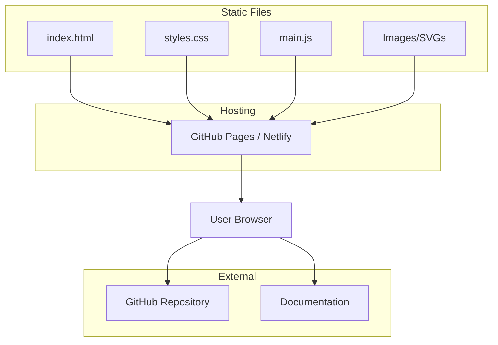

# MirDB Product Homepage Design - Product Requirements Document

## Executive Summary

### Problem Statement
MirDB is a feature-rich persistent key-value store with memcached compatibility, but lacks a web presence to showcase its capabilities, attract users, and provide documentation access. Without a homepage, potential users cannot easily discover the product's value proposition, features, or how to get started.

### Proposed Solution
Create a product homepage for MirDB that effectively communicates its unique value proposition as a persistent key-value store with memcached protocol support. The homepage will serve as the primary marketing and information hub for the product.

### Expected Impact
- **User Acquisition**: Increased visibility and discoverability for potential users seeking memcached-compatible storage solutions
- **Developer Adoption**: Clear documentation and getting-started guidance to reduce time-to-first-use
- **Brand Establishment**: Professional web presence positioning MirDB as a reliable, production-ready solution

### Success Metrics
- Homepage successfully deployed and accessible
- Clear communication of MirDB's three core value propositions
- Users can find installation and usage instructions within 30 seconds
- Page loads within 3 seconds on standard connections

---

## Requirements & Scope

### Functional Requirements

| ID | Requirement | Priority |
|----|-------------|----------|
| REQ-1 | Display product name (MirDB) and tagline prominently in hero section | Must |
| REQ-2 | Present three core value propositions: Memcached compatibility, persistence, and LSM tree architecture | Must |
| REQ-3 | Include a "Getting Started" section with installation and basic usage instructions | Must |
| REQ-4 | Display supported memcached commands (SET, GET, DELETE, etc.) | Should |
| REQ-5 | Show configuration examples with common parameters | Should |
| REQ-6 | Provide navigation to external resources (GitHub repository, documentation) | Must |
| REQ-7 | Include a feature comparison section highlighting MirDB vs standard memcached | Should |
| REQ-8 | Display current project status (implemented features and roadmap) | Could |
| REQ-9 | Show architecture diagram illustrating LSM tree data flow | Could |
| REQ-10 | Include code snippets demonstrating client connection examples | Should |

### Non-Functional Requirements

| ID | Requirement | Priority |
|----|-------------|----------|
| NFR-1 | Page must be fully responsive across mobile, tablet, and desktop viewports | Must |
| NFR-2 | Page must load in under 3 seconds on 3G connections | Must |
| NFR-3 | Page must be accessible (WCAG 2.1 AA compliance) | Should |
| NFR-4 | Page must be static (no server-side rendering required) | Must |
| NFR-5 | Page must be SEO-optimized with proper meta tags and semantic HTML | Should |
| NFR-6 | Design must support dark mode | Could |

### Out of Scope
- User authentication or accounts
- Interactive database demos or sandboxes
- Dynamic content management system (CMS)
- Blog or news section
- Community forum integration
- Multi-language support (English only for initial release)
- Analytics dashboard (though basic analytics tracking may be added)

### Success Criteria
- All "Must" priority requirements implemented and verified
- Homepage passes Lighthouse performance score of 80+
- Homepage passes Lighthouse accessibility score of 80+
- Content accurately represents MirDB's current capabilities

---

## User Experience & Interface

### Target Users
1. **Software Engineers**: Seeking a memcached-compatible storage solution with persistence
2. **DevOps Engineers**: Evaluating infrastructure components for their stack
3. **Technical Decision Makers**: Comparing database solutions for their projects

### User Journey

```
Landing → Read Value Proposition → Explore Features → View Getting Started → Take Action (GitHub/Install)
```

### Key Sections (Top to Bottom)

1. **Hero Section**
   - Product name and logo
   - Tagline: "Persistent Key-Value Store with Memcached Protocol"
   - Primary CTA: "Get Started" button
   - Secondary CTA: "View on GitHub" button

2. **Value Propositions**
   - Three-column layout highlighting:
     - Memcached Protocol Compatibility
     - Data Persistence with SSTables
     - LSM Tree Architecture

3. **Features Overview**
   - Supported commands with examples
   - Configuration highlights
   - Performance characteristics

4. **Getting Started**
   - Installation command
   - Basic usage example
   - Configuration snippet

5. **Architecture Overview**
   - Visual diagram of LSM tree data flow
   - Brief explanation of components

6. **Footer**
   - GitHub link
   - Documentation link
   - License information

### Accessibility Considerations
- Proper heading hierarchy (h1 → h2 → h3)
- Alt text for all images and diagrams
- Sufficient color contrast ratios
- Keyboard navigation support
- Screen reader compatible

---

## Technical Considerations

### High-Level Technical Approach
The homepage will be implemented as a static website using modern front-end technologies, ensuring fast load times, easy maintenance, and simple deployment without server-side infrastructure requirements.

### Technology Constraints
- Must be deployable to static hosting platforms (GitHub Pages, Netlify, Vercel)
- Should use minimal external dependencies to reduce bundle size
- Code syntax highlighting required for code examples
- Mermaid or similar for architecture diagrams

### Integration Points
- GitHub repository (external link)
- Future documentation site (placeholder link)

### Performance Considerations
- Optimize images using modern formats (WebP with fallbacks)
- Minimize CSS and JavaScript bundle sizes
- Implement lazy loading for below-fold content
- Use system fonts or minimal web font loading

---

## Design Specification

### Recommended Approach
Build a single-page static website using HTML, CSS, and minimal JavaScript. Focus on clean typography, clear visual hierarchy, and fast performance. The design should convey technical credibility while remaining approachable.

### Key Technical Decisions

#### 1. Static Site Generation vs. Plain HTML
- **Options Considered**: Plain HTML/CSS, Static Site Generator (Hugo, Eleventy), React-based (Next.js, Gatsby)
- **Tradeoffs**: Plain HTML offers simplicity and zero build complexity but harder to maintain; SSG provides templating and component reuse but adds tooling; React-based offers rich interactivity but overkill for a single page
- **Recommendation**: Plain HTML/CSS with optional CSS framework (Tailwind) for faster development and zero runtime dependencies

#### 2. Styling Approach
- **Options Considered**: Custom CSS, Tailwind CSS, Bootstrap, CSS-in-JS
- **Tradeoffs**: Custom CSS offers full control but slower development; Tailwind provides utility-first rapid development; Bootstrap may feel generic; CSS-in-JS requires JavaScript runtime
- **Recommendation**: Tailwind CSS via CDN or custom CSS - balances development speed with performance

#### 3. Code Highlighting
- **Options Considered**: Prism.js, highlight.js, Shiki, pre-rendered syntax highlighting
- **Tradeoffs**: Runtime libraries add JS weight; pre-rendered avoids runtime cost but requires build step
- **Recommendation**: Prism.js for lightweight runtime highlighting with lazy loading

#### 4. Diagram Rendering
- **Options Considered**: Static SVG images, Mermaid.js runtime, Pre-rendered Mermaid
- **Tradeoffs**: Static SVGs need manual updates; Mermaid runtime adds ~200KB; Pre-rendered offers best of both
- **Recommendation**: Static SVG for architecture diagram - cleaner and no runtime dependency

### High-Level Architecture



### Key Considerations
- **Performance**: Static assets with aggressive caching, lazy loading for non-critical content, optimized images under 100KB total
- **Security**: No user input handling, external links open in new tabs with `rel="noopener"`, no third-party scripts beyond code highlighting
- **Scalability**: Static hosting scales infinitely at minimal cost; CDN distribution handles traffic spikes automatically

### Risk Management
- **Browser Compatibility Risk**: Older browsers may not support modern CSS features; mitigate with progressive enhancement and CSS fallbacks
- **Content Accuracy Risk**: Homepage content may drift from actual product capabilities; mitigate by sourcing content from knowledge base and README

### Success Criteria
- Lighthouse Performance score ≥ 80
- Lighthouse Accessibility score ≥ 80
- All functional requirements with "Must" priority implemented
- Page renders correctly on Chrome, Firefox, Safari, and Edge

---

## Dependencies & Assumptions

### Dependencies
- MirDB GitHub repository must be public and accessible for linking
- Product logo/branding assets must be available or created
- Architecture diagram content approved by project maintainers

### Assumptions
- English is the only required language for initial release
- GitHub Pages or similar free static hosting will be used
- No custom domain is required for initial release (can use github.io subdomain)
- Product documentation is separate from the homepage (linked externally)
- Current feature set as documented in knowledge base is accurate

---

## Appendices

### A. MirDB Feature Reference

**Supported Memcached Commands:**
- Storage: `SET`, `ADD`, `REPLACE`, `APPEND`, `PREPEND`
- Retrieval: `GET`, `GETS`
- Deletion: `DELETE`
- MirDB-specific: `INFO`, `MAJOR_COMPACTION`

**Default Configuration:**
```toml
addr = "0.0.0.0:12333"
max_level = 7
work_dir = "/tmp/mirdb"
sst_max_size = "100M"
mem_table_max_size = "4M"
block_size = "4K"
```

### B. Content Outline

**Hero Tagline Options:**
1. "Persistent Key-Value Store with Memcached Protocol"
2. "Memcached Compatible. Persistent by Design."
3. "The Key-Value Store That Remembers"

**Value Proposition Copy:**

1. **Drop-in Memcached Compatibility**
   - Use existing memcached clients
   - Standard text protocol support
   - Zero code changes required

2. **Built-in Persistence**
   - Data survives restarts
   - SSTable-based storage
   - Write-ahead logging

3. **LSM Tree Architecture**
   - Optimized for write-heavy workloads
   - Automatic compaction
   - Configurable performance tuning
