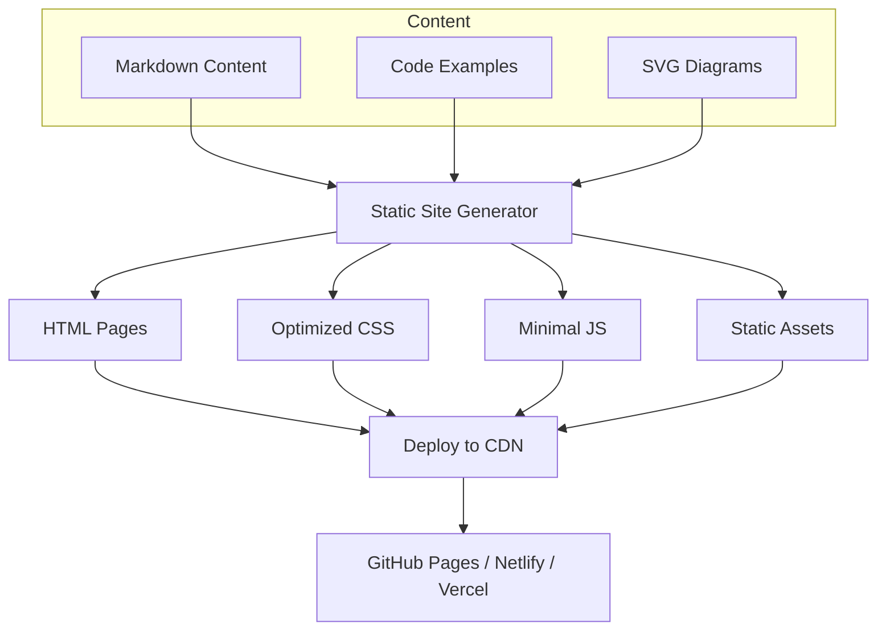

# Product Homepage Design - Product Requirements Document

## Executive Summary

### Problem Statement
MirDB is a high-performance persistent key-value store with Memcached protocol compatibility, but it currently lacks a product homepage to communicate its value proposition, features, and usage information to potential users and adopters.

### Proposed Solution
Create a dedicated product homepage for MirDB that effectively communicates the product's core value proposition (persistent Memcached-compatible key-value store), highlights key features and architecture, provides quick-start documentation, and establishes brand identity.

### Expected Impact
- **User Acquisition**: Enable developers to quickly understand MirDB's benefits and get started
- **Brand Awareness**: Establish MirDB's identity in the key-value store ecosystem
- **Developer Experience**: Reduce time-to-first-use through clear documentation and examples
- **Community Building**: Create a foundation for community engagement and contributions

### Success Metrics
- Homepage loads in under 3 seconds on standard connections
- Users can understand MirDB's value proposition within 30 seconds of landing
- Quick-start guide enables first successful connection within 5 minutes
- Mobile-responsive design with consistent experience across devices

---

## Requirements & Scope

### Functional Requirements

| ID | Requirement | Priority |
|----|-------------|----------|
| REQ-1 | Display hero section with product name, tagline, and primary call-to-action | Must |
| REQ-2 | Present key features (Memcached compatibility, persistence, LSM architecture) in scannable format | Must |
| REQ-3 | Include quick-start code examples showing connection and basic operations | Must |
| REQ-4 | Show architecture overview with visual diagram | Should |
| REQ-5 | Display configuration options and supported commands | Should |
| REQ-6 | Provide navigation to documentation, GitHub repository, and community resources | Must |
| REQ-7 | Include footer with project license, attribution, and relevant links | Must |
| REQ-8 | Support light/dark theme toggle | Could |
| REQ-9 | Include performance benchmarks or comparison section | Could |

### Non-Functional Requirements

| ID | Requirement | Priority |
|----|-------------|----------|
| NFR-1 | Page must load within 3 seconds on 3G connections | Must |
| NFR-2 | Achieve Lighthouse performance score of 90+ | Should |
| NFR-3 | Fully responsive across mobile, tablet, and desktop viewports | Must |
| NFR-4 | Meet WCAG 2.1 AA accessibility standards | Must |
| NFR-5 | Support all modern browsers (Chrome, Firefox, Safari, Edge - last 2 versions) | Must |
| NFR-6 | Static site with no server-side dependencies for easy hosting | Should |

### Out of Scope
- Interactive database playground or live demo environment
- User authentication or account management
- Blog or news section
- Internationalization/localization
- Analytics dashboard or admin interface

### Success Criteria
- All Must-priority requirements implemented and verified
- Cross-browser and responsive design testing completed
- Accessibility audit passes WCAG 2.1 AA criteria
- Page performance meets NFR-1 and NFR-2 thresholds
- Content accurately reflects current MirDB capabilities

---

## User Stories

### Personas
- **Prospective User**: Developer evaluating key-value store options for their project
- **New User**: Developer who has decided to try MirDB and needs to get started
- **Returning Visitor**: Developer seeking reference documentation or configuration details

### Core Stories

#### US-1: Understand Product Value Proposition
**As a** prospective user
**I want to** quickly understand what MirDB is and why I should use it
**So that** I can determine if it fits my project needs

**Priority**: Must
**Related Requirements**: REQ-1, REQ-2

**Acceptance Criteria**:
- Given I land on the homepage
- When I view the hero section
- Then I see the product name, a clear tagline explaining the core value (persistent Memcached-compatible key-value store), and a primary call-to-action button

---

#### US-2: Explore Key Features
**As a** prospective user
**I want to** see the main features and capabilities of MirDB
**So that** I can evaluate its technical fit for my use case

**Priority**: Must
**Related Requirements**: REQ-2, REQ-4

**Acceptance Criteria**:
- Given I am on the homepage
- When I scroll to the features section
- Then I see clearly presented features including Memcached protocol support, data persistence, and LSM tree architecture with brief explanations

---

#### US-3: Quick Start with Code Examples
**As a** new user
**I want to** see working code examples for connecting and using MirDB
**So that** I can start integrating it into my project immediately

**Priority**: Must
**Related Requirements**: REQ-3

**Acceptance Criteria**:
- Given I am on the homepage
- When I navigate to the quick-start section
- Then I see code examples showing how to connect to MirDB, perform SET/GET operations, and verify the connection using standard memcached clients

---

#### US-4: Access Documentation and Resources
**As a** new or returning user
**I want to** easily find documentation, source code, and community resources
**So that** I can learn more or contribute to the project

**Priority**: Must
**Related Requirements**: REQ-6, REQ-7

**Acceptance Criteria**:
- Given I am on any section of the homepage
- When I look for navigation elements
- Then I can find links to full documentation, GitHub repository, and community channels within 2 clicks

---

#### US-5: View Architecture Overview
**As a** prospective user with technical background
**I want to** understand how MirDB works under the hood
**So that** I can assess its reliability and performance characteristics

**Priority**: Should
**Related Requirements**: REQ-4

**Acceptance Criteria**:
- Given I am on the homepage
- When I navigate to the architecture section
- Then I see a visual diagram showing the LSM tree data flow (Write → WAL → Memtable → SSTable levels) with brief explanations

---

#### US-6: Mobile-Friendly Experience
**As a** user accessing from a mobile device
**I want to** have a fully functional and readable experience
**So that** I can evaluate MirDB on any device

**Priority**: Must
**Related Requirements**: NFR-3

**Acceptance Criteria**:
- Given I access the homepage from a mobile device
- When I view and interact with the page
- Then all content is readable without horizontal scrolling, navigation is accessible via mobile menu, and all interactive elements are touch-friendly

---

## User Experience & Interface

### User Journey

1. **Discovery**: User lands on homepage from search, link, or direct navigation
2. **Comprehension**: User reads hero section and understands core value proposition
3. **Exploration**: User scrolls through features and architecture sections
4. **Action**: User either:
   - Follows quick-start to try MirDB immediately
   - Navigates to documentation for deeper learning
   - Visits GitHub to explore source code
5. **Return**: User bookmarks page or remembers URL for future reference

### Interface Requirements

#### Layout Structure
- **Header**: Navigation bar with logo, section links, and GitHub/documentation links
- **Hero Section**: Product name, tagline, description, and primary CTA
- **Features Section**: Grid or card-based layout highlighting 3-4 key features
- **Architecture Section**: Visual diagram with accompanying explanations
- **Quick Start Section**: Code blocks with syntax highlighting and copy functionality
- **Configuration Section**: Table or list of key configuration options
- **Footer**: License, links, and project attribution

#### Visual Design Guidelines
- Clean, developer-focused aesthetic
- High contrast for readability
- Syntax-highlighted code blocks with copy-to-clipboard functionality
- Consistent spacing and typography hierarchy
- Visual indicators for interactive elements

### Accessibility Considerations
- Semantic HTML structure with proper heading hierarchy
- Alt text for all images and diagrams
- Keyboard navigation support for all interactive elements
- Sufficient color contrast ratios (4.5:1 minimum for text)
- Focus indicators for keyboard users
- Screen reader compatible content structure

---

## Technical Considerations

### High-Level Approach
Build a static, single-page website using modern web technologies that prioritizes performance, accessibility, and maintainability. The site should be deployable to any static hosting platform (GitHub Pages, Netlify, Vercel, etc.).

### Integration Points
- **GitHub Repository**: Links to source code, issues, and releases
- **Documentation**: Links to or embedded quick-start documentation
- **Package Registries**: Links to crates.io for Rust package

### Key Technical Constraints
- Must function as a purely static site with no server-side requirements
- All assets must be optimized for fast loading
- Code examples must be accurate and tested against current MirDB version
- Content must be easily maintainable and updateable

### Performance Considerations
- Minimize JavaScript payload; use only where necessary
- Optimize and lazy-load images
- Implement efficient CSS with minimal specificity
- Consider critical CSS inlining for above-the-fold content

---

## Design Specification

### Recommended Approach
Build a lightweight static single-page website using vanilla HTML/CSS with minimal JavaScript, optimized for performance and developer experience. Prioritize content clarity and fast load times over framework complexity.

### Key Technical Decisions

#### 1. Framework/Technology Stack
- **Options Considered**: Vanilla HTML/CSS/JS, React/Vue SPA, Static Site Generator (Astro, 11ty, Hugo)
- **Tradeoffs**: Vanilla offers simplicity and maximum performance but less structure; SPAs add bundle weight and complexity for a simple page; SSGs provide good balance of structure and performance
- **Recommendation**: Static Site Generator (Astro or 11ty) for maintainable structure with minimal build output and excellent performance

#### 2. Styling Approach
- **Options Considered**: Plain CSS, CSS Framework (Tailwind), CSS-in-JS, Sass/SCSS
- **Tradeoffs**: Plain CSS is simple but can become unwieldy; Tailwind adds bundle but speeds development; CSS-in-JS inappropriate for static site; Sass adds build step but improves organization
- **Recommendation**: Tailwind CSS for rapid development with tree-shaking to minimize output size

#### 3. Code Syntax Highlighting
- **Options Considered**: Prism.js, Highlight.js, Shiki, Pre-rendered at build time
- **Tradeoffs**: Runtime highlighting adds JS weight; build-time highlighting has zero client cost but less flexibility
- **Recommendation**: Build-time syntax highlighting (Shiki/Prism at build) for zero runtime JS cost

#### 4. Architecture Diagram
- **Options Considered**: Static image (SVG/PNG), Mermaid.js, Interactive D3.js visualization
- **Tradeoffs**: Static image is simplest but not responsive; Mermaid adds runtime JS; D3 is overkill for static diagram
- **Recommendation**: Optimized inline SVG for crisp rendering, accessibility, and zero JS requirement

### High-Level Architecture



### Key Considerations
- **Performance**: Static generation ensures sub-second TTFB; asset optimization targets <100KB total page weight; critical CSS inlining for fast first paint
- **Security**: No server-side code eliminates attack surface; all external links use rel="noopener noreferrer"; CSP headers recommended at hosting level
- **Scalability**: CDN deployment handles unlimited traffic; static nature ensures consistent performance regardless of load

### Risk Management
- **Content Accuracy Risk**: Code examples may become outdated as MirDB evolves. Mitigation: Store examples in separate files with version references; include example testing in CI pipeline
- **Browser Compatibility Risk**: CSS features may not work in older browsers. Mitigation: Use progressive enhancement; test across browser matrix before launch; provide fallbacks for non-critical features

### Success Criteria
- Lighthouse performance score ≥90 on mobile
- Total page weight <150KB (excluding optional images)
- Time to Interactive <2 seconds on 4G connection
- Zero JavaScript errors across supported browsers

---

## Dependencies & Assumptions

### Dependencies
- GitHub repository access for source links and contribution guidelines
- MirDB documentation availability (or creation as parallel effort)
- Domain/hosting infrastructure for deployment
- Design assets (logo, favicons, social sharing images)

### Assumptions
- MirDB's current feature set (as documented in knowledge base) is stable
- Memcached protocol compatibility is a primary value proposition
- Target audience is technical developers familiar with key-value stores
- English is the primary and only required language for initial launch

### Cross-Team Coordination
- Content review from MirDB maintainers for technical accuracy
- Design review for brand consistency (if brand guidelines exist)
- DevOps coordination for deployment pipeline setup

---

## Appendices

### MirDB Feature Summary for Homepage Content

**Core Features to Highlight:**
1. **Memcached Protocol Compatible** - Drop-in replacement for memcached with existing clients
2. **Persistent Storage** - Data survives restarts unlike in-memory memcached
3. **LSM Tree Architecture** - Production-grade storage engine design
4. **Async Performance** - Built on Tokio for high-concurrency workloads

**Quick-Start Example Content:**
```bash
# Start MirDB server
./mirdb -c mirdb.toml

# Connect with any memcached client
telnet localhost 12333

# Set a value
set mykey 0 0 5
hello
# Response: STORED

# Get the value
get mykey
# Response: VALUE mykey 0 5
# hello
# END
```

**Default Configuration Reference:**
| Setting | Default Value |
|---------|---------------|
| Listen Address | 0.0.0.0:12333 |
| Work Directory | /tmp/mirdb |
| Max LSM Levels | 7 |
| Memtable Size | 4MB |
| SSTable Size | 100MB |
| Block Size | 4KB |

### Reference Links
- GitHub Repository: [To be added]
- Documentation: [To be added]
- Crates.io Package: [To be added]
