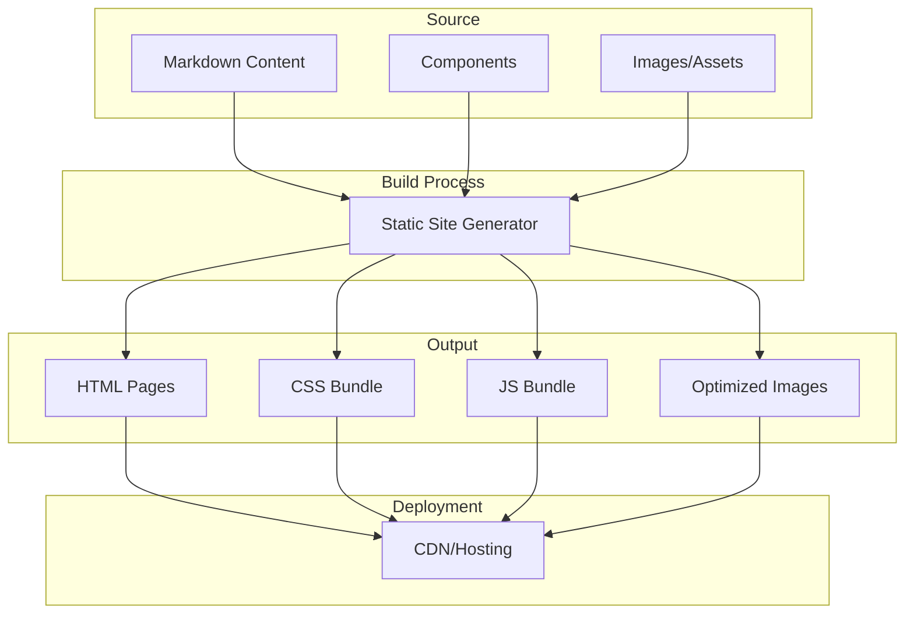

# Engaging Project Showcase - Product Requirements Document

## Executive Summary

### Problem Statement
MirDB is a sophisticated persistent key-value store with memcached protocol support, but it lacks a dedicated website to introduce and showcase the project to potential users and contributors. Without proper documentation and presentation, developers cannot easily understand what MirDB does, its unique value proposition, or how to get started using it.

### Proposed Solution
Create an engaging, visually appealing website that introduces the MirDB project, explains its purpose and architecture, highlights key features, and guides visitors on how to use and contribute to the project.

### Expected Impact
- **Increased Adoption**: Lower barrier to entry for new users by providing clear, accessible information
- **Developer Engagement**: Attract contributors by showcasing the project's technical elegance
- **Professional Presence**: Establish credibility through polished presentation
- **Community Growth**: Enable users to understand and share the project easily

### Success Metrics
- Website successfully deployed and accessible
- All key project information presented clearly
- Responsive design works across devices
- Page load time under 3 seconds
- Users can find getting started information within 2 clicks

---

## Requirements & Scope

### Functional Requirements

| ID | Requirement | Priority |
|----|-------------|----------|
| REQ-1 | Display project overview explaining what MirDB is and its purpose | Must |
| REQ-2 | Showcase key features (Memcached protocol, persistence, LSM tree architecture) | Must |
| REQ-3 | Present technical architecture in an accessible, visual way | Must |
| REQ-4 | Provide getting started guide or quick start section | Must |
| REQ-5 | Include supported commands/API documentation summary | Should |
| REQ-6 | Display project status and roadmap information | Should |
| REQ-7 | Link to GitHub repository for source code access | Must |
| REQ-8 | Include configuration options and default settings | Could |
| REQ-9 | Provide visual diagrams (data flow, architecture) | Should |
| REQ-10 | Support internationalization (Chinese and English) | Could |

### Non-Functional Requirements

| ID | Requirement | Priority |
|----|-------------|----------|
| NFR-1 | Website must be visually appealing with modern design | Must |
| NFR-2 | Responsive design supporting desktop, tablet, and mobile | Must |
| NFR-3 | Page load time under 3 seconds on average connection | Should |
| NFR-4 | Accessible following WCAG 2.1 AA guidelines | Should |
| NFR-5 | SEO-optimized for discoverability | Should |
| NFR-6 | Easy to maintain and update content | Should |

### Out of Scope
- User authentication or login functionality
- Dynamic backend services or databases
- Interactive API playground or live demo
- Community forum or discussion features
- Analytics dashboard (basic analytics may be included)
- Paid hosting infrastructure (static hosting preferred)

### Success Criteria
- All Must-priority requirements implemented and functional
- Website passes visual design review
- Content accurately represents MirDB project capabilities
- Website renders correctly on Chrome, Firefox, Safari, and Edge
- Mobile responsiveness verified on iOS and Android devices

---

## User Experience & Interface

### Target Audience
1. **Software Developers**: Looking for a persistent key-value store solution
2. **DevOps Engineers**: Evaluating caching solutions with persistence
3. **Open Source Contributors**: Interested in Rust or database internals
4. **Technical Decision Makers**: Comparing alternatives to memcached/Redis

### User Journey

```
Landing Page → Feature Overview → Architecture/Technical Details → Getting Started → GitHub Repository
```

### Key Pages/Sections

#### 1. Hero Section (Landing)
- Project name and tagline
- Brief one-line description
- Primary call-to-action (Get Started / View on GitHub)
- Visual element (logo or architecture illustration)

#### 2. Features Section
- Memcached Protocol Compatibility
- Persistent Storage with SSTables
- LSM Tree Architecture
- Async Performance with Tokio
- Each feature with icon and brief description

#### 3. Architecture Overview
- Visual diagram showing data flow
- Write path explanation (WAL → Memtable → SSTable)
- Read path explanation
- Compaction process overview

#### 4. Getting Started
- Installation instructions
- Basic configuration
- Quick example commands (SET, GET, DELETE)
- Link to full documentation

#### 5. API/Commands Reference
- Summary of supported memcached commands
- MirDB-specific commands (INFO, MAJOR_COMPACTION)
- Response codes reference

#### 6. Project Status & Roadmap
- Current implementation status
- Planned features (Raft consensus)
- How to contribute

#### 7. Footer
- GitHub link
- License information
- Contact/community links

### Interface Requirements
- Clean, modern design aesthetic
- Dark mode friendly (developer audience preference)
- Syntax highlighting for code examples
- Smooth scrolling navigation
- Mobile-friendly hamburger menu

---

## Technical Considerations

### High-Level Technical Approach
A static website is recommended for this project showcase, as it requires no backend services, is easy to maintain, and can be hosted on free platforms like GitHub Pages, Netlify, or Vercel.

### Integration Points
- **GitHub Repository**: Links to source code, issues, and contribution guidelines
- **Package Registry**: Optional links to crates.io for Rust packages

### Key Technical Constraints
- Must work as a static site (no server-side processing)
- Should be buildable from markdown or simple templating
- Content should be easy for maintainers to update

### Performance Considerations
- Optimize images and assets for web
- Use modern image formats (WebP with fallbacks)
- Implement lazy loading for below-fold content
- Minimize JavaScript bundle size

---

## Design Specification

### Recommended Approach
Build a single-page application (SPA) or multi-page static site using a modern static site generator or lightweight frontend framework, optimized for developer documentation with visual appeal.

### Key Technical Decisions

#### 1. Static Site Technology
- **Options Considered**: VitePress, Astro, Next.js (static export), Hugo, plain HTML/CSS/JS
- **Tradeoffs**: VitePress offers Vue ecosystem and markdown support; Astro provides component islands with minimal JS; Next.js is feature-rich but heavier; Hugo is fast but less flexible for custom components; plain HTML requires more manual work
- **Recommendation**: Astro or VitePress recommended for optimal balance of developer experience, markdown support, and minimal bundle size

#### 2. Styling Approach
- **Options Considered**: Tailwind CSS, CSS Modules, Styled Components, vanilla CSS
- **Tradeoffs**: Tailwind enables rapid development with utility classes; CSS Modules provide scoping; vanilla CSS has no build step but less maintainable at scale
- **Recommendation**: Tailwind CSS for rapid iteration and consistent design system

#### 3. Hosting Platform
- **Options Considered**: GitHub Pages, Netlify, Vercel, Cloudflare Pages
- **Tradeoffs**: All offer free tiers; GitHub Pages integrates with repo; Netlify/Vercel offer better CI/CD and preview deployments
- **Recommendation**: Netlify or Vercel for superior developer experience and automatic deployments

#### 4. Content Management
- **Options Considered**: Markdown files in repo, headless CMS, hardcoded content
- **Tradeoffs**: Markdown enables easy updates via PR; CMS adds complexity; hardcoded is simple but harder to maintain
- **Recommendation**: Markdown files with frontmatter for maintainability

### High-Level Architecture



### Key Considerations
- **Performance**: Static generation ensures fast load times; CDN distribution minimizes latency globally
- **Security**: No backend reduces attack surface; only static assets served
- **Scalability**: CDN-hosted static sites scale automatically to any traffic level

### Risk Management
- **Content Accuracy Risk**: Project documentation may become outdated; mitigate by keeping content in the main repo and updating alongside code changes
- **Design Skill Gap**: Creating visually appealing design may require design expertise; mitigate by using established design systems or templates

### Success Criteria
- Website successfully builds and deploys via CI/CD
- All content sections render correctly with proper styling
- Lighthouse performance score above 90
- Mobile and desktop responsive breakpoints functioning

---

## User Stories

### Personas
1. **Developer Dana**: Software engineer evaluating key-value stores for a project
2. **Contributor Carlos**: Open source enthusiast interested in Rust database internals
3. **Evaluator Eva**: Technical lead comparing caching solutions

### Core User Stories

#### US-1: Understand Project Purpose
**As a** Developer Dana
**I want to** quickly understand what MirDB is and what makes it different
**So that** I can decide if it's relevant to my needs

**Acceptance Criteria:**
- Given I land on the homepage
- When I view the hero section
- Then I see a clear tagline explaining MirDB is a persistent memcached-compatible key-value store

**Priority:** Must
**Related Requirements:** REQ-1, REQ-2

#### US-2: Explore Technical Architecture
**As a** Contributor Carlos
**I want to** understand how MirDB works internally
**So that** I can evaluate if I want to contribute

**Acceptance Criteria:**
- Given I am on the website
- When I navigate to the architecture section
- Then I see a visual diagram of the LSM tree data flow
- And I understand the write and read paths

**Priority:** Should
**Related Requirements:** REQ-3, REQ-9

#### US-3: Get Started Quickly
**As a** Developer Dana
**I want to** find installation and usage instructions
**So that** I can try MirDB in my development environment

**Acceptance Criteria:**
- Given I am interested in trying MirDB
- When I click "Get Started" or navigate to the getting started section
- Then I see clear installation steps
- And I see example commands to run

**Priority:** Must
**Related Requirements:** REQ-4, REQ-7

#### US-4: Review API Commands
**As a** Developer Dana
**I want to** see what memcached commands are supported
**So that** I can verify compatibility with my existing code

**Acceptance Criteria:**
- Given I need to verify API compatibility
- When I view the commands/API section
- Then I see a list of supported commands (SET, GET, DELETE, etc.)
- And I see MirDB-specific commands (INFO, MAJOR_COMPACTION)

**Priority:** Should
**Related Requirements:** REQ-5

#### US-5: Assess Project Maturity
**As an** Evaluator Eva
**I want to** understand the project's current status and future plans
**So that** I can assess risk of adoption

**Acceptance Criteria:**
- Given I need to evaluate project maturity
- When I view the project status section
- Then I see what features are implemented
- And I see the roadmap including planned features like Raft consensus

**Priority:** Should
**Related Requirements:** REQ-6

#### US-6: Access Source Code
**As a** Contributor Carlos
**I want to** easily navigate to the GitHub repository
**So that** I can view the code and contribute

**Acceptance Criteria:**
- Given I want to view the source code
- When I look for repository links
- Then I find a prominent link to the GitHub repository
- And the link opens in a new tab

**Priority:** Must
**Related Requirements:** REQ-7

---

## Dependencies & Assumptions

### Dependencies
- **GitHub Repository**: Must be publicly accessible for linking
- **Domain/Hosting**: Requires setup of hosting platform (GitHub Pages, Netlify, or Vercel)
- **Design Assets**: May require logo or custom illustrations

### Assumptions
- MirDB project will remain open source and publicly available
- Project maintainers can update markdown content as needed
- Target audience has technical background (developer-focused content acceptable)
- English is the primary language; Chinese can be added as secondary

---

## Appendices

### Content Sources
The following MirDB knowledge should be incorporated into website content:

1. **Project Overview**: Persistent key-value store with memcached protocol
2. **Key Features**:
   - Memcached text protocol compatibility
   - SSTable-based persistence
   - LSM tree architecture with compaction
   - Tokio async runtime
3. **Supported Commands**: SET, GET, DELETE, ADD, REPLACE, APPEND, PREPEND, INFO, MAJOR_COMPACTION
4. **Default Configuration**:
   - Listen address: 0.0.0.0:12333
   - Max LSM levels: 7
   - SSTable max size: 100MB
   - Memtable max size: 4MB
5. **Project Structure**: Three Rust crates (mirdb-server, skip-list, sstable)

### Reference Materials
- Existing memcached protocol documentation
- LSM tree educational resources for architecture diagrams
- Rust ecosystem branding guidelines
