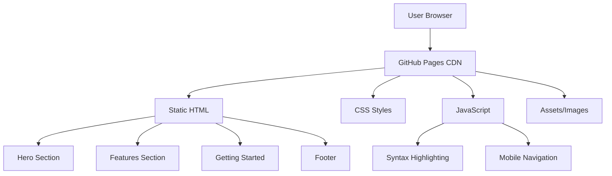

# Product Homepage Design - Product Requirements Document

## Executive Summary

### Problem Statement
MirDB is a powerful persistent key-value store with memcached protocol compatibility, but currently lacks a public-facing web presence. Without a homepage, potential users cannot easily discover the product, understand its value proposition, or learn how to get started. This creates a barrier to adoption and limits the project's visibility in the developer community.

### Proposed Solution
Create a modern, responsive product homepage that effectively communicates MirDB's unique value proposition—combining memcached compatibility with persistent storage and LSM tree architecture. The homepage will serve as the primary entry point for developers and technical decision-makers to learn about, evaluate, and adopt MirDB.

### Expected Impact
- **Increased Discoverability**: Provide a central location for users to learn about MirDB
- **Improved Developer Experience**: Offer clear documentation entry points and quick-start guides
- **Enhanced Credibility**: Establish MirDB as a professional, production-ready solution
- **Community Growth**: Enable easier onboarding and contribution pathways

### Success Metrics
- Homepage successfully deployed and accessible
- Clear presentation of MirDB's core features and differentiators
- Functional navigation to documentation and getting started resources
- Mobile-responsive design with accessibility compliance

---

## Requirements & Scope

### Functional Requirements

| ID | Requirement | Priority |
|----|-------------|----------|
| REQ-1 | Display product name, tagline, and hero section that clearly communicates MirDB's value proposition | Must |
| REQ-2 | Present key features section highlighting: memcached protocol compatibility, persistent storage, and LSM tree architecture | Must |
| REQ-3 | Include a "Getting Started" section with quick-start code examples showing basic usage | Must |
| REQ-4 | Provide navigation to documentation, GitHub repository, and community resources | Must |
| REQ-5 | Display supported commands and protocol compatibility information | Should |
| REQ-6 | Include architecture overview with visual representation of the LSM tree data flow | Should |
| REQ-7 | Show configuration options and default settings | Could |
| REQ-8 | Include comparison section highlighting differences from standard memcached | Could |

### Non-Functional Requirements

| ID | Requirement | Priority |
|----|-------------|----------|
| NFR-1 | Page must be responsive and render correctly on mobile, tablet, and desktop devices | Must |
| NFR-2 | Page must meet WCAG 2.1 AA accessibility standards | Must |
| NFR-3 | Page must load within 3 seconds on standard broadband connection | Must |
| NFR-4 | Page must be static and deployable without a backend server (suitable for GitHub Pages) | Must |
| NFR-5 | Page must render correctly in modern browsers (Chrome, Firefox, Safari, Edge - latest 2 versions) | Must |
| NFR-6 | Code examples must include syntax highlighting | Should |
| NFR-7 | Design must support dark mode preference | Could |

### Out of Scope
- User authentication or account management
- Dynamic content management system
- Interactive database playground or live demo
- Blog or news section
- Internationalization/localization
- Search functionality
- Analytics dashboard (analytics tracking code is in scope)

### Success Criteria
- All "Must" priority requirements implemented and verified
- Homepage passes Lighthouse accessibility audit with score >= 90
- Homepage passes Lighthouse performance audit with score >= 80
- Design reviewed and approved by stakeholders
- Successfully deployed to target hosting platform

---

## User Stories

### Personas
1. **Developer Dan** - A backend developer evaluating caching solutions for a new project
2. **DevOps Dana** - An operations engineer looking for a persistent cache alternative
3. **Open Source Oscar** - A developer interested in contributing to the project

### Core Stories

#### US-1: Understand Product Value
**As a** Developer Dan
**I want to** quickly understand what MirDB is and why it's different from memcached
**So that** I can determine if it meets my project requirements

**Acceptance Criteria:**
```gherkin
Given I am on the homepage
When the page loads
Then I should see a clear headline explaining MirDB's purpose
And I should see the key differentiator (persistence) highlighted
And I should understand the value within 10 seconds of reading
```
**Related Requirements:** REQ-1, REQ-2
**Priority:** Must

#### US-2: View Key Features
**As a** Developer Dan
**I want to** see the main features of MirDB at a glance
**So that** I can evaluate its technical capabilities

**Acceptance Criteria:**
```gherkin
Given I am on the homepage
When I scroll to the features section
Then I should see memcached protocol compatibility explained
And I should see persistence capabilities described
And I should see LSM tree architecture mentioned with benefits
```
**Related Requirements:** REQ-2, REQ-6
**Priority:** Must

#### US-3: Get Started Quickly
**As a** Developer Dan
**I want to** see code examples showing how to use MirDB
**So that** I can quickly evaluate if integration is straightforward

**Acceptance Criteria:**
```gherkin
Given I am on the homepage
When I navigate to the Getting Started section
Then I should see installation instructions
And I should see code examples for basic operations (SET, GET)
And the code examples should have syntax highlighting
```
**Related Requirements:** REQ-3, NFR-6
**Priority:** Must

#### US-4: Access Documentation
**As a** DevOps Dana
**I want to** easily navigate to detailed documentation
**So that** I can learn about configuration and deployment options

**Acceptance Criteria:**
```gherkin
Given I am on the homepage
When I look for documentation links
Then I should find a clear navigation link to documentation
And I should find a link to the GitHub repository
And all links should open in appropriate contexts
```
**Related Requirements:** REQ-4
**Priority:** Must

#### US-5: View on Mobile Device
**As a** Developer Dan
**I want to** view the homepage on my mobile device
**So that** I can review MirDB while commuting

**Acceptance Criteria:**
```gherkin
Given I am accessing the homepage on a mobile device
When the page loads
Then all content should be readable without horizontal scrolling
And navigation should be accessible via a mobile-friendly menu
And code examples should be horizontally scrollable
```
**Related Requirements:** NFR-1, NFR-5
**Priority:** Must

#### US-6: Contribute to Project
**As a** Open Source Oscar
**I want to** find contribution guidelines and community links
**So that** I can participate in the project's development

**Acceptance Criteria:**
```gherkin
Given I am on the homepage
When I look for community information
Then I should find a link to the GitHub repository
And I should find information about how to contribute
```
**Related Requirements:** REQ-4
**Priority:** Should

---

## User Experience & Interface

### User Journey
1. **Arrival**: User lands on homepage via search, link, or direct navigation
2. **Understanding**: User reads hero section and grasps MirDB's purpose within 10 seconds
3. **Exploration**: User scrolls through features to evaluate technical fit
4. **Evaluation**: User reviews code examples to assess integration effort
5. **Action**: User navigates to documentation or GitHub to proceed

### Interface Requirements

#### Page Structure
1. **Header/Navigation**
   - Logo/product name
   - Navigation links (Features, Getting Started, Documentation, GitHub)
   - Mobile hamburger menu

2. **Hero Section**
   - Product name and tagline
   - Brief value proposition (1-2 sentences)
   - Primary CTA (Get Started) and secondary CTA (View on GitHub)

3. **Features Section**
   - Three primary feature cards:
     - Memcached Protocol Compatible
     - Persistent Storage
     - LSM Tree Architecture
   - Brief descriptions with optional icons

4. **Architecture Overview** (Optional)
   - Visual diagram showing data flow
   - Brief explanation of LSM tree approach

5. **Getting Started Section**
   - Installation command
   - Basic usage code examples (SET/GET operations)
   - Link to full documentation

6. **Supported Commands Section** (Optional)
   - Table or list of supported memcached commands
   - MirDB-specific commands

7. **Footer**
   - GitHub link
   - License information
   - Copyright notice

### Accessibility Considerations
- Semantic HTML structure with proper heading hierarchy
- Sufficient color contrast ratios (4.5:1 minimum for text)
- Keyboard navigation support
- Alt text for all images and icons
- Focus indicators for interactive elements
- Screen reader compatible navigation

---

## Technical Considerations

### High-Level Technical Approach
The homepage will be built as a static website to ensure fast loading, easy deployment, and minimal maintenance. Static site deployment aligns with the project's infrastructure-free approach and enables hosting on GitHub Pages without additional server costs.

### Integration Points
- **GitHub Repository**: Links to source code, issues, and contribution guidelines
- **Documentation Site**: Navigation to detailed documentation (if separate)
- **Package Registries**: Links to crates.io for Rust package installation

### Key Technical Constraints
- Must be deployable as static files (HTML, CSS, JS)
- No server-side rendering or backend dependencies
- Compatible with GitHub Pages or similar static hosting
- Minimal JavaScript for progressive enhancement

### Performance Considerations
- Optimize images and assets for web delivery
- Minimize CSS and JavaScript bundle sizes
- Implement lazy loading for below-the-fold content
- Use system fonts or efficiently loaded web fonts

---

## Design Specification

### Recommended Approach
Build a single-page static website using modern HTML5, CSS3, and minimal JavaScript. The design should reflect MirDB's technical nature while remaining approachable, using a clean developer-focused aesthetic similar to successful open-source project homepages.

### Key Technical Decisions

#### 1. Build Approach
- **Options Considered**: Static HTML/CSS, Static Site Generator (Hugo/Jekyll), JavaScript Framework (React/Vue)
- **Tradeoffs**: Static HTML is simplest but harder to maintain; SSGs add build complexity but improve maintainability; JS frameworks are overkill for a simple homepage
- **Recommendation**: Static HTML/CSS with optional build tooling for asset optimization—balances simplicity with maintainability for a single-page site

#### 2. Styling Approach
- **Options Considered**: Plain CSS, CSS Framework (Tailwind/Bootstrap), CSS-in-JS
- **Tradeoffs**: Plain CSS has no dependencies but requires more code; frameworks speed development but add bundle size; CSS-in-JS is unnecessary without a JS framework
- **Recommendation**: Plain CSS with CSS custom properties for theming—keeps the page lightweight and dependency-free

#### 3. Code Syntax Highlighting
- **Options Considered**: Prism.js, Highlight.js, Pre-rendered highlighting
- **Tradeoffs**: Runtime libraries add JavaScript weight; pre-rendered requires build step but zero runtime cost
- **Recommendation**: Prism.js with minimal language support (rust, bash, text)—small footprint with good developer experience

#### 4. Hosting Platform
- **Options Considered**: GitHub Pages, Netlify, Vercel, Self-hosted
- **Tradeoffs**: GitHub Pages is free and integrated with repo; Netlify/Vercel offer more features but add complexity; self-hosted requires infrastructure
- **Recommendation**: GitHub Pages—free, integrated with project repository, and sufficient for static content

### High-Level Architecture



### Key Considerations
- **Performance**: Static files served via CDN ensure fast global delivery; minimal JavaScript keeps parse time low
- **Security**: No backend means minimal attack surface; only concern is ensuring external links use appropriate rel attributes
- **Scalability**: Static hosting scales automatically; no capacity planning required

### Risk Management
- **Technical Risk: Browser Compatibility**: Mitigation—use progressive enhancement and test across target browsers; fallback styling for older browsers
- **Technical Risk: Accessibility Compliance**: Mitigation—use automated testing tools (axe, Lighthouse) during development; manual screen reader testing before launch

### Success Criteria
- Page loads and renders correctly on all target browsers
- Lighthouse performance score >= 80
- Lighthouse accessibility score >= 90
- All navigation links functional and pointing to correct destinations

---

## Dependencies & Assumptions

### External Dependencies
- GitHub Pages (or alternative static hosting) availability
- GitHub repository for source code links
- Optional: Documentation site if hosted separately

### Assumptions
- MirDB project will continue using GitHub as primary repository
- No immediate need for dynamic content or user accounts
- English language only for initial release
- Project maintainers will review and approve design before implementation

### Cross-Team Coordination
- Design approval from project maintainers
- Content review for accuracy of technical descriptions
- Documentation team alignment (if separate)

---

## Appendices

### A. Content Requirements

#### Hero Section Copy (Draft)
- **Headline**: "MirDB"
- **Tagline**: "Persistent Key-Value Store with Memcached Protocol"
- **Description**: "Drop-in replacement for memcached with durable storage. Built with Rust for reliability and performance."

#### Feature Descriptions (Draft)
1. **Memcached Protocol Compatible**
   - "Use your existing memcached clients. MirDB speaks the same protocol, making migration seamless."

2. **Persistent Storage**
   - "Unlike memcached, your data survives restarts. MirDB persists to disk using SSTables for durability."

3. **LSM Tree Architecture**
   - "Built on a Log-Structured Merge-tree for optimized write performance and efficient compaction."

### B. Supported Commands Reference
- Storage: SET, ADD, REPLACE, APPEND, PREPEND
- Retrieval: GET, GETS
- Deletion: DELETE
- MirDB-specific: INFO, MAJOR_COMPACTION

### C. Default Configuration Reference
- Listen address: `0.0.0.0:12333`
- Max LSM levels: 7
- Work directory: `/tmp/mirdb`
- SSTable max size: 100MB
- Memtable max size: 4MB
- Block size: 4KB
