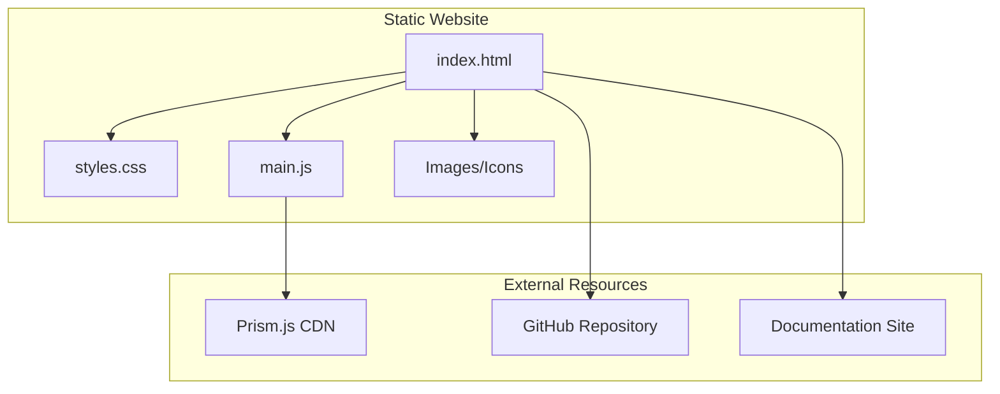

# Product Homepage Design - Product Requirements Document

## Executive Summary

### Problem Statement
MirDB currently lacks a public-facing homepage to communicate its value proposition, features, and usage information to potential users. Without a homepage, developers cannot easily discover, understand, or get started with MirDB, limiting adoption of this persistent key-value store solution.

### Proposed Solution
Create a professional, informative homepage for MirDB that clearly communicates its unique value as a persistent key-value store with Memcached protocol compatibility. The homepage will serve as the primary entry point for developers to learn about MirDB, understand its benefits, and get started quickly.

### Expected Impact
- **Increased Discoverability**: Developers searching for persistent caching solutions can find and evaluate MirDB
- **Faster Onboarding**: Clear documentation and getting-started guides reduce time-to-first-use
- **Enhanced Credibility**: Professional presentation establishes MirDB as a serious open-source project
- **Community Growth**: Accessible information encourages contributions and adoption

### Success Metrics
- Homepage successfully deployed and accessible
- All core content sections implemented and functional
- Page loads within 3 seconds on standard connections
- Responsive design works across desktop, tablet, and mobile devices

---

## Requirements & Scope

### Functional Requirements

| ID | Requirement | Priority |
|----|-------------|----------|
| REQ-1 | Display product name, tagline, and value proposition prominently in hero section | Must |
| REQ-2 | Present key features (persistence, Memcached compatibility, LSM tree architecture, async Rust) | Must |
| REQ-3 | Include quick-start/getting-started section with installation and basic usage commands | Must |
| REQ-4 | Show code examples demonstrating common operations (SET, GET, DELETE) | Must |
| REQ-5 | Provide navigation to documentation, GitHub repository, and other resources | Must |
| REQ-6 | Display project status and current feature availability | Should |
| REQ-7 | Include configuration examples and parameter reference | Should |
| REQ-8 | Show architecture diagram illustrating LSM tree data flow | Should |
| REQ-9 | Feature comparison table (MirDB vs Memcached vs Redis) | Could |
| REQ-10 | Include community/contribution section with links to issues and contribution guidelines | Could |

### Non-Functional Requirements

| ID | Requirement | Priority |
|----|-------------|----------|
| NFR-1 | Page must be fully responsive (mobile, tablet, desktop breakpoints) | Must |
| NFR-2 | Initial page load under 3 seconds on 3G connection | Must |
| NFR-3 | Achieve Lighthouse accessibility score of 90+ | Should |
| NFR-4 | Support dark mode / light mode theming | Should |
| NFR-5 | Semantic HTML for SEO optimization | Should |
| NFR-6 | Code syntax highlighting for all code examples | Must |

### Out of Scope
- User authentication or login functionality
- Interactive playground or live code execution environment
- Blog or news section
- Localization/internationalization (English only for initial release)
- Analytics dashboard or usage tracking backend
- Community forum or discussion features

### Success Criteria
- All "Must" priority requirements implemented
- Homepage passes W3C HTML validation
- Responsive design verified on Chrome, Firefox, Safari, and Edge
- All code examples are accurate and copy-paste functional
- Navigation links resolve correctly

---

## User Stories

### Personas
1. **Developer Dan** - Backend developer evaluating caching solutions for a new project
2. **DevOps Diana** - Operations engineer looking for a persistent alternative to Memcached
3. **Contributor Chris** - Open-source enthusiast interested in contributing to Rust projects

### Core User Stories

#### US-1: Understand Product Value
**As a** Developer Dan
**I want to** quickly understand what MirDB does and why I should use it
**So that** I can determine if it fits my project's caching needs

**Priority**: Must
**Related Requirements**: REQ-1, REQ-2

**Acceptance Criteria**:
- Given I land on the homepage
- When the page loads
- Then I see a clear headline explaining MirDB is a persistent key-value store
- And I see the tagline mentioning Memcached protocol compatibility
- And I see 3-4 key feature highlights within the first viewport

---

#### US-2: Get Started Quickly
**As a** Developer Dan
**I want to** see installation and basic usage instructions
**So that** I can try MirDB in under 5 minutes

**Priority**: Must
**Related Requirements**: REQ-3, REQ-4

**Acceptance Criteria**:
- Given I am on the homepage
- When I scroll to the getting-started section
- Then I see installation commands (cargo install or build from source)
- And I see example commands for starting the server
- And I see code examples for SET, GET, and DELETE operations
- And all code blocks have a copy-to-clipboard button

---

#### US-3: Evaluate Features and Compatibility
**As a** DevOps Diana
**I want to** understand MirDB's architecture and supported commands
**So that** I can assess if it will integrate with our existing memcached clients

**Priority**: Must
**Related Requirements**: REQ-2, REQ-5, REQ-6

**Acceptance Criteria**:
- Given I am evaluating MirDB for production use
- When I review the features section
- Then I see the list of supported memcached commands
- And I see information about the LSM tree storage architecture
- And I can navigate to detailed documentation
- And I can see the current project status (implemented vs planned features)

---

#### US-4: Configure the Database
**As a** DevOps Diana
**I want to** understand available configuration options
**So that** I can tune MirDB for our specific workload

**Priority**: Should
**Related Requirements**: REQ-7

**Acceptance Criteria**:
- Given I want to configure MirDB
- When I look for configuration information
- Then I see example TOML configuration
- And I see a table of key parameters with descriptions and defaults
- And I can access more detailed configuration documentation

---

#### US-5: Contribute to the Project
**As a** Contributor Chris
**I want to** find links to the source code and contribution guidelines
**So that** I can start contributing to MirDB

**Priority**: Could
**Related Requirements**: REQ-5, REQ-10

**Acceptance Criteria**:
- Given I want to contribute to MirDB
- When I look for contribution information
- Then I see a prominent link to the GitHub repository
- And I can find information about the project structure
- And I can navigate to open issues or contribution guidelines

---

#### US-6: Access on Mobile Device
**As a** Developer Dan
**I want to** view the homepage on my phone
**So that** I can quickly reference information while away from my desk

**Priority**: Must
**Related Requirements**: NFR-1

**Acceptance Criteria**:
- Given I access the homepage on a mobile device
- When the page loads
- Then all content is readable without horizontal scrolling
- And navigation is accessible via a mobile menu
- And code examples are scrollable horizontally if needed
- And touch targets are at least 44x44 pixels

---

#### US-7: Read Code Examples Clearly
**As a** Developer Dan
**I want to** see syntax-highlighted code examples
**So that** I can quickly understand the code structure

**Priority**: Must
**Related Requirements**: REQ-4, NFR-6

**Acceptance Criteria**:
- Given I am viewing code examples
- When I look at a code block
- Then the code has syntax highlighting appropriate to the language
- And line numbers are displayed for multi-line examples
- And I can copy the code with a single click

---

## User Experience & Interface

### Page Structure

1. **Header/Navigation**
   - Logo and product name
   - Navigation links: Features, Getting Started, Documentation, GitHub
   - Theme toggle (light/dark)

2. **Hero Section**
   - Product name: "MirDB"
   - Tagline: "A persistent key-value store with Memcached protocol support"
   - Brief description highlighting Rust implementation and LSM tree architecture
   - Primary CTA: "Get Started" button
   - Secondary CTA: "View on GitHub" button

3. **Features Section**
   - Feature cards highlighting:
     - Memcached Protocol Compatibility
     - Persistent Storage with SSTables
     - LSM Tree Architecture
     - Async Rust with Tokio
   - Each card with icon, title, and brief description

4. **Getting Started Section**
   - Installation commands
   - Server startup example
   - Basic usage examples (SET, GET, DELETE)
   - Link to full documentation

5. **Architecture Overview** (Optional)
   - Visual diagram of LSM tree data flow
   - Brief explanation of write and read paths

6. **Configuration Section**
   - Example TOML configuration
   - Key parameters table

7. **Footer**
   - Links: Documentation, GitHub, License
   - Copyright notice

### User Flow
```
Landing → Read Hero → Browse Features → View Getting Started → Access Documentation
                                    ↘ View Architecture → Explore Configuration
```

### Responsive Breakpoints
- Mobile: < 640px (single column layout)
- Tablet: 640px - 1024px (two column where appropriate)
- Desktop: > 1024px (full layout)

---

## Technical Considerations

### Technology Approach
The homepage should be implemented as a static website to ensure fast loading, easy deployment, and minimal maintenance overhead. This aligns with the project's focus on simplicity and the typical deployment patterns for open-source project documentation.

### Integration Points
- **GitHub Repository**: Links to source code, issues, and releases
- **Documentation**: Links to detailed documentation (if separate documentation site exists)
- **Package Registry**: Links to crates.io for Rust package installation

### Performance Considerations
- Static HTML/CSS/JS for fast initial load
- Minimal JavaScript - use only where necessary (theme toggle, copy buttons)
- Optimize images (if any) with modern formats (WebP with fallbacks)
- Consider using a CSS framework for consistent styling with minimal custom CSS

### Key Constraints
- Must work without JavaScript for core content (progressive enhancement)
- Should be hostable on GitHub Pages or similar static hosting
- No server-side rendering or backend required

---

## Design Specification

### Recommended Approach
Build a lightweight, static single-page website using semantic HTML, modern CSS (with CSS custom properties for theming), and minimal JavaScript for interactivity. The design should prioritize content clarity, fast loading, and developer-friendly aesthetics.

### Key Technical Decisions

#### 1. Static Site Generation vs Plain HTML
- **Options Considered**: Plain HTML/CSS, Hugo, Jekyll, Astro, Next.js static export
- **Tradeoffs**: Plain HTML is simplest but harder to maintain; static site generators add build complexity but improve maintainability; full frameworks are overkill for a single page
- **Recommendation**: Plain HTML/CSS with optional build tooling for minification. Keeps complexity low while allowing future migration to a generator if the site grows.

#### 2. CSS Architecture
- **Options Considered**: Vanilla CSS, Tailwind CSS, CSS framework (Bootstrap/Bulma), CSS-in-JS
- **Tradeoffs**: Vanilla CSS requires more code but no dependencies; Tailwind adds build step but speeds development; Frameworks add unused CSS bloat
- **Recommendation**: Vanilla CSS with CSS custom properties for theming. Keeps the site dependency-free and lightweight while enabling dark/light mode.

#### 3. Code Syntax Highlighting
- **Options Considered**: Prism.js, Highlight.js, pre-rendered highlighting, CSS-only
- **Tradeoffs**: JS libraries add weight but work dynamically; pre-rendered is lighter but harder to update; CSS-only is limited
- **Recommendation**: Prism.js (lightweight) loaded asynchronously. Small footprint with good language support and copy-to-clipboard plugins available.

#### 4. Hosting Platform
- **Options Considered**: GitHub Pages, Netlify, Vercel, CloudFlare Pages
- **Tradeoffs**: GitHub Pages is free and integrated with repo; other platforms offer more features but add external dependency
- **Recommendation**: GitHub Pages for simplicity and zero-cost hosting with automatic deployment from the repository.

### High-Level Architecture


### Key Considerations
- **Performance**: Static files served via CDN (GitHub Pages) ensure sub-second TTFB globally; total page weight should be under 500KB including all assets
- **Security**: No backend, no user input processing, no authentication = minimal attack surface; use HTTPS via GitHub Pages
- **Scalability**: Static hosting scales infinitely with no configuration; content updates via git push

### Risk Management
- **Content Accuracy Risk**: Code examples may become outdated as MirDB evolves. Mitigation: Keep examples minimal and link to living documentation for detailed reference.
- **Browser Compatibility Risk**: Modern CSS features may not work in older browsers. Mitigation: Use progressive enhancement and test on major browsers; provide fallbacks for CSS custom properties.

### Success Criteria
- Homepage loads completely in under 3 seconds on 3G connection
- Lighthouse performance score of 90+
- All code examples are verified to work with current MirDB version
- Responsive design functions correctly at all specified breakpoints

---

## Dependencies & Assumptions

### Dependencies
- GitHub repository for hosting (if using GitHub Pages)
- MirDB documentation for detailed reference links
- Syntax highlighting library (Prism.js or similar)

### Assumptions
- MirDB project will continue to support the memcached text protocol
- Default configuration values documented in knowledge base are current
- Project will remain open-source with public GitHub repository
- No immediate need for multiple language support

---

## Appendices

### A. Content Reference

#### Key Messages
1. **Primary**: MirDB is a persistent key-value store that speaks Memcached
2. **Secondary**: Built in Rust for performance and reliability
3. **Tertiary**: LSM tree architecture for efficient storage

#### Supported Commands for Documentation
- SET, ADD, REPLACE, APPEND, PREPEND (Storage)
- GET, GETS (Retrieval)
- DELETE (Deletion)
- INFO, MAJOR_COMPACTION (MirDB-specific)

#### Default Configuration Values
| Parameter | Default Value |
|-----------|---------------|
| addr | 0.0.0.0:12333 |
| max_level | 7 |
| work_dir | /tmp/mirdb |
| sst_max_size | 100MB |
| mem_table_max_size | 4MB |
| block_size | 4KB |

### B. Reference Links
- GitHub Repository: [To be linked]
- Detailed Documentation: [To be linked]
- Crates.io Package: [To be linked if published]
