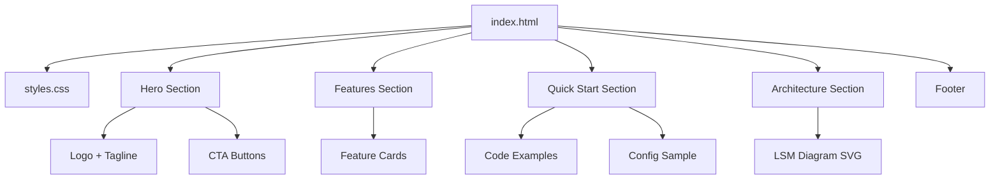

# Product Homepage Design - Product Requirements Document

## Executive Summary

### Problem Statement
MirDB is a high-performance persistent key-value store with powerful features including memcached protocol compatibility, LSM tree architecture, and disk persistence. However, the project currently lacks a homepage that can effectively communicate its value proposition, features, and usage to potential users, contributors, and the developer community.

### Proposed Solution
Create a modern, informative product homepage for MirDB that showcases its capabilities, provides clear documentation entry points, and establishes the project's identity in the database tools ecosystem. The homepage will serve as the primary marketing and information hub for the project.

### Expected Impact
- **Developer Adoption**: Increase visibility and adoption among developers looking for persistent key-value stores
- **Community Growth**: Attract open-source contributors by clearly communicating project goals and architecture
- **User Onboarding**: Reduce time-to-first-use by providing clear getting started information
- **Brand Identity**: Establish MirDB as a credible, professional database solution

### Success Metrics
- Homepage load time under 2 seconds
- Clear navigation to documentation, GitHub, and getting started guide
- Mobile-responsive design with consistent experience across devices
- Positive user feedback on clarity and information architecture

---

## Requirements & Scope

### Functional Requirements

| ID | Requirement | Priority |
|----|-------------|----------|
| REQ-1 | Display product name, tagline, and brief description prominently in hero section | Must |
| REQ-2 | Showcase key features: Memcached protocol support, persistence, LSM tree architecture | Must |
| REQ-3 | Provide quick start code example showing basic usage | Must |
| REQ-4 | Include navigation links to GitHub repository | Must |
| REQ-5 | Display supported commands (GET, SET, DELETE, etc.) in an organized format | Should |
| REQ-6 | Show architecture diagram illustrating LSM tree data flow | Should |
| REQ-7 | Include configuration example with TOML format | Should |
| REQ-8 | Provide comparison highlighting advantages over standard memcached | Should |
| REQ-9 | Display project status and roadmap information | Could |
| REQ-10 | Include footer with license information and project links | Must |

### Non-Functional Requirements

| ID | Requirement | Priority |
|----|-------------|----------|
| NFR-1 | Page must be responsive and functional on mobile devices (320px+) | Must |
| NFR-2 | Page must load within 2 seconds on standard broadband connection | Must |
| NFR-3 | Must be accessible (WCAG 2.1 AA compliance) | Should |
| NFR-4 | Must work without JavaScript for core content visibility | Should |
| NFR-5 | Must use semantic HTML for SEO optimization | Should |
| NFR-6 | Code examples must have syntax highlighting | Should |

### Out of Scope
- Backend functionality or API endpoints
- User authentication or account management
- Interactive database playground or demo environment
- Multi-language/internationalization support
- Blog or news section
- Full documentation system (homepage links to external docs)

### Success Criteria
- All "Must" priority requirements implemented
- Homepage renders correctly on Chrome, Firefox, Safari, and Edge
- Lighthouse performance score above 80
- All links functional and pointing to correct destinations
- Content accurately represents MirDB capabilities

---

## User Experience & Interface

### Target Users
1. **Backend Developers**: Looking for a persistent caching solution with familiar API
2. **DevOps Engineers**: Evaluating data storage solutions for their infrastructure
3. **Open Source Contributors**: Interested in contributing to a Rust database project

### User Journey

```
Landing → Hero Section (understand what MirDB is)
       → Features Section (learn key capabilities)
       → Quick Start (see how easy it is to use)
       → Architecture (understand how it works)
       → Footer (find links to GitHub, docs)
```

### Page Structure

#### 1. Hero Section
- Product logo/name
- Tagline: "A Persistent Key-Value Store with Memcached Protocol"
- Brief description (2-3 sentences)
- Primary CTA: "Get Started" or "View on GitHub"
- Secondary CTA: "Documentation"

#### 2. Key Features Section
- **Memcached Compatible**: Use existing memcached clients seamlessly
- **Persistent Storage**: Data survives restarts with SSTable-based storage
- **High Performance**: LSM tree architecture with async I/O via Tokio

#### 3. Quick Start Section
- Installation command
- Basic usage example showing SET and GET operations
- Configuration snippet (TOML format)

#### 4. Architecture Overview
- Visual diagram of LSM tree data flow
- Brief explanation of write path (WAL → Memtable → SSTable)
- Mention of compaction strategy

#### 5. Commands Reference (Condensed)
- Table or grid showing supported memcached commands
- Link to full documentation

#### 6. Footer
- GitHub link
- License information (MIT/Apache)
- Version information

### Interface Requirements
- Clean, modern design appropriate for developer tools
- Dark/light color scheme options (or single professional theme)
- Monospace fonts for code examples
- Adequate whitespace for readability
- Consistent visual hierarchy

---

## Technical Considerations

### Technology Approach
The homepage should be built as a static site to ensure:
- Fast loading times
- Easy hosting (GitHub Pages, Netlify, etc.)
- No server-side dependencies
- Simple maintenance

### Content Requirements
- All content derived from existing project documentation
- Code examples must be tested and functional
- Architecture diagrams in SVG or optimized PNG format

### Integration Points
- Links to GitHub repository (https://github.com/[org]/mirdb)
- Links to documentation (if external docs site exists)
- Potential integration with GitHub stars/forks badges

### Performance Considerations
- Optimize images (use SVG where possible)
- Minimize CSS/JS payload
- Consider using system fonts or limited web fonts
- Implement lazy loading for below-fold content

---

## Design Specification

### Recommended Approach
Build a single-page static website using modern HTML/CSS with minimal JavaScript, focusing on clear information hierarchy and fast performance. The page will be self-contained and easily deployable to any static hosting platform.

### Key Technical Decisions

#### 1. Framework/Tooling
- **Options Considered**: React/Next.js, Vue/Nuxt, Plain HTML/CSS, Static Site Generator (Hugo/Jekyll)
- **Tradeoffs**:
  - React/Vue: Rich interactivity but heavier bundle, more complexity
  - Plain HTML/CSS: Simplest, fastest, but harder to maintain
  - SSG: Good balance of maintainability and performance
- **Recommendation**: Plain HTML/CSS with optional build step for minification. The homepage is simple enough that a framework adds unnecessary complexity.

#### 2. Styling Approach
- **Options Considered**: Tailwind CSS, Custom CSS, CSS Framework (Bootstrap)
- **Tradeoffs**:
  - Tailwind: Utility-first, fast development, larger initial learning
  - Custom CSS: Full control, smaller bundle, more maintenance
  - Bootstrap: Quick setup, but generic appearance
- **Recommendation**: Custom CSS with CSS variables for theming. Keeps bundle small and allows unique branding.

#### 3. Code Syntax Highlighting
- **Options Considered**: Prism.js, Highlight.js, Pre-rendered highlighting
- **Tradeoffs**:
  - JS libraries: Dynamic but add weight
  - Pre-rendered: No JS required but less flexible
- **Recommendation**: Pre-rendered syntax highlighting via build step or inline styles to eliminate JavaScript dependency.

#### 4. Hosting Platform
- **Options Considered**: GitHub Pages, Netlify, Vercel, Self-hosted
- **Tradeoffs**:
  - GitHub Pages: Free, integrated with repo, limited features
  - Netlify/Vercel: More features, still free tier, separate from repo
- **Recommendation**: GitHub Pages for simplicity and integration with the existing repository.

### High-Level Architecture



### Key Considerations
- **Performance**: Static HTML with optimized assets ensures sub-2-second load times. No runtime JS required for core functionality.
- **Security**: Static site eliminates server-side vulnerabilities. External links use rel="noopener noreferrer".
- **Scalability**: Static hosting scales infinitely with CDN distribution at no additional cost.

### Risk Management
- **Content Accuracy Risk**: Homepage content may become outdated as project evolves. Mitigation: Include version number and "last updated" date; link to GitHub for latest information.
- **Browser Compatibility Risk**: CSS features may not work in older browsers. Mitigation: Use progressive enhancement and test across major browsers.

### Success Criteria
- Page renders complete content without JavaScript
- Lighthouse performance score ≥ 80
- All code examples are syntactically correct and runnable
- Responsive design works from 320px to 2560px viewport widths

---

## User Stories

### Personas
1. **Backend Developer (Primary)**: Evaluating caching/storage solutions for their application
2. **DevOps Engineer**: Researching database tools for infrastructure
3. **OSS Contributor**: Looking for interesting Rust projects to contribute to

### Core User Stories

#### US-1: Understand Product Value
**As a** backend developer,
**I want to** quickly understand what MirDB is and its key benefits,
**so that** I can determine if it's worth exploring further.

**Acceptance Criteria:**
- Given I land on the homepage
- When I view the hero section
- Then I see the product name, tagline, and a 2-3 sentence description within 5 seconds of page load

**Priority:** Must
**Traceability:** REQ-1, NFR-2

---

#### US-2: View Key Features
**As a** backend developer,
**I want to** see the main features of MirDB at a glance,
**so that** I can understand its technical capabilities.

**Acceptance Criteria:**
- Given I am on the homepage
- When I scroll to the features section
- Then I see at least 3 key features (memcached compatibility, persistence, LSM architecture) with brief descriptions

**Priority:** Must
**Traceability:** REQ-2

---

#### US-3: Access Quick Start Guide
**As a** developer new to MirDB,
**I want to** see a simple code example showing basic usage,
**so that** I can quickly try it out.

**Acceptance Criteria:**
- Given I am on the homepage
- When I navigate to the quick start section
- Then I see code examples for starting the server and performing GET/SET operations
- And the code has syntax highlighting for readability

**Priority:** Must
**Traceability:** REQ-3, NFR-6

---

#### US-4: Navigate to Source Code
**As a** potential contributor,
**I want to** easily find the GitHub repository link,
**so that** I can explore the codebase and consider contributing.

**Acceptance Criteria:**
- Given I am on the homepage
- When I look for source code access
- Then I find a clearly visible link to the GitHub repository in the hero section or navigation

**Priority:** Must
**Traceability:** REQ-4

---

#### US-5: View on Mobile Device
**As a** developer browsing on mobile,
**I want to** view the homepage with proper formatting,
**so that** I can learn about MirDB on any device.

**Acceptance Criteria:**
- Given I access the homepage on a mobile device (320px width)
- When the page loads
- Then all content is readable without horizontal scrolling
- And navigation is accessible via mobile-friendly controls

**Priority:** Must
**Traceability:** NFR-1

---

#### US-6: Understand Architecture
**As a** DevOps engineer evaluating MirDB,
**I want to** understand how data flows through the system,
**so that** I can assess its reliability and performance characteristics.

**Acceptance Criteria:**
- Given I am on the homepage
- When I scroll to the architecture section
- Then I see a visual diagram showing the LSM tree data flow (WAL → Memtable → SSTable)

**Priority:** Should
**Traceability:** REQ-6

---

#### US-7: Review Supported Commands
**As a** developer familiar with memcached,
**I want to** see which memcached commands are supported,
**so that** I know if MirDB is compatible with my existing code.

**Acceptance Criteria:**
- Given I am on the homepage
- When I view the commands section
- Then I see a list of supported commands (GET, SET, DELETE, ADD, REPLACE, etc.)

**Priority:** Should
**Traceability:** REQ-5

---

## Dependencies & Assumptions

### Assumptions
- GitHub repository exists and is publicly accessible
- Project logo or brand assets are available or will be created
- MirDB project maintainers will review and approve content accuracy
- Hosting will be free tier (GitHub Pages or similar)

### Dependencies
- Access to MirDB GitHub repository URL
- Final approval of homepage content from project maintainers
- Logo/brand assets (can proceed with text-only initially)

---

## Appendices

### A. MirDB Feature Summary (for content reference)

**Core Capabilities:**
- Memcached text protocol compatibility
- Persistent storage using SSTables
- LSM tree architecture with compaction
- Tokio-based async networking
- Write-ahead log for durability
- Configurable via TOML files

**Supported Commands:**
- Storage: SET, ADD, REPLACE, APPEND, PREPEND
- Retrieval: GET, GETS
- Deletion: DELETE
- MirDB-specific: INFO, MAJOR_COMPACTION

**Default Configuration:**
- Port: 12333
- Max LSM levels: 7
- Memtable size: 4MB
- SSTable size: 100MB
- Block size: 4KB

### B. Sample Code for Quick Start Section

```bash
# Start MirDB server
mirdb -c /path/to/config.toml
```

```bash
# Connect with any memcached client
$ telnet localhost 12333
> set mykey 0 0 5
> hello
STORED
> get mykey
VALUE mykey 0 5
hello
END
```

### C. Sample Configuration

```toml
addr = "0.0.0.0:12333"
max_level = 7
work_dir = "/var/lib/mirdb"
mem_table_max_size = "4M"
sst_max_size = "100M"
```
