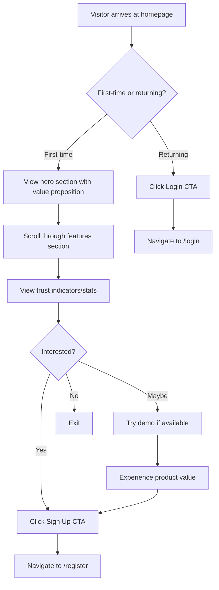

# Product Homepage Design - Product Requirements Document

## Executive Summary

### Problem Statement
The URL Shortening Service currently lacks a dedicated homepage that effectively communicates the product's value proposition to new visitors. Without a compelling landing page, potential users may not understand the service's capabilities, leading to reduced sign-ups and engagement.

### Proposed Solution
Create an engaging, conversion-focused homepage that showcases the URL Shortening Service's key features, demonstrates value through clear messaging, and provides intuitive call-to-action elements to drive user registration and engagement.

### Expected Impact
- **User Acquisition**: Improved first-impression experience leading to higher conversion rates for new user registrations
- **Brand Communication**: Clear articulation of the product's value proposition and feature set
- **User Engagement**: Streamlined entry points to core functionality (URL shortening, analytics dashboard)
- **Trust Building**: Professional presentation that establishes credibility with potential users

### Success Metrics
- Conversion rate: Percentage of homepage visitors who register
- Engagement rate: Time spent on homepage before navigation
- Call-to-action click-through rate
- Bounce rate reduction

---

## Requirements & Scope

### Functional Requirements

| ID | Requirement | Priority |
|----|-------------|----------|
| REQ-1 | Display clear product name and tagline that communicates the URL shortening service value proposition | Must |
| REQ-2 | Show hero section with primary call-to-action (Sign Up/Get Started button) | Must |
| REQ-3 | Present key features section highlighting URL shortening, click analytics, and dashboard capabilities | Must |
| REQ-4 | Include secondary call-to-action for existing users to log in | Must |
| REQ-5 | Display visual elements demonstrating the product (mockups, icons, or illustrations) | Should |
| REQ-6 | Show social proof or trust indicators (statistics, testimonials, or feature highlights) | Should |
| REQ-7 | Provide quick URL shortening demo for visitors (optional, unauthenticated) | Could |
| REQ-8 | Include footer with navigation links and legal information | Should |

### Non-Functional Requirements

| ID | Requirement | Priority |
|----|-------------|----------|
| NFR-1 | Homepage must be fully responsive across desktop, tablet, and mobile viewports | Must |
| NFR-2 | Page load time must be under 3 seconds on standard broadband connections | Must |
| NFR-3 | Must support existing theme system (light, dark, cyberpunk, synthwave, etc.) | Must |
| NFR-4 | Must be accessible (WCAG 2.1 AA compliance) with proper semantic HTML, ARIA labels, and keyboard navigation | Should |
| NFR-5 | Visual design must be consistent with existing UI components (GlassMorphismCard, FuturisticButton, BackgroundEffect) | Must |
| NFR-6 | Must integrate with existing routing structure (served at `/` route) | Must |
| NFR-7 | Animations should use Framer Motion consistent with existing application patterns | Should |

### Out of Scope
- User account creation from the homepage (redirects to dedicated `/register` page)
- Full URL shortening workflow on homepage (basic demo only, if implemented)
- Blog or content marketing integration
- Pricing or subscription tier information
- Multi-language/internationalization support
- SEO optimization beyond basic meta tags

### Success Criteria
- Homepage renders correctly at the `/` route without authentication
- All call-to-action buttons navigate to appropriate pages (login, register)
- Page displays correctly in all supported themes
- Page passes Lighthouse accessibility audit with score ≥ 90
- Page functions correctly on Chrome, Firefox, Safari, and Edge browsers

---

## User Experience & Interface

### User Journey



### Interface Requirements

#### Hero Section
- Prominent product name/logo
- Compelling headline communicating core value (e.g., "Shorten URLs. Track Clicks. Grow Your Reach.")
- Brief subheadline with supporting text
- Primary CTA button: "Get Started" or "Create Free Account"
- Secondary CTA: "Login" for existing users
- Background visual using existing BackgroundEffect component

#### Features Section
- 3-4 feature cards using GlassMorphismCard component
- Feature 1: URL Shortening - "Create short, memorable links in seconds"
- Feature 2: Click Analytics - "Track performance with detailed analytics"
- Feature 3: Dashboard - "Manage all your URLs in one place"
- Feature 4: Share Stats - "Share public analytics with stakeholders"
- Each card includes an icon, title, and brief description

#### Trust/Stats Section (Optional)
- Display aggregate statistics if available (total URLs shortened, clicks tracked)
- Or feature highlights with visual icons

#### Footer
- Navigation links: Login, Register, Dashboard (if authenticated)
- Copyright notice
- Theme toggle integration

### Accessibility Considerations
- All interactive elements must be keyboard accessible
- Color contrast ratios must meet WCAG AA standards
- Images must have descriptive alt text
- Heading hierarchy must be logical (h1 → h2 → h3)
- Focus indicators must be visible for keyboard navigation

### User Interaction Patterns
- Smooth scroll animations for section navigation
- Hover effects on buttons and cards using existing component styles
- Responsive navigation that adapts to viewport size
- Theme-aware styling that respects user's theme preference

---

## Technical Considerations

### High-Level Technical Approach
The homepage will be implemented as a new React component within the existing frontend architecture, leveraging established patterns, components, and styling conventions.

### Integration Points with Existing Systems
- **Routing**: Integrates with existing React Router configuration at `/` route (currently defined in App.tsx)
- **Theme System**: Uses existing ThemeContext and Zustand store for theme-aware styling
- **UI Components**: Leverages existing reusable components (GlassMorphismCard, FuturisticButton, BackgroundEffect)
- **Authentication**: Integrates with AuthContext to conditionally show login/register or dashboard links
- **Styling**: Uses Tailwind CSS with DaisyUI component library

### Key Technical Constraints
- Must maintain consistency with React 18 + TypeScript codebase
- Must use Vite build system
- Must not introduce new state management solutions (use existing React Query, Context, Zustand patterns)
- Must follow existing component file structure in `frontend/src/pages/`

### Performance Considerations
- Lazy load images and non-critical assets
- Minimize above-the-fold render blocking
- Use existing code-splitting patterns if introducing new dependencies
- Optimize animations to avoid layout thrashing

---

## User Stories

### Personas
- **New Visitor**: Someone who has never used the service and is evaluating whether to sign up
- **Returning User**: An existing user who needs to access their dashboard

### Core User Stories

#### US-1: View Product Value Proposition
**As a** new visitor
**I want to** immediately understand what the product does and its key benefits
**So that** I can decide if this service meets my needs

**Priority**: Must
**Related Requirements**: REQ-1, REQ-2, REQ-3

**Acceptance Criteria**:
- Given I navigate to the homepage URL
- When the page loads
- Then I see a clear headline explaining the service
- And I see at least 3 key features highlighted
- And I understand the core value within 5 seconds of reading

#### US-2: Sign Up for New Account
**As a** new visitor who wants to use the service
**I want to** easily find and click a sign-up button
**So that** I can create an account and start shortening URLs

**Priority**: Must
**Related Requirements**: REQ-2, NFR-6

**Acceptance Criteria**:
- Given I am viewing the homepage
- When I look for a way to sign up
- Then I see a prominent "Get Started" or "Sign Up" button
- And when I click the button
- Then I am navigated to the registration page (`/register`)

#### US-3: Access Login for Existing Account
**As a** returning user
**I want to** quickly access the login page from the homepage
**So that** I can access my dashboard and manage my URLs

**Priority**: Must
**Related Requirements**: REQ-4, NFR-6

**Acceptance Criteria**:
- Given I am an existing user visiting the homepage
- When I look for a way to log in
- Then I see a visible login link or button
- And when I click it
- Then I am navigated to the login page (`/login`)

#### US-4: View Homepage on Mobile Device
**As a** visitor using a mobile device
**I want to** view the homepage with proper mobile formatting
**So that** I can understand the product and navigate regardless of my device

**Priority**: Must
**Related Requirements**: NFR-1, NFR-4

**Acceptance Criteria**:
- Given I access the homepage on a mobile device (viewport < 768px)
- When the page renders
- Then all content is properly sized and readable
- And navigation elements are accessible (touch targets ≥ 44px)
- And I can scroll through all sections without horizontal scrolling

#### US-5: Experience Consistent Theming
**As a** visitor who prefers dark mode
**I want to** see the homepage in my preferred theme
**So that** my visual experience is comfortable and consistent

**Priority**: Must
**Related Requirements**: NFR-3, NFR-5

**Acceptance Criteria**:
- Given I have a theme preference set (dark, cyberpunk, etc.)
- When I view the homepage
- Then all components render in the selected theme
- And color contrast remains accessible
- And visual hierarchy is maintained across themes

---

## Dependencies & Assumptions

### Dependencies
- Existing React Router configuration in App.tsx
- Existing UI components (GlassMorphismCard, FuturisticButton, BackgroundEffect, ThemeToggle)
- Existing AuthContext for authentication state detection
- Tailwind CSS and DaisyUI styling framework
- Framer Motion for animations

### Assumptions
- The homepage will replace or update the existing Home.tsx component if one exists
- No backend API changes are required for the basic homepage
- Visual assets (icons, illustrations) will use existing icon libraries or simple SVGs
- The homepage is publicly accessible without authentication
- Statistics/metrics display (if implemented) will use mock data or be hidden until backend support is added

### Cross-Team Coordination
- None required - frontend-only implementation using existing patterns

---

## Appendices

### Existing Component Reference

The following existing components should be leveraged:

| Component | Location | Usage |
|-----------|----------|-------|
| GlassMorphismCard | `frontend/src/components/` | Feature cards |
| FuturisticButton | `frontend/src/components/` | CTA buttons |
| BackgroundEffect | `frontend/src/components/` | Hero background |
| ThemeToggle | `frontend/src/components/` | Footer theme switch |
| Navbar | `frontend/src/components/` | Navigation (if applicable) |

### Existing Route Structure

```
/ - Home (public) ← This PRD
/login - Login (public)
/register - Register (public)
/dashboard - User dashboard (protected)
/stats/:shortCode - URL analytics (protected)
/settings - Admin settings (admin only)
```

### Theme Options Supported
- light
- dark
- system
- cyberpunk
- synthwave
- retro
- valentine
- night
