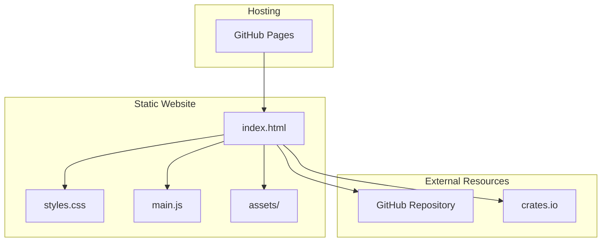

# Product Homepage Design - Product Requirements Document

## Executive Summary

### Problem Statement
MirDB is a high-performance persistent key-value store with unique capabilities combining Memcached protocol compatibility with persistent LSM-tree storage. Currently, the project lacks a public-facing homepage to communicate its value proposition, features, and usage guidance to potential users and contributors. Without a proper homepage, user adoption and community growth are hindered.

### Proposed Solution
Create a product homepage for MirDB that effectively communicates the project's purpose, key features, technical capabilities, and getting started information. The homepage will serve as the primary entry point for developers evaluating MirDB for their caching and storage needs.

### Expected Impact
- **Increased Visibility**: Establish MirDB's web presence for discoverability
- **Improved Adoption**: Lower barrier to entry for new users through clear documentation
- **Community Growth**: Provide a foundation for community engagement and contributions
- **Professional Credibility**: Position MirDB as a mature, production-ready solution

### Success Metrics
- Homepage successfully deployed and accessible
- Core product information clearly communicated
- Users can understand MirDB's value proposition within 30 seconds
- Clear call-to-action paths for getting started

---

## Requirements & Scope

### Functional Requirements

| ID | Requirement | Priority |
|----|-------------|----------|
| REQ-1 | Display product name (MirDB) and tagline prominently | Must |
| REQ-2 | Communicate core value proposition: persistent key-value store with Memcached compatibility | Must |
| REQ-3 | List key features: Memcached protocol, persistence, LSM-tree architecture | Must |
| REQ-4 | Show supported commands (SET, GET, DELETE, etc.) | Should |
| REQ-5 | Provide quick start / installation instructions | Must |
| REQ-6 | Display default configuration options | Should |
| REQ-7 | Include link to source code repository | Must |
| REQ-8 | Show project status and implemented features | Should |
| REQ-9 | Provide usage examples with code snippets | Should |
| REQ-10 | Include navigation to documentation sections | Should |

### Non-Functional Requirements

| ID | Requirement | Priority |
|----|-------------|----------|
| NFR-1 | Page must load within 3 seconds on standard connections | Must |
| NFR-2 | Homepage must be responsive across desktop, tablet, and mobile devices | Must |
| NFR-3 | Content must be accessible (WCAG 2.1 AA compliance) | Should |
| NFR-4 | Page must render correctly in modern browsers (Chrome, Firefox, Safari, Edge) | Must |
| NFR-5 | Static site with no server-side dependencies for easy hosting | Should |
| NFR-6 | SEO-optimized with proper meta tags and semantic HTML | Should |

### Out of Scope
- Interactive database playground or live demo
- User authentication or account management
- Full documentation site (only basic getting started)
- Blog or news section
- Multi-language support
- Analytics dashboard

### Success Criteria
- All Must-have requirements implemented
- Homepage passes accessibility audit
- Homepage renders correctly on all target browsers
- Content accurately represents MirDB's capabilities

---

## User Experience & Interface

### User Journey

1. **Discovery**: User lands on homepage from search engine or link
2. **Recognition**: User immediately understands MirDB is a key-value store
3. **Evaluation**: User reads features and compares to their needs
4. **Decision**: User finds quick start guide to try MirDB
5. **Action**: User follows installation steps or navigates to repository

### Interface Requirements

#### Header Section
- MirDB logo/name
- Navigation links (Features, Getting Started, Documentation, GitHub)
- Clear tagline: "Persistent Key-Value Store with Memcached Protocol"

#### Hero Section
- Compelling headline emphasizing key differentiator (persistence + Memcached compatibility)
- Brief description (2-3 sentences)
- Primary CTA: "Get Started"
- Secondary CTA: "View on GitHub"

#### Features Section
- Three key feature highlights:
  1. **Memcached Compatible**: Use existing memcached clients seamlessly
  2. **Persistent Storage**: Data survives restarts with SSTable-based storage
  3. **High Performance**: LSM-tree architecture optimized for write-heavy workloads

#### Quick Start Section
- Installation command
- Basic configuration example
- Simple usage example with SET/GET commands

#### Technical Highlights Section (Optional)
- Architecture overview (simplified)
- Supported commands list
- Default configuration values

#### Footer Section
- License information
- Repository link
- Version information

### Accessibility Considerations
- Proper heading hierarchy (h1 > h2 > h3)
- Alt text for any images
- Sufficient color contrast ratios
- Keyboard navigation support
- Screen reader compatible markup

---

## Technical Considerations

### High-Level Technical Approach
The homepage will be implemented as a static website to ensure simple deployment, fast loading, and minimal maintenance overhead. This aligns with MirDB being a developer-focused infrastructure tool where simplicity and reliability are valued.

### Integration Points
- **GitHub Repository**: Link to source code and documentation
- **Package Registry**: Link to crates.io (if published) for Rust installation

### Key Technical Constraints
- Must be hostable on static site platforms (GitHub Pages, Netlify, etc.)
- No backend server requirements
- Minimal JavaScript for progressive enhancement only
- Content must be easily updatable by contributors

### Performance Considerations
- Optimize images and assets for fast loading
- Minimize external dependencies
- Use modern CSS for styling (avoid heavy frameworks)
- Consider dark mode support for developer audience

---

## Design Specification

### Recommended Approach
Build a single-page static website using modern HTML5, CSS3, and minimal JavaScript. The site should follow a clean, developer-focused aesthetic similar to other infrastructure tool homepages (Redis, etcd, RocksDB).

### Key Technical Decisions

#### 1. Technology Stack
- **Options Considered**: React SPA, Static HTML/CSS, Static Site Generator (Hugo/Jekyll), Markdown with GitHub Pages
- **Tradeoffs**: React adds complexity for a simple page; pure HTML lacks templating; SSGs add build steps; GitHub Pages Markdown is limited in styling
- **Recommendation**: Static HTML/CSS with optional SSG (Hugo/Jekyll) for easier content updates if the team prefers templating

#### 2. Hosting Platform
- **Options Considered**: GitHub Pages, Netlify, Vercel, Self-hosted
- **Tradeoffs**: GitHub Pages is free and integrates with repo; Netlify/Vercel offer more features; self-hosted requires maintenance
- **Recommendation**: GitHub Pages for seamless integration with existing repository and zero-cost hosting

#### 3. Styling Approach
- **Options Considered**: Tailwind CSS, Custom CSS, Bootstrap, No framework
- **Tradeoffs**: Tailwind requires build process; Bootstrap is heavy; custom CSS is flexible but more work
- **Recommendation**: Custom CSS with CSS variables for theming, keeping the page lightweight and dependency-free

#### 4. Code Syntax Highlighting
- **Options Considered**: Prism.js, Highlight.js, Static pre-highlighted, No highlighting
- **Tradeoffs**: JS libraries add weight; static highlighting requires build step
- **Recommendation**: Prism.js (lightweight) for runtime highlighting of code examples

### High-Level Architecture

### Key Considerations
- **Performance**: Static assets served from CDN, minimal JS ensures sub-second load times
- **Security**: No server-side code eliminates attack surface; only external links to trusted sources
- **Scalability**: Static site scales infinitely with CDN; no server capacity concerns

### Risk Management
- **Content Accuracy Risk**: Product features may change, requiring homepage updates; mitigate by establishing content review process for releases
- **Browser Compatibility Risk**: Modern CSS features may not work in older browsers; mitigate by testing in target browsers and using progressive enhancement

### Success Criteria
- Page achieves 90+ Lighthouse performance score
- All content sections render correctly across target devices
- Users can navigate from homepage to GitHub repository in 2 clicks or fewer
- Code examples are copy-paste ready and functional

---

## User Stories

### Personas
- **Developer Dave**: A backend engineer evaluating caching solutions for a new project
- **Ops Oscar**: A DevOps engineer looking for a persistent alternative to Memcached
- **Contributor Carol**: An open-source enthusiast looking to contribute to Rust projects

### Core User Stories

#### Story 1: Understand Product Purpose
**As a** Developer Dave
**I want to** quickly understand what MirDB does
**So that** I can determine if it's relevant to my needs

**Acceptance Criteria:**
- Given I land on the homepage
- When I view the hero section
- Then I can read a clear tagline explaining MirDB's purpose within 5 seconds

**Priority:** Must
**Traceability:** REQ-1, REQ-2

---

#### Story 2: Evaluate Key Features
**As a** Ops Oscar
**I want to** see MirDB's key differentiating features
**So that** I can compare it to other solutions

**Acceptance Criteria:**
- Given I am on the homepage
- When I scroll to the features section
- Then I see at least 3 distinct features with clear descriptions

**Priority:** Must
**Traceability:** REQ-3, REQ-4

---

#### Story 3: Get Started Quickly
**As a** Developer Dave
**I want to** find installation and usage instructions
**So that** I can try MirDB in my development environment

**Acceptance Criteria:**
- Given I am on the homepage
- When I navigate to the Quick Start section
- Then I see installation commands I can copy
- And I see basic usage examples

**Priority:** Must
**Traceability:** REQ-5, REQ-9

---

#### Story 4: Access Source Code
**As a** Contributor Carol
**I want to** easily find the source code repository
**So that** I can explore the codebase and potentially contribute

**Acceptance Criteria:**
- Given I am on the homepage
- When I look for repository links
- Then I find a prominent link to the GitHub repository

**Priority:** Must
**Traceability:** REQ-7

---

#### Story 5: View Configuration Options
**As a** Ops Oscar
**I want to** see default configuration values
**So that** I can understand the tuning options available

**Acceptance Criteria:**
- Given I am on the homepage
- When I navigate to configuration information
- Then I see a list of configurable parameters with their defaults

**Priority:** Should
**Traceability:** REQ-6

---

#### Story 6: Understand Project Maturity
**As a** Developer Dave
**I want to** see the project's current status and implemented features
**So that** I can assess whether it's ready for my use case

**Acceptance Criteria:**
- Given I am on the homepage
- When I look for project status information
- Then I see which features are implemented vs planned

**Priority:** Should
**Traceability:** REQ-8

---

#### Story 7: Mobile-Friendly Access
**As a** Developer Dave
**I want to** view the homepage on my mobile device
**So that** I can research solutions while away from my desk

**Acceptance Criteria:**
- Given I access the homepage on a mobile device
- When the page loads
- Then all content is readable without horizontal scrolling
- And navigation is accessible via touch

**Priority:** Must
**Traceability:** NFR-2

---

## Dependencies & Assumptions

### Dependencies
- GitHub repository must be public and accessible for linking
- No external API dependencies for core functionality

### Assumptions
- The project will continue to be hosted as open source
- The existing GitHub repository will serve as the canonical source
- Content will be maintained by project contributors
- English is the primary (and only) language for initial release

---

## Appendices

### A. Content Reference

#### Product Description
MirDB is a persistent key-value store written in Rust that implements the Memcached protocol. It provides Memcached protocol compatibility for seamless client integration, persistent storage using SSTables, and high-performance writes through LSM-tree architecture.

#### Key Commands to Highlight
- `SET` - Store a key-value pair
- `GET` - Retrieve values by key
- `DELETE` - Remove a key
- `INFO` - Display database status (MirDB-specific)

#### Default Configuration Values
| Parameter | Default Value |
|-----------|---------------|
| Listen Address | 0.0.0.0:12333 |
| Max LSM Levels | 7 |
| Work Directory | /tmp/mirdb |
| SSTable Max Size | 100MB |
| Memtable Max Size | 4MB |
| Block Size | 4KB |

### B. Competitor Reference
For design inspiration, reference these similar project homepages:
- Redis (redis.io)
- etcd (etcd.io)
- RocksDB (rocksdb.org)
- BadgerDB (dgraph.io/badger)
