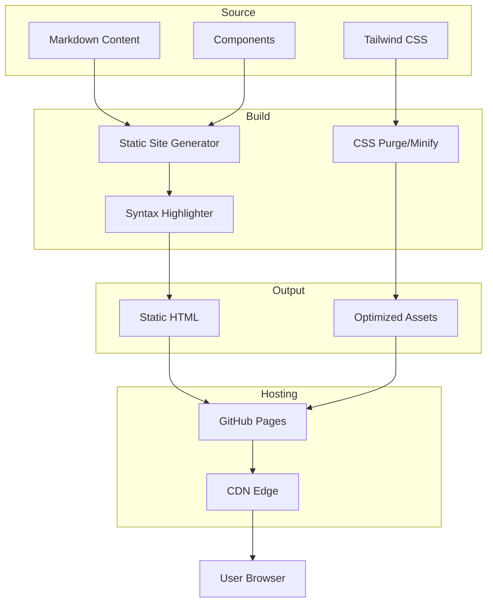

# Homepage Design Initiative - Product Requirements Document

## Executive Summary

### Problem Statement
MirDB is a persistent key-value store with memcached protocol compatibility, but currently lacks a public-facing homepage to communicate its value proposition, features, and getting-started information to potential users. Without a homepage, developers cannot easily discover, evaluate, or adopt MirDB as a solution for their data storage needs.

### Proposed Solution
Create a compelling, informative homepage that effectively communicates MirDB's unique value proposition—a persistent, memcached-compatible key-value store built on LSM-tree architecture. The homepage will serve as the primary entry point for developers and technical decision-makers to learn about MirDB, understand its capabilities, and begin using the product.

### Expected Impact
- **Increased Discoverability**: Provide a central location for users to learn about MirDB
- **Faster Adoption**: Enable developers to quickly understand and start using MirDB
- **Clearer Positioning**: Differentiate MirDB from both memcached (by highlighting persistence) and other databases (by highlighting memcached compatibility)
- **Community Growth**: Attract contributors and users to the open-source project

### Success Metrics
- Homepage loads in under 2 seconds on standard connections
- Clear path from landing to first successful connection (measurable via analytics)
- Bounce rate below 40% for first-time visitors
- Documentation click-through rate above 30%

---

## Requirements & Scope

### Functional Requirements

| ID | Requirement | Priority |
|----|-------------|----------|
| REQ-1 | Display clear product name, tagline, and value proposition above the fold | Must |
| REQ-2 | Present key features (memcached compatibility, persistence, LSM-tree architecture) in scannable format | Must |
| REQ-3 | Include quick-start section with connection example code | Must |
| REQ-4 | Show supported memcached commands (GET, SET, DELETE, etc.) | Should |
| REQ-5 | Display project status including implemented and planned features | Should |
| REQ-6 | Provide links to source code repository | Must |
| REQ-7 | Include configuration defaults for quick reference | Should |
| REQ-8 | Display architecture overview diagram | Should |
| REQ-9 | Include navigation to detailed documentation | Must |
| REQ-10 | Provide clear call-to-action for getting started | Must |

### Non-Functional Requirements

| ID | Requirement | Priority |
|----|-------------|----------|
| NFR-1 | Page must load within 2 seconds on 3G connections | Must |
| NFR-2 | Homepage must be responsive across desktop, tablet, and mobile viewports | Must |
| NFR-3 | Must meet WCAG 2.1 AA accessibility standards | Must |
| NFR-4 | Static content must be cacheable for improved performance | Should |
| NFR-5 | All interactive elements must be keyboard navigable | Must |
| NFR-6 | Code examples must have syntax highlighting | Should |
| NFR-7 | Page should function without JavaScript for core content | Should |

### Out of Scope
- User authentication or account management
- Interactive database playground or live demo environment
- Full API documentation (separate documentation site)
- Blog or news section
- Community forum integration
- Internationalization/localization
- Analytics dashboard or admin interface

### Success Criteria
- All "Must" priority requirements implemented and verified
- Page passes Lighthouse performance score of 90+
- Page passes accessibility audit with no critical issues
- All links functional and pointing to correct destinations
- Design reviewed and approved by stakeholders

---

## User Stories

### Personas
1. **Developer Dave** - A backend developer evaluating caching solutions for a new project
2. **Architect Anna** - A technical architect comparing database technologies
3. **Contributor Chris** - An open-source enthusiast looking for interesting projects

### Core Stories

#### Story 1: First Impression
**As a** Developer Dave visiting for the first time,
**I want to** immediately understand what MirDB is and why I should care,
**So that** I can quickly decide if it's relevant to my needs.

**Acceptance Criteria:**
- Given I land on the homepage
- When the page loads
- Then I see a clear product name and tagline within 1 second
- And I understand MirDB is a persistent memcached-compatible store
- And I can see the key differentiators without scrolling

**Traceability:** REQ-1, REQ-2, NFR-1

**Priority:** Must

---

#### Story 2: Feature Discovery
**As a** Developer Dave evaluating MirDB,
**I want to** see detailed feature information,
**So that** I can assess if MirDB meets my technical requirements.

**Acceptance Criteria:**
- Given I am on the homepage
- When I scroll to the features section
- Then I see memcached protocol compatibility highlighted
- And I see persistence capabilities explained
- And I see LSM-tree architecture benefits listed
- And I see the list of supported commands

**Traceability:** REQ-2, REQ-4, REQ-8

**Priority:** Must

---

#### Story 3: Quick Start
**As a** Developer Dave who wants to try MirDB,
**I want to** find clear getting-started instructions,
**So that** I can have MirDB running quickly.

**Acceptance Criteria:**
- Given I want to start using MirDB
- When I navigate to the quick-start section
- Then I see installation or build instructions
- And I see a code example showing how to connect
- And I see the default connection address (0.0.0.0:12333)
- And the code example has syntax highlighting

**Traceability:** REQ-3, REQ-7, REQ-10, NFR-6

**Priority:** Must

---

#### Story 4: Architecture Understanding
**As an** Architect Anna evaluating MirDB for enterprise use,
**I want to** understand the technical architecture,
**So that** I can assess performance characteristics and trade-offs.

**Acceptance Criteria:**
- Given I want to understand MirDB's architecture
- When I view the architecture section
- Then I see a clear diagram of the LSM-tree data flow
- And I understand the write path (WAL -> Memtable -> SSTable)
- And I understand the compaction strategy
- And I can see key configuration parameters

**Traceability:** REQ-8, REQ-7

**Priority:** Should

---

#### Story 5: Project Status Assessment
**As an** Architect Anna making technology decisions,
**I want to** understand the project's maturity and roadmap,
**So that** I can assess risk and future capabilities.

**Acceptance Criteria:**
- Given I want to evaluate project maturity
- When I view the status section
- Then I see what features are currently implemented
- And I see planned features (e.g., Raft consensus)
- And I can find a link to the source repository

**Traceability:** REQ-5, REQ-6

**Priority:** Should

---

#### Story 6: Mobile Access
**As a** Developer Dave on my phone,
**I want to** view the homepage on mobile,
**So that** I can research MirDB while away from my desk.

**Acceptance Criteria:**
- Given I access the homepage from a mobile device
- When the page loads
- Then all content is readable without horizontal scrolling
- And navigation is accessible via mobile-friendly controls
- And code examples are scrollable horizontally if needed

**Traceability:** NFR-2, NFR-5

**Priority:** Must

---

#### Story 7: Accessible Experience
**As a** user with visual impairments,
**I want to** navigate the homepage with a screen reader,
**So that** I can access all information about MirDB.

**Acceptance Criteria:**
- Given I use a screen reader
- When I navigate the homepage
- Then all images have descriptive alt text
- And all interactive elements are properly labeled
- And heading hierarchy is logical
- And I can navigate using keyboard only

**Traceability:** NFR-3, NFR-5

**Priority:** Must

---

## User Experience & Interface

### User Journey

```
Landing → Understand Value Prop → Explore Features → View Quick Start → Take Action
   │              │                      │                 │              │
   ▼              ▼                      ▼                 ▼              ▼
Hero Section → Key Features → Commands/Architecture → Code Example → CTA/Links
```

### Interface Requirements

#### Hero Section
- Product name: "MirDB"
- Tagline communicating core value (persistent + memcached-compatible)
- Primary CTA: "Get Started"
- Secondary CTA: "View on GitHub"

#### Features Section
- Three key feature cards:
  1. **Memcached Compatible**: Existing clients work seamlessly
  2. **Persistent Storage**: Data survives restarts via SSTable
  3. **High Performance**: LSM-tree architecture optimized for writes

#### Quick Start Section
- Connection example using standard memcached client
- Default configuration reference
- Copy-to-clipboard functionality for code snippets

#### Architecture Section
- Visual diagram showing data flow (WAL → Memtable → SSTable levels)
- Brief explanation of LSM-tree benefits

#### Footer
- Links to: Documentation, GitHub Repository, License
- Project status badge

### Accessibility Considerations
- Color contrast ratio minimum 4.5:1 for all text
- Focus indicators visible on all interactive elements
- Skip-to-content link for keyboard users
- Responsive font sizing using relative units

---

## Design Specification

### Recommended Approach
Build a static, single-page website using modern web technologies that prioritize performance, accessibility, and maintainability. The page should be deployable as static files with no server-side dependencies.

### Key Technical Decisions

#### 1. Framework/Technology Stack
- **Options Considered**: React SPA, Vue.js, Static HTML/CSS, Static Site Generator (Hugo/Astro)
- **Tradeoffs**:
  - React/Vue: Rich interactivity but larger bundle, requires build toolchain
  - Static HTML/CSS: Simplest, fastest, but harder to maintain
  - Static Site Generator: Balance of maintainability and performance
- **Recommendation**: Static Site Generator (Astro or Hugo) for optimal performance with maintainable component structure

#### 2. Styling Approach
- **Options Considered**: Plain CSS, Tailwind CSS, CSS-in-JS, CSS Modules
- **Tradeoffs**:
  - Plain CSS: No build step but harder to maintain consistency
  - Tailwind: Utility-first, small bundle with purging, fast development
  - CSS-in-JS: Component-scoped but runtime overhead
- **Recommendation**: Tailwind CSS for rapid development and small production bundle with purge

#### 3. Code Syntax Highlighting
- **Options Considered**: Prism.js, Highlight.js, Shiki, Build-time highlighting
- **Tradeoffs**:
  - Runtime libraries add JavaScript weight
  - Build-time highlighting is zero-runtime but less flexible
- **Recommendation**: Build-time syntax highlighting (Shiki) for zero runtime cost

#### 4. Hosting/Deployment
- **Options Considered**: GitHub Pages, Netlify, Vercel, Self-hosted
- **Tradeoffs**:
  - GitHub Pages: Free, integrated with repo, limited features
  - Netlify/Vercel: More features, CDN, easy previews
  - Self-hosted: Full control but operational overhead
- **Recommendation**: GitHub Pages for simplicity and integration with existing repository

### High-Level Architecture



### Key Considerations

- **Performance**: Static generation eliminates server response time; aggressive asset optimization keeps bundle under 100KB
- **Security**: No server-side code or user input reduces attack surface to near zero
- **Scalability**: Static files served via CDN scale infinitely with no infrastructure changes

### Risk Management

- **Technical Risk 1**: Complex diagrams may not render well on all devices. Mitigation: Use SVG with responsive viewBox and test across viewport sizes.
- **Technical Risk 2**: Code examples may become outdated as MirDB evolves. Mitigation: Source code examples from tested documentation that stays in sync with the codebase.

### Success Criteria
- Lighthouse performance score of 90+ on mobile
- All content accessible without JavaScript
- Page weight under 100KB (excluding images)
- Build and deploy completes in under 2 minutes

---

## Dependencies & Assumptions

### Dependencies
- GitHub repository access for hosting on GitHub Pages
- MirDB documentation for accurate feature and command information
- Design assets (logo, icons) if not already available

### Assumptions
- MirDB will continue to support the memcached protocol as its primary interface
- The project will remain open-source and publicly accessible
- No authentication or dynamic content is required for the homepage
- English is the only required language for initial release

---

## Appendices

### A. Content Reference

#### Supported Commands (from Knowledge Base)
- **Storage**: SET, ADD, REPLACE, APPEND, PREPEND
- **Retrieval**: GET, GETS
- **Deletion**: DELETE
- **MirDB-specific**: INFO, MAJOR_COMPACTION

#### Default Configuration Values
| Parameter | Default Value |
|-----------|---------------|
| Listen Address | 0.0.0.0:12333 |
| Max LSM Levels | 7 |
| Work Directory | /tmp/mirdb |
| SSTable Max Size | 100MB |
| Memtable Max Size | 4MB |
| Block Size | 4KB |

### B. Reference Architecture Diagram

```
Write Request
    │
    ▼
┌─────────┐
│   WAL   │──── (Write-Ahead Log for durability)
└────┬────┘
     │
     ▼
┌──────────┐
│ Memtable │──── (Active in-memory skip list)
└────┬─────┘
     │ (when full)
     ▼
┌────────────────┐
│ Imm Memtables  │──── (Immutable memtables queue)
└───────┬────────┘
        │ (minor compaction)
        ▼
┌───────────────┐
│ Level 0 SSTs  │──── (Recently flushed, may overlap)
└───────┬───────┘
        │ (major compaction)
        ▼
┌───────────────┐
│ Level 1+ SSTs │──── (Sorted, non-overlapping within level)
└───────────────┘
```

### C. Requirement Traceability Matrix

| Requirement | User Stories | Design Section |
|-------------|--------------|----------------|
| REQ-1 | Story 1 | Hero Section |
| REQ-2 | Story 1, 2 | Features Section |
| REQ-3 | Story 3 | Quick Start Section |
| REQ-4 | Story 2 | Features Section |
| REQ-5 | Story 5 | Footer/Status |
| REQ-6 | Story 5 | Footer |
| REQ-7 | Story 3, 4 | Quick Start, Architecture |
| REQ-8 | Story 2, 4 | Architecture Section |
| REQ-9 | Story 3 | Navigation, Footer |
| REQ-10 | Story 3 | Hero Section, Quick Start |
| NFR-1 | Story 1 | Design Specification |
| NFR-2 | Story 6 | UI Requirements |
| NFR-3 | Story 7 | Accessibility |
| NFR-5 | Story 6, 7 | Accessibility |
| NFR-6 | Story 3 | Design Specification |
