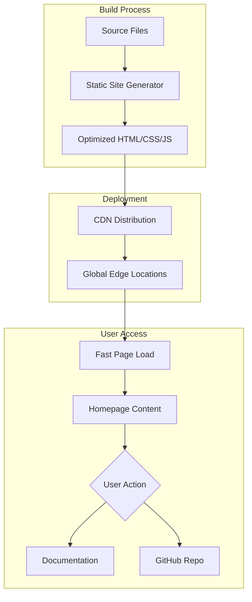

# Product Homepage Design - Product Requirements Document

## Executive Summary

### Problem Statement
MirDB is a powerful persistent key-value store with memcached protocol compatibility, but it currently lacks a dedicated homepage to communicate its value proposition, features, and differentiation to potential users. Without a clear entry point, developers and DevOps engineers cannot easily discover, understand, or evaluate MirDB for their use cases.

### Proposed Solution
Create a compelling, informative product homepage that effectively communicates MirDB's unique value proposition as a persistent key-value store with memcached compatibility. The homepage will serve as the primary marketing and information resource for potential users, providing clear messaging, feature highlights, and pathways to adoption.

### Expected Impact
- **Increased Discoverability**: Provide a clear entry point for developers searching for persistent key-value storage solutions
- **Improved Understanding**: Help users quickly grasp MirDB's capabilities and use cases
- **Accelerated Adoption**: Reduce time-to-evaluation by providing clear documentation paths and quick-start information
- **Brand Establishment**: Position MirDB as a professional, reliable open-source project

### Success Metrics
- Homepage bounce rate below 40%
- Average time on page above 2 minutes
- Click-through rate to documentation/GitHub above 25%
- Conversion to GitHub stars/forks (tracked via referral analytics)

---

## Requirements & Scope

### Functional Requirements

| ID | Requirement | Priority |
|----|-------------|----------|
| REQ-1 | Display clear product branding with MirDB name and logo | Must |
| REQ-2 | Present a concise value proposition headline explaining what MirDB is | Must |
| REQ-3 | Highlight key features: memcached compatibility, persistence, LSM tree architecture | Must |
| REQ-4 | Provide quick-start code example showing basic usage | Must |
| REQ-5 | Include clear call-to-action buttons (Get Started, Documentation, GitHub) | Must |
| REQ-6 | Display current project status and implemented features | Should |
| REQ-7 | Show configuration options and default settings | Should |
| REQ-8 | Include comparison section differentiating MirDB from memcached and other KV stores | Should |
| REQ-9 | Provide navigation to documentation, GitHub repository, and community resources | Must |
| REQ-10 | Display supported commands and protocol information | Could |
| REQ-11 | Include performance characteristics and benchmarks section | Could |
| REQ-12 | Show architecture diagram illustrating LSM tree data flow | Should |

### Non-Functional Requirements

| ID | Requirement | Priority |
|----|-------------|----------|
| NFR-1 | Page load time under 3 seconds on standard broadband connection | Must |
| NFR-2 | Fully responsive design supporting mobile, tablet, and desktop viewports | Must |
| NFR-3 | Accessible according to WCAG 2.1 AA guidelines | Must |
| NFR-4 | SEO-optimized with appropriate meta tags, structured data, and semantic HTML | Should |
| NFR-5 | Support for dark mode based on system preferences | Could |
| NFR-6 | Cross-browser compatibility (Chrome, Firefox, Safari, Edge - latest 2 versions) | Must |
| NFR-7 | Static site deployment capability (no server-side rendering required) | Should |

### Out of Scope
- User authentication or account management
- Interactive database playground or live demo environment
- Blog or news section
- Multi-language internationalization (initial version English only)
- E-commerce or pricing pages
- Community forum integration

### Success Criteria
- All "Must" priority requirements implemented and verified
- Page passes Lighthouse performance audit with score above 90
- Page passes accessibility audit with no critical issues
- Stakeholder approval on design and messaging

---

## User Stories

### Personas
1. **Developer Dave**: A backend developer evaluating key-value stores for a new project
2. **DevOps Dana**: An operations engineer looking for memcached alternatives with persistence
3. **Architect Alex**: A technical lead researching storage solutions for system design

### Core Stories

#### US-1: Understand Product Value
**As a** Developer Dave
**I want** to quickly understand what MirDB is and why I should use it
**So that** I can determine if it fits my project requirements

**Acceptance Criteria:**
```gherkin
Given I land on the MirDB homepage
When I view the hero section
Then I see a clear headline explaining MirDB is a persistent key-value store
And I see a subheadline mentioning memcached protocol compatibility
And I can understand the core value proposition within 10 seconds
```
**Traceability:** REQ-1, REQ-2
**Priority:** Must

#### US-2: Evaluate Key Features
**As a** DevOps Dana
**I want** to see MirDB's key features and capabilities
**So that** I can compare it against other solutions I'm considering

**Acceptance Criteria:**
```gherkin
Given I am on the MirDB homepage
When I scroll to the features section
Then I see memcached protocol compatibility highlighted
And I see persistence capabilities explained
And I see LSM tree architecture mentioned with benefits
And each feature has a brief explanation of its value
```
**Traceability:** REQ-3, REQ-6
**Priority:** Must

#### US-3: Quick Start Evaluation
**As a** Developer Dave
**I want** to see a quick-start code example
**So that** I can understand how easy it is to integrate MirDB

**Acceptance Criteria:**
```gherkin
Given I am on the MirDB homepage
When I view the quick-start section
Then I see installation/setup commands
And I see a basic code example showing SET/GET operations
And I see the default connection address (0.0.0.0:12333)
And I can copy the code examples to my clipboard
```
**Traceability:** REQ-4, REQ-7
**Priority:** Must

#### US-4: Navigate to Resources
**As a** Architect Alex
**I want** to easily navigate to documentation and source code
**So that** I can perform deeper technical evaluation

**Acceptance Criteria:**
```gherkin
Given I am on the MirDB homepage
When I look for navigation options
Then I see a prominent "Get Started" button
And I see a link to full documentation
And I see a link to the GitHub repository
And all links open in appropriate contexts (same/new tab as suitable)
```
**Traceability:** REQ-5, REQ-9
**Priority:** Must

#### US-5: Understand Architecture
**As a** Architect Alex
**I want** to understand MirDB's internal architecture
**So that** I can assess its suitability for my performance requirements

**Acceptance Criteria:**
```gherkin
Given I am on the MirDB homepage
When I scroll to the architecture section
Then I see a diagram showing the LSM tree data flow
And I understand the write path (WAL -> Memtable -> SSTable)
And I understand the compaction process
And I can see default configuration values
```
**Traceability:** REQ-12, REQ-7
**Priority:** Should

#### US-6: Compare with Alternatives
**As a** DevOps Dana
**I want** to see how MirDB compares to plain memcached
**So that** I can justify choosing MirDB over alternatives

**Acceptance Criteria:**
```gherkin
Given I am on the MirDB homepage
When I view the comparison section
Then I see a clear comparison with memcached
And I understand that MirDB adds persistence where memcached doesn't
And I see that existing memcached clients work with MirDB
```
**Traceability:** REQ-8
**Priority:** Should

---

## User Experience & Interface

### User Journey
1. **Landing**: User arrives via search, referral, or direct link
2. **Discovery**: Hero section immediately communicates value proposition
3. **Exploration**: User scrolls through features, architecture, and comparison sections
4. **Evaluation**: User reviews quick-start example and configuration options
5. **Action**: User clicks through to documentation or GitHub to begin adoption

### Interface Requirements

#### Hero Section
- Large, clear product name and logo
- Compelling headline (e.g., "Persistent Key-Value Storage with Memcached Compatibility")
- Brief subheadline elaborating on key benefits
- Primary CTA button ("Get Started") and secondary CTA ("View on GitHub")

#### Features Section
- Grid or card layout highlighting 3-4 key features
- Icons or illustrations for each feature
- Concise descriptions focusing on user benefits

#### Quick Start Section
- Syntax-highlighted code blocks
- Copy-to-clipboard functionality
- Progressive disclosure (basic example first, advanced options linked)

#### Architecture Section
- Visual diagram showing data flow
- Brief explanations of components
- Link to detailed documentation

#### Footer
- Navigation links
- GitHub repository link
- License information

### Accessibility Considerations
- Semantic HTML structure with proper heading hierarchy
- Sufficient color contrast ratios (4.5:1 minimum)
- Keyboard navigation support
- Alt text for all images and diagrams
- Screen reader-friendly code blocks

---

## Technical Considerations

### High-Level Technical Approach
The homepage will be built as a static site to ensure fast load times, easy deployment, and minimal maintenance overhead. Modern frontend tooling will enable component-based development while producing optimized static output.

### Integration Points
- **GitHub Repository**: Links and potentially embedded repository information (stars, latest release)
- **Documentation Site**: Navigation integration if separate documentation exists
- **Analytics**: Integration with privacy-respecting analytics (e.g., Plausible, Fathom)

### Key Technical Constraints
- Must be deployable as static files (GitHub Pages, Netlify, Vercel compatible)
- No server-side dependencies for core functionality
- Must work without JavaScript for core content (progressive enhancement)

### Performance Considerations
- Optimized images (WebP format with fallbacks)
- Minimal JavaScript bundle size
- Critical CSS inlining
- Lazy loading for below-fold content

---

## Design Specification

### Recommended Approach
Build a single-page static site using a modern static site generator or framework, focusing on clean design, fast performance, and clear information hierarchy that guides users from value proposition to action.

### Key Technical Decisions

#### 1. Framework/Build Tool
- **Options Considered**: Plain HTML/CSS, Astro, Next.js (static export), Hugo, Eleventy
- **Tradeoffs**: Plain HTML offers simplicity but lacks component reuse; full frameworks add complexity but enable better developer experience; static site generators balance both
- **Recommendation**: Astro or similar lightweight framework - provides component architecture without heavy JavaScript runtime, excellent performance defaults

#### 2. Styling Approach
- **Options Considered**: Plain CSS, Tailwind CSS, CSS Modules, Styled Components
- **Tradeoffs**: Plain CSS is universal but harder to maintain; utility-first CSS (Tailwind) enables rapid development; CSS-in-JS adds runtime overhead
- **Recommendation**: Tailwind CSS - rapid development, small production bundle via purging, good documentation patterns

#### 3. Deployment Platform
- **Options Considered**: GitHub Pages, Netlify, Vercel, Cloudflare Pages
- **Tradeoffs**: GitHub Pages is simple but limited; Netlify/Vercel offer more features; all are free for static sites
- **Recommendation**: GitHub Pages or Netlify - both integrate well with GitHub repos, provide CDN distribution

#### 4. Code Highlighting
- **Options Considered**: Prism.js, Highlight.js, Shiki (build-time)
- **Tradeoffs**: Runtime highlighting affects performance; build-time adds complexity but zero runtime cost
- **Recommendation**: Shiki or build-time Prism - syntax highlighting at build time for zero runtime JavaScript

### High-Level Architecture



### Key Considerations

- **Performance**: Static generation ensures sub-second TTFB; optimized assets and lazy loading keep total load under 3 seconds
- **Security**: Static sites have minimal attack surface; no server-side vulnerabilities; CSP headers for additional protection
- **Scalability**: CDN distribution handles any traffic volume; no server resources to scale

### Risk Management

- **Technical Risk - Framework Lock-in**: Using a framework may create maintenance burden if it becomes unmaintained. Mitigation: Choose mature, well-supported framework with active community.
- **Technical Risk - Performance Regression**: Future additions may degrade performance. Mitigation: Establish Lighthouse CI checks to catch regressions.
- **Technical Risk - Browser Compatibility**: Modern CSS/JS may not work in older browsers. Mitigation: Define browser support matrix and test accordingly.

### Success Criteria

- Lighthouse performance score > 90
- First Contentful Paint < 1.5 seconds
- Total page weight < 500KB (excluding images)
- All functional requirements implemented and working

---

## Dependencies & Assumptions

### Dependencies
- Access to MirDB branding assets (logo, color scheme) or authority to create them
- Final copy/messaging approval from project maintainers
- GitHub repository access for deployment integration

### Assumptions
- MirDB will remain open-source and freely available
- Documentation will be available at a linkable URL
- Project maintainers will provide feedback on messaging accuracy
- No immediate need for internationalization

---

## Appendices

### A. MirDB Feature Summary (for messaging reference)

| Feature | User Benefit |
|---------|--------------|
| Memcached Protocol | Drop-in replacement - existing clients work immediately |
| Persistence | Data survives restarts - no cold cache problem |
| LSM Tree Architecture | High write throughput with efficient storage |
| Rust Implementation | Memory safety and performance without garbage collection |
| Configurable | Tune for your workload - memory limits, compaction triggers, etc. |

### B. Supported Commands Reference

Storage: `SET`, `ADD`, `REPLACE`, `APPEND`, `PREPEND`
Retrieval: `GET`, `GETS`
Deletion: `DELETE`
Admin: `INFO`, `MAJOR_COMPACTION`

### C. Default Configuration Values

| Setting | Default |
|---------|---------|
| Listen Address | 0.0.0.0:12333 |
| Work Directory | /tmp/mirdb |
| Max LSM Levels | 7 |
| Memtable Max Size | 4MB |
| SSTable Max Size | 100MB |
| Block Size | 4KB |
