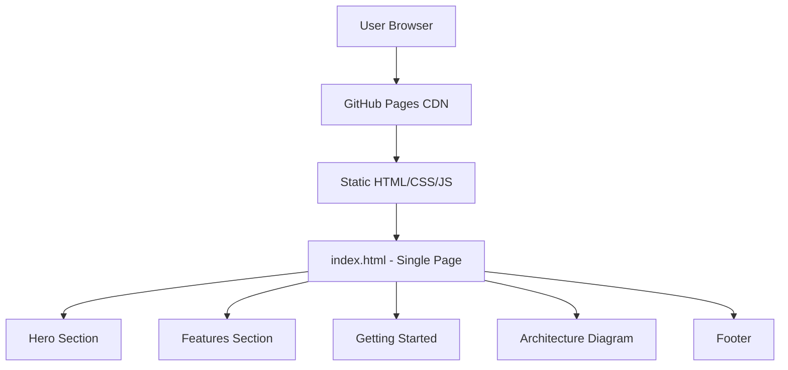

# Product Homepage Design - Product Requirements Document

## Executive Summary

### Problem Statement
MirDB is a persistent key-value store with memcached protocol support, but currently lacks a public-facing homepage to communicate its value proposition, features, and usage instructions to potential users. Without a homepage, discovery and adoption of the product is limited, and users have no centralized resource to understand what MirDB offers or how to get started.

### Proposed Solution
Create a compelling, informative homepage for MirDB that clearly communicates the product's unique value proposition (persistence + memcached compatibility), highlights key features and architecture, provides getting started guidance, and establishes credibility for the project.

### Expected Impact
- **Increased Discoverability**: Provide a central landing page for users discovering MirDB
- **Improved Adoption**: Clear documentation and getting started guides reduce barriers to entry
- **Professional Credibility**: A well-designed homepage establishes trust and project maturity
- **User Education**: Help potential users understand when and why to use MirDB over alternatives

### Success Metrics
- Homepage successfully deployed and accessible
- All key product features clearly communicated
- Getting started guide enables users to run MirDB within 5 minutes
- Page loads within 2 seconds on standard connections

---

## Requirements & Scope

### Functional Requirements

| ID | Requirement | Priority |
|----|-------------|----------|
| REQ-1 | Display product name, tagline, and value proposition prominently | Must |
| REQ-2 | Present key features with clear descriptions (persistence, memcached compatibility, LSM architecture) | Must |
| REQ-3 | Provide getting started section with installation and basic usage instructions | Must |
| REQ-4 | Show supported memcached commands with examples | Should |
| REQ-5 | Display default configuration parameters | Should |
| REQ-6 | Include architecture overview with visual diagram | Should |
| REQ-7 | Provide links to source code repository | Must |
| REQ-8 | Include project status and roadmap (e.g., upcoming Raft consensus) | Could |
| REQ-9 | Responsive design for mobile and desktop viewing | Must |
| REQ-10 | Provide code snippets with syntax highlighting | Should |

### Non-Functional Requirements

| ID | Requirement | Priority |
|----|-------------|----------|
| NFR-1 | Page load time under 2 seconds on 3G connections | Must |
| NFR-2 | Accessible according to WCAG 2.1 AA standards | Should |
| NFR-3 | SEO-optimized with appropriate meta tags and semantic HTML | Should |
| NFR-4 | Cross-browser compatibility (Chrome, Firefox, Safari, Edge) | Must |
| NFR-5 | No external tracking or analytics without user consent | Could |
| NFR-6 | Static site generation for minimal hosting requirements | Should |

### Out of Scope
- User authentication or accounts
- Interactive database demo or playground
- Blog or news section
- Community forum or discussion features
- Internationalization/localization
- Backend API for the homepage

### Success Criteria
- All "Must" requirements implemented and verified
- Homepage passes Lighthouse performance audit with score > 80
- Homepage renders correctly on desktop (1920x1080) and mobile (375x667)
- All links functional and content accurate to current MirDB capabilities

---

## User Stories

### Personas
1. **Developer Evaluator**: A backend developer researching key-value stores for a new project
2. **Existing Memcached User**: A developer using memcached who needs persistence
3. **Open Source Contributor**: A developer interested in contributing to the project

### Core Stories

#### US-1: Understand Product Value
**As a** Developer Evaluator
**I want to** quickly understand what MirDB does and why it's different
**So that** I can decide if it's worth evaluating further

**Acceptance Criteria:**
- Given I land on the homepage
- When I view the hero section
- Then I see the product name, a clear tagline, and 2-3 key differentiators within 5 seconds

**Priority:** Must
**Traceability:** REQ-1, REQ-2

#### US-2: Learn Key Features
**As a** Developer Evaluator
**I want to** see the main features and capabilities of MirDB
**So that** I can assess if it meets my technical requirements

**Acceptance Criteria:**
- Given I am on the homepage
- When I scroll to the features section
- Then I see at least 3 key features (persistence, memcached protocol, LSM architecture) with brief descriptions

**Priority:** Must
**Traceability:** REQ-2

#### US-3: Get Started Quickly
**As an** Existing Memcached User
**I want to** find installation and basic usage instructions
**So that** I can try MirDB with minimal effort

**Acceptance Criteria:**
- Given I am on the homepage
- When I navigate to the getting started section
- Then I see step-by-step instructions to install and run MirDB
- And I see example commands to connect and perform basic operations

**Priority:** Must
**Traceability:** REQ-3, REQ-4, REQ-10

#### US-4: Understand Command Compatibility
**As an** Existing Memcached User
**I want to** see which memcached commands are supported
**So that** I know if my existing code will work with MirDB

**Acceptance Criteria:**
- Given I am on the homepage
- When I view the commands section
- Then I see a list of supported commands (SET, GET, DELETE, etc.)
- And I see example syntax for common operations

**Priority:** Should
**Traceability:** REQ-4, REQ-10

#### US-5: View Architecture Overview
**As a** Developer Evaluator
**I want to** understand MirDB's internal architecture
**So that** I can assess its reliability and performance characteristics

**Acceptance Criteria:**
- Given I am on the homepage
- When I view the architecture section
- Then I see a visual diagram of the LSM tree data flow
- And I understand the relationship between WAL, memtable, and SSTables

**Priority:** Should
**Traceability:** REQ-6

#### US-6: Access Source Code
**As an** Open Source Contributor
**I want to** easily find links to the source repository
**So that** I can explore the codebase and potentially contribute

**Acceptance Criteria:**
- Given I am on the homepage
- When I look for repository links
- Then I find a prominent link to the source code repository
- And I can see the project's open source status

**Priority:** Must
**Traceability:** REQ-7

#### US-7: View on Mobile Device
**As a** Developer Evaluator
**I want to** view the homepage on my mobile device
**So that** I can research MirDB while away from my desktop

**Acceptance Criteria:**
- Given I access the homepage on a mobile device (375px width)
- When the page loads
- Then all content is readable without horizontal scrolling
- And navigation is accessible via mobile-friendly controls

**Priority:** Must
**Traceability:** REQ-9, NFR-4

---

## User Experience & Interface

### User Journey
1. **Arrival**: User lands on homepage from search engine, link, or direct URL
2. **First Impression**: Hero section immediately communicates product value (< 5 seconds)
3. **Exploration**: User scrolls to learn about features and architecture
4. **Action**: User navigates to getting started section or source repository
5. **Conversion**: User downloads/installs MirDB or bookmarks for later

### Interface Requirements

#### Hero Section
- Product logo/name prominently displayed
- Clear tagline: "Persistent Key-Value Store with Memcached Protocol"
- 2-3 bullet points highlighting key differentiators
- Primary CTA: "Get Started" button
- Secondary CTA: "View on GitHub" link

#### Features Section
- Card-based layout showcasing 3-4 key features:
  - **Memcached Compatible**: Drop-in replacement for existing memcached clients
  - **Persistent Storage**: Data survives restarts via SSTable storage
  - **LSM Architecture**: Efficient writes with background compaction
  - **Async Performance**: Built on Tokio for high-throughput operations

#### Getting Started Section
- Step-by-step numbered instructions
- Code blocks with copy functionality
- Example commands demonstrating basic operations

#### Architecture Section
- Visual diagram showing data flow (WAL → Memtable → SSTable)
- Brief explanation of LSM tree benefits

#### Footer
- Links to repository, license, documentation
- Configuration reference

### Accessibility Considerations
- Semantic HTML structure (proper heading hierarchy)
- Sufficient color contrast ratios (4.5:1 minimum)
- Alt text for all images and diagrams
- Keyboard navigable interface
- Screen reader compatible

---

## Technical Considerations

### High-Level Technical Approach
The homepage will be implemented as a static website to ensure fast load times, minimal hosting requirements, and easy deployment. The site should integrate seamlessly with the existing MirDB repository structure.

### Integration Points
- **Repository**: Homepage source should reside within or alongside the MirDB repository
- **Deployment**: Compatible with GitHub Pages, Netlify, or similar static hosting
- **Documentation**: Links to any existing documentation or README files

### Key Technical Constraints
- Must be buildable without complex dependencies
- Should support standard web technologies (HTML, CSS, JavaScript)
- Code snippets must support syntax highlighting for shell commands and protocol examples

### Performance Considerations
- Minimize JavaScript payload
- Optimize images and diagrams
- Use efficient CSS (avoid large frameworks if not necessary)
- Consider lazy loading for below-fold content

---

## Design Specification

### Recommended Approach
Implement a single-page static website using modern HTML/CSS with minimal JavaScript, deployed via GitHub Pages or similar static hosting service. The design should prioritize clarity, fast loading, and ease of maintenance.

### Key Technical Decisions

#### 1. Static Site Generator vs. Plain HTML
- **Options Considered**: Plain HTML/CSS, Jekyll, Hugo, Astro, 11ty
- **Tradeoffs**: Plain HTML offers simplicity but less maintainability; SSGs add build complexity but provide templating and better organization
- **Recommendation**: Plain HTML/CSS for initial implementation due to simplicity and minimal content; migrate to SSG if content grows significantly

#### 2. CSS Framework vs. Custom CSS
- **Options Considered**: Tailwind CSS, Bootstrap, Custom CSS, No framework
- **Tradeoffs**: Frameworks accelerate development but increase bundle size; custom CSS is lighter but requires more effort
- **Recommendation**: Custom CSS with CSS variables for theming; keeps bundle minimal and avoids framework lock-in

#### 3. Code Syntax Highlighting
- **Options Considered**: Prism.js, Highlight.js, Server-side highlighting, No highlighting
- **Tradeoffs**: JS libraries add weight; server-side adds build complexity; no highlighting reduces readability
- **Recommendation**: Prism.js (lightweight) loaded asynchronously to highlight code blocks without blocking render

#### 4. Hosting Platform
- **Options Considered**: GitHub Pages, Netlify, Vercel, Self-hosted
- **Tradeoffs**: GitHub Pages integrates with repo but limited features; Netlify/Vercel offer more features but add external dependency
- **Recommendation**: GitHub Pages for tight integration with existing repository and zero cost

### High-Level Architecture

### Key Considerations
- **Performance**: Static files served via CDN ensure sub-second load times; minimal JS keeps payload under 100KB
- **Security**: No server-side code eliminates attack surface; CSP headers recommended for additional protection
- **Scalability**: Static hosting scales infinitely with CDN; no backend bottlenecks

### Risk Management
- **Content Accuracy Risk**: Homepage content may become outdated as MirDB evolves; mitigation: document update process and link to authoritative sources (README, docs)
- **Browser Compatibility Risk**: Custom CSS may render differently across browsers; mitigation: test on major browsers and use CSS resets

### Success Criteria
- Homepage loads in under 2 seconds on throttled 3G connection
- Lighthouse performance score > 80
- All content accurately reflects current MirDB capabilities
- Responsive layout verified on desktop and mobile viewports

---

## Business Impact & Metrics

### Business Objectives
- Establish MirDB's online presence and brand identity
- Reduce barrier to entry for new users
- Increase project visibility and adoption

### Success Metrics and Measurement
| Metric | Target | Measurement Method |
|--------|--------|-------------------|
| Page Views | Establish baseline | Analytics (if implemented) |
| Time to First Byte | < 200ms | Lighthouse/WebPageTest |
| First Contentful Paint | < 1.5s | Lighthouse |
| Bounce Rate | < 60% | Analytics (if implemented) |
| GitHub Repository Traffic | Increase referrals | GitHub Insights |

### User Adoption Targets
- Users can go from landing on homepage to running MirDB in under 5 minutes
- Getting started section provides complete, copyable commands

---

## Dependencies & Assumptions

### Dependencies
- Access to MirDB repository for deployment configuration
- Domain or subdomain for hosting (or use default GitHub Pages URL)
- Current product documentation and feature list for content accuracy

### Assumptions
- GitHub Pages (or similar) is acceptable as hosting solution
- No custom backend or dynamic content is required
- English is the only required language for initial release
- Existing README and knowledge base content is accurate and current

### Cross-Team Coordination
- Coordination with repository maintainers for deployment setup
- Review of content accuracy against current MirDB capabilities

---

## Appendices

### Content Reference: MirDB Key Messages

**Tagline Options:**
- "Persistent Key-Value Store with Memcached Protocol"
- "Memcached with Persistence, Powered by Rust"
- "Drop-in Persistent Storage for Memcached Clients"

**Key Differentiators:**
1. Memcached protocol compatible - use existing clients
2. Persistent storage via LSM tree architecture
3. Written in Rust for safety and performance
4. Background compaction for optimized storage

**Default Configuration Reference:**
- Listen address: `0.0.0.0:12333`
- Work directory: `/tmp/mirdb`
- Memtable max size: 4MB
- SSTable max size: 100MB
- Max LSM levels: 7
- Block size: 4KB

**Supported Commands:**
- Storage: SET, ADD, REPLACE, APPEND, PREPEND
- Retrieval: GET, GETS
- Deletion: DELETE
- MirDB-specific: INFO, MAJOR_COMPACTION
