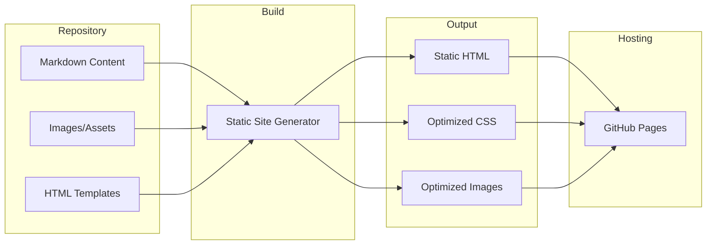

# Product Homepage Design - Product Requirements Document

## Executive Summary

### Problem Statement
MirDB is a high-performance, persistent key-value store written in Rust that implements the memcached protocol. Currently, the product lacks a web presence - there is no homepage, landing page, or documentation site. Potential users have no way to discover the product, understand its value proposition, or learn how to get started without directly accessing the GitHub repository and reading source code.

### Proposed Solution
Create a modern, responsive product homepage that effectively communicates MirDB's value proposition, showcases its key features and architecture, provides clear getting-started guidance, and establishes credibility for the project. The homepage will serve as the primary entry point for developers and technical decision-makers evaluating MirDB for their caching and persistence needs.

### Expected Impact
- **Increased Discoverability**: Provide a professional web presence that can be indexed by search engines and shared in technical communities
- **Reduced Onboarding Friction**: Enable developers to quickly understand what MirDB does and how to start using it
- **Enhanced Credibility**: Establish MirDB as a serious, production-ready solution through professional presentation
- **Community Growth**: Drive adoption by making the project accessible and easy to understand

### Success Metrics
- Homepage successfully deployed and accessible
- Clear value proposition communicated within first viewport
- Complete documentation of core features and getting-started workflow
- Responsive design working across desktop and mobile devices

---

## Requirements & Scope

### Functional Requirements

| ID | Requirement | Priority |
|----|-------------|----------|
| REQ-1 | Display hero section with product name, tagline, and primary call-to-action | Must Have |
| REQ-2 | Present key value propositions (persistence, memcached compatibility, Rust performance) | Must Have |
| REQ-3 | Showcase core features with visual explanations | Must Have |
| REQ-4 | Provide architecture overview with LSM tree visualization | Should Have |
| REQ-5 | Include getting-started section with installation and basic usage examples | Must Have |
| REQ-6 | Display code examples for common operations (SET, GET, DELETE) | Must Have |
| REQ-7 | Show configuration options and defaults | Should Have |
| REQ-8 | Include navigation to GitHub repository | Must Have |
| REQ-9 | Provide footer with project information and links | Should Have |
| REQ-10 | Support responsive design for mobile and desktop viewports | Must Have |

### Non-Functional Requirements

| ID | Requirement | Priority |
|----|-------------|----------|
| NFR-1 | Page load time under 3 seconds on standard broadband connection | Must Have |
| NFR-2 | Achieve accessibility compliance (WCAG 2.1 AA minimum) | Should Have |
| NFR-3 | Support modern browsers (Chrome, Firefox, Safari, Edge - latest 2 versions) | Must Have |
| NFR-4 | Static site with no server-side dependencies for easy hosting | Must Have |
| NFR-5 | SEO-optimized with proper meta tags and semantic HTML | Should Have |

### Out of Scope
- Interactive API playground or live demo environment
- User authentication or account management
- Blog or content management system
- Community forum or discussion features
- Automated performance benchmarking tools
- Multi-language/internationalization support

### Success Criteria
- All Must Have requirements implemented and functional
- Design reviewed and approved by stakeholders
- Successful deployment to hosting platform
- Positive feedback from initial user testing

---

## User Experience & Interface

### User Journey

1. **Landing**: User arrives at homepage (via search, link, or direct navigation)
2. **Discovery**: User immediately understands what MirDB is through hero section
3. **Evaluation**: User scrolls through features to assess fit for their use case
4. **Understanding**: User views architecture section to understand technical approach
5. **Action**: User follows getting-started guide or navigates to GitHub

### Interface Requirements

#### Hero Section
- Product logo (existing `assets/logo.gif`)
- Clear tagline: "Persistent Key-Value Store with Memcached Compatibility"
- Brief description (1-2 sentences)
- Primary CTA: "Get Started" or "View on GitHub"
- Secondary CTA: "Learn More"

#### Value Proposition Section
Three key pillars presented as cards or columns:
1. **Persistence**: LSM tree-based storage with WAL for durability
2. **Compatibility**: Drop-in memcached protocol support
3. **Performance**: Rust-powered async I/O with Tokio

#### Features Section
Visual presentation of key capabilities:
- GET/SET/DELETE operations with TTL support
- Background compaction (minor and major)
- Write-ahead logging for crash recovery
- Configurable via TOML
- Multiple storage levels with optimized merging

#### Architecture Section
- Simplified diagram showing memtable -> immutable memtables -> SSTables flow
- Brief explanation of LSM tree benefits

#### Getting Started Section
- Installation command
- Basic configuration example
- Simple usage example with code snippets

#### Footer
- GitHub repository link
- License information
- Version information (0.1.0)

### Accessibility Considerations
- Sufficient color contrast ratios
- Keyboard navigation support
- Alt text for all images and diagrams
- Semantic HTML structure with proper headings
- Focus indicators for interactive elements

---

## Technical Considerations

### High-Level Approach
Build a static website that can be hosted on any static file server (GitHub Pages, Netlify, Vercel, or self-hosted). The site should be lightweight, fast-loading, and require no backend infrastructure.

### Integration Points
- GitHub repository for source links and CTA buttons
- Existing assets (`assets/logo.gif`, `assets/usage.gif`) to be incorporated
- README.md content as reference for feature descriptions

### Key Technical Constraints
- Must be a static site with no server-side rendering requirements
- Should integrate with existing repository structure
- Must not require complex build pipelines for maintenance

### Performance Considerations
- Optimize images and assets for web delivery
- Minimize CSS/JS bundle sizes
- Implement lazy loading for below-fold content
- Use modern image formats where browser support allows

---

## Design Specification

### Recommended Approach
Build a single-page static website using minimal dependencies, focusing on clean HTML/CSS with optional JavaScript for interactivity. The design should reflect the technical nature of the product with a modern, developer-focused aesthetic.

### Key Technical Decisions

#### 1. Static Site Framework
- **Options Considered**: Plain HTML/CSS, Hugo, Jekyll, Astro, Next.js static export
- **Tradeoffs**: Plain HTML offers simplicity but harder maintenance; static site generators add build complexity but improve maintainability; JavaScript frameworks add bundle size
- **Recommendation**: Hugo or Jekyll for balance of simplicity, maintainability, and zero runtime JavaScript requirement

#### 2. Styling Approach
- **Options Considered**: Custom CSS, Tailwind CSS, Bootstrap, Minimal CSS framework (e.g., Pico, MVP.css)
- **Tradeoffs**: Custom CSS offers full control but more development time; frameworks speed development but add dependencies; minimal frameworks balance both
- **Recommendation**: Tailwind CSS or a minimal framework for rapid development with customization flexibility

#### 3. Hosting Platform
- **Options Considered**: GitHub Pages, Netlify, Vercel, Self-hosted
- **Tradeoffs**: GitHub Pages integrates with repo but limited features; Netlify/Vercel offer more features but external dependency; self-hosted offers control but requires infrastructure
- **Recommendation**: GitHub Pages for simplicity and direct repository integration

#### 4. Code Syntax Highlighting
- **Options Considered**: Prism.js, Highlight.js, Pre-rendered with static site generator
- **Tradeoffs**: Runtime highlighting adds JS bundle; pre-rendered is static but requires build-time processing
- **Recommendation**: Pre-rendered syntax highlighting during build for zero-JS code blocks

### High-Level Architecture


### Key Considerations
- **Performance**: Static HTML ensures fastest possible load times; images should be optimized and lazy-loaded
- **Security**: Static site with no backend eliminates server-side vulnerabilities; only concern is content injection via build process
- **Scalability**: Static files scale infinitely with CDN; GitHub Pages provides built-in CDN

### Risk Management
- **Content Maintenance Risk**: Documentation may become outdated as product evolves; mitigate by keeping content minimal and linking to README for detailed docs
- **Design Consistency Risk**: Homepage design may diverge from future documentation sites; mitigate by establishing design tokens early

### Success Criteria
- Page achieves 90+ Lighthouse performance score
- All content accurately reflects current product capabilities
- Design is responsive across device sizes
- Site deploys successfully via CI/CD

---

## Dependencies & Assumptions

### Dependencies
- Access to existing logo and usage GIF assets in `/assets/` directory
- GitHub repository for hosting via GitHub Pages
- Design assets or approval for visual direction

### Assumptions
- Product information in README.md is accurate and up-to-date
- Existing assets are suitable for web use without modification
- No custom domain is required initially (can use GitHub Pages default URL)
- English-only content is acceptable for initial release

### Cross-Team Coordination
- Design review required before implementation
- Content accuracy verification with product/engineering team

---

## Appendices

### Content Reference
Key messaging derived from codebase analysis:

**Tagline Options**:
- "Persistent Key-Value Store with Memcached Compatibility"
- "Memcached with Disk Persistence, Powered by Rust"
- "Fast, Durable, Compatible: The Better Cache"

**Feature Highlights**:
1. Drop-in memcached protocol compatibility
2. LSM tree-based persistent storage
3. Write-ahead logging for crash recovery
4. Background compaction for optimized performance
5. Configurable via simple TOML file
6. Async I/O powered by Tokio

**Technical Specifications**:
- Default port: 12333
- Storage: 7-level LSM tree
- Memtable: 4MB skip list
- Block size: 4KB
- Compression: Snappy

### Existing Assets
- `/assets/logo.gif` - Product logo
- `/assets/usage.gif` - Usage demonstration

### Configuration Example
```toml
addr = "0.0.0.0:12333"
max_level = 7
work_dir = "/tmp/mirdb"
sst_max_size = "100M"
mem_table_max_size = "4M"
```
