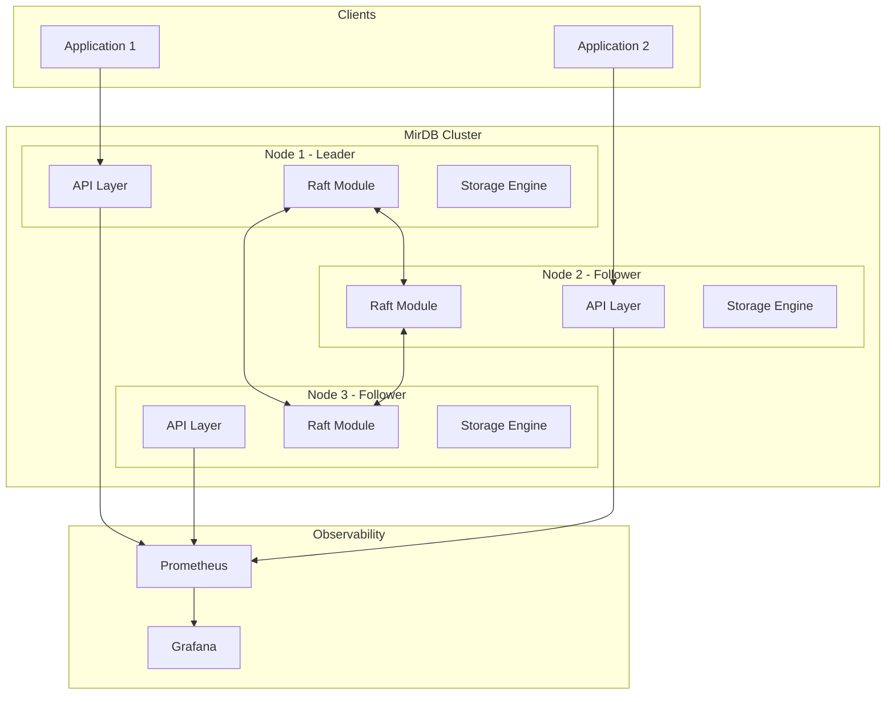

# Empowering Greatness Initiative - Product Requirements Document

## Executive Summary

### Problem Statement
MirDB is a functional key-value store with solid foundational architecture (LSM tree, memcached protocol, write-ahead logging). However, it currently operates as a single-node system with limited scalability, observability, and modern async runtime support. To achieve production-readiness and competitive positioning, the project requires strategic enhancements across multiple dimensions.

### Proposed Solution
A phased improvement initiative focusing on:
1. **Runtime Modernization**: Upgrade from legacy Tokio 0.1 to modern async/await patterns
2. **Distributed Capabilities**: Implement Raft consensus for high availability (as originally planned)
3. **Enhanced Observability**: Comprehensive metrics, logging, and monitoring integration
4. **Security Hardening**: Authentication and access control mechanisms
5. **Performance Optimization**: Improved compaction strategies and caching

### Expected Impact
- **Reliability**: 99.9% availability through distributed consensus and replication
- **Scalability**: Horizontal scaling capability for enterprise workloads
- **Operational Excellence**: Reduced mean time to detection (MTTD) and resolution (MTTR) through enhanced observability
- **Security Posture**: Enterprise-grade access control and audit capabilities

### Success Metrics
- Achieve 3-node cluster support with automatic failover
- Support 100K+ operations per second on commodity hardware
- Reduce P99 latency by 30% through runtime modernization
- Zero-downtime upgrades and configuration changes

---

## Requirements & Scope

### Functional Requirements

| ID | Requirement | Priority |
|----|-------------|----------|
| REQ-1 | System shall support distributed consensus using Raft protocol for leader election and log replication | Must |
| REQ-2 | System shall support cluster membership changes (adding/removing nodes) without downtime | Must |
| REQ-3 | System shall provide automatic leader failover within 10 seconds of leader failure detection | Must |
| REQ-4 | System shall expose Prometheus-compatible metrics endpoint for all key performance indicators | Must |
| REQ-5 | System shall support structured logging with configurable log levels and output formats | Must |
| REQ-6 | System shall implement token-based authentication for client connections | Should |
| REQ-7 | System shall support role-based access control (RBAC) for command authorization | Should |
| REQ-8 | System shall provide a health check endpoint for load balancer integration | Must |
| REQ-9 | System shall support graceful shutdown with connection draining | Must |
| REQ-10 | System shall implement read replicas for improved read throughput | Could |

### Non-Functional Requirements

| ID | Requirement | Target |
|----|-------------|--------|
| NFR-1 | System shall maintain P99 read latency under 10ms for cached data | Performance |
| NFR-2 | System shall maintain P99 write latency under 50ms (including replication) | Performance |
| NFR-3 | System shall support 100K operations per second per node | Scalability |
| NFR-4 | System shall achieve 99.9% availability in a 3-node cluster configuration | Reliability |
| NFR-5 | System shall recover from single-node failure without data loss | Durability |
| NFR-6 | System shall support TLS 1.3 for client and inter-node communication | Security |
| NFR-7 | System shall consume less than 1GB memory per 10M keys (average 100-byte values) | Efficiency |
| NFR-8 | System shall start up and become operational within 30 seconds | Operations |

### Out of Scope
- Multi-datacenter replication (future consideration)
- SQL query interface
- Secondary indexes
- Transactions across multiple keys
- GUI management interface

### Success Criteria
- All Must-have requirements implemented and tested
- Performance benchmarks meet NFR targets
- Documentation complete for operators and developers
- Migration path documented for existing single-node deployments

---

## User Stories

### Personas
- **Operator**: DevOps engineer responsible for deploying and maintaining MirDB clusters
- **Developer**: Application developer integrating MirDB as a caching or storage backend
- **Security Engineer**: Team member responsible for compliance and security posture

### Core Stories

#### US-1: Cluster Deployment
**As an** Operator
**I want** to deploy a multi-node MirDB cluster
**So that** my application has high availability and fault tolerance

**Acceptance Criteria:**
```gherkin
Given a cluster configuration with 3 nodes
When I start each node with the cluster configuration
Then all nodes should discover each other within 30 seconds
And one node should be elected as leader
And the cluster should accept client connections

Given a running 3-node cluster
When the leader node fails
Then a new leader should be elected within 10 seconds
And client operations should resume automatically
```
**Related Requirements:** REQ-1, REQ-2, REQ-3, NFR-4, NFR-5
**Priority:** Must

#### US-2: Performance Monitoring
**As an** Operator
**I want** to monitor cluster performance metrics
**So that** I can proactively identify and resolve issues

**Acceptance Criteria:**
```gherkin
Given a running MirDB instance
When I query the /metrics endpoint
Then I should receive Prometheus-formatted metrics
And metrics should include operation counts, latencies, and resource usage

Given configured alerting thresholds
When metrics exceed thresholds
Then alerts should be triggered via configured channels
```
**Related Requirements:** REQ-4, REQ-5, REQ-8
**Priority:** Must

#### US-3: Secure Access
**As a** Security Engineer
**I want** to enforce authentication and authorization
**So that** only authorized users can access the data

**Acceptance Criteria:**
```gherkin
Given authentication is enabled
When a client connects without valid credentials
Then the connection should be rejected with an error

Given a user with read-only role
When the user attempts a write operation
Then the operation should be denied
And an audit log entry should be created
```
**Related Requirements:** REQ-6, REQ-7, NFR-6
**Priority:** Should

#### US-4: Application Integration
**As a** Developer
**I want** to use MirDB as a reliable caching backend
**So that** my application performs consistently under load

**Acceptance Criteria:**
```gherkin
Given a MirDB cluster with 3 nodes
When my application performs 10K operations per second
Then P99 latency should remain under 10ms for reads
And no operations should be lost due to node failures
```
**Related Requirements:** NFR-1, NFR-2, NFR-3
**Priority:** Must

#### US-5: Graceful Operations
**As an** Operator
**I want** to perform maintenance without service disruption
**So that** I can update and scale the system safely

**Acceptance Criteria:**
```gherkin
Given a running 3-node cluster
When I initiate a graceful shutdown on one node
Then the node should drain existing connections
And the cluster should rebalance leadership if needed
And no client operations should fail
```
**Related Requirements:** REQ-9, REQ-2
**Priority:** Must

---

## Technical Considerations

### High-Level Technical Approach
The initiative requires modernizing the existing codebase while preserving the proven LSM tree storage engine and memcached protocol compatibility.

### Integration Points
- **Existing Storage Engine**: The LSM tree implementation (memtable, SSTable, compaction) remains the foundation
- **Network Layer**: Requires refactoring from Tokio 0.1 to modern async/await runtime
- **Configuration System**: Extends existing TOML-based configuration for cluster settings
- **Monitoring Stack**: New integration with Prometheus/Grafana ecosystem

### Key Technical Constraints
- Backward compatibility with existing data format (WAL, SSTable, Manifest)
- Memcached protocol compatibility must be preserved
- Single-node deployment mode must remain supported
- Memory efficiency targets must be maintained

### Performance Considerations
- Raft consensus adds latency to write path (mitigated by batching)
- Read replicas can improve read throughput without consensus overhead
- Connection pooling and multiplexing reduce connection overhead

---

## Design Specification

### Recommended Approach
Implement a modular architecture where distributed capabilities are layered on top of the existing storage engine, allowing single-node and clustered deployments from the same codebase with feature flags.

### Key Technical Decisions

#### 1. Consensus Protocol Implementation
- **Options Considered**: Custom Raft implementation, raft-rs library, etcd integration
- **Tradeoffs**: Custom offers full control but high complexity; raft-rs is proven but requires integration effort; etcd adds external dependency
- **Recommendation**: Use raft-rs library for proven correctness with reasonable integration effort

#### 2. Async Runtime Migration
- **Options Considered**: Tokio 1.x, async-std, smol
- **Tradeoffs**: Tokio has best ecosystem and performance; async-std has simpler API; smol is lightweight
- **Recommendation**: Migrate to Tokio 1.x for ecosystem compatibility and performance

#### 3. Metrics Collection
- **Options Considered**: Custom metrics, prometheus crate, metrics-rs
- **Tradeoffs**: Custom is flexible but maintenance burden; prometheus crate is standard; metrics-rs offers better abstraction
- **Recommendation**: Use prometheus crate for direct compatibility with monitoring ecosystem

#### 4. Authentication Mechanism
- **Options Considered**: Password-based, mTLS, Token-based (JWT)
- **Tradeoffs**: Passwords simple but less secure; mTLS complex but strong; tokens balance usability and security
- **Recommendation**: Token-based auth with optional mTLS for inter-node communication

### High-Level Architecture



### Key Considerations
- **Performance**: Write amplification from Raft replication mitigated through batching and pipelining; read-from-follower option for read-heavy workloads
- **Security**: TLS for all network communication; token rotation support; audit logging for compliance
- **Scalability**: Horizontal scaling through read replicas; vertical scaling through improved compaction and caching

### Risk Management
- **Raft Implementation Complexity**: Mitigate by using battle-tested raft-rs library and extensive testing with Jepsen-style failure injection
- **Migration Risk**: Provide rolling upgrade capability and automated rollback; extensive integration testing before release
- **Performance Regression**: Establish baseline benchmarks before changes; continuous performance testing in CI pipeline

### Success Criteria
- 3-node cluster passes all Jepsen consistency tests
- Performance benchmarks show <20% overhead vs single-node for writes
- Zero data loss during simulated failures
- All existing tests pass with new async runtime

---

## Dependencies & Assumptions

### External Dependencies
- **raft-rs**: Raft consensus implementation (requires evaluation and integration)
- **Tokio 1.x ecosystem**: Runtime migration impacts all async code
- **prometheus crate**: Metrics exposition
- **rustls**: TLS implementation for secure communication

### Assumptions
- Existing data format remains compatible (no migration required for storage layer)
- Network between cluster nodes has <10ms latency
- Operators have access to Prometheus/Grafana for monitoring
- Three-node minimum cluster size is acceptable for initial release

### Cross-Team Coordination
- Security team review required for authentication design
- Operations team input needed for monitoring and alerting requirements
- Documentation team for operator and developer guides

---

## Risk Assessment

### Technical Risks

| Risk | Impact | Likelihood | Mitigation |
|------|--------|------------|------------|
| Raft integration introduces subtle bugs | High | Medium | Use raft-rs library; extensive testing with failure injection; formal verification of critical paths |
| Async runtime migration causes regressions | Medium | Medium | Incremental migration; comprehensive test coverage; performance benchmarking at each stage |
| Performance degradation in clustered mode | Medium | Medium | Batching optimizations; read replica support; extensive benchmarking |
| Backward compatibility issues | High | Low | Version negotiation protocol; comprehensive migration testing |

### User Experience Risks

| Risk | Impact | Likelihood | Mitigation |
|------|--------|------------|------------|
| Increased operational complexity | Medium | High | Excellent documentation; sensible defaults; single-node mode preserved |
| Client library compatibility | Medium | Medium | Maintain memcached protocol; provide migration guides |

---

## Appendices

### A. Current System Capabilities (from Knowledge Base)
- LSM tree storage with configurable levels (default 7)
- Write-ahead logging for durability
- Memcached text protocol support
- Skip list-based memtable with configurable size (default 4MB)
- SSTable with block compression (Snappy) and bloom filters
- Configurable compaction triggers and intervals

### B. Related Knowledge Base References
- Project Overview: UUID b3a7fcb8-a652-48c7-a55a-6638cd2d1b5c
- Storage Engine: UUID fd598601-3282-45dd-b150-e3a532139d3c
- Network Protocol: UUID 5ea4aab2-d7eb-4f2c-b501-66d1cc8fa545
- Configuration: UUID f02b71fa-2a0f-44f4-9cc7-30f5164f240e
- Project Structure: UUID e0d2f997-9a80-4cdb-952f-ceaa3bd67b6e

### C. Glossary
- **LSM Tree**: Log-Structured Merge Tree, a data structure optimizing write performance
- **SSTable**: Sorted String Table, immutable on-disk data format
- **WAL**: Write-Ahead Log, ensures durability before acknowledging writes
- **Raft**: Consensus algorithm for distributed systems
- **Memtable**: In-memory sorted data structure (skip list in this implementation)
