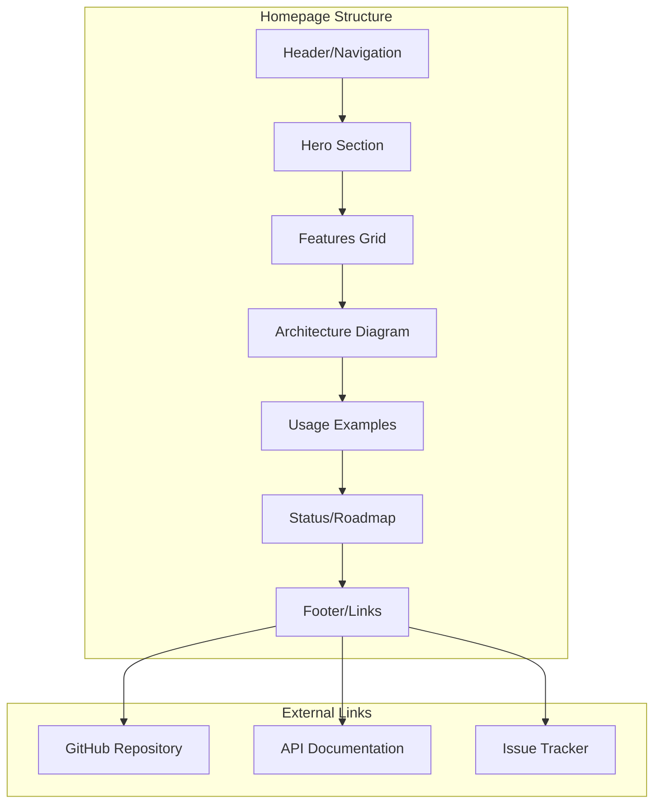

# Product Homepage Design - Product Requirements Document

## Executive Summary

### Problem Statement
MirDB is a high-performance persistent key-value store with memcached protocol compatibility, but it lacks a public-facing product homepage. Without a dedicated homepage, potential users and contributors cannot easily discover the project, understand its capabilities, or evaluate it against alternatives. This limits adoption and community growth.

### Proposed Solution
Create a comprehensive product homepage that effectively communicates MirDB's value proposition, showcases its technical capabilities, and provides clear pathways for users to get started and contribute to the project.

### Expected Impact
- **Increased Visibility**: Improve discoverability of MirDB in the key-value store ecosystem
- **User Adoption**: Lower barrier to entry with clear documentation and examples
- **Community Growth**: Attract contributors by showcasing the project's architecture and roadmap
- **Trust Building**: Demonstrate project maturity through professional presentation

### Success Metrics
- Homepage accurately represents MirDB's architecture and capabilities
- Clear documentation of memcached protocol compatibility
- Visible project status and feature completeness
- Easy access to getting started guides

## Requirements & Scope

### Functional Requirements

| ID | Requirement | Priority |
|----|-------------|----------|
| REQ-1 | Display project identity with logo and tagline | Must |
| REQ-2 | Provide clear explanation of what MirDB is and its key features | Must |
| REQ-3 | Document memcached protocol compatibility and usage examples | Must |
| REQ-4 | Showcase technical architecture (LSM-tree, skip list, SSTable) | Should |
| REQ-5 | Display current project status and implemented features | Must |
| REQ-6 | Include getting started/installation instructions | Must |
| REQ-7 | Provide links to source code repository and documentation | Must |
| REQ-8 | Display performance characteristics and benchmarks | Should |
| REQ-9 | Show roadmap with completed and planned features | Should |
| REQ-10 | Include contribution guidelines and community links | Could |

### Non-Functional Requirements

| ID | Requirement | Priority |
|----|-------------|----------|
| NFR-1 | Homepage must be responsive and accessible | Must |
| NFR-2 | Load time should be under 3 seconds | Should |
| NFR-3 | Support for code syntax highlighting | Must |
| NFR-4 | Mobile-friendly design | Must |
| NFR-5 | SEO-optimized for key-value store and memcached-related searches | Should |

### Out of Scope
- Interactive demo/sandbox environment
- Real-time performance monitoring dashboard
- User authentication or account management
- Hosted service offering

### Success Criteria
- [ ] Homepage clearly communicates MirDB as a persistent key-value store with memcached compatibility
- [ ] All implemented features (tokio, memtable with skiplist, minor/major compaction) are documented
- [ ] Code examples demonstrate memcached protocol usage
- [ ] Architecture diagram explains LSM-tree implementation
- [ ] Repository links and contribution guidelines are easily accessible

## User Experience & Interface

### Target Audience
1. **Developers** seeking a persistent alternative to memcached
2. **DevOps Engineers** evaluating key-value storage solutions
3. **Contributors** interested in Rust-based database systems
4. **Decision Makers** comparing storage solutions for their stack

### User Journey

#### First-Time Visitor
1. Land on homepage and immediately understand what MirDB is
2. See visual demonstration of memcached compatibility
3. Review feature list and architecture highlights
4. Access getting started guide
5. Navigate to GitHub repository

#### Technical Evaluator
1. Review architecture section with LSM-tree details
2. Examine performance characteristics
3. Check feature completeness against requirements
4. Review roadmap for future development
5. Assess codebase quality through documented patterns

### Interface Requirements

#### Header Section
- Project logo (animated GIF as shown in README)
- Clear tagline: "A Persistent Key-Value Store with Memcached Protocol"
- Navigation links: Features, Architecture, Usage, GitHub

#### Hero Section
- Prominent display of key value proposition
- Visual showing memcached protocol compatibility
- Primary CTA: "Get Started" or "View on GitHub"
- Status badges (CircleCI build status)

#### Features Section
- Core capabilities with icons:
  - **Memcached Protocol**: Drop-in replacement compatibility
  - **Persistent Storage**: LSM-tree based durability
  - **High Performance**: Skip list memtable, SSTable compaction
  - **Rust Implementation**: Memory safety and performance

#### Architecture Section
- High-level component diagram
- Explanation of key components:
  - Memtable with skip list (in-memory writes)
  - SSTable storage (persistent sorted tables)
  - WAL (Write-Ahead Log for durability)
  - Compaction (minor and major)

#### Usage Section
- Code examples showing memcached protocol commands:
  - SET/GET operations
  - ADD/REPLACE/APPEND/PREPEND
  - DELETE operations
- Connection examples in different languages

#### Status Section
- Feature checklist showing:
  - [x] Tokio with memcached protocol
  - [x] Memtable with skiplist
  - [x] Minor compaction
  - [x] Major compaction
  - [ ] Raft (planned)

#### Footer
- GitHub repository link
- License information (implied open source)
- Contribution guidelines link

## Technical Considerations

### Implementation Approach
The homepage should be a static site that can be hosted on GitHub Pages or similar platforms. Given the project's Rust focus, consider:

1. **Static Site Generator**: Options include Zola (Rust-based), Hugo, or Jekyll
2. **Documentation Integration**: Link to rustdoc-generated API documentation
3. **Asset Optimization**: Optimize the logo GIF for web delivery
4. **Responsive Framework**: Use a lightweight CSS framework or custom styling

### Key Technical Decisions

#### 1. Hosting Platform
- **Option A**: GitHub Pages (free, integrated with repo)
- **Option B**: Netlify/Vercel (better performance, CI/CD)
- **Recommendation**: GitHub Pages for simplicity and alignment with open source hosting

#### 2. Static Site Generator
- **Option A**: Zola (Rust-based, fast)
- **Option B**: Hugo (mature, many themes)
- **Option C**: Plain HTML/CSS (simplest, no dependencies)
- **Recommendation**: Zola or plain HTML to align with Rust ecosystem

#### 3. Documentation Strategy
- Auto-generated API docs via `cargo doc`
- Manual usage examples in homepage
- Architecture documentation as markdown

### Integration Points
- GitHub repository (yetone/mirdb)
- CircleCI for build status badges
- crates.io (if published)

### Performance Considerations
- Optimize logo GIF (currently may be large)
- Lazy load images below the fold
- Minimize CSS/JS for fast load times

## Design Specification

### Recommended Approach
Create a clean, technical-focused homepage that emphasizes MirDB's performance and compatibility benefits. The design should appeal to developers and DevOps professionals with a preference for clear information hierarchy over flashy animations.

### Key Technical Decisions

#### 1. Visual Style
- **Options**: Dark theme (developer-friendly), Light theme (professional), System preference
- **Tradeoffs**: Dark reduces eye strain for developers; light feels more traditional
- **Recommendation**: Support system preference with dark as default (aligns with developer tools)

#### 2. Content Layout
- **Options**: Single-page scrolling, Multi-page navigation
- **Tradeoffs**: Single-page better for storytelling; multi-page better for SEO
- **Recommendation**: Single-page with anchor navigation for immediate overview

#### 3. Code Presentation
- **Options**: Embedded GitHub gists, Prism.js highlighting, Static code blocks
- **Tradeoffs**: Gists auto-update; Prism is customizable; static is fastest
- **Recommendation**: Prism.js or similar for syntax highlighting with copy-to-clipboard

### High-Level Architecture

### Key Considerations

#### Performance
- Target Lighthouse score >90 for performance
- Optimize logo GIF to <500KB
- Use system fonts to avoid external font loading

#### Security
- No user input handling (static site)
- HTTPS-only delivery
- No third-party tracking scripts

#### Accessibility
- WCAG 2.1 AA compliance
- Keyboard navigation support
- Screen reader compatible code examples

### Risk Management

#### Technical Risk: Logo GIF Size
- **Risk**: Large GIF may slow page load
- **Mitigation**: Provide optimized version, lazy loading, or static fallback

#### Content Risk: Documentation Drift
- **Risk**: Homepage becomes outdated as project evolves
- **Mitigation**: Automate feature list from README, include "last updated" timestamp

### Success Criteria
- Homepage loads in under 3 seconds on 3G connection
- All features from README accurately represented
- Mobile layout is fully functional
- Code examples are copy-paste ready
- GitHub links are prominently displayed

## Appendices

### Reference Materials
- Project README: `/workspace/README.md`
- Source code: `/workspace/mirdb-server/src/`
- Logo assets: `/workspace/assets/logo.gif`

### Memcached Protocol Commands Supported
Based on `request.rs` analysis:
- Storage: `set`, `add`, `replace`, `append`, `prepend`
- Retrieval: `get`, `gets`
- Deletion: `delete`
- Other: `info`, `major_compaction`

### Architecture Components
1. **Skip List**: In-memory sorted data structure (`skip-list/`)
2. **SSTable**: Persistent sorted string tables (`sstable/`)
3. **Memtable**: Write buffer using skip list
4. **WAL**: Write-ahead log for durability
5. **Compaction**: Background maintenance (minor and major)
