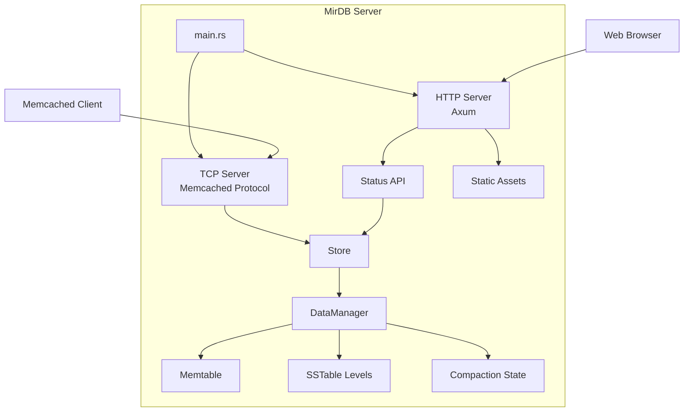

# Homepage Enhancement Initiative - Product Requirements Document

## Executive Summary

### Problem Statement
MirDB is a powerful persistent key-value store with Memcached protocol compatibility, but it currently lacks any web-based user interface. Users and administrators must interact with the database exclusively through command-line tools or programmatic clients, making it difficult to:
- Monitor database health and performance at a glance
- Understand the current state of the storage engine
- Introduce MirDB to potential users who prefer visual interfaces
- Perform administrative tasks without memorizing protocol commands

### Proposed Solution
Implement a web-based homepage and dashboard for MirDB that provides:
- A welcoming landing page introducing MirDB and its capabilities
- Real-time status monitoring and health indicators
- Database statistics and performance metrics visualization
- Administrative controls for common operations

### Expected Impact
- **Improved User Experience**: Lower barrier to entry for new users exploring MirDB
- **Enhanced Observability**: Visual representation of database state, storage levels, and compaction status
- **Operational Efficiency**: Quick access to database status and administrative functions without CLI tools
- **Product Positioning**: Professional web presence that showcases MirDB's capabilities

### Success Metrics
- Homepage accessible via HTTP alongside existing Memcached protocol
- Real-time display of database status (memtable size, SSTable levels, compaction state)
- Page load time under 500ms for dashboard views
- Zero impact on existing Memcached protocol performance

---

## Requirements & Scope

### Functional Requirements

| ID | Requirement | Priority |
|----|-------------|----------|
| REQ-1 | System shall serve a web-based homepage accessible via HTTP | Must |
| REQ-2 | Homepage shall display MirDB product overview and key features | Must |
| REQ-3 | Dashboard shall show real-time database status (up/down, uptime) | Must |
| REQ-4 | Dashboard shall display current memtable size and utilization | Must |
| REQ-5 | Dashboard shall show SSTable count per level (Levels 0-6) | Must |
| REQ-6 | Dashboard shall indicate active compaction operations | Should |
| REQ-7 | Dashboard shall display configuration parameters | Should |
| REQ-8 | System shall provide a manual compaction trigger via UI | Could |
| REQ-9 | Homepage shall be responsive and work on mobile devices | Should |
| REQ-10 | Dashboard shall auto-refresh status data periodically | Should |

### Non-Functional Requirements

| ID | Requirement | Priority |
|----|-------------|----------|
| NFR-1 | HTTP server must not degrade existing Memcached protocol performance | Must |
| NFR-2 | Web interface shall load initial page in under 500ms | Should |
| NFR-3 | HTTP server shall support concurrent connections | Must |
| NFR-4 | Web assets shall be embedded in binary for single-binary deployment | Should |
| NFR-5 | HTTP endpoint configuration shall follow existing TOML config pattern | Must |
| NFR-6 | Web interface shall work without JavaScript for basic functionality | Could |

### Out of Scope
- User authentication and authorization (future enhancement)
- Data browsing or key-value manipulation through the UI
- Distributed cluster management UI
- Historical metrics storage and trending graphs
- Alerting and notification systems

### Success Criteria
- HTTP server runs alongside TCP Memcached server without port conflicts
- Homepage renders correctly in modern browsers (Chrome, Firefox, Safari, Edge)
- Dashboard displays accurate, real-time database statistics
- Existing Memcached client connections remain unaffected
- Single binary deployment preserved (no external static files required)

---

## User Experience & Interface

### User Journey

**Persona: Database Administrator**
1. Administrator starts MirDB server with web interface enabled
2. Opens browser to configured HTTP address (e.g., `http://localhost:8080`)
3. Views homepage with MirDB introduction and navigation
4. Navigates to dashboard to check database health
5. Reviews storage level distribution and compaction status
6. Optionally triggers manual compaction if needed

**Persona: Developer/New User**
1. Developer discovers MirDB and wants to evaluate it
2. Accesses homepage to understand product capabilities
3. Reviews feature list and architecture overview
4. Navigates to dashboard to see the system in action
5. Gains confidence in product maturity through professional UI

### Interface Requirements

**Homepage Layout**
- Header with MirDB logo and navigation
- Hero section with product tagline and key value proposition
- Feature highlights (persistence, Memcached compatibility, LSM architecture)
- Quick links to documentation and dashboard
- Footer with version information

**Dashboard Layout**
- Status indicator (healthy/degraded/offline)
- Server information panel (address, uptime, version)
- Storage overview:
  - Active memtable size/utilization bar
  - Immutable memtable queue depth
  - SSTable level breakdown (visual representation)
- Compaction status (idle/minor running/major running)
- Configuration summary panel
- Manual compaction trigger button

### Accessibility Considerations
- Semantic HTML structure for screen readers
- Sufficient color contrast ratios
- Keyboard navigation support
- Status indicators use both color and text/icons

---

## Technical Considerations

### High-Level Technical Approach
Add an HTTP server capability to MirDB that runs alongside the existing TCP Memcached protocol server, serving static web assets and exposing a REST API for database statistics.

### Integration Points with Existing Systems
- **DataManager**: Query memtable sizes, SSTable counts, and compaction status
- **Configuration System**: Read existing TOML config, add HTTP-specific parameters
- **Main Entry Point**: Initialize HTTP server alongside TCP server in Tokio runtime

### Key Technical Constraints
- Must maintain Rust workspace structure with existing crates
- Must use Tokio async runtime (already in use for TCP server)
- Single binary deployment preferred (embed static assets)
- Configuration follows existing TOML patterns

### Performance and Scalability Considerations
- HTTP server should use minimal resources when idle
- Status API calls should not block data operations
- Static assets should be cacheable
- Dashboard polling should be rate-limited to prevent server overload

---

## Design Specification

### Recommended Approach
Implement an HTTP server as a new module within the existing `mirdb-server` crate, using Axum web framework for its Tokio compatibility and lightweight footprint. Embed static frontend assets at compile time for single-binary deployment.

### Key Technical Decisions

#### 1. Web Framework Selection
- **Options Considered**: Axum, Actix-web, Rocket, Warp
- **Tradeoffs**: Axum integrates natively with Tokio (already used), has excellent performance, and minimal dependencies. Actix-web has higher throughput but different async runtime. Rocket requires nightly Rust. Warp is lightweight but has less ecosystem support.
- **Recommendation**: Axum - native Tokio integration ensures seamless coexistence with existing TCP server and simplifies shared state management.

#### 2. Frontend Technology
- **Options Considered**: Static HTML/CSS/JS, React SPA, Vue SPA, Server-side templates
- **Tradeoffs**: Static HTML is simplest and requires no build tooling but limits interactivity. SPAs provide rich UX but add complexity and build dependencies. Server-side templates balance both.
- **Recommendation**: Static HTML/CSS with minimal vanilla JavaScript - keeps build simple, embeds easily, and provides adequate interactivity for dashboard use case.

#### 3. Asset Embedding Strategy
- **Options Considered**: rust-embed, include_bytes! macro, External static files
- **Tradeoffs**: rust-embed provides convenient macro-based embedding with development mode support. include_bytes! is lower-level but built-in. External files complicate deployment.
- **Recommendation**: rust-embed crate - provides debug/release mode handling and clean API for serving embedded assets.

#### 4. API Design Pattern
- **Options Considered**: REST JSON API, GraphQL, Server-Sent Events
- **Tradeoffs**: REST is simple and widely understood. GraphQL adds complexity for simple status queries. SSE enables push-based updates but complicates client implementation.
- **Recommendation**: REST JSON API with polling - simple implementation, easy client consumption, adequate for status monitoring use case.

### High-Level Architecture


### Key Considerations
- **Performance**: HTTP server runs in same Tokio runtime, sharing thread pool; status queries use read-only access to avoid contention with write operations.
- **Security**: Initial implementation without authentication; HTTP server should bind to configurable address allowing localhost-only binding for security.
- **Scalability**: Stateless HTTP handlers scale naturally; embedded assets eliminate file I/O; status API responses are small and fast to generate.

### Risk Management
- **Technical Risk 1**: Shared state contention between HTTP and TCP handlers could impact database performance. Mitigation: Use read-only Arc references for status queries; benchmark under load before release.
- **Technical Risk 2**: Embedded asset size could significantly increase binary size. Mitigation: Minimize frontend dependencies; use compression; measure binary size impact during development.
- **Technical Risk 3**: Dashboard polling could create excessive load. Mitigation: Implement reasonable poll intervals (5-10 seconds); consider SSE for future optimization.

### Success Criteria
- HTTP server starts successfully alongside TCP server
- Dashboard accurately reflects DataManager state
- Binary size increase stays under 2MB
- No measurable impact on Memcached protocol throughput

---

## Dependencies & Assumptions

### External Dependencies
- **Axum**: Web framework for HTTP server
- **rust-embed**: Compile-time asset embedding
- **serde_json**: JSON serialization for REST API (likely already available)
- **tower-http**: HTTP middleware for static file serving and CORS

### Assumptions
- Tokio runtime can efficiently handle both TCP and HTTP workloads
- Users have modern web browsers (ES6+ JavaScript support)
- HTTP port availability can be configured independently of Memcached port
- DataManager internal state can be safely queried without blocking writes

### Cross-Team Coordination
- None required - self-contained enhancement to existing codebase

---

## Appendices

### A. Configuration Extension

New TOML configuration parameters:

```toml
# HTTP Web Interface
[http]
enabled = true
addr = "0.0.0.0:8080"
```

### B. API Endpoint Specification

| Endpoint | Method | Description |
|----------|--------|-------------|
| `/` | GET | Homepage HTML |
| `/dashboard` | GET | Dashboard HTML |
| `/api/status` | GET | JSON status response |
| `/api/compaction` | POST | Trigger manual compaction |

### C. Status API Response Schema

```json
{
  "server": {
    "version": "0.1.0",
    "uptime_seconds": 3600,
    "memcached_addr": "0.0.0.0:12333"
  },
  "storage": {
    "memtable_size_bytes": 2097152,
    "memtable_max_bytes": 4194304,
    "immutable_memtable_count": 1,
    "levels": [
      {"level": 0, "sstable_count": 3, "size_bytes": 15728640},
      {"level": 1, "sstable_count": 1, "size_bytes": 52428800}
    ]
  },
  "compaction": {
    "minor_running": false,
    "major_running": true,
    "major_current_level": 0
  }
}
```

### D. Requirement Traceability

| User Story | Related Requirements |
|------------|---------------------|
| View database status | REQ-3, REQ-4, REQ-5, REQ-6 |
| Learn about MirDB | REQ-1, REQ-2 |
| Trigger maintenance | REQ-8 |
| Mobile access | REQ-9, NFR-2 |
| Simple deployment | NFR-4, NFR-5 |
