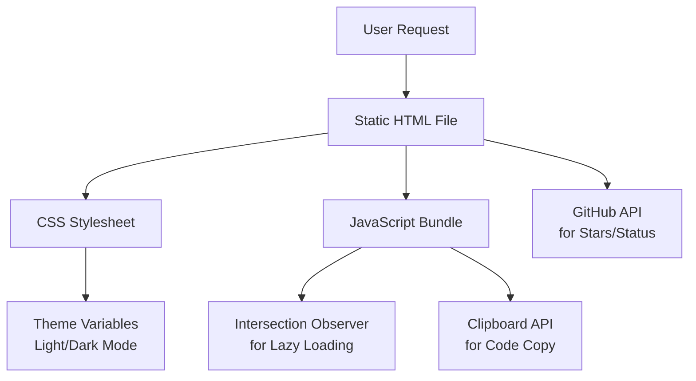

# MirDB Product Landing Page - Product Requirements Document

## Executive Summary

### Problem Statement
MirDB is a powerful persistent key-value store with Memcached protocol compatibility, but it lacks a professional product landing page to showcase its capabilities, attract developers, and drive adoption. Without a compelling homepage, potential users may not discover or understand the value proposition of MirDB compared to other key-value stores.

### Proposed Solution
Create a modern, professional product landing page that effectively communicates MirDB's unique value proposition: a persistent key-value store that combines the simplicity of Memcached protocol with the durability of disk-based storage through LSM-tree architecture.

### Expected Impact
- Increased project visibility and developer adoption
- Clear communication of MirDB's technical advantages
- Professional presentation suitable for open-source community engagement
- Improved user onboarding through clear documentation links and feature highlights

### Success Metrics
- Page load time under 2 seconds
- Responsive design supporting desktop, tablet, and mobile devices
- Clear call-to-action elements for GitHub repository and documentation
- SEO-optimized content for key-value store and Memcached-related searches

---

## Requirements & Scope

### Functional Requirements

**REQ-1: Hero Section**
The landing page must display a prominent hero section featuring the MirDB logo, a compelling tagline, and a brief value proposition statement that communicates "Persistent Key-Value Store with Memcached Protocol" within 3 seconds of page load.

**REQ-2: Feature Showcase**
The page must display key features in a visually organized manner:
- Memcached Protocol Compatibility
- Persistent Storage with SSTables
- LSM-Tree Architecture
- Async Tokio-based Networking
- Skip List Memtable Implementation
- Minor and Major Compaction Support

**REQ-3: Code Examples**
The page must include practical code examples showing how to use MirDB with standard memcached clients, demonstrating the painless migration path for existing memcached users.

**REQ-4: Architecture Overview**
The page must provide a high-level visual representation of MirDB's architecture, including memtable, immutable memtables, and SSTable levels.

**REQ-5: Status Indicators**
The page must display current project status including implemented features and roadmap items (e.g., Raft consensus).

**REQ-6: Navigation and CTAs**
The page must include clear navigation to:
- GitHub repository
- Documentation
- Getting Started guide
- Configuration reference

**REQ-7: Technical Specifications**
The page must display key technical specifications:
- Default listen address: 0.0.0.0:12333
- Max LSM levels: 7
- SSTable max size: 100MB
- Memtable max size: 4MB
- Block size: 4KB

**REQ-8: Responsive Design**
The landing page must be fully responsive and functional across desktop (1920px+), tablet (768px-1024px), and mobile (320px-767px) viewports.

### Non-Functional Requirements

**NFR-1: Performance**
The landing page must achieve a Lighthouse performance score of 90+ with initial page load under 2 seconds on a 3G connection.

**NFR-2: Accessibility**
The page must meet WCAG 2.1 Level AA standards, including proper color contrast, keyboard navigation, and screen reader compatibility.

**NFR-3: SEO**
The page must include proper meta tags, structured data, and semantic HTML to optimize for search engines targeting keywords: "key-value store", "persistent memcached", "Rust database", "LSM-tree storage".

**NFR-4: Browser Compatibility**
The page must support the latest two versions of Chrome, Firefox, Safari, and Edge.

**NFR-5: Dark Mode**
The page must support both light and dark themes, respecting user system preferences.

### Out of Scope
- Interactive demo environment (phase 2 consideration)
- User account management or authentication
- Real-time statistics dashboard
- Multi-language internationalization (i18n)
- Blog or news section

### Success Criteria
- [ ] Hero section clearly communicates value proposition within 3 seconds
- [ ] All REQ features are implemented and visually presented
- [ ] Page achieves 90+ Lighthouse performance score
- [ ] Page passes WCAG 2.1 Level AA accessibility audit
- [ ] Responsive design verified on desktop, tablet, and mobile devices
- [ ] All CTAs link to correct destinations (GitHub, docs)

---

## User Experience & Interface

### User Journey

**Primary Persona: Backend Developer**
1. Arrives from search engine or GitHub referral
2. Scans hero section for relevance ("Is this what I need?")
3. Reviews feature list for key requirements
4. Examines code examples for implementation clarity
5. Checks technical specifications for compatibility
6. Clicks through to GitHub or documentation

**Secondary Persona: Technical Decision Maker**
1. Arrives evaluating storage solutions
2. Reviews architecture diagram for technical soundness
3. Compares specifications against requirements
4. Assesses project maturity via status indicators
5. Considers roadmap for future viability

### Interface Requirements

**Layout Structure**
- Fixed navigation header with logo and menu items
- Full-width hero section with centered content
- Alternating feature sections (zigzag layout)
- Code example section with syntax highlighting
- Architecture diagram section
- Technical specifications grid
- Footer with links and attribution

**Visual Design**
- Clean, modern aesthetic suitable for developer tools
- Primary color scheme aligned with Rust branding (orange accents)
- Monospace fonts for code elements
- Clear visual hierarchy with adequate whitespace
- Animated GIF/logo showcasing usage (reuse existing assets)

**Interaction Patterns**
- Smooth scroll navigation
- Hover states on interactive elements
- Copy-to-clipboard functionality for code examples
- Theme toggle for light/dark mode
- Expandable sections for detailed specifications

### Accessibility Considerations
- Skip navigation link for keyboard users
- ARIA labels for interactive elements
- Focus indicators visible on all interactive elements
- Alt text for all images and diagrams
- Reduced motion support for animations

---

## Technical Considerations

### High-Level Technical Approach
The landing page will be a static HTML site with minimal JavaScript, optimized for performance and SEO. Given the project's Rust nature and developer audience, a lightweight approach aligns with the project's philosophy.

### Integration Points
- Links to existing GitHub repository: https://github.com/yetone/mirdb
- CircleCI badge integration for build status
- Reuse existing logo and usage GIF assets from repository

### Key Technical Constraints
- Static site generation for GitHub Pages compatibility
- No server-side rendering requirements
- Minimal external dependencies to reduce attack surface
- Fast load times prioritized over dynamic features

### Performance Considerations
- Lazy loading for below-the-fold images
- Minified CSS and JavaScript
- Optimized asset delivery (WebP images where supported)
- Critical CSS inlined for above-the-fold content

---

## Design Specification

### Recommended Approach
Create a single-page static website with semantic HTML5, modern CSS (Flexbox/Grid), and vanilla JavaScript. The design emphasizes MirDB's technical sophistication while maintaining approachability for developers evaluating storage solutions.

### Key Technical Decisions

#### 1. Technology Stack
- **Options Considered**: React/Gatsby, Vue/Nuxt, Plain HTML/CSS, Jekyll
- **Tradeoffs**: Frameworks offer better DX but add bundle size; plain HTML is lightweight but harder to maintain
- **Recommendation**: Plain HTML/CSS with minimal JavaScript for optimal performance and simplicity, aligning with MirDB's Rust philosophy of zero-cost abstractions

#### 2. Styling Approach
- **Options Considered**: Tailwind CSS, Bootstrap, Custom CSS, CSS-in-JS
- **Tradeoffs**: Utility frameworks speed development but add unused styles; custom CSS offers control but requires more effort
- **Recommendation**: Custom CSS with CSS variables for theming, ensuring minimal file size and full design control

#### 3. Animation Strategy
- **Options Considered**: GSAP, Framer Motion, CSS animations, No animations
- **Tradeoffs**: JS libraries offer rich effects but impact performance; CSS animations are lightweight but limited
- **Recommendation**: CSS animations and transitions only, respecting `prefers-reduced-motion` for accessibility

### High-Level Architecture

### Key Considerations

**Performance**: Inline critical CSS for above-the-fold content; lazy-load below-fold images and non-critical scripts. Target <100KB total initial payload.

**Security**: No user input handling; all external links use `rel="noopener noreferrer"`; Content Security Policy headers to prevent XSS.

**Scalability**: Static site can be served from CDN; no database or server-side components required; easily mirrors to GitHub Pages.

### Risk Management

**Technical Risk 1**: Browser compatibility issues with modern CSS features
- **Mitigation**: Use Autoprefixer for vendor prefixes; test on target browsers; provide graceful degradation

**Technical Risk 2**: Performance degradation with large assets (GIFs)
- **Mitigation**: Optimize existing assets; provide WebP alternatives; implement lazy loading

### Success Criteria
- Lighthouse performance score 90+
- WCAG 2.1 Level AA compliance
- Consistent rendering across target browsers
- Page load time <2 seconds on 3G

---

## User Stories

### Story 1: Developer Evaluating Storage Options
**As a** backend developer evaluating key-value stores,
**I want** to quickly understand MirDB's core features and protocol compatibility,
**So that** I can determine if it meets my project's requirements.

**Acceptance Criteria:**
- Given I visit the landing page
- When I view the hero section
- Then I see a clear statement about Memcached protocol compatibility within 3 seconds

- Given I scroll to the features section
- When I review the feature list
- Then I see persistence and LSM-tree architecture prominently displayed

**Priority**: Must
**Traceability**: REQ-1, REQ-2, NFR-1

### Story 2: Developer Planning Migration
**As a** developer currently using memcached,
**I want** to see practical code examples showing MirDB usage,
**So that** I can assess the migration effort and compatibility.

**Acceptance Criteria:**
- Given I navigate to the code examples section
- When I view the examples
- Then I see standard memcached client code working with MirDB

- Given I find a relevant code example
- When I click the copy button
- Then the code is copied to my clipboard

**Priority**: Must
**Traceability**: REQ-3, REQ-6

### Story 3: Technical Architect Assessing Solution
**As a** technical architect evaluating storage solutions,
**I want** to understand MirDB's architecture and technical specifications,
**So that** I can assess its suitability for our infrastructure.

**Acceptance Criteria:**
- Given I view the architecture section
- When I examine the diagram
- Then I understand the LSM-tree structure and SSTable organization

- Given I review the specifications
- When I check the configuration defaults
- Then I see listen address, storage limits, and level configuration

**Priority**: Should
**Traceability**: REQ-4, REQ-7

### Story 4: Mobile User Browsing on Phone
**As a** developer browsing on my phone,
**I want** to access all landing page content on my mobile device,
**So that** I can evaluate MirDB regardless of my current device.

**Acceptance Criteria:**
- Given I access the page on a mobile device (375px width)
- When the page loads
- Then all content is readable without horizontal scrolling

- Given I view the navigation on mobile
- When I tap the menu button
- Then a mobile-friendly menu appears with all navigation options

**Priority**: Must
**Traceability**: REQ-8, NFR-4

### Story 5: Accessibility-Dependent User
**As a** developer using a screen reader,
**I want** to navigate and understand the landing page content,
**So that** I can evaluate MirDB like any other user.

**Acceptance Criteria:**
- Given I use keyboard navigation
- When I press Tab to navigate
- Then all interactive elements receive focus in logical order

- Given I use a screen reader
- When the page loads
- Then the heading hierarchy is logical and all images have alt text

**Priority**: Should
**Traceability**: NFR-2

---

## Dependencies & Assumptions

### External Dependencies
- GitHub repository availability for badge integration
- CircleCI for build status badges
- Existing logo and usage GIF assets in repository

### Assumptions
- Target audience is technically proficient (developers, architects)
- Primary discovery channels are search engines and GitHub
- Users value performance and simplicity over flashy features
- GitHub Pages or similar static hosting will be used

### Cross-Team Coordination
- Coordinate with maintainers for accurate roadmap/status information
- Verify technical specifications with backend developers
- Review architecture diagram with project maintainers for accuracy

---

## Appendices

### Reference Materials
- GitHub Repository: https://github.com/yetone/mirdb
- Existing README.md with project overview
- Knowledge base files in `.something/knowledge/`

### Asset Inventory
- Logo: `assets/logo.gif`
- Usage demo: `assets/usage.gif`
- CircleCI badge integration available

### SEO Keywords
Primary: "persistent key-value store", "Rust database", "Memcached alternative"
Secondary: "LSM-tree storage", "SSTable database", "embedded database Rust"
