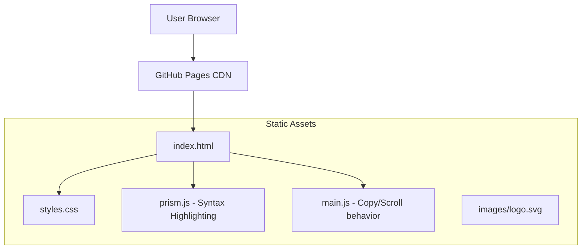

# Homepage Design Initiative - Product Requirements Document

## Executive Summary

### Problem Statement
MirDB is a capable persistent key-value store with Memcached protocol compatibility, but it currently lacks a public-facing homepage. Without a homepage, potential users cannot easily discover the product, understand its value proposition, or access documentation and getting-started resources. This limits adoption and makes it difficult to differentiate MirDB from alternatives in the key-value store space.

### Proposed Solution
Create a professional, informative homepage for MirDB that clearly communicates its unique value proposition (persistent Memcached-compatible storage), provides quick-start information, and directs users to relevant resources. The homepage will serve as the primary entry point for developers evaluating MirDB for their projects.

### Expected Impact
- **Increased Discoverability**: Developers searching for persistent key-value solutions can find and evaluate MirDB
- **Reduced Time-to-Value**: Clear documentation and getting-started guides help users adopt MirDB faster
- **Professional Presence**: A polished homepage establishes credibility and trust in the project
- **Community Growth**: Better visibility and resources encourage contributions and community engagement

### Success Metrics
- Homepage successfully deployed and accessible
- Core information (features, installation, usage) clearly presented
- Page loads within 2 seconds on standard connections
- Mobile-responsive design functioning on all major device sizes

---

## Requirements & Scope

### Functional Requirements

| ID | Requirement | Priority |
|----|-------------|----------|
| REQ-1 | Display product name (MirDB) and tagline prominently | Must |
| REQ-2 | Communicate core value proposition: persistent Memcached-compatible key-value store | Must |
| REQ-3 | List key features: persistence, Memcached protocol support, LSM tree architecture | Must |
| REQ-4 | Provide quick-start installation instructions | Must |
| REQ-5 | Show basic usage examples (SET/GET operations) | Must |
| REQ-6 | Include navigation to documentation/GitHub repository | Must |
| REQ-7 | Display supported commands overview | Should |
| REQ-8 | Show configuration options summary | Should |
| REQ-9 | Include "Built with Rust" badge/indicator | Should |
| REQ-10 | Provide code snippets for common client integrations | Could |
| REQ-11 | Display project status and roadmap highlights | Could |

### Non-Functional Requirements

| ID | Requirement | Priority |
|----|-------------|----------|
| NFR-1 | Page must load within 2 seconds on 3G connections | Must |
| NFR-2 | Design must be responsive (mobile, tablet, desktop) | Must |
| NFR-3 | Content must be accessible (WCAG 2.1 AA compliance) | Must |
| NFR-4 | Page must render correctly in Chrome, Firefox, Safari, Edge | Must |
| NFR-5 | Code snippets must have syntax highlighting | Should |
| NFR-6 | Design should follow modern minimalist aesthetics | Should |
| NFR-7 | Page should support dark/light mode toggle | Could |

### Out of Scope
- User authentication or account management
- Interactive database playground/demo
- Blog or news section
- Multi-language internationalization (initial release)
- Full API documentation (link to external docs instead)
- Community forum or discussion features

### Success Criteria
- All "Must" priority requirements implemented and verified
- Homepage deployed to production URL
- Page passes Lighthouse performance score of 90+
- Page passes accessibility audit with no critical issues
- Stakeholder sign-off on design and content

---

## User Stories

### Personas
1. **Evaluating Developer**: A developer researching key-value store options for a new project
2. **New User**: A developer who has decided to try MirDB and needs getting-started guidance
3. **Returning User**: An existing MirDB user looking for reference information or updates

### Core Stories

**US-1: Understand Product Value** (REQ-1, REQ-2, REQ-3)
> As an **Evaluating Developer**, I want to quickly understand what MirDB is and why I should use it, so that I can decide if it fits my project needs.

*Acceptance Criteria:*
- Given I land on the homepage
- When the page loads
- Then I see the product name, tagline, and 3-5 key differentiators within the first viewport

*Priority: Must*

---

**US-2: Get Started Quickly** (REQ-4, REQ-5)
> As a **New User**, I want clear installation and usage instructions, so that I can start using MirDB within minutes.

*Acceptance Criteria:*
- Given I want to install MirDB
- When I look for installation instructions
- Then I find copy-able commands for building/running the server
- And I see example SET/GET commands I can try immediately

*Priority: Must*

---

**US-3: Access Documentation** (REQ-6)
> As a **New User**, I want links to detailed documentation, so that I can learn more about advanced features and configuration.

*Acceptance Criteria:*
- Given I need more detailed information
- When I look for documentation links
- Then I find clear navigation to GitHub repository and/or external docs

*Priority: Must*

---

**US-4: View Feature Overview** (REQ-7, REQ-8)
> As an **Evaluating Developer**, I want to see what commands and configuration options are available, so that I can assess if MirDB meets my requirements.

*Acceptance Criteria:*
- Given I want to understand MirDB's capabilities
- When I browse the homepage
- Then I find a summary of supported commands (SET, GET, DELETE, etc.)
- And I can see key configuration parameters and defaults

*Priority: Should*

---

**US-5: Mobile Access** (NFR-2)
> As a **Developer on mobile**, I want the homepage to be readable on my phone, so that I can review MirDB while away from my workstation.

*Acceptance Criteria:*
- Given I access the homepage on a mobile device
- When the page loads
- Then all content is readable without horizontal scrolling
- And navigation is touch-friendly

*Priority: Must*

---

## User Experience & Interface

### Page Structure

The homepage follows a single-page scrolling layout with distinct sections:

1. **Hero Section**
   - Product name and logo
   - Tagline: "Persistent Key-Value Store with Memcached Protocol"
   - Primary CTA: "Get Started" (scrolls to installation)
   - Secondary CTA: "View on GitHub"

2. **Features Section**
   - Grid or card layout highlighting 3-4 key features:
     - Memcached Protocol Compatibility
     - Persistent Storage (survives restarts)
     - LSM Tree Architecture
     - Written in Rust

3. **Quick Start Section**
   - Installation commands (cargo build)
   - Running the server
   - Basic usage example with memcached client

4. **Commands Overview Section**
   - Table or cards showing supported commands
   - Brief description of each command category

5. **Configuration Section**
   - Key configuration parameters table
   - Link to full configuration documentation

6. **Footer**
   - GitHub link
   - License information
   - "Built with Rust" badge

### Interaction Patterns
- Smooth scroll navigation between sections
- Copy-to-clipboard functionality for code snippets
- Sticky header with section links for easy navigation
- Responsive hamburger menu on mobile

### Accessibility Considerations
- Semantic HTML structure with proper heading hierarchy
- Sufficient color contrast ratios (4.5:1 minimum)
- Keyboard navigable interactive elements
- Alt text for any images/icons
- Skip-to-content link for screen readers

---

## Design Specification

### Recommended Approach
Build a lightweight static website using modern HTML/CSS with minimal JavaScript, deployable via GitHub Pages or similar static hosting. This approach prioritizes simplicity, performance, and maintainability while meeting all functional requirements.

### Key Technical Decisions

#### 1. Static Site vs. Dynamic Framework
- **Options Considered**: Static HTML/CSS, Static Site Generator (Hugo, Jekyll), SPA Framework (React, Vue)
- **Tradeoffs**:
  - Static HTML: Simplest, fastest, no build step; limited reusability
  - SSG: Good balance of templating and performance; adds build complexity
  - SPA: Maximum flexibility; overkill for informational page, larger bundle
- **Recommendation**: Static HTML/CSS for initial implementation due to simplicity and performance. Consider SSG if content grows significantly.

#### 2. Styling Approach
- **Options Considered**: Custom CSS, CSS Framework (Tailwind, Bootstrap), CSS-in-JS
- **Tradeoffs**:
  - Custom CSS: Full control, no dependencies; more initial work
  - CSS Framework: Rapid development, consistent design; potential bloat
  - CSS-in-JS: Component scoping; unnecessary for static site
- **Recommendation**: Custom CSS with CSS variables for theming. Keeps bundle minimal and avoids framework lock-in.

#### 3. Hosting Platform
- **Options Considered**: GitHub Pages, Netlify, Vercel, Self-hosted
- **Tradeoffs**:
  - GitHub Pages: Free, integrated with repo; limited features
  - Netlify/Vercel: More features, easy deploys; external dependency
  - Self-hosted: Full control; maintenance overhead
- **Recommendation**: GitHub Pages for seamless integration with the existing MirDB repository and zero cost.

#### 4. Code Syntax Highlighting
- **Options Considered**: Prism.js, Highlight.js, Pre-rendered highlighting
- **Tradeoffs**:
  - Prism.js: Lightweight, extensible; requires JS
  - Highlight.js: Feature-rich; larger bundle
  - Pre-rendered: No runtime JS; static code only
- **Recommendation**: Prism.js for its small footprint and good Rust/shell support.

### High-Level Architecture



### Key Considerations
- **Performance**: Static assets cached at CDN edge, minimal JavaScript, optimized images ensure sub-2-second load times
- **Security**: No server-side code, no user input handling; minimal attack surface
- **Scalability**: Static hosting handles any traffic volume without infrastructure changes

### Risk Management
- **Content Accuracy Risk**: Documentation may drift from actual implementation. Mitigation: Include version number on homepage, link to versioned docs.
- **Browser Compatibility Risk**: CSS features may not work in older browsers. Mitigation: Use progressive enhancement and test in target browsers.

### Success Criteria
- Page loads in under 2 seconds on 3G connection
- Lighthouse performance score of 90+
- All code snippets render with proper syntax highlighting
- Responsive breakpoints function correctly at 320px, 768px, and 1024px widths

---

## Dependencies & Assumptions

### Dependencies
- **GitHub Repository Access**: Homepage files will be hosted in or alongside the MirDB repository
- **GitHub Pages Activation**: Repository must have GitHub Pages enabled for deployment
- **Logo/Branding Assets**: Product logo or icon needed for hero section (if not existing, simple text logo acceptable)

### Assumptions
- MirDB project maintainers will review and approve homepage content
- No backend services or APIs are required for the initial homepage
- Existing MirDB documentation (README, code comments) provides accurate technical information
- English is the only language required for initial release

### Cross-Team Coordination
- Content review by MirDB maintainers for technical accuracy
- Design review (if applicable) for visual consistency with any existing brand guidelines

---

## Appendices

### Content Reference: Key MirDB Information for Homepage

**Tagline Options:**
- "Persistent Key-Value Store with Memcached Protocol"
- "Memcached-Compatible Storage That Persists"
- "Drop-in Persistent Storage for Memcached Clients"

**Feature Highlights:**
1. Memcached Protocol Support - Use existing clients without modification
2. Persistent Storage - Data survives server restarts
3. LSM Tree Architecture - Optimized for write-heavy workloads
4. Written in Rust - Memory safety and performance

**Quick Start Commands:**
```bash
# Build
cargo build --release

# Run server
./target/release/mirdb -c etc/mirdb.toml

# Connect with any memcached client
telnet localhost 12333
set mykey 0 0 5
hello
STORED
get mykey
VALUE mykey 0 5
hello
END
```

**Default Configuration:**
| Parameter | Default Value |
|-----------|--------------|
| Listen Address | 0.0.0.0:12333 |
| Work Directory | /tmp/mirdb |
| Max LSM Levels | 7 |
| Memtable Size | 4MB |
| SSTable Max Size | 100MB |
| Block Size | 4KB |
