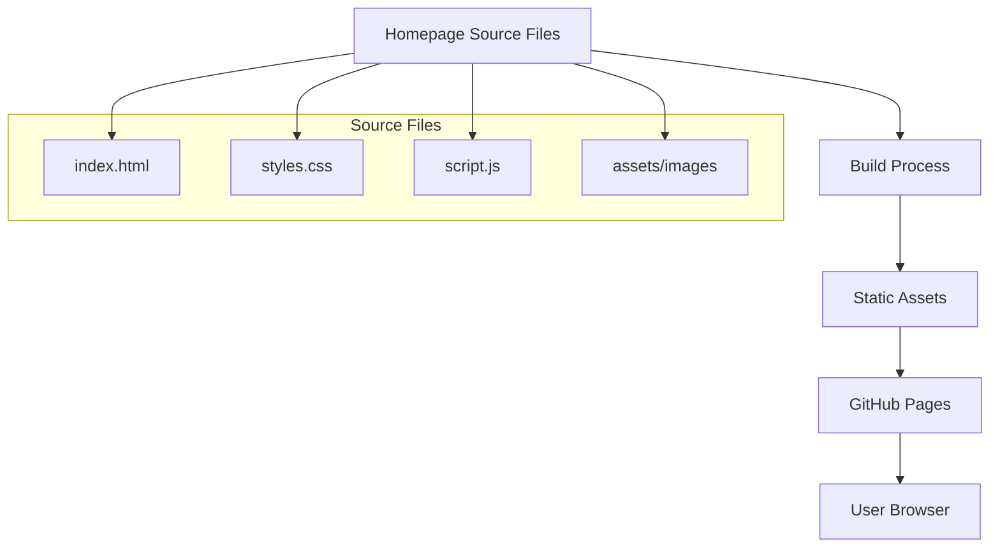

# Product Homepage Design - Product Requirements Document

## Executive Summary

### Problem Statement
MirDB is a feature-rich persistent key-value store written in Rust, but it currently lacks a dedicated homepage to communicate its value proposition to potential users. Without a clear, professional homepage, the project struggles to attract developers and organizations who could benefit from a memcached-compatible persistent storage solution.

### Proposed Solution
Create a compelling product homepage for MirDB that effectively communicates its core value proposition: a drop-in replacement for memcached with persistence. The homepage will showcase key features, provide clear documentation links, and guide users to get started quickly.

### Expected Impact
- **Business Value**: Increase project visibility and adoption among developers seeking persistent caching solutions
- **User Benefits**: Enable potential users to quickly understand MirDB's capabilities, evaluate fit for their use case, and begin integration
- **Community Growth**: Establish MirDB's professional presence to attract contributors and build community

### Success Metrics
- Homepage clearly communicates MirDB's core value proposition within 5 seconds of viewing
- Users can navigate to getting started documentation within 2 clicks
- Homepage is responsive across desktop, tablet, and mobile devices
- Page load time under 3 seconds on standard connections

---

## Requirements & Scope

### Functional Requirements

| ID | Requirement | Priority |
|----|-------------|----------|
| REQ-1 | Display hero section with product name, tagline, and primary call-to-action | Must |
| REQ-2 | Showcase key features (memcached compatibility, persistence, Rust performance, LSM architecture) | Must |
| REQ-3 | Provide quick start code snippet demonstrating basic usage | Must |
| REQ-4 | Include navigation to documentation, GitHub repository, and community resources | Must |
| REQ-5 | Display current project status and implemented features | Should |
| REQ-6 | Show configuration options with sensible defaults | Should |
| REQ-7 | Include comparison section highlighting advantages over standard memcached | Should |
| REQ-8 | Provide links to supported memcached commands | Could |
| REQ-9 | Display community/contributor information | Could |

### Non-Functional Requirements

| ID | Requirement | Priority |
|----|-------------|----------|
| NFR-1 | Page must be fully responsive (mobile, tablet, desktop) | Must |
| NFR-2 | Page load time must be under 3 seconds | Must |
| NFR-3 | Accessibility compliance (WCAG 2.1 AA) | Should |
| NFR-4 | SEO optimization with proper meta tags and semantic HTML | Should |
| NFR-5 | Support for dark/light theme | Could |

### Out of Scope
- User authentication or account management
- Interactive database playground or live demo environment
- Blog or news section
- Multi-language internationalization (i18n)
- Analytics dashboard integration

### Success Criteria
- All "Must" requirements implemented and verified
- Homepage passes Lighthouse performance audit with score >= 80
- Homepage renders correctly on Chrome, Firefox, Safari, and Edge
- Stakeholder approval on design and content

---

## User Experience & Interface

### User Journey

1. **Discovery**: User arrives at homepage from search, GitHub, or referral
2. **Understanding**: User immediately sees what MirDB is and its key benefit (persistence + memcached compatibility)
3. **Evaluation**: User explores features to determine if MirDB fits their needs
4. **Action**: User clicks to view documentation or GitHub to begin integration

### Interface Requirements

#### Hero Section
- Product logo and name prominently displayed
- Clear tagline: "Persistent Key-Value Store with Memcached Protocol"
- Primary CTA: "Get Started" button linking to documentation
- Secondary CTA: "View on GitHub" button

#### Features Section
Four key feature cards:
1. **Memcached Compatible** - Drop-in replacement using standard memcached protocol
2. **Persistent Storage** - Data survives restarts with SSTable-based storage
3. **Rust Performance** - Built with Rust for speed and memory safety
4. **LSM Architecture** - Efficient writes with Log-Structured Merge-tree

#### Quick Start Section
- Code snippet showing basic connection and SET/GET operations
- Copy-to-clipboard functionality
- Link to full documentation

#### Configuration Section
- Visual display of key configuration options
- Default values and brief descriptions
- Link to configuration documentation

#### Footer
- Links: Documentation, GitHub, License
- Project attribution

### Accessibility Considerations
- Semantic HTML structure with proper heading hierarchy
- Sufficient color contrast ratios (minimum 4.5:1)
- Keyboard navigation support
- Alt text for all images and icons
- Screen reader compatible

---

## Technical Considerations

### High-Level Technical Approach
Static site implementation that prioritizes performance and maintainability. The homepage should be easily deployable alongside the existing project repository.

### Integration Points
- GitHub repository for source hosting and version control
- GitHub Pages or similar static hosting platform for deployment
- Existing project documentation (if available)

### Key Technical Constraints
- Must work as static HTML/CSS/JS (no server-side requirements)
- Should be maintainable by contributors with varying frontend expertise
- Must integrate cleanly with existing Rust project repository structure

### Performance Considerations
- Minimize external dependencies and HTTP requests
- Use optimized images and modern formats (WebP with fallbacks)
- Implement lazy loading for below-fold content
- Inline critical CSS for faster first contentful paint

---

## Design Specification

### Recommended Approach
Build a single-page static website using minimal dependencies, focusing on clean HTML/CSS with optional JavaScript enhancements. This approach prioritizes maintainability, performance, and ease of deployment within the existing Rust project ecosystem.

### Key Technical Decisions

#### 1. Framework/Build Tool
- **Options Considered**: Raw HTML/CSS, Static Site Generator (Hugo/Jekyll), React/Vue SPA
- **Tradeoffs**: Raw HTML is simplest but harder to maintain; SSGs add build complexity but offer templating; SPAs are overkill for a single page
- **Recommendation**: Use a minimal static site generator (Hugo) or plain HTML/CSS, depending on future documentation needs

#### 2. Styling Approach
- **Options Considered**: Custom CSS, CSS Framework (Tailwind/Bootstrap), CSS-in-JS
- **Tradeoffs**: Custom CSS offers full control but more code; frameworks speed development but add weight; CSS-in-JS requires JS runtime
- **Recommendation**: Custom CSS with CSS variables for theming, keeping the bundle minimal

#### 3. Hosting Platform
- **Options Considered**: GitHub Pages, Netlify, Cloudflare Pages, Self-hosted
- **Tradeoffs**: GitHub Pages integrates with repo but limited features; Netlify/Cloudflare offer better performance and features
- **Recommendation**: GitHub Pages for simplicity and zero-cost hosting within existing GitHub workflow

### High-Level Architecture

### Key Considerations
- **Performance**: Static files with minimal JavaScript ensure fast load times; inline critical CSS and lazy-load images for optimal Core Web Vitals
- **Security**: No server-side code eliminates common vulnerabilities; CSP headers can be configured via hosting platform
- **Scalability**: Static hosting scales infinitely at minimal cost; CDN distribution handles traffic spikes

### Risk Management
- **Content Maintenance Risk**: Homepage content may become outdated as project evolves; mitigate by keeping content modular and easy to update
- **Browser Compatibility Risk**: Modern CSS features may not work in older browsers; mitigate by testing across major browsers and using progressive enhancement

### Success Criteria
- Homepage deploys successfully to GitHub Pages from project repository
- Lighthouse performance score >= 80
- All "Must" requirements from REQ-1 through REQ-4 implemented
- Page renders correctly on major browsers (Chrome, Firefox, Safari, Edge)

---

## User Stories

### Personas
- **Developer Dana**: A backend developer evaluating caching solutions for a new project
- **Ops Oliver**: A DevOps engineer looking to add persistence to existing memcached infrastructure
- **Contributor Chris**: An open-source contributor interested in the project

### Core Stories

#### Story 1: Understand Product Value
**As a** Developer Dana
**I want to** immediately understand what MirDB is and why it's useful
**So that** I can quickly determine if it fits my project needs

**Priority**: Must
**Related Requirements**: REQ-1, REQ-2

**Acceptance Criteria**:
- Given I land on the homepage
- When the page loads
- Then I see the product name and tagline within the hero section
- And I understand the core value proposition (persistent memcached-compatible storage) within 5 seconds

#### Story 2: Explore Features
**As a** Developer Dana
**I want to** see detailed feature descriptions
**So that** I can evaluate MirDB's technical capabilities

**Priority**: Must
**Related Requirements**: REQ-2, REQ-5

**Acceptance Criteria**:
- Given I am on the homepage
- When I scroll to the features section
- Then I see cards describing memcached compatibility, persistence, Rust performance, and LSM architecture
- And each feature has a brief, clear description

#### Story 3: Get Started Quickly
**As a** Developer Dana
**I want to** see example code for basic operations
**So that** I can understand how to integrate MirDB

**Priority**: Must
**Related Requirements**: REQ-3, REQ-4

**Acceptance Criteria**:
- Given I am on the homepage
- When I view the quick start section
- Then I see code snippets for connecting and performing GET/SET operations
- And I can copy the code with a single click
- And I can navigate to full documentation within 2 clicks

#### Story 4: Access Project Resources
**As an** Ops Oliver
**I want to** easily find documentation and GitHub links
**So that** I can begin evaluating and testing MirDB

**Priority**: Must
**Related Requirements**: REQ-4

**Acceptance Criteria**:
- Given I am on the homepage
- When I look for navigation options
- Then I see clearly visible links to documentation and GitHub repository
- And the links are accessible from both header and footer

#### Story 5: Compare with Alternatives
**As an** Ops Oliver
**I want to** understand how MirDB differs from standard memcached
**So that** I can justify the switch to my team

**Priority**: Should
**Related Requirements**: REQ-7

**Acceptance Criteria**:
- Given I am on the homepage
- When I view the comparison section
- Then I see a clear comparison highlighting MirDB's persistence advantage
- And I understand what commands are supported

#### Story 6: View on Mobile
**As a** Developer Dana
**I want to** view the homepage on my phone
**So that** I can share it with colleagues during meetings

**Priority**: Must
**Related Requirements**: NFR-1

**Acceptance Criteria**:
- Given I am viewing the homepage on a mobile device
- When the page loads
- Then all content is readable without horizontal scrolling
- And navigation is accessible via mobile-friendly menu
- And buttons are easily tappable

#### Story 7: Contribute to Project
**As a** Contributor Chris
**I want to** find information about contributing
**So that** I can participate in the project

**Priority**: Could
**Related Requirements**: REQ-9

**Acceptance Criteria**:
- Given I am on the homepage
- When I look for contribution information
- Then I find a link to the GitHub repository
- And I can access contribution guidelines

---

## Dependencies & Assumptions

### Dependencies
- GitHub repository must remain accessible for hosting and linking
- Project documentation must be available or planned for linking from homepage

### Assumptions
- The project will continue to be open-source and hosted on GitHub
- Existing memcached protocol documentation can be referenced
- No immediate plans for custom domain (using GitHub Pages default URL initially)

---

## Appendices

### MirDB Key Information for Content

**Tagline Options**:
- "Persistent Key-Value Store with Memcached Protocol"
- "Drop-in Memcached Replacement with Persistence"
- "The Persistent Memcached Alternative Written in Rust"

**Key Features to Highlight**:
1. Memcached protocol compatibility (existing clients work seamlessly)
2. Persistence via SSTable storage
3. LSM Tree architecture for efficient writes
4. Written in Rust for performance and safety
5. Configurable with TOML files

**Supported Commands**:
- Storage: SET, ADD, REPLACE, APPEND, PREPEND
- Retrieval: GET, GETS
- Deletion: DELETE
- MirDB-specific: INFO, MAJOR_COMPACTION

**Default Configuration**:
- Address: 0.0.0.0:12333
- Max LSM levels: 7
- Memtable size: 4MB
- SSTable max size: 100MB
- Block size: 4KB
