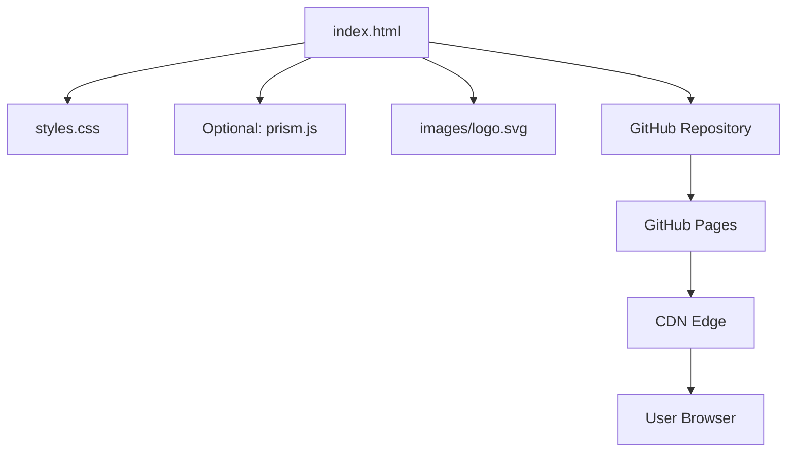

# Product Homepage Design - Product Requirements Document

## Executive Summary

### Problem Statement
MirDB is a powerful persistent key-value store that combines memcached protocol compatibility with disk persistence using LSM tree architecture. However, there is currently no homepage to showcase the product, explain its value proposition, or help potential users understand its capabilities and get started.

### Proposed Solution
Create a compelling product homepage that effectively communicates MirDB's unique value proposition, key features, and differentiation from standard memcached. The homepage will serve as the primary entry point for developers discovering MirDB, providing clear information about what it does, why they should use it, and how to get started.

### Expected Impact
- **Increased Adoption**: A professional homepage will help developers discover and understand MirDB's value
- **Reduced Onboarding Friction**: Clear documentation and getting-started guidance will accelerate adoption
- **Community Growth**: A visible online presence enables community building around the project
- **Credibility**: A polished homepage establishes MirDB as a serious, production-ready solution

### Success Metrics
- Homepage successfully deployed and accessible
- Clear communication of MirDB's core value proposition
- Visitors can understand what MirDB is within 30 seconds
- Getting-started path is clearly visible and actionable

---

## Requirements & Scope

### Functional Requirements

| ID | Requirement | Priority |
|----|-------------|----------|
| REQ-1 | Display MirDB product name and tagline prominently | Must |
| REQ-2 | Communicate the core value proposition (persistent memcached-compatible key-value store) | Must |
| REQ-3 | Highlight key features (persistence, memcached compatibility, LSM tree architecture) | Must |
| REQ-4 | Provide a "Getting Started" section with installation/usage instructions | Must |
| REQ-5 | Show supported commands and protocol information | Should |
| REQ-6 | Include code examples demonstrating basic usage | Should |
| REQ-7 | Display default configuration options | Should |
| REQ-8 | Link to source code repository | Must |
| REQ-9 | Show project status (implemented vs planned features) | Should |
| REQ-10 | Provide visual architecture diagram (LSM tree data flow) | Could |
| REQ-11 | Include comparison with standard memcached | Could |
| REQ-12 | Mobile-responsive design | Must |

### Non-Functional Requirements

| ID | Requirement | Priority |
|----|-------------|----------|
| NFR-1 | Page load time under 3 seconds on standard connections | Must |
| NFR-2 | Accessible design following WCAG 2.1 AA guidelines | Should |
| NFR-3 | SEO-optimized with appropriate meta tags and semantic HTML | Should |
| NFR-4 | Cross-browser compatibility (Chrome, Firefox, Safari, Edge) | Must |
| NFR-5 | Static site generation for simple hosting and deployment | Should |
| NFR-6 | Clean, professional design consistent with developer tool aesthetics | Must |

### Out of Scope
- User authentication or login functionality
- Interactive database playground or live demo
- Documentation site with multiple pages (single homepage only)
- Blog or news section
- Community forum integration
- Analytics dashboard

### Success Criteria
- All "Must" priority requirements implemented and verified
- Homepage renders correctly on desktop and mobile viewports
- All external links functional
- Content accurately represents MirDB's current capabilities

---

## User Experience & Interface

### Target Users
**Primary Persona**: Backend developers familiar with memcached who need persistence for their key-value data. They are evaluating MirDB as an alternative to memcached or other key-value stores.

**Secondary Persona**: System architects researching persistent caching solutions for their infrastructure.

### User Journey

1. **Discovery**: User arrives via search, GitHub, or referral
2. **Understanding**: User reads hero section and immediately understands what MirDB is
3. **Evaluation**: User scrolls to features section to evaluate fit for their use case
4. **Decision**: User reviews getting-started section and decides to try MirDB
5. **Action**: User clicks through to documentation or repository to begin

### Interface Requirements

#### Hero Section
- Product name: "MirDB"
- Tagline: "Persistent Key-Value Store with Memcached Protocol"
- Brief description (1-2 sentences)
- Primary CTA: "Get Started" or "View on GitHub"

#### Features Section
- 3-4 key features displayed in cards or grid layout:
  - **Memcached Compatible**: Use existing clients and tools
  - **Persistent Storage**: Data survives restarts using SSTables
  - **LSM Tree Architecture**: Efficient write-heavy workloads
  - **Built with Rust**: Performance and memory safety

#### Getting Started Section
- Simple installation command
- Basic usage example with SET/GET commands
- Configuration snippet

#### Technical Details Section
- Supported commands overview
- Architecture diagram (optional)
- Default configuration values

#### Footer
- Repository link
- License information
- Project status indicator

### Accessibility Considerations
- Sufficient color contrast for all text
- Keyboard navigation support
- Screen reader compatible structure
- Alt text for any images or diagrams

---

## Technical Considerations

### High-Level Technical Approach
The homepage should be implemented as a static website, optimized for simplicity, performance, and easy deployment. Static sites are ideal for product homepages as they require no server-side processing and can be hosted on free platforms like GitHub Pages.

### Integration Points
- **GitHub Repository**: Link to source code
- **Package Registry**: Link to crates.io if published
- **Documentation**: Link to README or docs if available

### Key Technical Constraints
- Must work without JavaScript for core content (progressive enhancement acceptable)
- Should be deployable to static hosting platforms (GitHub Pages, Netlify, Vercel)
- Assets should be optimized for fast loading

### Performance Considerations
- Minimize external dependencies
- Optimize images and use modern formats (WebP with fallbacks)
- Use efficient CSS (consider utility-first frameworks or minimal custom CSS)
- Code syntax highlighting should be lightweight

---

## Design Specification

### Recommended Approach
Build a single-page static website using modern HTML/CSS with optional static site generator for maintainability. Focus on clean typography, clear hierarchy, and developer-friendly aesthetics.

### Key Technical Decisions

#### 1. Static Site Generation
- **Options Considered**: Plain HTML, Hugo, Jekyll, Astro, Zola
- **Tradeoffs**: Plain HTML is simplest but harder to maintain; Hugo/Jekyll add build complexity but enable templating; Astro/Zola offer modern DX but smaller ecosystems
- **Recommendation**: Plain HTML/CSS for initial implementation due to simplicity, with option to migrate to a generator if maintenance becomes an issue

#### 2. Styling Approach
- **Options Considered**: Custom CSS, Tailwind CSS, Bootstrap, Pico CSS
- **Tradeoffs**: Custom CSS offers full control but more work; Tailwind is flexible but requires build step; Bootstrap is comprehensive but heavy; Pico is minimal and classless
- **Recommendation**: Minimal custom CSS or Pico CSS for a clean, lightweight solution that looks professional without build complexity

#### 3. Code Highlighting
- **Options Considered**: Prism.js, Highlight.js, pre-rendered with static classes
- **Tradeoffs**: JS libraries add weight but are flexible; pre-rendered is lightweight but less maintainable
- **Recommendation**: Prism.js (lightweight) or pre-rendered code blocks for minimal JavaScript dependency

#### 4. Hosting Platform
- **Options Considered**: GitHub Pages, Netlify, Vercel, Cloudflare Pages
- **Tradeoffs**: GitHub Pages integrates with repo but limited features; Netlify/Vercel offer more features but external service; Cloudflare is performant but adds complexity
- **Recommendation**: GitHub Pages for simplicity and tight repository integration

### High-Level Architecture

### Key Considerations
- **Performance**: Static HTML with minimal CSS ensures fast load times; lazy-load any images below the fold
- **Security**: Static sites have minimal attack surface; ensure no sensitive information in source
- **Scalability**: Static hosting scales automatically via CDN; no server capacity concerns

### Risk Management
- **Content Accuracy Risk**: Homepage content may become outdated as MirDB evolves. Mitigation: Include last-updated date and link to authoritative README.
- **Browser Compatibility Risk**: Custom CSS may render differently across browsers. Mitigation: Test on major browsers and use well-supported CSS features.

### Success Criteria
- Homepage loads in under 2 seconds on 3G connection
- Lighthouse performance score above 90
- Content accurately reflects current MirDB capabilities
- All links functional and pointing to correct destinations

---

## User Stories

### Personas
- **Developer Dave**: Backend developer evaluating key-value stores for a new project
- **Architect Alice**: System architect researching caching infrastructure options

### Core User Stories

#### US-1: Understand Product Purpose
**As a** Developer Dave
**I want to** quickly understand what MirDB is and does
**So that** I can determine if it's relevant to my needs

**Acceptance Criteria:**
- Given I land on the homepage
- When I read the hero section
- Then I understand MirDB is a persistent key-value store with memcached compatibility within 10 seconds

**Priority:** Must
**Traces to:** REQ-1, REQ-2

---

#### US-2: Evaluate Key Features
**As a** Architect Alice
**I want to** see MirDB's key features and technical approach
**So that** I can evaluate if it fits our architecture requirements

**Acceptance Criteria:**
- Given I am on the homepage
- When I scroll to the features section
- Then I see clearly presented features including persistence, protocol compatibility, and architecture

**Priority:** Must
**Traces to:** REQ-3, REQ-10

---

#### US-3: Get Started Quickly
**As a** Developer Dave
**I want to** find quick-start instructions
**So that** I can try MirDB in my development environment

**Acceptance Criteria:**
- Given I decide to try MirDB
- When I look for getting-started information
- Then I find installation commands and basic usage examples prominently displayed

**Priority:** Must
**Traces to:** REQ-4, REQ-6

---

#### US-4: Access Source Code
**As a** Developer Dave
**I want to** access the source code repository
**So that** I can review the implementation and contribute

**Acceptance Criteria:**
- Given I want to explore the codebase
- When I look for repository links
- Then I find a clearly visible link to the GitHub repository

**Priority:** Must
**Traces to:** REQ-8

---

#### US-5: View Supported Commands
**As a** Developer Dave
**I want to** see what memcached commands are supported
**So that** I can verify compatibility with my existing code

**Acceptance Criteria:**
- Given I use memcached in my current project
- When I look for protocol information
- Then I see a list of supported commands (SET, GET, DELETE, etc.)

**Priority:** Should
**Traces to:** REQ-5

---

#### US-6: View on Mobile Device
**As a** Developer Dave
**I want to** view the homepage on my phone
**So that** I can research MirDB while away from my desk

**Acceptance Criteria:**
- Given I access the homepage on a mobile device
- When the page loads
- Then all content is readable and properly formatted for mobile viewport

**Priority:** Must
**Traces to:** REQ-12, NFR-4

---

#### US-7: Understand Project Maturity
**As a** Architect Alice
**I want to** understand the project's current status and roadmap
**So that** I can assess risk and plan for future capabilities

**Acceptance Criteria:**
- Given I need to evaluate project maturity
- When I look for status information
- Then I see what features are implemented vs planned (e.g., Raft consensus)

**Priority:** Should
**Traces to:** REQ-9

---

## Dependencies & Assumptions

### Dependencies
- GitHub repository must be accessible for linking
- No external API dependencies for homepage functionality

### Assumptions
- MirDB project will continue active development
- GitHub Pages (or similar) is an acceptable hosting solution
- Target audience has technical background (developers/architects)
- English is the primary language for initial release

---

## Appendices

### A. MirDB Feature Summary for Homepage Content

**Core Features:**
- Memcached protocol compatibility
- Persistent storage using SSTables
- LSM tree architecture with compaction
- Tokio-based async networking
- Skip list memtable implementation

**Supported Commands:**
- Storage: SET, ADD, REPLACE, APPEND, PREPEND
- Retrieval: GET, GETS
- Deletion: DELETE
- Admin: INFO, MAJOR_COMPACTION

**Default Configuration:**
- Listen: 0.0.0.0:12333
- Max levels: 7
- Work directory: /tmp/mirdb
- SSTable max: 100MB
- Memtable max: 4MB
- Block size: 4KB

### B. Content Outline

1. **Hero**
   - Logo/Name: MirDB
   - Tagline: "Persistent Key-Value Store with Memcached Protocol"
   - Description: "A Rust-based key-value store that speaks memcached but persists your data"
   - CTA: "Get Started" / "View on GitHub"

2. **Features Grid**
   - Memcached Compatible
   - Persistent Storage
   - LSM Tree Architecture
   - Built with Rust

3. **Quick Start**
   - Installation command
   - Connection example
   - SET/GET example

4. **Commands Reference**
   - Supported commands table

5. **Architecture** (optional)
   - LSM tree diagram

6. **Footer**
   - Repository link
   - License
   - Status badge
