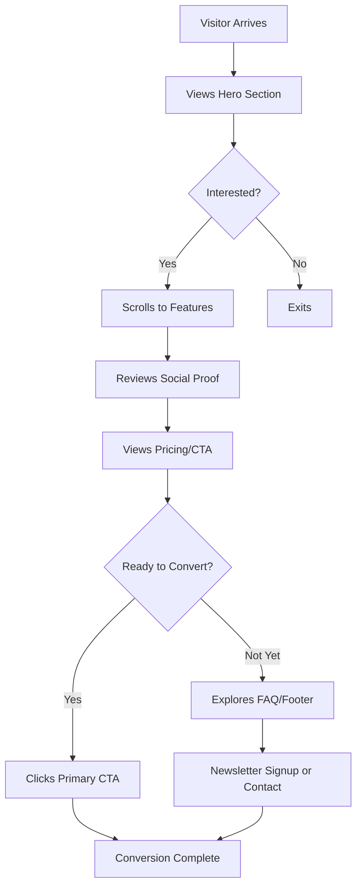

# Product Landing Page Design - Product Requirements Document

## Executive Summary

### Problem Statement
The product currently lacks a dedicated homepage that communicates its value proposition, engages potential customers, and drives conversions. Without a well-designed landing page, the product cannot effectively attract and convert visitors into users or customers.

### Proposed Solution
Design and develop a professional, conversion-focused product landing page that clearly communicates the product's value proposition, showcases key features and benefits, builds trust through social proof, and guides visitors toward desired actions (signup, purchase, or contact).

### Expected Impact
- **User Benefits**: Clear understanding of product value, easy navigation to relevant information, seamless path to conversion
- **Business Value**: Increased brand awareness, improved conversion rates, reduced bounce rates, and enhanced user acquisition

### Success Metrics
- Bounce rate below 40%
- Average time on page exceeding 2 minutes
- Conversion rate (CTA clicks) above 5%
- Mobile responsiveness score above 90 on Google PageSpeed Insights

---

## Requirements & Scope

### Functional Requirements

| ID | Requirement | Priority |
|----|-------------|----------|
| REQ-1 | Hero section with compelling headline, subheadline, and primary CTA button | Must Have |
| REQ-2 | Product features/benefits section highlighting key value propositions | Must Have |
| REQ-3 | Navigation header with logo, menu links, and CTA button | Must Have |
| REQ-4 | Footer with contact information, social links, and secondary navigation | Must Have |
| REQ-5 | Social proof section (testimonials, customer logos, or reviews) | Should Have |
| REQ-6 | Visual product showcase (screenshots, demo video, or product images) | Should Have |
| REQ-7 | Pricing section or call-to-action for pricing information | Should Have |
| REQ-8 | FAQ or common questions section | Could Have |
| REQ-9 | Newsletter signup form for lead capture | Could Have |
| REQ-10 | Live chat or contact form integration | Could Have |

### Non-Functional Requirements

| ID | Requirement | Priority |
|----|-------------|----------|
| NFR-1 | Page must be fully responsive across desktop, tablet, and mobile devices | Must Have |
| NFR-2 | Page load time under 3 seconds on standard broadband connection | Must Have |
| NFR-3 | WCAG 2.1 AA accessibility compliance | Must Have |
| NFR-4 | Cross-browser compatibility (Chrome, Firefox, Safari, Edge) | Must Have |
| NFR-5 | SEO-optimized structure with proper meta tags, headings, and semantic HTML | Should Have |
| NFR-6 | Support for analytics tracking (Google Analytics or equivalent) | Should Have |
| NFR-7 | Images optimized for web with lazy loading where appropriate | Should Have |

### Out of Scope
- User authentication or account management
- E-commerce/payment processing functionality
- Content management system (CMS) integration
- Multi-language support (initial release)
- Backend API development
- Blog or news section

### Success Criteria
- All Must Have functional requirements implemented and verified
- All Must Have non-functional requirements met
- Page passes Google Lighthouse performance audit with score above 80
- Page validated for accessibility using automated tools
- Stakeholder approval of visual design and user flow

---

## User Experience & Interface

### User Journey



### Interface Requirements

**Hero Section**
- Full-width design with eye-catching visual
- Clear, concise headline (max 10 words)
- Supporting subheadline explaining the value proposition
- Prominent primary CTA button with contrasting color
- Optional secondary CTA for alternative action

**Navigation Header**
- Fixed/sticky header on scroll
- Logo positioned on the left
- Navigation links centered or right-aligned
- CTA button visually distinct from navigation links
- Mobile hamburger menu for smaller screens

**Features Section**
- Grid or card-based layout for 3-6 key features
- Icon or illustration for each feature
- Feature title and brief description
- Visual consistency across all feature cards

**Social Proof Section**
- Customer testimonials with photos and names
- Company logos (if B2B focused)
- Star ratings or review scores
- Case study highlights or statistics

**Footer**
- Multi-column layout with organized sections
- Contact information (email, phone, address)
- Social media icons with links
- Secondary navigation links
- Copyright notice and legal links

### Accessibility Considerations
- Sufficient color contrast ratios (4.5:1 minimum for text)
- Keyboard navigability for all interactive elements
- Alt text for all images
- Proper heading hierarchy (H1-H6)
- Focus indicators for interactive elements
- Screen reader-friendly content structure

---

## User Stories

### Personas
- **First-time Visitor**: A potential customer discovering the product for the first time
- **Returning Visitor**: Someone who has seen the product before and is evaluating it further
- **Mobile User**: A user accessing the landing page from a smartphone

### Core User Stories

**Story 1: First Impression**
- **As a** first-time visitor
- **I want to** immediately understand what the product does and its main benefit
- **So that** I can decide if it's relevant to my needs
- **Priority**: Must Have
- **Related Requirements**: REQ-1

**Acceptance Criteria**:
- Given I land on the homepage
- When the page loads completely
- Then I see a clear headline and subheadline within the viewport
- And the content communicates the product's core value within 5 seconds of reading

---

**Story 2: Feature Discovery**
- **As a** potential customer
- **I want to** explore the product's key features and benefits
- **So that** I can understand how it solves my problem
- **Priority**: Must Have
- **Related Requirements**: REQ-2, REQ-6

**Acceptance Criteria**:
- Given I am on the homepage
- When I scroll past the hero section
- Then I see a features section with at least 3 key benefits
- And each feature has an icon, title, and description
- And I can view product visuals (screenshots or images)

---

**Story 3: Trust Validation**
- **As a** cautious buyer
- **I want to** see evidence that others have used and benefited from this product
- **So that** I can trust the product before taking action
- **Priority**: Should Have
- **Related Requirements**: REQ-5

**Acceptance Criteria**:
- Given I am evaluating the product
- When I navigate to the social proof section
- Then I see at least 2 testimonials or customer references
- And each testimonial includes a name and context
- And the content appears authentic and relevant

---

**Story 4: Clear Call to Action**
- **As a** visitor ready to take action
- **I want to** easily find and click the main call-to-action
- **So that** I can proceed with signup, purchase, or contact
- **Priority**: Must Have
- **Related Requirements**: REQ-1, REQ-3, REQ-7

**Acceptance Criteria**:
- Given I want to take the next step
- When I look for the CTA button
- Then I can see at least one primary CTA button without scrolling (hero section)
- And additional CTAs are visible throughout the page
- And the CTA button clearly communicates what will happen when clicked

---

**Story 5: Mobile Experience**
- **As a** mobile user
- **I want to** have a seamless experience on my smartphone
- **So that** I can learn about and engage with the product on any device
- **Priority**: Must Have
- **Related Requirements**: NFR-1

**Acceptance Criteria**:
- Given I access the landing page on a mobile device
- When the page loads
- Then all content is readable without horizontal scrolling
- And navigation is accessible via a mobile-friendly menu
- And CTA buttons are easily tappable (minimum 44px touch target)
- And images scale appropriately for the screen size

---

**Story 6: Quick Loading**
- **As a** visitor with limited patience
- **I want to** have the page load quickly
- **So that** I don't abandon the site before seeing the content
- **Priority**: Must Have
- **Related Requirements**: NFR-2, NFR-7

**Acceptance Criteria**:
- Given I navigate to the landing page
- When the page loads
- Then the core content is visible within 3 seconds
- And images load progressively without blocking content
- And there are no noticeable layout shifts during loading

---

**Story 7: Easy Navigation**
- **As a** visitor exploring the page
- **I want to** navigate between sections easily
- **So that** I can find the information I need quickly
- **Priority**: Must Have
- **Related Requirements**: REQ-3, REQ-4

**Acceptance Criteria**:
- Given I am on the landing page
- When I use the navigation menu
- Then I can access all major sections from the header
- And the header remains visible when scrolling (sticky navigation)
- And the footer provides additional navigation options

---

## Technical Considerations

### High-Level Technical Approach
The landing page will be built as a static or semi-static website optimized for performance and SEO. The focus is on fast load times, accessibility, and ease of maintenance.

### Integration Points
- Analytics platform (Google Analytics, Mixpanel, or similar)
- Form submission handler (for newsletter signup and contact forms)
- Optional: CRM integration for lead capture
- Optional: Live chat widget (Intercom, Drift, etc.)

### Key Technical Constraints
- Must work without JavaScript for core content (progressive enhancement)
- Images must be optimized and served in modern formats (WebP with fallbacks)
- CSS must support modern layouts (Flexbox, Grid) with fallbacks for older browsers

### Performance and Scalability
- Static assets should be served via CDN
- Critical CSS inlined for above-the-fold content
- Lazy loading for below-the-fold images
- Minimal third-party scripts to reduce blocking

---

## Dependencies & Assumptions

### Dependencies
- Brand assets (logo, color palette, typography guidelines)
- Product screenshots or visual assets
- Copy/content for headlines, features, and descriptions
- Customer testimonials or social proof materials
- Hosting infrastructure or platform selection

### Assumptions
- Product branding and messaging have been finalized
- Stakeholders will provide timely feedback during design reviews
- Required visual assets will be available in web-ready formats
- Analytics and tracking requirements are known

---

## Appendices

### Wireframe Reference (Suggested Layout)

```
+--------------------------------------------------+
|  HEADER: Logo | Nav Links | CTA Button           |
+--------------------------------------------------+
|                                                  |
|  HERO SECTION                                    |
|  [Headline]                                      |
|  [Subheadline]                                   |
|  [Primary CTA] [Secondary CTA]                   |
|  [Hero Image/Visual]                             |
|                                                  |
+--------------------------------------------------+
|                                                  |
|  FEATURES SECTION                                |
|  [Feature 1] [Feature 2] [Feature 3]             |
|  [Feature 4] [Feature 5] [Feature 6]             |
|                                                  |
+--------------------------------------------------+
|                                                  |
|  PRODUCT SHOWCASE                                |
|  [Screenshots/Demo Video]                        |
|                                                  |
+--------------------------------------------------+
|                                                  |
|  SOCIAL PROOF                                    |
|  [Testimonials] [Customer Logos]                 |
|                                                  |
+--------------------------------------------------+
|                                                  |
|  PRICING / CTA SECTION                           |
|  [Pricing Cards or CTA]                          |
|                                                  |
+--------------------------------------------------+
|                                                  |
|  FAQ SECTION (Optional)                          |
|  [Question 1] [Question 2] [Question 3]          |
|                                                  |
+--------------------------------------------------+
|  FOOTER                                          |
|  [Links] [Contact] [Social] [Legal]              |
+--------------------------------------------------+
```

### Key Performance Indicators (KPIs)

| Metric | Target | Measurement Method |
|--------|--------|-------------------|
| Bounce Rate | < 40% | Google Analytics |
| Avg. Time on Page | > 2 min | Google Analytics |
| CTA Conversion Rate | > 5% | Analytics Events |
| Mobile Traffic Share | Tracked | Google Analytics |
| Page Load Time | < 3 sec | Google PageSpeed |
| Lighthouse Score | > 80 | Google Lighthouse |
