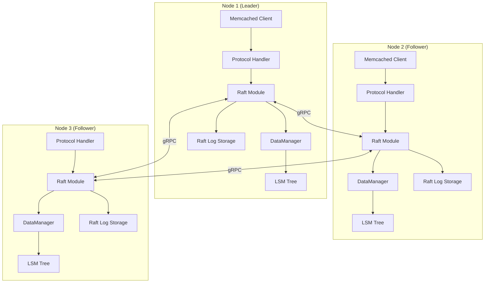

# Add Distributed Support - Product Requirements Document

## Executive Summary

### Problem Statement
MirDB currently operates as a single-node persistent key-value store. While it provides durability through write-ahead logging and efficient storage through LSM-tree architecture, it lacks the ability to scale horizontally or provide high availability. A single node failure results in complete service unavailability, and the system cannot handle workloads that exceed single-machine capacity.

### Proposed Solution
Implement distributed consensus using the Raft protocol to enable MirDB to operate as a replicated, fault-tolerant cluster. This will allow data to be automatically replicated across multiple nodes, with automatic leader election and failover capabilities, ensuring continuous availability and data consistency even when individual nodes fail.

### Expected Impact
- **High Availability**: System remains operational despite individual node failures (survives N/2 failures in an N-node cluster)
- **Data Durability**: Data replicated across multiple nodes eliminates single point of failure for data loss
- **Horizontal Read Scaling**: Read operations can be distributed across follower nodes
- **Production Readiness**: Transforms MirDB from a development/single-use tool to a production-ready distributed database

### Success Metrics
- Cluster maintains availability with up to (N-1)/2 node failures
- Leader election completes within 500ms of leader failure detection
- Write latency increase less than 2x compared to single-node operation
- Read throughput scales linearly with follower count for eventually-consistent reads

---

## Requirements & Scope

### Functional Requirements

| ID | Requirement | Priority |
|----|-------------|----------|
| REQ-1 | System shall implement Raft consensus protocol for distributed state machine replication | Must |
| REQ-2 | System shall support automatic leader election when the current leader becomes unavailable | Must |
| REQ-3 | System shall replicate all write operations to a majority of nodes before acknowledging success | Must |
| REQ-4 | System shall support cluster membership of 3, 5, or 7 nodes | Must |
| REQ-5 | System shall provide log replication with consistency guarantees | Must |
| REQ-6 | System shall support follower reads for eventually-consistent read operations | Should |
| REQ-7 | System shall provide cluster health and status monitoring endpoints | Should |
| REQ-8 | System shall support dynamic cluster membership changes (adding/removing nodes) | Could |
| REQ-9 | System shall support snapshot-based state transfer for new or recovering nodes | Should |
| REQ-10 | System shall maintain backward compatibility with existing memcached protocol clients | Must |

### Non-Functional Requirements

| ID | Requirement | Priority |
|----|-------------|----------|
| NFR-1 | Leader election shall complete within 500ms of leader failure | Must |
| NFR-2 | System shall achieve consensus for writes within 10ms in normal operation (same datacenter) | Should |
| NFR-3 | System shall support up to 10,000 write operations per second on leader node | Should |
| NFR-4 | Follower nodes shall lag behind leader by no more than 100ms under normal load | Should |
| NFR-5 | System shall recover from network partitions without data loss or corruption | Must |
| NFR-6 | Cluster configuration shall use TOML format consistent with existing configuration | Should |
| NFR-7 | Raft log storage shall be durable and survive node restarts | Must |

### Out of Scope
- Multi-datacenter/geo-distributed replication
- Automatic sharding/partitioning of data across clusters
- Byzantine fault tolerance
- Cross-cluster replication
- Client-side load balancing libraries
- Kubernetes operator or Helm charts

### Success Criteria
- All unit tests pass for Raft implementation
- Integration tests demonstrate leader election, log replication, and failover
- 3-node cluster survives 1 node failure with continuous operation
- 5-node cluster survives 2 node failures with continuous operation
- Existing memcached protocol tests pass unchanged

---

## Technical Considerations

### High-Level Technical Approach
The Raft consensus implementation will be integrated at the storage layer, wrapping the existing `DataManager` component. All write operations will flow through the Raft log before being applied to the local state machine (LSM tree). The existing WAL will be replaced by the Raft log for durability, eliminating redundant persistence.

### Integration Points with Existing Systems
- **DataManager**: Raft state machine will invoke DataManager for applying committed entries
- **Store**: Write path modified to route through Raft consensus layer
- **WAL**: Replaced by Raft persistent log storage
- **Configuration**: Extended to include cluster membership and Raft parameters
- **Networking**: New RPC layer for inter-node Raft communication alongside existing memcached protocol

### Key Technical Constraints
- Uses older tokio 0.1 ecosystem; Raft implementation must be compatible or tokio upgrade required
- Existing LSM compaction runs in background threads; must coordinate with Raft state machine
- Memcached protocol is synchronous request-response; write latency will increase due to consensus

### Performance and Scalability Considerations
- Write operations require majority acknowledgment, adding network RTT to latency
- Raft log compaction (snapshotting) needed to prevent unbounded log growth
- SSTable compaction must not block Raft log application
- Consider separate thread pools for Raft RPC and client request handling

---

## Design Specification

### Recommended Approach
Implement Raft consensus as a separate module that wraps the existing storage engine. The Raft layer handles leader election, log replication, and membership management, while the current `DataManager` serves as the state machine that applies committed log entries. This approach minimizes changes to proven storage code while adding distributed capabilities.

### Key Technical Decisions

#### 1. Raft Implementation Strategy
- **Options Considered**: Build from scratch vs. use existing Raft library (raft-rs, async-raft, openraft)
- **Tradeoffs**: Building from scratch offers full control but requires significant effort and testing; existing libraries are battle-tested but may have dependency conflicts with tokio 0.1
- **Recommendation**: Use `raft-rs` (tikv/raft-rs) as it's mature, well-tested, and has minimal async runtime dependencies, allowing integration with existing tokio 0.1 code.

#### 2. Log Storage Backend
- **Options Considered**: Reuse existing WAL, dedicated Raft log file, RocksDB for Raft storage
- **Tradeoffs**: Reusing WAL couples Raft to storage internals; separate log file is simpler but adds I/O; RocksDB adds dependency but provides proven durability
- **Recommendation**: Implement dedicated Raft log storage using existing SSTable primitives for consistency, replacing WAL usage for application data.

#### 3. Network Transport
- **Options Considered**: gRPC, custom TCP protocol, HTTP/2
- **Tradeoffs**: gRPC adds dependencies but provides robust RPC; custom protocol is lightweight but requires more implementation; HTTP/2 is standard but adds overhead
- **Recommendation**: Use gRPC via `tonic` for inter-node communication as it provides bidirectional streaming needed for Raft and has good Rust ecosystem support.

#### 4. Client Request Routing
- **Options Considered**: Proxy all requests through leader, redirect clients to leader, client-side leader tracking
- **Tradeoffs**: Proxying adds latency but simplifies clients; redirects require client retry logic; client tracking is complex but optimal
- **Recommendation**: Implement redirect responses with leader hint, allowing clients to connect directly to leader while supporting transparent failover.

### High-Level Architecture

### Key Considerations
- **Performance**: Consensus adds 1-2 network RTTs to write latency; batch multiple client requests into single Raft proposals to amortize overhead.
- **Security**: Inter-node communication should support TLS; cluster membership changes should be authenticated.
- **Scalability**: Read scaling achieved through follower reads; write scaling requires sharding (out of scope).

### Risk Management
- **Tokio Version Incompatibility**: If raft-rs or tonic require newer tokio, plan incremental tokio upgrade as prerequisite task. Mitigation: Evaluate library compatibility early in implementation.
- **Log Compaction Complexity**: Raft snapshotting with LSM tree state requires careful coordination. Mitigation: Leverage existing SSTable format for snapshot storage; implement incremental snapshots.
- **Split-Brain Prevention**: Network partitions could cause multiple leaders. Mitigation: Strict quorum requirements; implement pre-vote extension to Raft protocol.

### Success Criteria
- 3-node cluster achieves consensus and replicates data correctly
- Leader failover completes within specified latency bounds
- Existing single-node tests pass in clustered mode
- No data loss during controlled failure scenarios

---

## User Stories

### Personas
- **DevOps Engineer**: Deploys and operates MirDB clusters in production
- **Application Developer**: Uses MirDB as backend storage via memcached protocol
- **Database Administrator**: Monitors cluster health and performs maintenance

### Core Stories

#### US-1: Cluster Deployment
**As a** DevOps Engineer
**I want** to deploy a multi-node MirDB cluster
**So that** my application has high availability and fault tolerance

**Priority**: Must

**Acceptance Criteria**:
- Given a valid cluster configuration with 3+ nodes
- When I start each node with the cluster configuration
- Then nodes discover each other and form a cluster
- And one node is elected as leader within 5 seconds

**Traces**: REQ-1, REQ-2, REQ-4, NFR-1

---

#### US-2: Automatic Failover
**As an** Application Developer
**I want** the cluster to automatically recover from node failures
**So that** my application experiences minimal disruption

**Priority**: Must

**Acceptance Criteria**:
- Given a healthy 3-node cluster with an active leader
- When the leader node fails
- Then a new leader is elected within 500ms
- And write operations resume successfully on the new leader
- And no acknowledged writes are lost

**Traces**: REQ-2, REQ-3, NFR-1, NFR-5

---

#### US-3: Write Operation Consistency
**As an** Application Developer
**I want** write operations to be replicated across nodes
**So that** my data is not lost if a node fails

**Priority**: Must

**Acceptance Criteria**:
- Given a write request (SET command) to the cluster
- When the write is acknowledged to the client
- Then the data is persisted on a majority of nodes
- And subsequent reads from any node return the written value

**Traces**: REQ-3, REQ-5, NFR-7

---

#### US-4: Cluster Health Monitoring
**As a** Database Administrator
**I want** to monitor cluster health and status
**So that** I can identify and address issues proactively

**Priority**: Should

**Acceptance Criteria**:
- Given a running cluster
- When I query the cluster status endpoint
- Then I receive information about all nodes including leader identity
- And I can see replication lag for each follower
- And I can see log index positions for each node

**Traces**: REQ-7

---

#### US-5: Follower Read Scaling
**As an** Application Developer
**I want** to read data from follower nodes
**So that** I can scale read throughput beyond single-node capacity

**Priority**: Should

**Acceptance Criteria**:
- Given a cluster with leader and followers
- When I send a read request with eventual consistency flag
- Then the request can be served by any node
- And the response reflects data no older than NFR-4 threshold

**Traces**: REQ-6, NFR-4

---

#### US-6: Node Recovery with Snapshot
**As a** DevOps Engineer
**I want** new or recovering nodes to sync state efficiently
**So that** cluster recovery is fast and doesn't overload the leader

**Priority**: Should

**Acceptance Criteria**:
- Given a new node joining an existing cluster
- When the node's log is far behind the leader
- Then the leader sends a snapshot instead of replaying full log
- And the new node becomes a healthy follower within reasonable time

**Traces**: REQ-9

---

#### US-7: Backward Compatible Client Access
**As an** Application Developer
**I want** to use existing memcached clients unchanged
**So that** I don't need to modify my application code

**Priority**: Must

**Acceptance Criteria**:
- Given an existing memcached client library
- When I connect to any node in the cluster
- Then standard GET/SET/DELETE commands work correctly
- And the client receives appropriate responses per memcached protocol

**Traces**: REQ-10

---

## Dependencies & Assumptions

### External Dependencies
- **raft-rs library**: Core Raft consensus implementation
- **tonic/gRPC**: Inter-node RPC communication
- **Potential tokio upgrade**: May require upgrading from tokio 0.1 to 1.x

### Assumptions
- Nodes are deployed in same datacenter with low-latency networking (<5ms RTT)
- Cluster size remains static after initial deployment (dynamic membership is "Could" priority)
- Clock skew between nodes is bounded (NTP synchronized)
- Sufficient disk I/O capacity for Raft log persistence alongside LSM operations

### Cross-Team Coordination
- None required; this is an internal enhancement to MirDB

---

## Appendices

### Reference Materials
- [Raft Consensus Algorithm Paper](https://raft.github.io/raft.pdf)
- [raft-rs Documentation](https://github.com/tikv/raft-rs)
- [TiKV Raft Implementation Guide](https://tikv.org/deep-dive/consensus-algorithm/raft/)

### Glossary
- **Leader**: The node that handles all write requests and replicates to followers
- **Follower**: Nodes that replicate data from leader and can serve reads
- **Candidate**: Temporary state during leader election
- **Term**: Logical clock used by Raft to detect stale leaders
- **Log Entry**: A single operation in the Raft replicated log
- **Committed**: A log entry acknowledged by majority and safe to apply
- **Snapshot**: Compact representation of state machine for efficient state transfer
