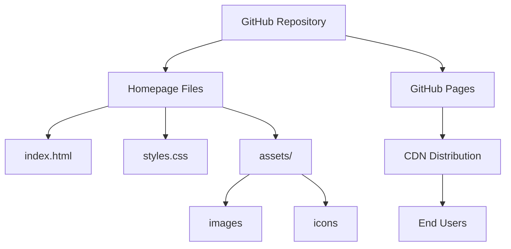

# Product Homepage Design - Product Requirements Document

## Executive Summary

### Problem Statement
MirDB is a powerful persistent key-value store with memcached protocol compatibility, but it currently lacks a public-facing homepage to introduce the product to potential users, explain its value proposition, and provide resources for getting started. Without a homepage, users cannot easily discover or understand MirDB's capabilities.

### Proposed Solution
Create a modern, responsive homepage for MirDB that effectively communicates the product's value proposition, key features, and provides clear pathways for users to get started with the software.

### Expected Impact
- **User Discovery**: Enable potential users to find and understand MirDB through search engines and direct links
- **Clear Value Communication**: Articulate why MirDB is different from standard memcached (persistence, LSM-tree architecture)
- **User Onboarding**: Provide clear documentation and getting-started resources to reduce time-to-value
- **Project Credibility**: Establish MirDB as a professional, well-maintained open-source project

### Success Metrics
- Homepage successfully deployed and accessible
- All key product information accurately represented
- Page loads in under 3 seconds on standard connections
- Mobile-responsive design functions correctly on all device sizes

---

## Requirements & Scope

### Functional Requirements

| ID | Requirement | Priority |
|------|-------------|----------|
| REQ-1 | Display product name, tagline, and brief description prominently | Must |
| REQ-2 | Present key features section highlighting memcached compatibility, persistence, and LSM-tree architecture | Must |
| REQ-3 | Include getting started section with installation instructions and basic usage | Must |
| REQ-4 | Provide configuration reference showing default settings (port, directories, limits) | Should |
| REQ-5 | Display current project status including implemented and planned features | Should |
| REQ-6 | Include navigation to documentation, GitHub repository, and other resources | Must |
| REQ-7 | Provide code examples demonstrating basic operations | Should |
| REQ-8 | Include architecture overview diagram showing LSM-tree components | Could |

### Non-Functional Requirements

| ID | Requirement | Priority |
|------|-------------|----------|
| NFR-1 | Page must be responsive and functional on mobile, tablet, and desktop devices | Must |
| NFR-2 | Page must load within 3 seconds on a standard 4G connection | Must |
| NFR-3 | Page must be accessible (WCAG 2.1 AA compliance) | Should |
| NFR-4 | Page must render correctly in modern browsers (Chrome, Firefox, Safari, Edge) | Must |
| NFR-5 | Content must be maintainable without requiring code changes for text updates | Should |
| NFR-6 | Page must be SEO-friendly with proper meta tags and semantic HTML | Should |

### Out of Scope
- User authentication or account management
- Interactive database playground or live demo environment
- Blog or news section
- Multi-language internationalization
- Analytics dashboard or tracking implementation
- Community forum or discussion features

### Success Criteria
- All "Must" priority requirements are implemented and verified
- Homepage passes Lighthouse performance audit with score >= 80
- Homepage passes accessibility audit with no critical issues
- Content accurately reflects current MirDB capabilities and status

---

## User Stories

### Personas
- **Developer**: Software engineer evaluating key-value stores for their application
- **DevOps Engineer**: Operations professional looking for a persistent cache solution
- **Open Source Contributor**: Developer interested in contributing to MirDB

### Core Stories

#### US-1: Understand Product Value (Developer)
**As a** developer evaluating database solutions,
**I want to** quickly understand what MirDB is and how it differs from memcached,
**So that** I can determine if it meets my application's requirements.

**Acceptance Criteria:**
- Given I land on the homepage
- When I read the hero section
- Then I understand MirDB is a persistent key-value store with memcached protocol support

**Priority:** Must
**Traceability:** REQ-1, REQ-2

#### US-2: Get Started Quickly (Developer)
**As a** developer who has decided to try MirDB,
**I want to** find installation and basic usage instructions,
**So that** I can start using MirDB in my development environment.

**Acceptance Criteria:**
- Given I am on the homepage
- When I navigate to the getting started section
- Then I find installation commands and basic usage examples

**Priority:** Must
**Traceability:** REQ-3, REQ-7

#### US-3: Understand Configuration Options (DevOps Engineer)
**As a** DevOps engineer planning to deploy MirDB,
**I want to** see default configuration values and available options,
**So that** I can plan my deployment appropriately.

**Acceptance Criteria:**
- Given I am on the homepage
- When I view the configuration section
- Then I see default values for port, directories, and resource limits

**Priority:** Should
**Traceability:** REQ-4

#### US-4: Assess Project Maturity (Developer)
**As a** developer considering MirDB for production use,
**I want to** understand what features are implemented vs planned,
**So that** I can assess the project's maturity and roadmap.

**Acceptance Criteria:**
- Given I am on the homepage
- When I view the project status section
- Then I see a clear distinction between implemented features and planned features

**Priority:** Should
**Traceability:** REQ-5

#### US-5: Access Additional Resources (Developer/Contributor)
**As a** user wanting to learn more about MirDB,
**I want to** easily navigate to documentation and source code,
**So that** I can explore the project in depth or contribute.

**Acceptance Criteria:**
- Given I am on the homepage
- When I look for external links
- Then I find prominent links to GitHub repository and documentation

**Priority:** Must
**Traceability:** REQ-6

---

## User Experience & Interface

### User Journey
1. **Discovery**: User finds MirDB through search or referral
2. **Understanding**: User reads hero section and grasps the value proposition
3. **Exploration**: User scrolls through features and capabilities
4. **Evaluation**: User reviews configuration options and project status
5. **Action**: User clicks to get started or view documentation

### Interface Requirements

#### Page Structure
- **Hero Section**: Product name, tagline, brief description, and primary CTA
- **Features Section**: Three-column layout highlighting key capabilities
- **Getting Started Section**: Installation commands with copy functionality
- **Configuration Section**: Table of default configuration values
- **Status Section**: Feature checklist with implemented/planned indicators
- **Footer**: Links to GitHub, documentation, and license information

#### Interaction Patterns
- Smooth scroll navigation between sections
- Code blocks with copy-to-clipboard functionality
- Responsive hamburger menu on mobile devices
- Hover states on interactive elements

### Accessibility Considerations
- Semantic HTML structure with proper heading hierarchy
- Alt text for all images and diagrams
- Sufficient color contrast ratios (4.5:1 minimum)
- Keyboard navigation support for all interactive elements
- Skip-to-content link for screen reader users

---

## Design Specification

### Recommended Approach
Build a static single-page website using modern HTML/CSS with minimal JavaScript, focusing on performance, maintainability, and developer-friendly tooling. The site should be deployable via GitHub Pages or similar static hosting.

### Key Technical Decisions

#### 1. Framework/Build Approach
- **Options Considered**: Static HTML/CSS, Static Site Generator (Hugo/Jekyll), JavaScript Framework (React/Vue)
- **Tradeoffs**: Static HTML offers simplicity but limited reusability; SSGs add build complexity but enable templating; JS frameworks are overkill for a single page
- **Recommendation**: Static HTML/CSS with optional build step for minification - provides simplicity, fast loading, and easy maintenance for a single-page site

#### 2. Styling Approach
- **Options Considered**: Plain CSS, CSS Framework (Tailwind/Bootstrap), CSS-in-JS
- **Tradeoffs**: Plain CSS requires more custom work but no dependencies; frameworks speed development but add file size; CSS-in-JS requires JavaScript
- **Recommendation**: Plain CSS with CSS custom properties (variables) - keeps the page lightweight and dependency-free while enabling maintainable theming

#### 3. Hosting Strategy
- **Options Considered**: GitHub Pages, Netlify, Vercel, Self-hosted
- **Tradeoffs**: GitHub Pages integrates with existing repo but limited features; Netlify/Vercel offer more features but separate platform; self-hosted requires infrastructure
- **Recommendation**: GitHub Pages - free, integrates with existing repository, sufficient for static content, familiar to open-source developers

### High-Level Architecture

### Key Considerations
- **Performance**: Static files ensure fast load times; minimal dependencies reduce bundle size; images should be optimized and lazy-loaded.
- **Security**: Static site has minimal attack surface; no server-side code execution; external links should use rel="noopener noreferrer".
- **Scalability**: Static hosting via CDN handles traffic spikes automatically; no server resources to manage or scale.

### Risk Management
- **Content Accuracy Risk**: Homepage content may become outdated as MirDB evolves. Mitigation: Structure content to reference documentation for details that change frequently.
- **Browser Compatibility Risk**: CSS features may not work in older browsers. Mitigation: Use progressive enhancement and test across target browsers.

### Success Criteria
- Homepage deploys successfully to GitHub Pages
- Lighthouse performance score >= 80
- All content sections accurately represent MirDB capabilities
- Page functions correctly across all target browsers and devices

---

## Business Impact & Metrics

### Business Objectives
- **Increase Project Visibility**: Make MirDB discoverable by developers searching for key-value stores
- **Reduce Onboarding Friction**: Enable new users to understand and start using MirDB quickly
- **Establish Professional Presence**: Present MirDB as a credible, well-maintained project

### Success Metrics
| Metric | Target | Measurement Method |
|--------|--------|-------------------|
| Page Load Time | < 3 seconds | Lighthouse audit |
| Performance Score | >= 80 | Lighthouse audit |
| Accessibility Score | >= 90 | Lighthouse audit |
| Mobile Usability | Pass | Google Mobile-Friendly Test |

### User Adoption Indicators
- GitHub repository star growth rate
- Documentation page visits (via GitHub traffic analytics)
- Clone/download frequency increase

---

## Dependencies & Assumptions

### Dependencies
- GitHub repository access for deploying to GitHub Pages
- MirDB project documentation and accurate feature status information
- Logo or branding assets (if available)

### Assumptions
- The project will continue to use GitHub as its primary repository
- No immediate need for dynamic content or user-generated content
- English is the primary (and initially only) language needed
- The existing MirDB knowledge base accurately reflects current project status

### Cross-Team Coordination
- Maintainers must review and approve homepage content for accuracy
- Any logo or visual branding decisions require maintainer input

---

## Appendices

### Product Information Reference

**MirDB Key Features:**
- Memcached protocol compatibility (existing clients work seamlessly)
- Data persistence to disk using SSTables
- LSM-tree architecture with memtables and multi-level compaction

**Current Implementation Status:**
- Tokio-based async networking
- Skip list memtable implementation
- Minor compaction (memtable to SSTable)
- Major compaction (SSTable level compaction)

**Planned Features:**
- Raft consensus for distributed operation

**Default Configuration Values:**
| Setting | Default Value |
|---------|---------------|
| Listen Address | 0.0.0.0:12333 |
| Max LSM Levels | 7 |
| Work Directory | /tmp/mirdb |
| SSTable Max Size | 100MB |
| Memtable Max Size | 4MB |
| Block Size | 4KB |
