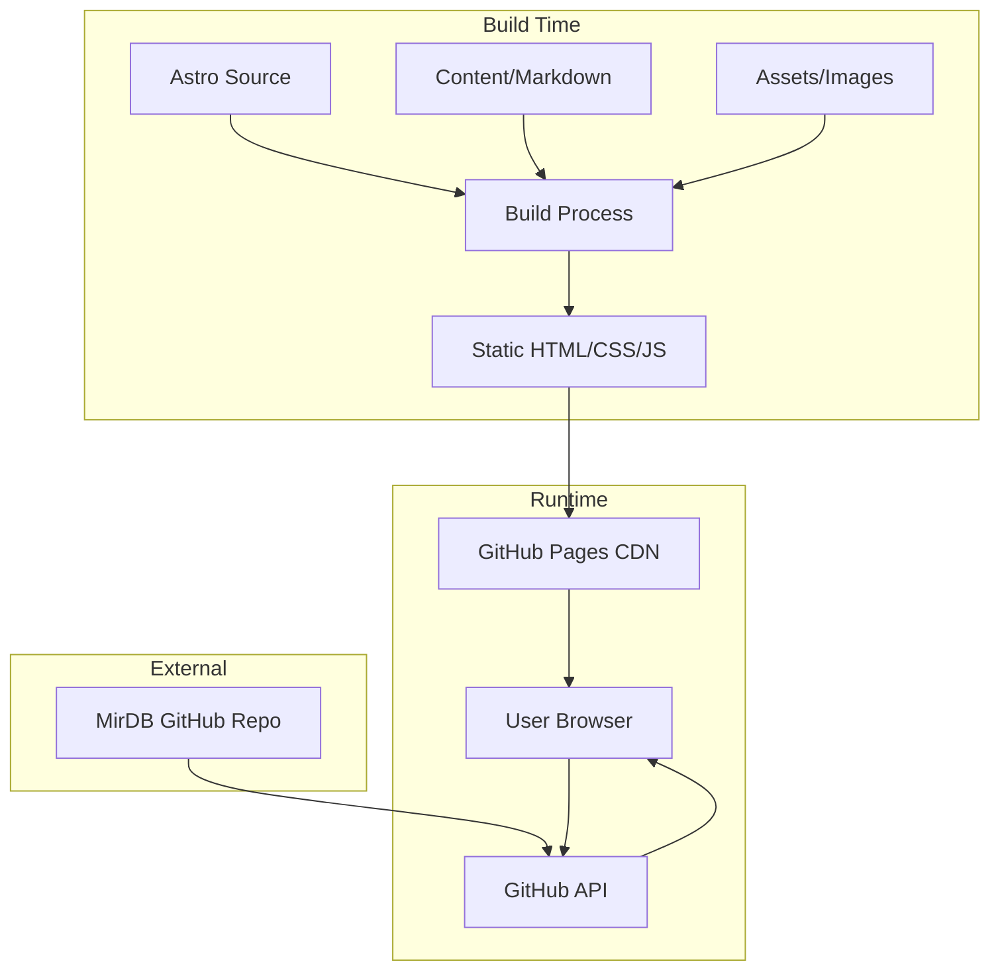

# Product Homepage Design - Product Requirements Document

## Executive Summary

### Problem Statement
MirDB is a high-performance, persistent key-value database written in Rust with memcached protocol compatibility. Currently, the project lacks a public-facing web presence to communicate its value proposition, features, and differentiation to potential users. Developers seeking key-value storage solutions have no centralized location to learn about MirDB's capabilities, view documentation, or get started with the product.

### Proposed Solution
Create a modern, developer-focused product homepage that effectively communicates MirDB's unique value proposition as a persistent LSM Tree-based key-value store with memcached protocol compatibility. The homepage will serve as the primary entry point for developers to discover, evaluate, and adopt MirDB.

### Expected Impact
- **Increased Adoption**: Provide clear onboarding path for developers evaluating key-value storage solutions
- **Developer Trust**: Establish credibility through professional presentation and comprehensive documentation
- **Community Growth**: Enable community engagement and contribution through clear calls-to-action
- **Reduced Support Burden**: Self-service documentation reduces repetitive inquiries

### Success Metrics
- Homepage bounce rate < 40%
- Time on page > 2 minutes for documentation sections
- Click-through rate to GitHub repository > 15%
- Quick start guide completion rate > 60%

---

## Requirements & Scope

### Functional Requirements

| ID | Requirement | Priority |
|----|-------------|----------|
| REQ-1 | Display clear product positioning and value proposition above the fold | Must |
| REQ-2 | Showcase key features: memcached compatibility, LSM Tree architecture, Rust performance | Must |
| REQ-3 | Provide interactive quick-start guide with installation and basic usage examples | Must |
| REQ-4 | Display architecture diagram explaining the LSM Tree-based storage model | Should |
| REQ-5 | Include configuration reference with common settings and use cases | Should |
| REQ-6 | Provide comparison matrix with alternative solutions (Redis, Memcached, LevelDB) | Should |
| REQ-7 | Display GitHub statistics (stars, contributors, latest release) | Could |
| REQ-8 | Include code syntax highlighting for Rust, TOML, and shell examples | Must |
| REQ-9 | Provide responsive navigation with sections: Features, Quick Start, Documentation, GitHub | Must |
| REQ-10 | Include footer with license information, links to GitHub, and community resources | Should |

### Non-Functional Requirements

| ID | Requirement | Priority |
|----|-------------|----------|
| NFR-1 | Page load time under 3 seconds on standard broadband connection | Must |
| NFR-2 | Responsive design supporting desktop, tablet, and mobile viewports | Must |
| NFR-3 | Accessibility compliance with WCAG 2.1 Level AA standards | Should |
| NFR-4 | SEO optimization for key terms: "Rust key-value database", "memcached compatible", "LSM Tree database" | Should |
| NFR-5 | Static site generation for optimal performance and simple hosting | Must |
| NFR-6 | Support for dark mode based on user system preference | Could |

### Out of Scope
- User authentication or account management
- Interactive database playground or sandbox environment
- Blog or news section
- Automated documentation generation from source code
- Community forum or discussion platform
- Multi-language internationalization (English only for initial release)
- Performance benchmarking dashboard with live metrics

### Success Criteria
- All Must-priority requirements implemented and functional
- Homepage passes Lighthouse performance audit with score > 90
- Homepage passes accessibility audit with no critical violations
- All code examples are tested and functional with current MirDB release
- Page renders correctly on Chrome, Firefox, Safari, and Edge

---

## User Experience & Interface

### Target Users
- **Primary**: Backend developers and DevOps engineers evaluating key-value storage solutions
- **Secondary**: Technical architects making technology decisions for data storage layers
- **Tertiary**: Open source contributors interested in Rust database implementations

### User Journey

1. **Discovery**: Developer finds MirDB via search, social media, or GitHub
2. **Evaluation**: Lands on homepage, quickly understands what MirDB is and its key differentiators
3. **Exploration**: Reviews features, architecture, and comparisons with alternatives
4. **Trial**: Follows quick-start guide to install and run MirDB locally
5. **Adoption**: Accesses detailed configuration documentation for production setup
6. **Contribution**: Navigates to GitHub to explore source code or contribute

### Interface Requirements

#### Hero Section
- Product logo and name prominently displayed
- Concise tagline: "Persistent Key-Value Store with Memcached Protocol Compatibility"
- Primary CTA: "Get Started" linking to quick-start section
- Secondary CTA: "View on GitHub" linking to repository

#### Features Section
- Grid layout showcasing 4-6 key features with icons
- Key features to highlight:
  - Memcached protocol compatibility
  - LSM Tree-based persistent storage
  - Rust performance and safety
  - Configurable compaction and caching
  - Write-Ahead Log durability
  - Simple TOML configuration

#### Architecture Section
- Visual diagram showing LSM Tree data flow
- Brief explanation of memtable → SSTable → compaction pipeline
- Highlight performance characteristics

#### Quick Start Section
- Step-by-step installation instructions
- Basic usage examples with copy-to-clipboard functionality
- Example configuration file snippet

#### Comparison Section
- Feature comparison table: MirDB vs Redis vs Memcached vs LevelDB
- Focus on: persistence, protocol, language, performance characteristics

#### Documentation Section
- Links to configuration reference
- API/protocol documentation
- Deployment guides

### Accessibility Considerations
- Semantic HTML structure with proper heading hierarchy
- Alt text for all images and diagrams
- Keyboard navigation support
- Sufficient color contrast ratios
- Screen reader compatible code blocks

---

## Technical Considerations

### High-Level Approach
Build a static website using a modern static site generator, separate from the existing Rust codebase. The homepage will be hosted independently and link to the GitHub repository for source code and detailed documentation.

### Technology Stack Options
- **Static Site Generator**: Astro, Next.js (static export), or Hugo
- **Styling**: Tailwind CSS for utility-first styling
- **Hosting**: GitHub Pages, Netlify, or Vercel
- **Code Highlighting**: Prism.js or Shiki for syntax highlighting

### Integration Points
- GitHub API for fetching repository statistics (stars, releases)
- Existing README content can be adapted for documentation sections
- Logo assets (logo.gif) from existing repository

### Key Technical Constraints
- Must be static site (no server-side rendering required at runtime)
- Should be maintainable by developers unfamiliar with frontend frameworks
- Build artifacts should be deployable to any static hosting service

### Performance Considerations
- Lazy loading for below-fold images and diagrams
- Minimal JavaScript bundle size
- Optimized image formats (WebP with fallbacks)
- Preconnect to external resources (GitHub API, fonts)

---

## Design Specification

### Recommended Approach
Build a lightweight static marketing homepage using Astro with Tailwind CSS, optimized for developer audience. Focus on clean typography, code readability, and fast page loads. Host on GitHub Pages for zero-cost deployment with automatic CI/CD integration.

### Key Technical Decisions

#### 1. Static Site Generator
- **Options Considered**: Astro, Next.js (static export), Hugo, plain HTML
- **Tradeoffs**: Astro offers component-based development with zero JS by default; Next.js has larger ecosystem but heavier output; Hugo is fast but uses Go templating; plain HTML is simple but lacks component reuse
- **Recommendation**: Astro - provides optimal balance of developer experience, performance, and maintainability for a marketing homepage

#### 2. Styling Approach
- **Options Considered**: Tailwind CSS, vanilla CSS, CSS modules, styled-components
- **Tradeoffs**: Tailwind enables rapid development with consistent design tokens; vanilla CSS offers full control but slower iteration; CSS modules provide scoping but add complexity; styled-components requires runtime JS
- **Recommendation**: Tailwind CSS - aligns with developer-focused audience expectations and enables responsive design with minimal overhead

#### 3. Diagram Rendering
- **Options Considered**: Static SVG/PNG images, Mermaid.js, D3.js
- **Tradeoffs**: Static images are simplest but harder to maintain; Mermaid provides text-based diagrams but limited styling; D3 offers flexibility but significant complexity
- **Recommendation**: Static SVG with source diagrams maintained in Mermaid - generates once at build time for optimal performance while keeping source maintainable

#### 4. Hosting Platform
- **Options Considered**: GitHub Pages, Netlify, Vercel, Cloudflare Pages
- **Tradeoffs**: GitHub Pages integrates with existing repository but limited features; Netlify/Vercel offer more features but add external dependency; Cloudflare offers edge performance
- **Recommendation**: GitHub Pages - keeps infrastructure consolidated with source repository, sufficient for static marketing site

### High-Level Architecture

### Key Considerations
- **Performance**: Static generation ensures sub-second Time to First Byte; Astro's zero-JS default minimizes bundle size
- **Security**: Static site with no server-side code eliminates common attack vectors; GitHub API calls are read-only
- **Scalability**: CDN-served static files scale infinitely with no infrastructure management

### Risk Management
- **Content Drift Risk**: Homepage content may become outdated as MirDB evolves. Mitigation: Include last-updated dates and link to GitHub for authoritative documentation.
- **GitHub API Rate Limiting**: Repository stats fetched client-side may hit rate limits for unauthenticated requests. Mitigation: Fetch stats at build time and display static values, refreshed on each deployment.

### Success Criteria
- Lighthouse performance score > 90
- First Contentful Paint < 1.5 seconds
- Homepage deployed and accessible via custom domain or github.io URL
- All code examples verified against current MirDB release

---

## Dependencies & Assumptions

### Dependencies
- **GitHub Repository Access**: Homepage links to and fetches data from MirDB GitHub repository
- **Static Hosting Service**: GitHub Pages or equivalent for deployment
- **Design Assets**: Logo and branding assets available in current repository (logo.gif)

### Assumptions
- MirDB project will remain open source and publicly accessible on GitHub
- Existing README documentation is accurate and can be adapted for homepage content
- Project maintainers can review and merge homepage-related pull requests
- No custom domain is required for initial launch (GitHub Pages subdomain acceptable)

### Cross-Team Coordination
- Coordination with MirDB maintainers for content accuracy review
- Agreement on hosting and deployment workflow

---

## Appendices

### A. Content Sources
- Existing README.md for product description and usage examples
- Configuration example from mirdb.toml
- Architecture description from codebase analysis

### B. Competitor Reference
- Redis.io homepage structure and messaging
- RocksDB documentation site
- LevelDB GitHub page

### C. Key Messaging Points
- "Drop-in replacement for memcached with persistence"
- "Built with Rust for reliability and performance"
- "LSM Tree architecture for optimized write performance"
- "Simple TOML-based configuration"
