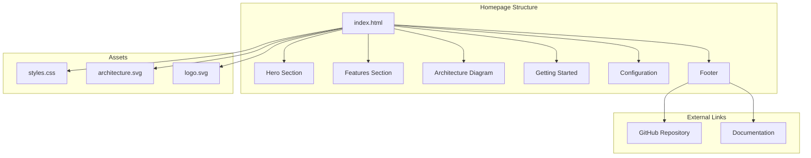

# Product Homepage Design - Product Requirements Document

## Executive Summary

### Problem Statement
MirDB is a feature-rich persistent key-value store with Memcached protocol compatibility, but it lacks a public-facing homepage to introduce the product to potential users, explain its value proposition, and guide adoption. Without a homepage, potential users cannot easily discover MirDB's capabilities, understand how it differs from standard memcached, or find resources to get started.

### Proposed Solution
Create a product homepage for MirDB that effectively communicates the product's unique value proposition (persistent storage with memcached compatibility), showcases key features and capabilities, and provides clear pathways for users to learn more, download, or start using the product.

### Expected Impact
- **User Acquisition**: Enable potential users to discover and evaluate MirDB
- **Product Awareness**: Clearly communicate MirDB's differentiation from memcached (persistence, LSM tree storage)
- **Reduced Onboarding Friction**: Provide clear documentation links and getting started resources
- **Community Growth**: Establish a foundation for community engagement and contribution

### Success Metrics
- Homepage successfully deployed and accessible
- Key product information clearly communicated (features, use cases, getting started)
- Users can navigate to documentation, download, and community resources
- Page loads within acceptable performance thresholds (< 3 seconds)

---

## Requirements & Scope

### Functional Requirements

| ID | Requirement | Priority |
|----|-------------|----------|
| REQ-1 | Display product name (MirDB) and tagline prominently | Must |
| REQ-2 | Present key product features (persistence, memcached compatibility, LSM tree architecture) | Must |
| REQ-3 | Include a "Getting Started" section with basic usage instructions | Must |
| REQ-4 | Provide navigation to documentation resources | Must |
| REQ-5 | Display code examples showing basic memcached commands (SET, GET, DELETE) | Should |
| REQ-6 | Include visual representation of product architecture (LSM tree data flow) | Should |
| REQ-7 | Show default configuration parameters and customization options | Should |
| REQ-8 | Provide download/installation instructions | Must |
| REQ-9 | Include links to source code repository | Must |
| REQ-10 | Display project status and roadmap highlights (e.g., planned Raft consensus) | Could |

### Non-Functional Requirements

| ID | Requirement | Priority |
|----|-------------|----------|
| NFR-1 | Page must be responsive and display correctly on desktop and mobile devices | Must |
| NFR-2 | Page must load within 3 seconds on standard broadband connection | Must |
| NFR-3 | Content must be accessible (WCAG 2.1 AA compliance) | Should |
| NFR-4 | Page must be static/serverless for easy deployment and maintenance | Should |
| NFR-5 | Design must be clean, professional, and developer-focused | Must |

### Out of Scope
- User authentication or login functionality
- Interactive database console or playground
- Blog or news section
- Localization/internationalization (English only for initial release)
- Analytics integration
- Community forum or discussion features

### Success Criteria
- Homepage displays all Must-priority requirements correctly
- Page passes responsive design testing on major screen sizes
- Page loads within performance threshold
- All links are functional and point to correct resources

---

## User Stories

### Personas
- **Developer Evaluator**: A software engineer researching key-value stores for a project, comparing options like Redis, memcached, and alternatives
- **Existing Memcached User**: A developer currently using memcached who needs persistence and wants drop-in compatibility
- **Technical Decision Maker**: An architect or tech lead evaluating storage solutions for their team

### Core Stories

#### Story 1: Discover Product Value Proposition
**As a** Developer Evaluator
**I want** to quickly understand what MirDB is and how it differs from memcached
**So that** I can determine if it's worth further investigation for my project

**Acceptance Criteria:**
- Given I land on the homepage, When the page loads, Then I see the product name and a clear tagline within the first viewport
- Given I am on the homepage, When I read the hero section, Then I understand that MirDB provides persistence with memcached compatibility
- Given I am on the homepage, When I scan the feature list, Then I can identify at least 3 key differentiators from standard memcached

**Priority:** Must
**Traceability:** REQ-1, REQ-2

#### Story 2: View Technical Architecture
**As a** Technical Decision Maker
**I want** to understand MirDB's architecture and storage approach
**So that** I can evaluate if it meets my technical requirements

**Acceptance Criteria:**
- Given I am on the homepage, When I scroll to the architecture section, Then I see a visual diagram of the LSM tree data flow
- Given I am viewing the architecture section, When I read the descriptions, Then I understand the memtable, SSTable, and compaction concepts
- Given I am on the homepage, When I look for technical details, Then I can find information about the storage engine design

**Priority:** Should
**Traceability:** REQ-6, REQ-2

#### Story 3: Get Started with MirDB
**As an** Existing Memcached User
**I want** to see how to install and run MirDB
**So that** I can quickly try it with my existing memcached clients

**Acceptance Criteria:**
- Given I am on the homepage, When I navigate to the Getting Started section, Then I find installation instructions
- Given I am in the Getting Started section, When I read the code examples, Then I see familiar memcached commands (SET, GET, DELETE)
- Given I want to configure MirDB, When I look for configuration options, Then I find default settings and how to customize them

**Priority:** Must
**Traceability:** REQ-3, REQ-5, REQ-7, REQ-8

#### Story 4: Access Source Code and Documentation
**As a** Developer Evaluator
**I want** to access the source code and detailed documentation
**So that** I can dive deeper into the implementation and usage

**Acceptance Criteria:**
- Given I am on the homepage, When I look for documentation links, Then I find clear navigation to documentation resources
- Given I want to view the source code, When I look for repository links, Then I find a link to the source code repository
- Given I click on documentation or repository links, When the links open, Then they navigate to the correct destinations

**Priority:** Must
**Traceability:** REQ-4, REQ-9

#### Story 5: View on Mobile Device
**As a** Developer Evaluator
**I want** the homepage to be readable on my mobile device
**So that** I can evaluate MirDB while on the go

**Acceptance Criteria:**
- Given I access the homepage on a mobile device, When the page loads, Then all content is readable without horizontal scrolling
- Given I am viewing on mobile, When I navigate the page, Then all interactive elements are appropriately sized for touch
- Given I am on a mobile device, When images and diagrams load, Then they scale appropriately for the screen size

**Priority:** Must
**Traceability:** NFR-1

---

## User Experience & Interface

### Page Structure

1. **Hero Section**
   - Product logo/name (MirDB)
   - Tagline emphasizing persistence + memcached compatibility
   - Primary call-to-action (Get Started / View Documentation)
   - Secondary call-to-action (View on GitHub)

2. **Features Section**
   - Memcached Protocol Compatibility
   - Persistent Storage with SSTables
   - LSM Tree Architecture
   - Async I/O with Tokio
   - Configurable parameters

3. **Architecture Overview**
   - Visual diagram of LSM tree data flow (Write -> WAL -> Memtable -> SSTable levels)
   - Brief explanation of key components

4. **Getting Started Section**
   - Installation command
   - Basic configuration example
   - Code examples showing SET, GET, DELETE commands
   - Default port and connection info (0.0.0.0:12333)

5. **Configuration Section**
   - Key configuration parameters table
   - Link to full configuration documentation

6. **Footer**
   - Links to documentation, GitHub, license
   - Project status note (e.g., "Raft consensus coming soon")

### Design Principles
- Clean, minimalist design appropriate for developer tooling
- Monospace fonts for code examples
- Sufficient contrast for readability
- Consistent spacing and visual hierarchy
- Professional color scheme (suggested: dark theme option for developer preference)

### Accessibility Considerations
- Proper heading hierarchy (H1, H2, H3)
- Alt text for images and diagrams
- Sufficient color contrast ratios
- Keyboard navigable elements
- Semantic HTML structure

---

## Technical Considerations

### Technology Approach
The homepage should be implemented as a static site for simplicity, low maintenance, and easy deployment. Static site generators or plain HTML/CSS/JS are appropriate choices.

### Content Requirements
- All content should be derived from existing project documentation and knowledge base
- Code examples must be accurate and tested
- Architecture diagram should reflect actual LSM tree implementation

### Integration Points
- Links to external documentation (if separate docs site exists)
- Links to GitHub repository
- Potential integration with package registry for installation instructions

### Hosting Considerations
- Should support static hosting (GitHub Pages, Netlify, Vercel, or similar)
- No server-side processing required
- CDN-friendly for performance

---

## Design Specification

### Recommended Approach
Build a single-page static website using modern web technologies, focusing on clear communication of MirDB's value proposition and easy navigation to resources. The page should be lightweight, fast-loading, and require no backend infrastructure.

### Key Technical Decisions

#### 1. Static Site Technology
- **Options Considered**: Plain HTML/CSS/JS, Static Site Generator (Hugo, Jekyll, Astro), React/Vue SPA
- **Tradeoffs**: Plain HTML is simplest but harder to maintain; SSGs provide templating and markdown support but add build complexity; SPAs offer interactivity but are overkill for a homepage
- **Recommendation**: Static Site Generator (or plain HTML for minimal scope) - provides good balance of maintainability and simplicity without requiring JavaScript runtime

#### 2. Styling Approach
- **Options Considered**: Custom CSS, CSS Framework (Tailwind, Bootstrap), CSS-in-JS
- **Tradeoffs**: Custom CSS offers full control but requires more effort; frameworks provide consistency and speed; CSS-in-JS adds complexity for a static page
- **Recommendation**: CSS Framework (Tailwind or minimal custom CSS) - accelerates development while maintaining professional appearance

#### 3. Architecture Diagram Format
- **Options Considered**: Static image (PNG/SVG), Mermaid diagrams, Interactive diagram library
- **Tradeoffs**: Static images are simple but harder to update; Mermaid integrates with markdown but has styling limitations; interactive libraries add JavaScript weight
- **Recommendation**: SVG image - provides crisp rendering, small file size, and can be styled with CSS while keeping the page lightweight

#### 4. Hosting Platform
- **Options Considered**: GitHub Pages, Netlify, Vercel, S3 + CloudFront
- **Tradeoffs**: GitHub Pages is free and integrates with repo but has limited features; Netlify/Vercel offer more features with free tiers; S3+CloudFront requires more setup
- **Recommendation**: GitHub Pages or Netlify - both provide free hosting, automatic deployments, and HTTPS with minimal configuration

### High-Level Architecture


### Key Considerations
- **Performance**: Minimize assets, use appropriate image formats (SVG for diagrams, optimized images), avoid unnecessary JavaScript
- **Security**: Static site minimizes attack surface; ensure external links use HTTPS; implement Content Security Policy headers if hosting supports it
- **Scalability**: Static hosting inherently scales; CDN distribution handles traffic spikes

### Risk Management
- **Content Accuracy Risk**: Homepage content may become outdated as MirDB evolves. Mitigation: Source content from knowledge base and establish update process when features change.
- **Browser Compatibility Risk**: CSS features may not work in older browsers. Mitigation: Use well-supported CSS properties and test across major browsers.

### Success Criteria
- Homepage deploys successfully to chosen hosting platform
- All functional requirements (REQ-1 through REQ-9) are implemented
- Page achieves < 3 second load time (NFR-2)
- Page passes responsive design tests on desktop, tablet, and mobile viewports

---

## Dependencies & Assumptions

### Dependencies
- Access to MirDB source code repository for linking
- Existing documentation or ability to create documentation links
- Logo/branding assets (or need to create)
- Hosting platform account setup

### Assumptions
- MirDB project will continue active development
- English is the only required language
- No authentication or user accounts needed
- Project documentation exists or will be created separately
- Basic branding (product name, potential logo) is established

---

## Appendices

### A. Content Reference - Key Features to Highlight

1. **Memcached Protocol Compatibility**
   - Works with existing memcached clients
   - Supports SET, GET, DELETE, ADD, REPLACE, APPEND, PREPEND
   - Standard response codes (STORED, NOT_STORED, DELETED, etc.)

2. **Persistence**
   - Data survives restarts (unlike standard memcached)
   - Write-Ahead Log for durability
   - SSTable-based storage

3. **LSM Tree Architecture**
   - Memtable (skip list) for fast writes
   - Background compaction (minor and major)
   - Multi-level storage optimization

4. **Performance**
   - Async I/O with Tokio
   - Block caching with LRU
   - Snappy compression

5. **Configuration**
   - TOML-based configuration
   - Tunable memtable size, SSTable size, compaction triggers
   - Flexible work directory

### B. Default Configuration Example
```toml
addr = "0.0.0.0:12333"
max_level = 7
work_dir = "/tmp/mirdb"
sst_max_size = "100M"
mem_table_max_size = "4M"
block_size = "4K"
l0_compaction_trigger = 4
```

### C. Command Examples for Getting Started Section
```bash
# Connect with any memcached client
# Example using telnet:
telnet localhost 12333

# Set a value
set mykey 0 0 5
hello
# Response: STORED

# Get a value
get mykey
# Response: VALUE mykey 0 5
#           hello
#           END

# Delete a value
delete mykey
# Response: DELETED
```
