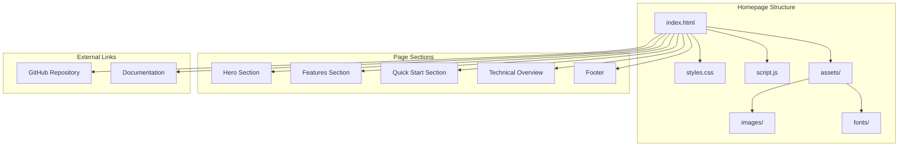

# Product Homepage Design - Product Requirements Document

## Executive Summary

### Problem Statement
MirDB is a powerful persistent key-value store with memcached compatibility, but it currently lacks a dedicated homepage to showcase its capabilities, guide potential users, and provide essential information for adoption. Without a homepage, users have difficulty discovering the product's value proposition and understanding how to get started.

### Proposed Solution
Create a product homepage for MirDB that effectively communicates its unique value as a persistent, memcached-compatible key-value store written in Rust. The homepage will serve as the primary entry point for developers evaluating the product, providing clear messaging about features, benefits, and getting started guidance.

### Expected Impact
- **Increased Discoverability**: Provide a professional web presence for the MirDB project
- **Improved User Onboarding**: Help developers quickly understand what MirDB offers and how to use it
- **Enhanced Credibility**: Establish MirDB as a legitimate, well-documented database solution
- **Community Growth**: Attract contributors and users by clearly presenting the project's capabilities and roadmap

### Success Metrics
- Homepage successfully deployed and accessible
- Clear communication of MirDB's core value proposition (persistence + memcached compatibility)
- All essential sections (features, installation, documentation) present and functional
- Responsive design working across desktop and mobile devices

---

## Requirements & Scope

### Functional Requirements

| ID | Requirement | Priority |
|----|-------------|----------|
| REQ-1 | Display product name, tagline, and brief description highlighting MirDB as a persistent key-value store with memcached protocol support | Must |
| REQ-2 | Showcase key features: memcached protocol compatibility, data persistence, LSM tree architecture, Rust implementation | Must |
| REQ-3 | Provide quick start / installation instructions | Must |
| REQ-4 | Display supported commands (GET, SET, DELETE, etc.) | Should |
| REQ-5 | Include configuration overview showing default settings | Should |
| REQ-6 | Present project status including implemented features and roadmap (Raft consensus) | Should |
| REQ-7 | Provide links to source code repository | Must |
| REQ-8 | Include documentation or links to detailed documentation | Should |
| REQ-9 | Display technical specifications (performance characteristics, default configuration) | Could |
| REQ-10 | Provide contact/community links for support and contribution | Could |

### Non-Functional Requirements

| ID | Requirement | Priority |
|----|-------------|----------|
| NFR-1 | Page must be responsive and display correctly on desktop, tablet, and mobile devices | Must |
| NFR-2 | Page must load within 3 seconds on standard broadband connection | Must |
| NFR-3 | Design must be clean, professional, and developer-focused | Must |
| NFR-4 | Page must be accessible (WCAG 2.1 AA compliance) | Should |
| NFR-5 | Page must be SEO-optimized with appropriate meta tags | Should |
| NFR-6 | Content must be easily maintainable and updatable | Should |

### Out of Scope
- User authentication or login functionality
- Interactive database demo or playground
- Blog or news section
- Multilingual support
- Analytics dashboard
- Community forum integration
- Paid tier or pricing information

### Success Criteria
- [ ] Homepage displays all Must-have functional requirements
- [ ] Page passes responsive design testing on major viewport sizes
- [ ] Page loads within performance targets
- [ ] All links are functional and point to correct destinations
- [ ] Design is consistent with developer tool aesthetics

---

## User Experience & Interface

### Target Users
- **Primary**: Backend developers evaluating key-value stores for their projects
- **Secondary**: DevOps engineers looking for memcached-compatible persistent storage
- **Tertiary**: Open source contributors interested in Rust database implementations

### User Journey

1. **Discover**: User finds MirDB through search or referral
2. **Understand**: User reads homepage to understand what MirDB is and its benefits
3. **Evaluate**: User reviews features, comparing to alternatives (Redis, memcached)
4. **Try**: User follows quick start guide to install and test MirDB
5. **Adopt/Contribute**: User either adopts MirDB for their project or contributes to development

### Interface Requirements

#### Hero Section
- Product logo/name prominently displayed
- Clear tagline: "A persistent key-value store with memcached protocol support"
- Brief value proposition emphasizing Rust, persistence, and compatibility
- Primary CTA: "Get Started" button
- Secondary CTA: "View on GitHub" button

#### Features Section
- Card-based layout highlighting 4 key features:
  - **Memcached Compatible**: Use existing memcached clients seamlessly
  - **Persistent Storage**: Unlike memcached, data survives restarts via SSTables
  - **LSM Tree Architecture**: Efficient write-heavy workloads with background compaction
  - **Written in Rust**: Memory-safe, high-performance implementation

#### Quick Start Section
- Code snippet showing installation command
- Basic usage example (connecting and running SET/GET commands)
- Link to full documentation

#### Technical Overview Section
- Architecture diagram (LSM tree data flow)
- Supported commands list
- Default configuration values
- Performance characteristics

#### Footer
- Links to repository, documentation, license
- Copyright information

### Accessibility Considerations
- Sufficient color contrast ratios
- Keyboard navigation support
- Screen reader compatible markup
- Alt text for all images and diagrams

---

## Technical Considerations

### High-Level Approach
The homepage should be a static website that can be easily hosted on GitHub Pages, Netlify, or similar static hosting platforms. This aligns with the open-source nature of the project and minimizes hosting complexity.

### Integration Points
- **GitHub Repository**: Links to source code, issues, and releases
- **Documentation**: Either embedded or linked to external documentation site
- **Package Registry**: If MirDB is published to crates.io, link to the package page

### Key Technical Constraints
- Must be static (no server-side rendering required for homepage)
- Should be buildable and deployable through CI/CD pipelines
- Assets should be optimized for fast loading

### Technology Considerations
- Static site generator (e.g., Hugo, Jekyll, or plain HTML/CSS/JS)
- Responsive CSS framework or custom responsive design
- Syntax highlighting for code examples
- SVG or optimized images for diagrams

---

## Design Specification

### Recommended Approach
Build a single-page static website using modern HTML/CSS with optional JavaScript for interactivity. Prioritize simplicity, fast loading, and easy maintenance over complex frameworks.

### Key Technical Decisions

#### 1. Site Architecture
- **Options Considered**: Single-page static HTML, Static site generator (Hugo/Jekyll), React/Vue SPA
- **Tradeoffs**: Single-page HTML is simplest but harder to maintain at scale; SSG provides templates but adds build complexity; SPA is overkill for a product homepage
- **Recommendation**: Single-page static HTML with modular CSS for simplicity and zero build dependencies

#### 2. Styling Approach
- **Options Considered**: Custom CSS, Tailwind CSS, Bootstrap, CSS framework
- **Tradeoffs**: Custom CSS offers full control but requires more effort; Tailwind provides utility-first rapid development; Bootstrap may look generic
- **Recommendation**: Custom CSS with CSS variables for theming, keeping the design unique and lightweight

#### 3. Hosting Platform
- **Options Considered**: GitHub Pages, Netlify, Vercel, Self-hosted
- **Tradeoffs**: GitHub Pages is free and integrates with repo but has limited features; Netlify/Vercel offer better CI/CD and preview deploys
- **Recommendation**: GitHub Pages for simplicity and direct repository integration

#### 4. Code Syntax Highlighting
- **Options Considered**: Highlight.js, Prism.js, Pre-rendered highlighting
- **Tradeoffs**: JS libraries add load time but are flexible; pre-rendered is faster but harder to maintain
- **Recommendation**: Prism.js for lightweight, customizable syntax highlighting

### High-Level Architecture

### Key Considerations

- **Performance**: Minimize HTTP requests, optimize images, use system fonts or limited custom fonts, implement lazy loading for below-fold content
- **Security**: No sensitive data on homepage; use HTTPS; implement Content Security Policy headers if hosting allows
- **Scalability**: Static site scales infinitely on CDN-backed hosting; consider documentation site separation if content grows significantly

### Risk Management

- **Content Accuracy Risk**: Homepage content may become outdated as MirDB evolves. Mitigation: Establish process to update homepage when major features ship.
- **Browser Compatibility Risk**: Custom CSS may render differently across browsers. Mitigation: Test on major browsers (Chrome, Firefox, Safari, Edge) and use CSS feature queries for progressive enhancement.

### Success Criteria
- Homepage loads in under 3 seconds on 3G connection
- Lighthouse performance score > 90
- All sections render correctly on viewports from 320px to 1920px
- Zero JavaScript errors in browser console

---

## Dependencies & Assumptions

### Dependencies
- GitHub repository must be accessible for linking
- Domain name or GitHub Pages URL must be available for deployment
- Any existing documentation or assets that should be referenced

### Assumptions
- MirDB project maintainers will review and approve homepage content
- The memcached protocol implementation is the primary differentiator to highlight
- Rust programming language community is a target audience
- No immediate plans for commercial offerings (no pricing page needed)

---

## Appendices

### A. MirDB Feature Summary for Homepage Content

**Core Capabilities:**
- Memcached text protocol compatibility (SET, GET, DELETE, ADD, REPLACE, APPEND, PREPEND)
- Persistent storage using SSTables
- LSM tree architecture with automatic compaction
- Write-ahead logging for durability
- Configurable memory and storage parameters

**Technical Highlights:**
- Written in Rust for memory safety and performance
- Async I/O with Tokio
- Snappy compression for data blocks
- CRC32 checksums for data integrity
- 7-level LSM tree with configurable compaction triggers

**Default Configuration Reference:**
| Parameter | Default Value |
|-----------|---------------|
| Listen Address | 0.0.0.0:12333 |
| Max LSM Levels | 7 |
| Work Directory | /tmp/mirdb |
| SSTable Max Size | 100MB |
| Memtable Max Size | 4MB |
| Block Size | 4KB |

### B. Competitor Reference

When designing the homepage, consider the presentation style of:
- Redis.io - Clean, feature-focused
- RocksDB - Technical depth, architecture focus
- ScyllaDB - Modern design, performance emphasis

### C. Content Outline

1. **Hero**: "MirDB - Persistent Key-Value Store with Memcached Protocol"
2. **Value Props**: Drop-in memcached replacement with persistence
3. **Features**: Protocol compatibility, SSTable persistence, LSM architecture, Rust implementation
4. **Quick Start**: Installation, basic commands, configuration
5. **Architecture**: Data flow diagram, component overview
6. **Roadmap**: Current status, planned Raft consensus
7. **Community**: GitHub, contributing guidelines
