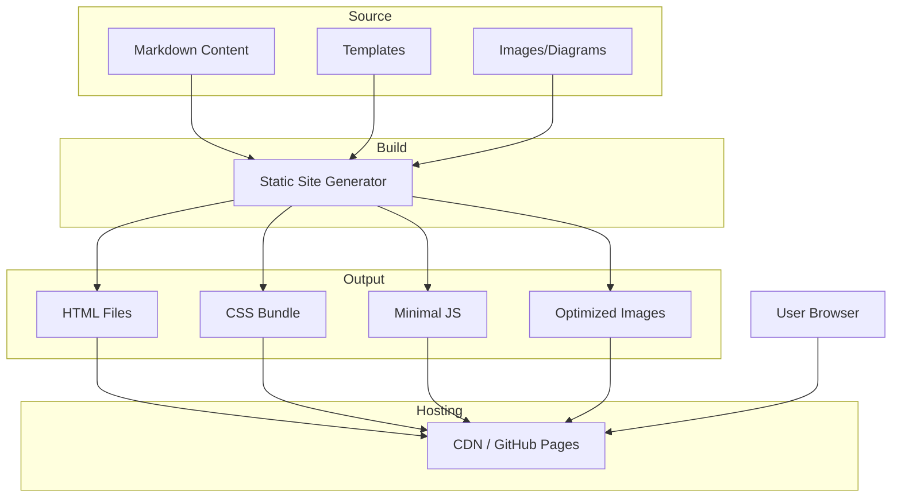

# Product Homepage Design - Product Requirements Document

## Executive Summary

### Problem Statement
MirDB is a powerful persistent key-value store that combines memcached protocol compatibility with durable storage, but it currently lacks a public-facing homepage to communicate its value proposition, features, and usage instructions to potential users and developers.

### Proposed Solution
Create a product homepage for MirDB that effectively communicates the product's unique value proposition, key features, technical capabilities, and provides clear pathways for users to get started with the product.

### Expected Impact
- **Increased Adoption**: Clear communication of MirDB's benefits will attract developers looking for persistent memcached alternatives
- **Reduced Onboarding Friction**: Comprehensive documentation and getting-started guides will accelerate user adoption
- **Brand Establishment**: Professional homepage establishes MirDB as a credible, production-ready solution
- **Community Growth**: Visible project presence encourages contributions and community building

### Success Metrics
- Homepage successfully deployed and accessible
- Key product information clearly communicated (features, benefits, usage)
- User journey from landing to getting started is intuitive and complete
- Page loads within acceptable performance thresholds (< 3 seconds)

---

## Requirements & Scope

### Functional Requirements

| ID | Requirement | Priority |
|----|-------------|----------|
| REQ-1 | Display product name, tagline, and value proposition prominently | Must |
| REQ-2 | Present key features with clear explanations (memcached compatibility, persistence, LSM tree architecture) | Must |
| REQ-3 | Provide getting started instructions with installation and basic usage examples | Must |
| REQ-4 | Include code examples demonstrating common operations (set, get, delete) | Must |
| REQ-5 | Display configuration options and parameters | Should |
| REQ-6 | Link to source code repository | Must |
| REQ-7 | Show project status and roadmap (implemented vs. planned features) | Should |
| REQ-8 | Include architecture diagram or visual representation of how MirDB works | Should |
| REQ-9 | Provide navigation for different content sections | Must |
| REQ-10 | Support responsive design for mobile and desktop viewing | Must |

### Non-Functional Requirements

| ID | Requirement | Priority |
|----|-------------|----------|
| NFR-1 | Page must load within 3 seconds on standard connections | Must |
| NFR-2 | Page must be accessible (WCAG 2.1 AA compliance) | Should |
| NFR-3 | Page must render correctly on modern browsers (Chrome, Firefox, Safari, Edge) | Must |
| NFR-4 | Page must be responsive across screen sizes (mobile, tablet, desktop) | Must |
| NFR-5 | Content must be maintainable without requiring developer intervention for text changes | Should |
| NFR-6 | Page must be SEO-friendly with proper meta tags and semantic HTML | Should |

### Out of Scope
- User authentication or login functionality
- Interactive database demo or sandbox environment
- Blog or news section
- Community forum integration
- Multi-language/internationalization support
- Analytics dashboard
- Payment or licensing functionality

### Success Criteria
- All "Must" priority requirements implemented and verified
- Homepage accessible via a public URL
- Page passes basic accessibility checks
- Page renders correctly on target browsers
- Stakeholder approval of design and content

---

## User Stories

### Personas

1. **Developer Evaluator**: A software developer researching persistent key-value stores who wants to quickly understand if MirDB fits their needs
2. **New User**: A developer who has decided to try MirDB and needs clear setup instructions
3. **Returning User**: An existing user looking for reference documentation or configuration details

### Core Stories

#### Story 1: Understand Product Value
**As a** Developer Evaluator
**I want** to quickly understand what MirDB is and why I should use it
**So that** I can decide if it's the right solution for my project

**Priority**: Must

**Related Requirements**: REQ-1, REQ-2

**Acceptance Criteria**:
- Given I land on the homepage
- When the page loads
- Then I see the product name and a clear tagline within the first viewport
- And I can understand the key value proposition (persistent memcached) within 10 seconds of reading

#### Story 2: Compare Features
**As a** Developer Evaluator
**I want** to see detailed features and technical capabilities
**So that** I can compare MirDB with alternative solutions

**Priority**: Must

**Related Requirements**: REQ-2, REQ-7, REQ-8

**Acceptance Criteria**:
- Given I am on the homepage
- When I scroll to the features section
- Then I see clearly organized feature descriptions
- And each feature explains what it does and why it matters
- And I can see the current project status (what's implemented vs. planned)

#### Story 3: Get Started Quickly
**As a** New User
**I want** to find clear installation and setup instructions
**So that** I can start using MirDB in my project

**Priority**: Must

**Related Requirements**: REQ-3, REQ-4, REQ-6

**Acceptance Criteria**:
- Given I want to try MirDB
- When I navigate to the getting started section
- Then I see step-by-step installation instructions
- And I see basic usage examples with code snippets
- And I can easily copy code examples to my clipboard

#### Story 4: Understand Usage
**As a** New User
**I want** to see code examples for common operations
**So that** I can integrate MirDB into my application

**Priority**: Must

**Related Requirements**: REQ-4

**Acceptance Criteria**:
- Given I am learning to use MirDB
- When I view the code examples section
- Then I see examples for SET, GET, and DELETE operations
- And the examples show the memcached protocol format
- And the expected responses are documented

#### Story 5: Configure the Database
**As a** Returning User
**I want** to reference configuration options
**So that** I can tune MirDB for my specific use case

**Priority**: Should

**Related Requirements**: REQ-5

**Acceptance Criteria**:
- Given I need to configure MirDB
- When I navigate to the configuration section
- Then I see a list of all configuration parameters
- And each parameter has a description and default value
- And I understand the format for size units (K, M, G, T)

#### Story 6: Access Source Code
**As a** Developer Evaluator or New User
**I want** to easily access the source code repository
**So that** I can review the implementation or contribute

**Priority**: Must

**Related Requirements**: REQ-6

**Acceptance Criteria**:
- Given I want to view the source code
- When I look for repository links
- Then I find a prominent link to the code repository
- And the link is visible from the main navigation or hero section

#### Story 7: Navigate Content Easily
**As a** any user
**I want** to navigate between different sections of the homepage
**So that** I can quickly find the information I need

**Priority**: Must

**Related Requirements**: REQ-9, REQ-10

**Acceptance Criteria**:
- Given I am on the homepage
- When I want to navigate to a specific section
- Then I can use a navigation menu to jump to that section
- And the navigation works on both desktop and mobile devices
- And my current location is visually indicated

---

## User Experience & Interface

### User Journey

```
Landing → Understand Value → Explore Features → Get Started → Configure → Build
   ↓            ↓                  ↓                ↓            ↓
Hero      Value Prop         Feature List    Quick Start   Config Docs
Section   (above fold)       (scrollable)    (code blocks) (reference)
```

### Page Structure

1. **Hero Section** (above the fold)
   - Product name: "MirDB"
   - Tagline: Communicates persistent memcached value proposition
   - Primary CTA: "Get Started" button
   - Secondary CTA: "View on GitHub" link

2. **Features Section**
   - Memcached protocol compatibility
   - Persistence with SSTables
   - LSM tree architecture
   - High performance with Rust
   - Each feature with icon, title, and brief description

3. **Architecture Overview**
   - Visual diagram showing data flow (Write → WAL → Memtable → SSTable levels)
   - Brief explanation of the LSM tree approach

4. **Getting Started Section**
   - Installation instructions
   - Basic configuration example
   - Code examples with syntax highlighting:
     - Connecting to MirDB
     - SET/GET/DELETE operations
     - Example responses

5. **Configuration Reference**
   - Table of configuration parameters
   - Default values and descriptions
   - Size unit formatting guide

6. **Project Status**
   - Currently implemented features
   - Planned features (Raft consensus)
   - Link to repository and contribution guidelines

7. **Footer**
   - Repository link
   - License information
   - Navigation links

### Interface Requirements

- **Typography**: Clean, readable monospace font for code; sans-serif for prose
- **Color Scheme**: Professional palette appropriate for developer tooling
- **Code Blocks**: Syntax-highlighted with copy-to-clipboard functionality
- **Icons**: Simple iconography for features and navigation
- **Spacing**: Generous whitespace for readability

### Accessibility Considerations

- Semantic HTML structure (proper heading hierarchy)
- Alt text for all images and diagrams
- Keyboard navigation support
- Sufficient color contrast ratios
- Screen reader compatibility

---

## Technical Considerations

### High-Level Approach
The homepage will be a static website that can be hosted on any static file hosting service (GitHub Pages, Netlify, Vercel, or similar). This approach minimizes infrastructure complexity while providing fast load times and easy maintenance.

### Integration Points
- **Source Repository**: Links to the MirDB GitHub/code repository
- **Documentation**: Content derived from existing knowledge base and README files
- **Assets**: Product diagrams and architecture visualizations

### Key Technical Constraints
- Must work without a backend server (static site)
- Code examples must be accurate to the actual memcached protocol implementation
- Configuration documentation must match current default values

### Performance Considerations
- Optimize images and assets for fast loading
- Minimize JavaScript bundle size
- Use appropriate caching headers
- Consider lazy loading for below-fold content

---

## Design Specification

### Recommended Approach
Build a static single-page website using a modern static site generator or lightweight framework. The site should prioritize fast loading, maintainability, and clear presentation of technical content.

### Key Technical Decisions

#### 1. Site Generation Approach
- **Options Considered**: Static HTML, Static Site Generator (Hugo/Jekyll/Astro), React SPA, Vue SPA
- **Tradeoffs**: Pure HTML is simplest but harder to maintain; SSG provides templating without runtime overhead; SPAs add complexity without clear benefit for a homepage
- **Recommendation**: Static Site Generator (Astro or Hugo) for maintainability and performance

#### 2. Styling Approach
- **Options Considered**: Plain CSS, Tailwind CSS, CSS Framework (Bootstrap), CSS-in-JS
- **Tradeoffs**: Plain CSS is dependency-free but verbose; Tailwind provides utility-first rapid development; Bootstrap is heavier but feature-complete
- **Recommendation**: Tailwind CSS for rapid development and small bundle size

#### 3. Code Highlighting
- **Options Considered**: Prism.js, Highlight.js, Shiki, Server-side highlighting
- **Tradeoffs**: Prism and Highlight.js are well-established; Shiki provides VS Code-quality highlighting; server-side eliminates client JS
- **Recommendation**: Build-time syntax highlighting (Shiki or similar) for zero runtime cost

#### 4. Hosting Platform
- **Options Considered**: GitHub Pages, Netlify, Vercel, Self-hosted
- **Tradeoffs**: GitHub Pages integrates with repository; Netlify/Vercel offer more features; self-hosted requires infrastructure
- **Recommendation**: GitHub Pages for simplicity and integration with source repository

### High-Level Architecture



### Key Considerations

- **Performance**: Static files served via CDN ensure sub-second load times; build-time processing eliminates runtime overhead
- **Security**: No backend means minimal attack surface; static hosting provides inherent security benefits
- **Scalability**: CDN distribution handles any traffic level without configuration changes

### Risk Management

- **Content Accuracy Risk**: Code examples and configuration values may drift from actual implementation. Mitigation: Include content validation in build process or derive from source
- **Maintenance Risk**: Homepage may become outdated as product evolves. Mitigation: Keep content in easily editable format (Markdown) and establish update process

### Success Criteria

- Page loads in under 3 seconds globally
- Lighthouse performance score above 90
- All code examples are syntactically correct and match actual protocol
- Content is easily updatable by non-developers

---

## Dependencies & Assumptions

### Dependencies
- Access to MirDB source repository for accurate feature documentation
- Design assets (logo, icons, diagrams) either existing or to be created
- Hosting platform access (GitHub Pages or alternative)

### Assumptions
- Product name "MirDB" is finalized and approved
- Core features (memcached protocol, persistence, LSM tree) are stable and documented
- Target audience is primarily developers familiar with memcached and key-value stores
- English is the only required language for initial release

### Cross-Team Coordination
- Design/branding input for visual identity (if applicable)
- Content review and approval from project maintainers
- Repository access for deployment configuration

---

## Appendices

### Content Sources

The following existing knowledge should be incorporated into homepage content:

1. **Product Overview**: MirDB overview with features and status
2. **Protocol Documentation**: Supported memcached commands and responses
3. **Configuration Reference**: All TOML configuration parameters
4. **Architecture Details**: LSM tree data flow and component descriptions

### Key Messaging Points

**Tagline Options**:
- "Persistent memcached, powered by Rust"
- "The memcached-compatible key-value store with persistence"
- "Drop-in memcached replacement with durable storage"

**Core Value Propositions**:
1. **Familiarity**: Works with existing memcached clients
2. **Durability**: Data persists to disk, survives restarts
3. **Performance**: LSM tree architecture optimized for writes
4. **Reliability**: Written in Rust for memory safety

### Reference Architecture Diagram

The following diagram should be adapted for the homepage to explain MirDB's storage architecture:

```
Write Request → WAL → Memtable → Immutable Memtables → Level 0 SSTables → Level 1+ SSTables
```
