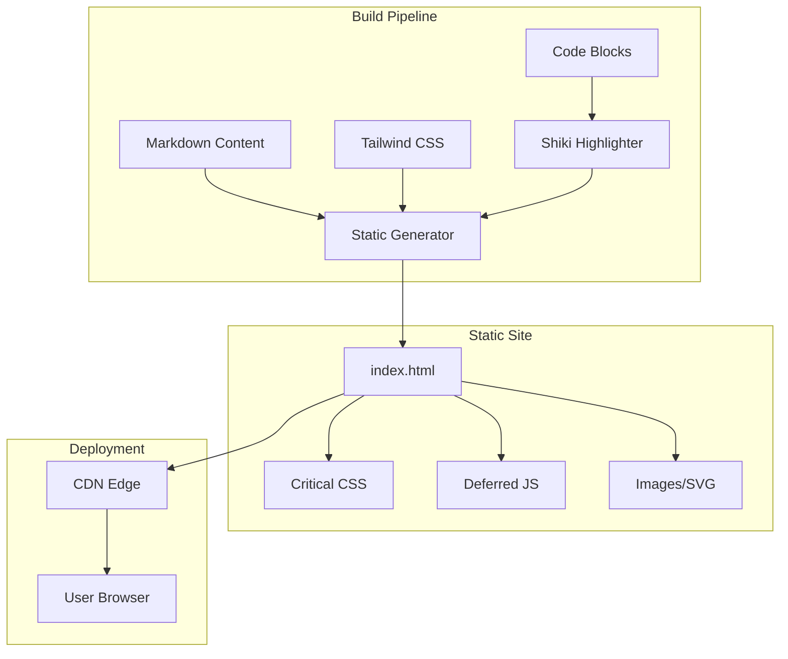

# Product Homepage Design - Product Requirements Document

## Executive Summary

### Problem Statement
MirDB is a powerful persistent key-value store with memcached compatibility, but it currently lacks a public-facing homepage to introduce the product to potential users, explain its value proposition, and provide getting-started resources. Without a homepage, users have difficulty discovering MirDB's unique capabilities and understanding how it differentiates from alternatives like Redis and standard memcached.

### Proposed Solution
Create a professional, informative homepage for MirDB that effectively communicates the product's core value proposition, highlights key features and benefits, provides quick-start documentation, and guides users toward adoption. The homepage will serve as the primary entry point for developers evaluating MirDB as their key-value storage solution.

### Expected Impact
- **Increased Adoption**: Clear communication of MirDB's unique benefits will attract developers seeking persistent, memcached-compatible storage
- **Reduced Onboarding Friction**: Quick-start guides and documentation links will help users get started faster
- **Brand Credibility**: A professional homepage establishes MirDB as a mature, production-ready project
- **Community Growth**: Easy access to resources will facilitate community contributions and engagement

### Success Metrics
- Homepage load time < 2 seconds
- User engagement: Average time on page > 60 seconds
- Conversion: > 20% of visitors click through to documentation or GitHub
- SEO: Homepage ranks in top 10 for "persistent memcached" and "rust key-value store" searches

## Requirements & Scope

### Functional Requirements

| ID | Requirement | Priority |
|----|-------------|----------|
| REQ-1 | Display product name, logo, and tagline prominently in the hero section | Must |
| REQ-2 | Present key value propositions (memcached compatibility, persistence, performance) | Must |
| REQ-3 | Showcase supported memcached commands (GET, SET, DELETE, etc.) | Must |
| REQ-4 | Display architecture overview with LSM tree visualization | Should |
| REQ-5 | Provide quick-start code examples for common programming languages | Must |
| REQ-6 | Include installation instructions and configuration options | Must |
| REQ-7 | Link to GitHub repository, documentation, and community resources | Must |
| REQ-8 | Display comparison table with alternatives (Redis, Memcached) | Should |
| REQ-9 | Show default configuration parameters and customization options | Should |
| REQ-10 | Include footer with project links, license information, and social links | Must |
| REQ-11 | Provide visual data flow diagram showing write/read paths | Could |
| REQ-12 | Display project status and implemented/planned features | Should |

### Non-Functional Requirements

| ID | Requirement | Priority |
|----|-------------|----------|
| NFR-1 | Page must load in under 2 seconds on 3G connection | Must |
| NFR-2 | Homepage must be fully responsive (mobile, tablet, desktop) | Must |
| NFR-3 | Meet WCAG 2.1 AA accessibility standards | Must |
| NFR-4 | Support modern browsers (Chrome, Firefox, Safari, Edge - last 2 versions) | Must |
| NFR-5 | Page must be SEO-optimized with proper meta tags and semantic HTML | Must |
| NFR-6 | All images must have alt text and be optimized for web | Should |
| NFR-7 | Code examples must have syntax highlighting | Should |
| NFR-8 | Page should work without JavaScript (progressive enhancement) | Could |

### Out of Scope
- User authentication or login functionality
- Interactive database playground or live demo environment
- Blog or news section
- Pricing pages or commercial licensing information
- Multi-language internationalization (initial release English only)
- Dark mode toggle (can be added later)
- Analytics dashboard or admin panel

### Success Criteria
- All "Must" priority requirements implemented and tested
- Homepage passes Lighthouse performance score > 90
- Homepage passes Lighthouse accessibility score > 90
- All links functional and pointing to correct destinations
- Page renders correctly on all target browsers and devices
- Documentation links lead to valid, helpful content

## User Experience & Interface

### Target Users
1. **Backend Developers**: Looking for a persistent caching solution compatible with existing memcached clients
2. **DevOps Engineers**: Evaluating storage solutions for infrastructure decisions
3. **Open Source Contributors**: Interested in contributing to a Rust-based database project
4. **Technical Decision Makers**: Comparing MirDB against alternatives like Redis

### User Journey

1. **Discovery**: User arrives from search, GitHub, or referral
2. **Understand**: Hero section immediately communicates what MirDB is
3. **Evaluate**: Features section helps user assess fit for their needs
4. **Compare**: Comparison table helps position against alternatives
5. **Try**: Quick-start section enables immediate experimentation
6. **Adopt**: Clear links to documentation and GitHub for next steps

### Page Structure

```
┌─────────────────────────────────────┐
│           Navigation Bar            │
│    Logo | Features | Docs | GitHub  │
├─────────────────────────────────────┤
│           Hero Section              │
│  "MirDB - Persistent Key-Value      │
│   Store with Memcached Protocol"    │
│      [Get Started] [GitHub]         │
├─────────────────────────────────────┤
│         Key Features Grid           │
│  ┌─────┐ ┌─────┐ ┌─────┐           │
│  │Memcd│ │Perst│ │Fast │           │
│  │Proto│ │Data │ │LSM  │           │
│  └─────┘ └─────┘ └─────┘           │
├─────────────────────────────────────┤
│      Architecture Overview          │
│    [LSM Tree Data Flow Diagram]     │
├─────────────────────────────────────┤
│        Supported Commands           │
│   GET | SET | DELETE | INFO | ...   │
├─────────────────────────────────────┤
│         Quick Start Section         │
│   Installation + Code Examples      │
├─────────────────────────────────────┤
│        Configuration Options        │
│   Key parameters and defaults       │
├─────────────────────────────────────┤
│        Comparison Table             │
│   MirDB vs Redis vs Memcached       │
├─────────────────────────────────────┤
│             Footer                  │
│  Links | License | Community        │
└─────────────────────────────────────┘
```

### Interface Requirements
- Clean, modern design with technical aesthetic appropriate for developer tools
- Monospace font for code examples
- Syntax highlighting for code blocks (Rust, shell commands, protocol examples)
- Visual hierarchy emphasizing key value propositions
- Consistent spacing and typography throughout

## Technical Considerations

### Recommended Approach
Static site implementation using a modern static site generator or simple HTML/CSS/JS, optimized for performance and SEO.

### Content Requirements
The homepage must accurately represent MirDB's capabilities:

**Product Description**:
- Persistent key-value store written in Rust
- Memcached protocol compatibility
- LSM Tree storage architecture

**Feature Highlights**:
- Tokio-based async networking
- Skip list memtable implementation
- SSTable persistence with Snappy compression
- Write-Ahead Log for durability
- Minor and major compaction support

**Configuration Defaults**:
- Listen address: `0.0.0.0:12333`
- Max LSM levels: 7
- Memtable max size: 4MB
- SSTable max size: 100MB
- Block size: 4KB

**Supported Commands**:
- Storage: SET, ADD, REPLACE, APPEND, PREPEND
- Retrieval: GET, GETS
- Deletion: DELETE
- MirDB-specific: INFO, MAJOR_COMPACTION

### Integration Points
- Link to GitHub repository for source code
- Link to documentation (if separate docs site exists)
- Social sharing meta tags for Twitter, LinkedIn
- RSS/Atom feed for announcements (future consideration)

### Performance Considerations
- Minimize HTTP requests through bundling and inlining critical CSS
- Lazy load images below the fold
- Use modern image formats (WebP with fallbacks)
- Implement proper caching headers
- Consider CDN deployment for global distribution

### Security Considerations
- No user input handling (static content only)
- Use HTTPS for all resources
- Implement Content Security Policy headers
- No tracking cookies without consent

## Design Specification

### Recommended Approach
Build a performant, static homepage that clearly communicates MirDB's value proposition as a persistent, memcached-compatible key-value store. Use semantic HTML with progressive enhancement for optimal accessibility and SEO.

### Key Technical Decisions

#### 1. Site Generation Approach
- **Options Considered**: Static HTML/CSS, Hugo, Next.js (static export), Astro
- **Tradeoffs**: Static HTML is simplest but lacks templating; Hugo/Astro offer better DX with static output; Next.js adds complexity
- **Recommendation**: Hugo or Astro for balance of developer experience and zero-runtime static output

#### 2. Styling Approach
- **Options Considered**: Vanilla CSS, Tailwind CSS, CSS-in-JS
- **Tradeoffs**: Vanilla CSS is simplest but harder to maintain; Tailwind provides utility classes with good performance; CSS-in-JS requires JS runtime
- **Recommendation**: Tailwind CSS for rapid development with excellent performance when purged

#### 3. Code Syntax Highlighting
- **Options Considered**: Prism.js, Highlight.js, Shiki (build-time)
- **Tradeoffs**: Client-side highlighting adds JS weight; build-time highlighting is zero-runtime but less flexible
- **Recommendation**: Build-time highlighting with Shiki for zero-runtime performance

#### 4. Diagram Rendering
- **Options Considered**: Static SVG, Mermaid.js, ASCII art
- **Tradeoffs**: Static SVG is performant but harder to maintain; Mermaid requires JS; ASCII art is accessible but limited
- **Recommendation**: Static SVG exported from Mermaid diagrams at build time

### High-Level Architecture



### Key Considerations
- **Performance**: Static assets served from CDN edge locations ensure sub-second load times globally
- **Security**: No server-side processing eliminates attack surface; CSP headers prevent XSS
- **Scalability**: Static hosting scales infinitely with zero infrastructure management

### Risk Management
- **Content Accuracy Risk**: Homepage content may drift from actual product capabilities; mitigate by documenting content update process and regular reviews
- **Browser Compatibility Risk**: CSS features may not work in older browsers; mitigate by testing on target browsers and using progressive enhancement

### Success Criteria
- Lighthouse Performance score > 90
- Lighthouse Accessibility score > 90
- First Contentful Paint < 1.5s
- All "Must" priority requirements implemented

## Dependencies & Assumptions

### Dependencies
- GitHub repository availability for source code links
- Domain/hosting infrastructure for deployment
- Design assets (logo, icons) availability

### Assumptions
- MirDB project will maintain an active GitHub repository
- Documentation will be available at a linked location
- No immediate need for CMS or dynamic content management
- English-only content is acceptable for initial release

## Appendices

### A. MirDB Protocol Example

```
# Connect to MirDB
$ telnet localhost 12333

# Store a value
set mykey 0 0 5
hello
STORED

# Retrieve the value
get mykey
VALUE mykey 0 5
hello
END

# Delete the value
delete mykey
DELETED
```

### B. Quick-Start Installation Example

```bash
# Clone the repository
git clone https://github.com/org/mirdb.git
cd mirdb

# Build the project
cargo build --release

# Run with default configuration
./target/release/mirdb -c etc/mirdb.toml
```

### C. Comparison Matrix

| Feature | MirDB | Memcached | Redis |
|---------|-------|-----------|-------|
| Persistence | Yes (LSM) | No | Yes (RDB/AOF) |
| Memcached Protocol | Yes | Native | Partial |
| Written In | Rust | C | C |
| Compression | Snappy | No | LZF/Snappy |
| Clustering | Planned (Raft) | No | Yes |
| Memory Efficiency | High | High | Medium |
