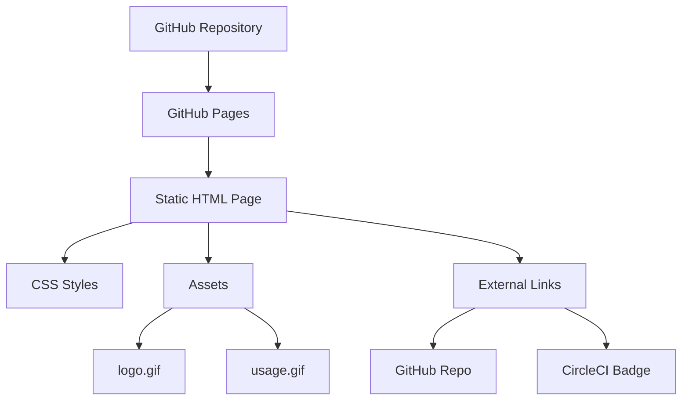

# Product Homepage Design - Product Requirements Document

## Executive Summary

### Problem Statement
MirDB is a powerful persistent key-value store with Memcached protocol compatibility, but it currently lacks a dedicated product homepage that showcases its capabilities, guides new users through adoption, and differentiates it from standard memcached and other key-value stores.

### Proposed Solution
Create a compelling, informative product homepage that effectively communicates MirDB's unique value proposition—persistence with memcached compatibility—while providing clear pathways for users to get started, understand the technology, and engage with the project.

### Expected Impact
- **User Acquisition**: Lower barrier to entry for developers evaluating key-value store solutions
- **Project Visibility**: Establish MirDB's identity in the database ecosystem
- **Developer Experience**: Provide quick access to documentation, getting started guides, and project resources
- **Community Growth**: Facilitate community engagement and contribution

### Success Metrics
- Homepage completion with all required sections
- Mobile-responsive design implementation
- Successful integration of existing assets (logo, usage demo)
- Clear navigation to documentation and GitHub repository

---

## Requirements & Scope

### Functional Requirements

| ID | Requirement | Description | Priority |
|----|-------------|-------------|----------|
| REQ-1 | Hero Section | Display MirDB logo, tagline, and primary call-to-action buttons | Must |
| REQ-2 | Value Proposition | Clearly communicate the three key benefits: Memcached compatibility, Persistence, LSM Tree architecture | Must |
| REQ-3 | Feature Showcase | Display implemented features (async networking, memtable, compaction) and planned features (Raft) | Must |
| REQ-4 | Quick Start Guide | Provide simple instructions for getting started with MirDB | Must |
| REQ-5 | Usage Demonstration | Embed or link to the usage.gif demonstrating MirDB in action | Should |
| REQ-6 | Navigation | Clear navigation to GitHub repository, documentation, and configuration guides | Must |
| REQ-7 | Status Badge Display | Show CI/CD status badge (CircleCI) | Should |
| REQ-8 | Protocol Commands | Display supported memcached commands (SET, GET, DELETE, etc.) | Should |
| REQ-9 | Configuration Overview | Highlight key configuration options and defaults | Could |
| REQ-10 | Footer | Include project links, license information, and attribution | Must |

### Non-Functional Requirements

| ID | Requirement | Description | Priority |
|----|-------------|-------------|----------|
| NFR-1 | Responsive Design | Homepage must be fully responsive across desktop, tablet, and mobile devices | Must |
| NFR-2 | Performance | Page load time under 3 seconds on standard broadband | Must |
| NFR-3 | Accessibility | WCAG 2.1 AA compliance for accessibility | Should |
| NFR-4 | Browser Compatibility | Support for modern browsers (Chrome, Firefox, Safari, Edge - latest 2 versions) | Must |
| NFR-5 | SEO Optimization | Proper meta tags, semantic HTML, and structured data for search visibility | Should |
| NFR-6 | No JavaScript Dependency | Core content accessible without JavaScript enabled | Could |
| NFR-7 | Asset Optimization | Optimize logo.gif and usage.gif for web delivery | Should |

### Out of Scope
- User authentication or login functionality
- Interactive database playground or REPL
- Blog or news section
- Multi-language internationalization (i18n)
- Backend API development
- Documentation site (separate from homepage)
- Analytics implementation

### Success Criteria
- All "Must" priority requirements implemented and functional
- Homepage renders correctly on all target browsers
- Existing assets (logo.gif, usage.gif) successfully integrated
- All navigation links functional
- Page passes Lighthouse performance audit with score >= 80

---

## User Experience & Interface

### User Journey

```
Developer discovers MirDB
         │
         ▼
┌─────────────────────┐
│   Hero Section      │ ← First impression: Logo + Tagline
│   "Get Started" CTA │
└──────────┬──────────┘
           │
           ▼
┌─────────────────────┐
│  Value Proposition  │ ← Why MirDB? (Persistence + Memcached)
└──────────┬──────────┘
           │
           ▼
┌─────────────────────┐
│  Features Section   │ ← What does it do?
└──────────┬──────────┘
           │
           ▼
┌─────────────────────┐
│  Usage Demo (GIF)   │ ← See it in action
└──────────┬──────────┘
           │
           ▼
┌─────────────────────┐
│  Quick Start Guide  │ ← How do I use it?
└──────────┬──────────┘
           │
           ▼
┌─────────────────────┐
│  CTA: GitHub/Docs   │ ← Next steps
└─────────────────────┘
```

### Interface Requirements

**Header**
- MirDB logo (compact version)
- Navigation links: Features, Quick Start, Documentation, GitHub

**Hero Section**
- Animated logo (logo.gif)
- Headline: "MirDB: A Persistent Key-Value Store with Memcached Protocol"
- Subheadline: "The familiarity of memcached with the reliability of persistent storage"
- Primary CTA: "Get Started"
- Secondary CTA: "View on GitHub"
- CI Status badge

**Value Proposition Section**
- Three-column layout highlighting:
  1. Memcached Protocol Support - Drop-in compatibility
  2. Persistence - Data survives restarts
  3. LSM Tree Architecture - Efficient storage and retrieval

**Features Section**
- Grid of implemented features with icons
- Visual indicator for planned features (Raft consensus)

**Demo Section**
- Embedded usage.gif with play controls if possible
- Caption explaining the demonstration

**Quick Start Section**
- Code blocks with installation and basic usage commands
- Example memcached commands (set, get, delete)

**Footer**
- Project links
- License information
- GitHub repository link

### Accessibility Considerations
- Alt text for all images (logo, demo GIF)
- Keyboard navigation support
- Sufficient color contrast ratios
- Screen reader compatible structure
- Reduced motion option for animated content

---

## User Stories

### Personas
- **New Developer**: Developer discovering MirDB for the first time, evaluating it for a project
- **Memcached User**: Developer familiar with memcached looking for persistent alternatives
- **Contributor**: Developer interested in contributing to the project

### Core User Stories

**US-1: First Impression**
As a **New Developer**, I want to quickly understand what MirDB is and why I should consider it, so that I can decide if it meets my project needs.

**Acceptance Criteria:**
- Given I land on the homepage
- When the page loads
- Then I see a clear headline explaining MirDB's purpose within 2 seconds
- And I can identify the primary value proposition (persistence + memcached compatibility)

**Priority:** Must
**Traceability:** REQ-1, REQ-2

---

**US-2: Feature Discovery**
As a **Memcached User**, I want to see which memcached commands are supported, so that I know if MirDB is compatible with my existing code.

**Acceptance Criteria:**
- Given I am on the homepage
- When I navigate to the features section
- Then I see a list of supported memcached commands (SET, GET, DELETE, etc.)
- And I understand which features are implemented vs. planned

**Priority:** Should
**Traceability:** REQ-3, REQ-8

---

**US-3: Quick Start**
As a **New Developer**, I want to see how to get started with MirDB, so that I can begin testing it quickly.

**Acceptance Criteria:**
- Given I am on the homepage
- When I scroll to the Quick Start section
- Then I see clear installation instructions
- And I see example commands I can copy and run

**Priority:** Must
**Traceability:** REQ-4

---

**US-4: Visual Demonstration**
As a **New Developer**, I want to see MirDB in action, so that I understand how it works before installing.

**Acceptance Criteria:**
- Given I am on the homepage
- When I view the demo section
- Then I see an animated demonstration of MirDB usage
- And the demo clearly shows command input and output

**Priority:** Should
**Traceability:** REQ-5

---

**US-5: Project Engagement**
As a **Contributor**, I want to easily access the GitHub repository and CI status, so that I can evaluate the project health and contribute.

**Acceptance Criteria:**
- Given I am on the homepage
- When I look for project links
- Then I find a clear link to the GitHub repository
- And I can see the current CI/CD build status

**Priority:** Must
**Traceability:** REQ-6, REQ-7

---

**US-6: Mobile Access**
As a **New Developer**, I want to view the homepage on my mobile device, so that I can learn about MirDB while away from my workstation.

**Acceptance Criteria:**
- Given I access the homepage on a mobile device
- When the page loads
- Then all content is readable without horizontal scrolling
- And navigation is accessible via a mobile-friendly menu

**Priority:** Must
**Traceability:** NFR-1

---

## Technical Considerations

### High-Level Technical Approach
The homepage will be implemented as a static website that can be hosted on GitHub Pages, Netlify, or similar static hosting platforms. This aligns with the project's open-source nature and requires no backend infrastructure.

### Integration Points
- **GitHub Repository**: Links to yetone/mirdb repository
- **CircleCI**: Status badge integration for CI/CD visibility
- **Existing Assets**: Integration of logo.gif and usage.gif from the assets directory

### Key Technical Constraints
- Must be hostable on free static hosting platforms
- Should not require a build process for simple updates
- Must efficiently serve animated GIF assets (combined ~8.5MB)

### Performance Considerations
- Lazy loading for animated GIFs to improve initial page load
- Consider converting GIFs to modern video formats (WebM/MP4) for better performance
- Implement appropriate caching headers for static assets

---

## Design Specification

### Recommended Approach
A single-page static HTML website with embedded CSS, optimized for simplicity and fast deployment. The design should be clean, developer-focused, and emphasize MirDB's technical strengths while remaining visually appealing.

### Key Technical Decisions

#### 1. Technology Stack
- **Options Considered**: Static HTML/CSS, React SPA, Hugo/Jekyll static site generator
- **Tradeoffs**:
  - Static HTML/CSS: Simplest, no build process, but limited reusability
  - React SPA: Modern tooling, but overkill for a single page and requires build step
  - Static site generators: Good for multi-page sites, unnecessary complexity for homepage
- **Recommendation**: Static HTML/CSS for maximum simplicity and zero dependencies

#### 2. Asset Delivery Strategy
- **Options Considered**: Direct GIF embedding, lazy-loaded GIFs, video conversion (WebM/MP4)
- **Tradeoffs**:
  - Direct GIF: Simple but slow initial load (~8.5MB total)
  - Lazy loading: Better initial performance, slightly more complex
  - Video conversion: Best performance but requires conversion tooling
- **Recommendation**: Lazy loading with optional video fallback for optimal balance

#### 3. Hosting Platform
- **Options Considered**: GitHub Pages, Netlify, Vercel, self-hosted
- **Tradeoffs**:
  - GitHub Pages: Free, integrated with repository, limited to static content
  - Netlify/Vercel: More features (forms, functions), free tier available
  - Self-hosted: Full control but requires infrastructure
- **Recommendation**: GitHub Pages for seamless integration with existing repository

#### 4. CSS Framework
- **Options Considered**: Custom CSS, Tailwind CSS, Bootstrap, no framework
- **Tradeoffs**:
  - Custom CSS: Full control, smaller file size, more work
  - Tailwind: Utility-first, requires build step
  - Bootstrap: Familiar components, larger file size
- **Recommendation**: Custom CSS with CSS variables for theming, keeping the page lightweight

### High-Level Architecture



### Key Considerations
- **Performance**: Lazy loading and asset optimization are critical given the large GIF files; target < 3s load time
- **Security**: Static site with no user input minimizes security concerns; ensure external links use proper attributes
- **Scalability**: Static hosting scales automatically; no concerns for expected traffic levels

### Risk Management
- **Large Asset Size Risk**: The ~8.5MB of GIF assets may cause slow load times on slower connections; mitigated through lazy loading and potential video conversion
- **Browser Compatibility Risk**: Custom CSS may behave differently across browsers; mitigated through progressive enhancement and testing

### Success Criteria
- Page loads with meaningful content in under 2 seconds on fast connections
- All sections render correctly across target browsers
- Mobile layout provides good user experience
- GitHub Pages deployment succeeds without errors

---

## Dependencies & Assumptions

### Dependencies
- **GitHub Pages**: Assuming continued availability of free GitHub Pages hosting
- **CircleCI**: Badge integration depends on CircleCI service availability
- **Existing Assets**: Relies on logo.gif and usage.gif remaining in repository

### Assumptions
- The homepage will be the primary landing page for the project
- Existing README content can be expanded for homepage use
- No backend or database requirements for the homepage itself
- The project will continue to be hosted on GitHub

### Cross-Team Coordination
- None required; this is a frontend-only static page addition to the existing repository

---

## Appendices

### Existing Asset Inventory

| Asset | Location | Size | Purpose |
|-------|----------|------|---------|
| logo.gif | assets/logo.gif | ~2.5MB | Animated MirDB logo |
| usage.gif | assets/usage.gif | ~6MB | Usage demonstration |

### Supported Memcached Commands Reference

**Storage Commands**: SET, ADD, REPLACE, APPEND, PREPEND
**Retrieval Commands**: GET, GETS
**Deletion Commands**: DELETE
**MirDB-Specific**: INFO, MAJOR_COMPACTION

### Default Configuration Quick Reference

```toml
addr = "0.0.0.0:12333"
max_level = 7
work_dir = "/tmp/mirdb"
sst_max_size = "100M"
mem_table_max_size = "4M"
block_size = "4K"
```

### Reference Links
- GitHub Repository: https://github.com/yetone/mirdb
- Memcached Protocol: https://github.com/memcached/memcached/blob/master/doc/protocol.txt
