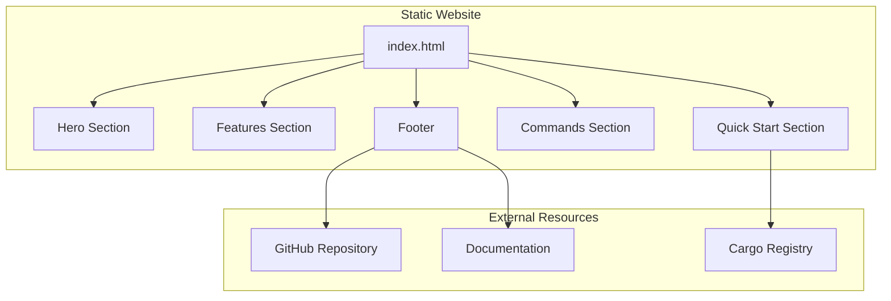

# Product Homepage Design - Product Requirements Document

## Executive Summary

### Problem Statement
MirDB is a feature-rich persistent key-value store with memcached protocol compatibility, but it lacks a dedicated homepage to effectively communicate its value proposition, features, and capabilities to potential users. Without a homepage, developers cannot easily discover, understand, or evaluate MirDB for their projects.

### Proposed Solution
Create a compelling product homepage that clearly articulates MirDB's unique value proposition as a persistent key-value store that speaks the memcached protocol. The homepage will serve as the primary entry point for developers seeking a drop-in memcached replacement with durability guarantees.

### Expected Impact
- **User Acquisition**: Provide a clear entry point for developers evaluating key-value storage solutions
- **Developer Understanding**: Reduce time-to-comprehension for MirDB's capabilities and differentiation
- **Adoption Enablement**: Guide users from discovery to getting started with clear calls-to-action
- **Credibility**: Establish MirDB as a professional, production-ready solution

### Success Metrics
- Homepage effectively communicates product value proposition within 10 seconds of viewing
- Users can find "Getting Started" information within 2 clicks
- Key differentiators (persistence + memcached compatibility) are prominently displayed
- Page loads within 3 seconds on average connections

---

## Requirements & Scope

### Functional Requirements

| ID | Requirement | Priority |
|----|-------------|----------|
| REQ-1 | Display hero section with product tagline and primary value proposition | Must Have |
| REQ-2 | Present key features with clear, concise descriptions | Must Have |
| REQ-3 | Include "Getting Started" section with quick-start instructions | Must Have |
| REQ-4 | Display supported commands and protocol compatibility information | Should Have |
| REQ-5 | Show configuration options and customization capabilities | Should Have |
| REQ-6 | Provide links to documentation, GitHub repository, and community resources | Must Have |
| REQ-7 | Include code examples demonstrating basic usage | Should Have |
| REQ-8 | Display project status and roadmap highlights | Could Have |
| REQ-9 | Include performance characteristics and default configurations | Should Have |

### Non-Functional Requirements

| ID | Requirement | Priority |
|----|-------------|----------|
| NFR-1 | Page must be responsive and render correctly on desktop, tablet, and mobile devices | Must Have |
| NFR-2 | Page must load within 3 seconds on a 3G connection | Should Have |
| NFR-3 | Page must be accessible (WCAG 2.1 AA compliance) | Should Have |
| NFR-4 | Content must be SEO-optimized for relevant search terms (key-value store, memcached alternative, persistent cache) | Should Have |
| NFR-5 | Page design must be consistent with technical/developer-focused products | Must Have |

### Out of Scope
- User authentication or account creation
- Interactive database playground or demo
- Community forum integration
- Blog or news section
- Pricing or commercial licensing information
- Multi-language support (English only for initial release)

### Success Criteria
- All Must Have requirements are implemented and functional
- Homepage passes accessibility audit with no critical issues
- Page renders correctly on Chrome, Firefox, Safari, and Edge browsers
- All external links are valid and functional

---

## User Experience & Interface

### User Journey

```
Discovery → Landing → Understanding → Evaluation → Getting Started
    │           │           │             │              │
    └─ Search   └─ Hero     └─ Features   └─ Code       └─ Docs/
       Result      Section     Section       Examples       GitHub
```

### Target Personas

1. **Backend Developer**: Evaluating caching/storage solutions for their application
2. **DevOps Engineer**: Looking for memcached-compatible storage with persistence
3. **Tech Lead**: Researching infrastructure components for team adoption

### Interface Requirements

#### Hero Section
- Clear product name (MirDB)
- Tagline communicating core value: "A Persistent Key-Value Store with Memcached Protocol"
- Primary CTA: "Get Started" button
- Secondary CTA: "View on GitHub" button

#### Features Section
Highlight the three core differentiators:
1. **Memcached Protocol Compatibility** - Drop-in replacement for existing memcached clients
2. **Durable Persistence** - Data survives restarts using SSTable storage
3. **LSM Tree Architecture** - High-performance writes with efficient compaction

#### Quick Start Section
- Installation instructions
- Basic configuration example
- Simple usage example with common memcached client

#### Technical Details Section
- Supported commands (GET, SET, DELETE, etc.)
- Default configuration values
- Performance characteristics

#### Footer
- GitHub repository link
- Documentation link
- License information

### Accessibility Considerations
- All images must have descriptive alt text
- Color contrast must meet WCAG AA standards
- Interactive elements must be keyboard accessible
- Code blocks must be screen-reader friendly

---

## User Stories

### Personas
- **Backend Developer**: Individual contributor evaluating storage solutions
- **DevOps Engineer**: Infrastructure specialist seeking memcached alternatives
- **Tech Lead**: Decision-maker researching team tooling options

### Core User Stories

#### US-1: Understand Product Value
**As a** Backend Developer
**I want to** quickly understand what MirDB does and how it differs from memcached
**So that** I can determine if it meets my project requirements

**Acceptance Criteria:**
- Given I land on the homepage
- When I view the hero section
- Then I see a clear tagline explaining MirDB is a persistent key-value store with memcached compatibility

**Related Requirements:** REQ-1
**Priority:** Must Have

---

#### US-2: Explore Key Features
**As a** Tech Lead
**I want to** review the key features and technical architecture
**So that** I can evaluate MirDB for team adoption

**Acceptance Criteria:**
- Given I am on the homepage
- When I scroll to the features section
- Then I see at least three distinct features with descriptions highlighting persistence, memcached compatibility, and architecture

**Related Requirements:** REQ-2, REQ-9
**Priority:** Must Have

---

#### US-3: Get Started Quickly
**As a** Backend Developer
**I want to** find quick-start instructions
**So that** I can try MirDB in my development environment

**Acceptance Criteria:**
- Given I am on the homepage
- When I click "Get Started" or scroll to the quick-start section
- Then I see clear installation and basic usage instructions

**Related Requirements:** REQ-3, REQ-7
**Priority:** Must Have

---

#### US-4: View Supported Commands
**As a** DevOps Engineer
**I want to** see which memcached commands are supported
**So that** I can assess compatibility with our existing client code

**Acceptance Criteria:**
- Given I am on the homepage
- When I navigate to the commands/protocol section
- Then I see a list of supported commands including GET, SET, DELETE, and MirDB-specific commands

**Related Requirements:** REQ-4
**Priority:** Should Have

---

#### US-5: Access Documentation and Source
**As a** Backend Developer
**I want to** easily find links to documentation and the GitHub repository
**So that** I can explore detailed documentation and contribute

**Acceptance Criteria:**
- Given I am on any section of the homepage
- When I look for external resources
- Then I find clearly visible links to GitHub and documentation in the header or footer

**Related Requirements:** REQ-6
**Priority:** Must Have

---

#### US-6: View on Mobile Device
**As a** Backend Developer
**I want to** view the homepage on my mobile device
**So that** I can evaluate MirDB while away from my workstation

**Acceptance Criteria:**
- Given I access the homepage from a mobile device
- When the page loads
- Then all content is readable and navigation is functional without horizontal scrolling

**Related Requirements:** NFR-1
**Priority:** Must Have

---

## Technical Considerations

### High-Level Approach
The homepage will be implemented as a static website optimized for performance and developer experience. This approach supports fast loading times, easy deployment, and minimal infrastructure requirements.

### Integration Points
- **GitHub Repository**: Link to source code and contribution guidelines
- **Documentation Site**: Link to detailed technical documentation (if exists)
- **Package Registry**: Links to installation via Cargo (Rust package manager)

### Key Technical Constraints
- Must be deployable as static files (GitHub Pages, Netlify, or similar)
- No server-side rendering requirements
- No database or backend dependencies

### Performance Considerations
- Optimize images and assets for web delivery
- Minimize JavaScript bundle size
- Use efficient CSS frameworks or minimal custom styles
- Consider lazy loading for below-fold content

---

## Design Specification

### Recommended Approach
Build a single-page static website using modern web technologies optimized for developer audiences. The design should prioritize clarity, fast loading, and technical credibility over visual complexity.

### Key Technical Decisions

#### 1. Framework/Technology Stack
- **Options Considered**: Plain HTML/CSS, Static Site Generator (Hugo/Jekyll/Astro), React/Vue SPA
- **Tradeoffs**: Plain HTML is simplest but harder to maintain; SSG offers templating with static output; SPA adds complexity without clear benefit
- **Recommendation**: Static Site Generator (Astro or Hugo) for balance of maintainability and performance

#### 2. Styling Approach
- **Options Considered**: Custom CSS, Tailwind CSS, CSS framework (Bootstrap)
- **Tradeoffs**: Custom CSS offers full control but more effort; Tailwind provides utility-first rapid development; Bootstrap is heavier and may look generic
- **Recommendation**: Tailwind CSS for rapid development with custom design while maintaining small bundle size

#### 3. Code Syntax Highlighting
- **Options Considered**: Prism.js, Highlight.js, Shiki
- **Tradeoffs**: Prism.js is lightweight; Highlight.js has more languages; Shiki offers accurate VS Code-style highlighting
- **Recommendation**: Prism.js for minimal footprint with adequate language support

#### 4. Hosting/Deployment
- **Options Considered**: GitHub Pages, Netlify, Vercel, Self-hosted
- **Tradeoffs**: GitHub Pages is free and integrated with repo; Netlify/Vercel offer more features; Self-hosted requires infrastructure
- **Recommendation**: GitHub Pages for simplicity and tight integration with existing repository

### High-Level Architecture



### Key Considerations
- **Performance**: Static files served via CDN ensure sub-second load times globally
- **Security**: No server-side code eliminates most attack vectors; CSP headers recommended
- **Scalability**: Static hosting scales automatically with CDN infrastructure

### Risk Management
- **Content Accuracy Risk**: Product features may change; mitigation is to establish content update process aligned with releases
- **Browser Compatibility Risk**: Modern CSS features may not work in older browsers; mitigation is to test across target browsers and use appropriate fallbacks

### Success Criteria
- Homepage deployed and accessible via public URL
- All sections render correctly and links function properly
- Page achieves 90+ score on Lighthouse performance audit
- Design approved by project stakeholders

---

## Dependencies & Assumptions

### Dependencies
- GitHub repository access for hosting (if using GitHub Pages)
- Design assets (logo, icons) if not already available
- Content approval from project maintainers

### Assumptions
- MirDB will continue to support the memcached protocol as a core feature
- The project will remain open-source
- English is sufficient for the initial target audience
- Existing documentation (if any) will be linked rather than duplicated

### Cross-Team Coordination
- Content review by MirDB maintainers
- Design feedback from community (if applicable)

---

## Appendices

### Content Reference: Key Messages

**Primary Value Proposition:**
"MirDB is a persistent key-value store that speaks the memcached protocol. Get the simplicity of memcached with the durability your data deserves."

**Feature Highlights:**
1. Drop-in memcached compatibility - use your existing clients
2. Data persistence with SSTable storage - survive restarts
3. LSM tree architecture - optimized for write-heavy workloads

**Technical Specifications to Display:**
- Default port: 12333
- Supported commands: GET, SET, DELETE, ADD, REPLACE, APPEND, PREPEND
- MirDB-specific: INFO, MAJOR_COMPACTION
- Written in Rust for performance and safety

### Wireframe Reference

```
┌─────────────────────────────────────────────────────────────┐
│  [Logo] MirDB                    [Docs] [GitHub] [Get Started] │
├─────────────────────────────────────────────────────────────┤
│                                                             │
│         A Persistent Key-Value Store with                   │
│            Memcached Protocol                               │
│                                                             │
│     [ Get Started ]        [ View on GitHub ]               │
│                                                             │
├─────────────────────────────────────────────────────────────┤
│                                                             │
│   ┌─────────────┐  ┌─────────────┐  ┌─────────────┐       │
│   │  Memcached  │  │  Durable    │  │  LSM Tree   │       │
│   │  Compatible │  │  Storage    │  │  Engine     │       │
│   └─────────────┘  └─────────────┘  └─────────────┘       │
│                                                             │
├─────────────────────────────────────────────────────────────┤
│                     Quick Start                             │
│   ┌─────────────────────────────────────────────────────┐ │
│   │  $ cargo install mirdb                               │ │
│   │  $ mirdb -c config.toml                              │ │
│   └─────────────────────────────────────────────────────┘ │
│                                                             │
├─────────────────────────────────────────────────────────────┤
│                  Supported Commands                         │
│                                                             │
│   GET  SET  DELETE  ADD  REPLACE  APPEND  PREPEND          │
│   INFO  MAJOR_COMPACTION                                    │
│                                                             │
├─────────────────────────────────────────────────────────────┤
│  [GitHub] [Docs] [License: MIT]           © 2024 MirDB     │
└─────────────────────────────────────────────────────────────┘
```
